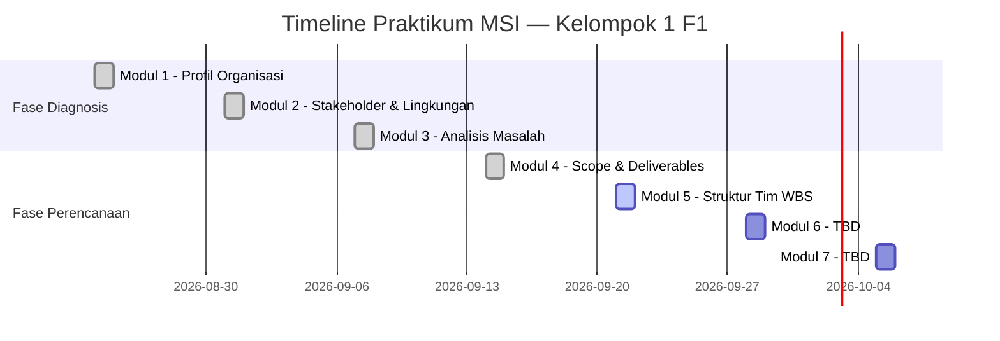

# 🕌 SIM-BaitulHikmah — Project Dashboard

> **Mata Kuliah:** Praktik Manajemen Sistem Informasi / PTF60234  
> **Dosen:** Dr. Ratna Wardani, S.Si., M.T. | **Tahun:** 2026 / Semester 5  
> **Model:** Project-Based Learning (artefak kumulatif per pertemuan)

---

## 👥 Identitas Kelompok

| Nama | NIM |
|---|---|
| Muhammad Riski | 24050530029 |
| Fajar Ahnaf Mahardika | 24050530030 |
| Muhadzdzib Terry Al-Fauzan | 24050530052 |

**Kelompok 1 — Kelas F1**

---

## 📊 Status Laporan Per Modul

| Modul | Topik | Status | Link |
|:---:|---|:---:|---|
| 1 | Profil Organisasi & Sistem Berjalan | ✅ Final | [[01 - Laporan/Laporan Modul 1\|Laporan Modul 1]] |
| 2 | Stakeholder & Lingkungan Bisnis | ✅ Final | [[01 - Laporan/Laporan Modul 2\|Laporan Modul 2]] |
| 3 | Analisis Masalah & Prioritas Solusi | ✅ Final | [[01 - Laporan/Laporan Modul 3\|Laporan Modul 3]] |
| 4 | Scope, Tujuan & Deliverables | ✅ Final | [[01 - Laporan/Laporan Modul 4\|Laporan Modul 4]] |
| 5 | Struktur Tim & Peran (WBS) | ⏳ Menunggu | — |
| 6 | — | 🔲 Belum | — |
| 7 | — | 🔲 Belum | — |

---

## 🗃️ Navigasi Cepat

### 📋 Laporan
- [[01 - Laporan/Laporan Modul 1|Modul 1 — Profil Organisasi]]
- [[01 - Laporan/Laporan Modul 2|Modul 2 — Stakeholder]]
- [[01 - Laporan/Laporan Modul 3|Modul 3 — Analisis Masalah]]
- [[01 - Laporan/Laporan Modul 4|Modul 4 — Project Scope Statement]]

### 🎙️ Data Lapangan
- [[02 - Data Lapangan/Wawancara Mardiyanto|Wawancara Bpk. Mardiyanto (Sekretaris I)]]
- [[02 - Data Lapangan/Wawancara Jefri TPA|Wawancara Mas Jefri (Direktur TPA)]]
- [[02 - Data Lapangan/Wawancara Masjid Mujur Al-Amin|Masjid Mujur Al-Amin (Pembanding)]]
- [[02 - Data Lapangan/Benchmark Nurul Ashri Deresan|Benchmark Nurul Ashri Deresan]]

### 📚 Materi & Modul Bu Ratna
- [[03 - Materi & Modul/Modul 1|Modul 1 Template]]
- [[03 - Materi & Modul/Modul 2|Modul 2 Template]]
- [[03 - Materi & Modul/Modul 3|Modul 3 Template]]
- [[03 - Materi & Modul/Modul 4|Modul 4 — Scope & Deliverables]]

### 🎓 Akademik & Referensi
- [[04 - Referensi & Akademik/Validasi Akademik MSI|Validasi Akademik & Rasionalisasi MSI]]
- [[04 - Referensi & Akademik/Notes Kelas|Panduan Filosofi Bu Ratna]]
- [[04 - Referensi & Akademik/Daftar Referensi|Master Daftar Referensi]]

---

## 🔑 Fakta Kunci Tervalidasi (Anti-Halusinasi)

> ⚠️ Hanya gunakan data di bawah ini dalam laporan. Jangan tambahkan angka estimasi.

| Fakta | Status | Sumber |
|---|:---:|---|
| PC rusak Feb 2026, 70% data hilang | ✅ Konfirmasi | Wawancara Mardiyanto |
| Laporan keuangan tidak tertulis ±3 tahun | ✅ Konfirmasi | Wawancara Mardiyanto |
| Triple-entry Qurban (WA → buku → PC) | ✅ Konfirmasi | Wawancara Mardiyanto |
| Bisyarah pengurus Rp150.000/bulan | ✅ Konfirmasi | WhatsApp Mas Jefri 14/9/2026 |
| Absensi TPA di Excel lokal Mas Jefri | ✅ Konfirmasi | WhatsApp Mas Jefri 7/9/2026 |
| IZOP TPA sudah terbit dari Kemenag | ✅ Konfirmasi | WhatsApp Mas Jefri |
| Data nominal infaq bulanan | ❌ Belum tervalidasi | — |
| Volume hewan Qurban aktual | ❌ Belum tervalidasi | — |
| Data mustahik vs DTKS | 🟡 Hipotesis parsial | Wawancara Mardiyanto |

---

## 🏛️ Ekosistem Kasus

```
Target Utama   → Masjid Besar Baitul Hikmah (Klitren, Gondokusuman)
Pembanding     → Masjid Mujur Al-Amin (Karangnongko)
Benchmark      → Masjid Nurul Ashri Deresan (masjidnurulashri.com)
```

---

## 📅 Timeline Pertemuan



---

*Vault dibuat: 14 September 2026 | Dikelola oleh Kelompok 1 F1*
