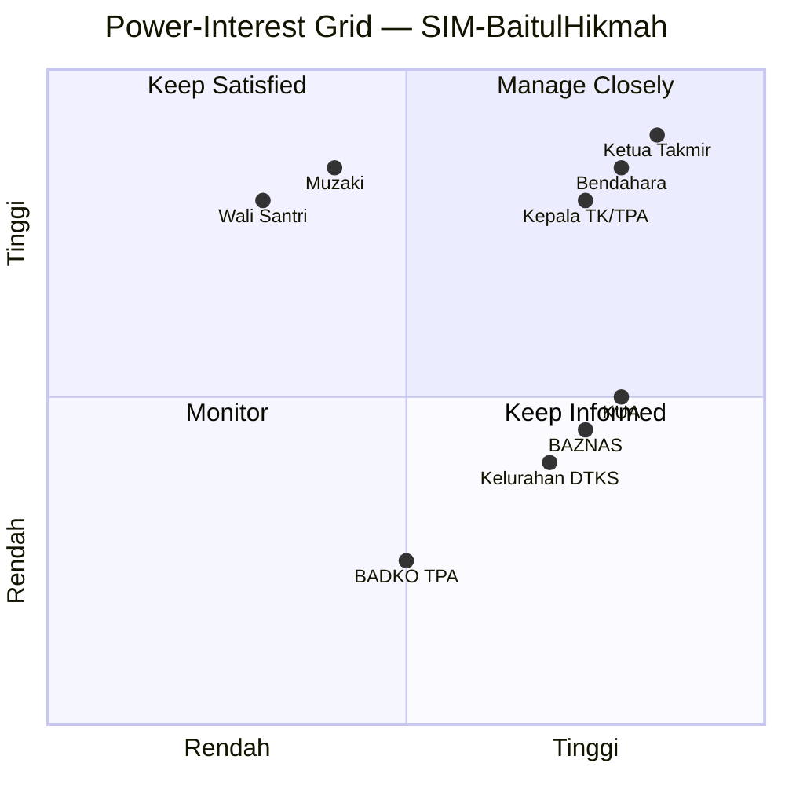
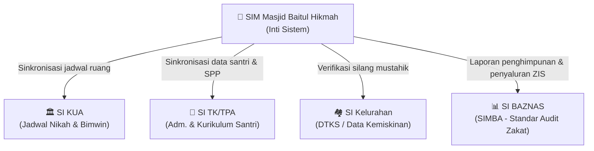
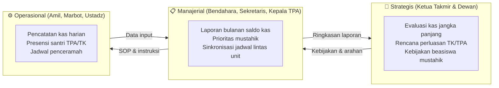
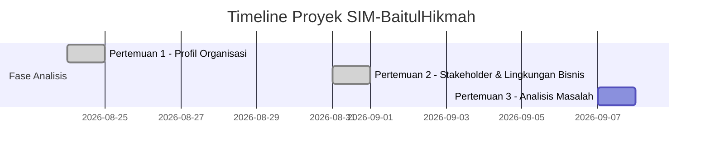
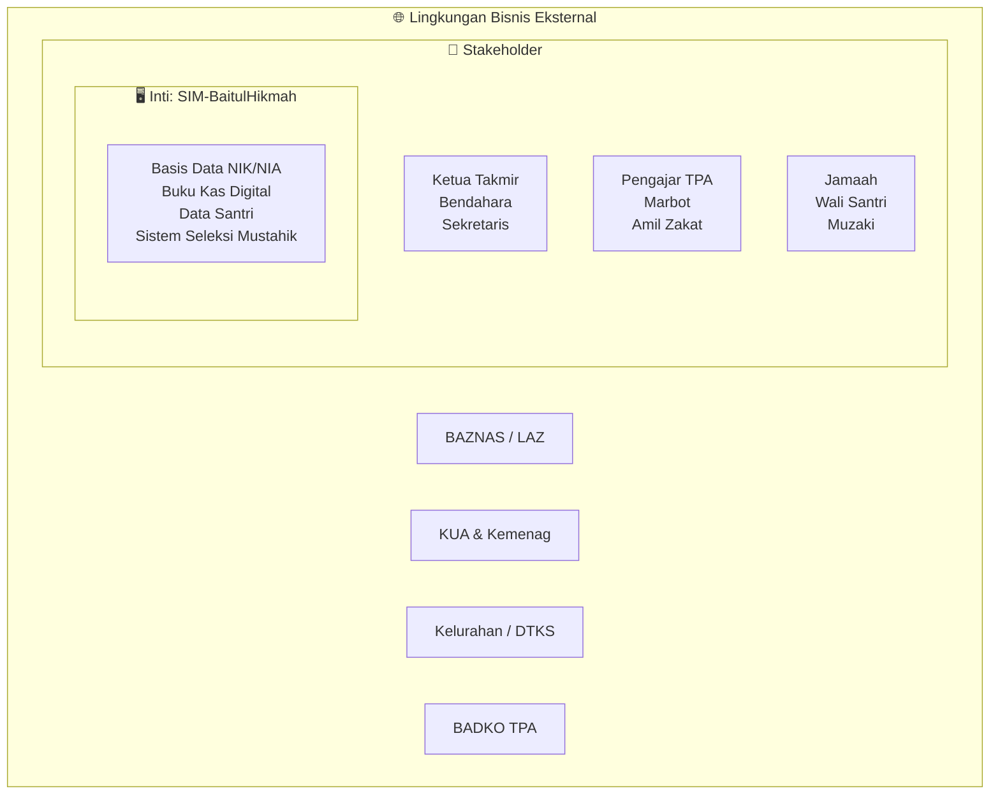

# AGENTS.md — Panduan Agent: Proyek MSI Kelompok 1 F1

> File ini dibaca otomatis oleh agent setiap kali bekerja di folder ini.
> Tujuannya: memastikan setiap laporan praktikum dibuat secara konsisten,
> akurat sesuai standar Bu Ratna, dan berbasis konteks proyek yang lengkap.

---

## 🔒 ATURAN WAJIB — BACA SELURUH KONTEKS SEBELUM MULAI

Sebelum mengerjakan laporan atau tugas apapun di project ini, agent WAJIB membaca file-file berikut terlebih dahulu:

### File Konteks Inti
| File | Isi |
|---|---|
| `notes kelas.md` | Panduan akademis Bu Ratna — filosofi MSI, 7 aspek, RACI, Power-Interest Grid, 5 unsur sistem |
| `data draft.md` | Data faktual lapangan Masjid Besar Baitul Hikmah |
| `migrasi 1.md` | Analisis kelayakan migrasi topik dari UNYParkir ke SIM-BaitulHikmah |
| `migrasi 2.md` | Revisi Modul 1 & brainstorming Modul 2 berbasis SIM-Masjid |
| `migrasi 3.md` | Draf terstruktur khusus Masjid Besar Baitul Hikmah |
| `validasi akademik dan rasionalisasi msi.md` | Justifikasi akademik MSI vs aplikasi, Task-Technology Fit, Internal Control, TAM, IT Resistance |
| `komparasi benchmark masjid jogokariyan dan tata kelola eksternal.md` | Analisis komparatif ekosistem Jogokariyan vs Baitul Hikmah, maturity model, koreksi TPA BADKO |
| `panduan wawancara lapangan msi.md` | Instrumen wawancara lapangan universal (makro-meso-mikro, TPA, penurunan jamaah/santri) |
| `panduan wawancara ringkas 30 menit.md` | Instrumen wawancara lapangan ringkas (6 pertanyaan payung & checklist 30 menit) |
| `hasil wawancara masjid pembanding dan analisis komparasi.md` | Transkrip harfiah wawancara Masjid Mujur Al-Amin, evaluasi ketercapaian MSI, & taktik komparasi |
| `panduan presentasi dan pemahaman msi.md` | Narasi "bahasa bayi" konsep MSI (motor balap vs aturan jalan) |
| `tata kelola informasi bottom-up.md` | Alur tata kelola informasi dari level bawah ke atas |

### File Laporan yang Sudah Ada (Referensi Konsistensi)
| File | Keterangan |
|---|---|
| `Laporan Modul 1 - Kelompok 1 F1.md` | Laporan Pertemuan 1 (sudah final) |
| `Laporan Modul 2 - Kelompok 1 F1.md` | Laporan Pertemuan 2 (sudah final) |

### Template Resmi (Struktur Wajib)
| File | Keterangan |
|---|---|
| `Modul 1 template.pdf` | Template resmi Pertemuan 1 dari Bu Ratna |
| `Modul 2 template.pdf` | Template resmi Pertemuan 2 dari Bu Ratna |

---

## 👤 KONTEKS PROYEK

### Identitas Kelompok
- **Kelompok**: Kelompok 1 — Kelas F1
- **Anggota**:
  1. Muhammad Riski — 24050530029
  2. Fajar Ahnaf Mahardika — 24050530030
  3. Muhadzdzib Terry Al-Fauzan — 24050530052
- **Mata Kuliah**: Praktik Manajemen Sistem Informasi / PTF60234
- **Dosen**: Dr. Ratna Wardani, S.Si., M.T.
- **Tahun Akademik**: 2026 / Semester 5
- **Model Pembelajaran**: Project-Based Learning (artefak kumulatif per pertemuan)

### Objek Studi & Spektrum Komparasi Tiga Tingkat (Tri-Level Spectrum)
- **1. Target Studi Kasus Utama**: **Masjid Besar Baitul Hikmah** (Klitren, Gondokusuman, Yogyakarta) — Masjid Besar tingkat kecamatan/kelurahan, semi-urban, non-profit murni, isu data silo & penurunan jamaah/santri.
- **2. Pembanding Empiris Lapangan (Empirical Village Baseline)**: **Masjid Mujur Al-Amin** (Karangnongko) — Masjid dusun/lingkungan berbasis partisipasi swadaya RT 1–5, percontohan tata kelola transparan swakelola (Papan Takjil Terbuka & Otonomi TPA).
- **3. Benchmark Mapan Nasional**: **Masjid Jogokariyan Yogyakarta** — Level *Socio-Enterprise*, diversifikasi usaha (Wisma, Air Minum, KRJ), percontohan integrasi data *Peta Dakwah* & Saldo Kas Nol Rupiah.
- **Unit Afiliasi Target**: TK Baitul Hikmah, TPA Baitul Hikmah, Kemitraan KUA Kecamatan.
- **Fokus Dua Proses Bisnis Inti**:
  1. **Tata Kelola Pendataan Jamaah & Penyaluran ZIS** — verifikasi NIK + sinkronisasi DTKS Kelurahan.
  2. **Tata Kelola Layanan Pendidikan (TPA) & Kemakmuran Ibadah** — monitoring santri + pelaporan ke BADKO.

---

## ❓ PROTOKOL BERTANYA SEBELUM EKSEKUSI

**WAJIB**: Setiap kali diminta membuat laporan baru, agent HARUS bertanya dulu kepada user sebelum mulai menulis. Minimal tanyakan hal-hal berikut yang belum diketahui:

### Pertanyaan Wajib untuk Setiap Laporan Baru
1. **Pertemuan ke berapa?** (untuk menentukan nomor modul dan tanggal)
2. **Tanggal pelaksanaan?** (format: DD Bulan YYYY)
3. **Topik/judul pertemuan ini?** (misalnya: "Analisis Masalah", "WBS", "Gantt Chart", dll.)
4. **Ada artefak/template khusus dari Bu Ratna?** (minta user upload PDF jika ada)
5. **Ada data baru dari lapangan?** (wawancara, observasi baru, data yang belum ada di draft)
6. **Ada perubahan dari pertemuan sebelumnya** yang perlu dikoreksi atau diperbarui?

### Pertanyaan Tambahan (Kondisional)
- Jika menyangkut keuangan/ZIS: apakah ada angka nyata dari masjid yang bisa digunakan?
- Jika menyangkut stakeholder baru: nama, jabatan, dan peran tata kelola informasinya?
- Jika menyangkut diagram: apakah ada struktur spesifik yang diminta Bu Ratna?

---

## 📋 WAJIB: BUAT IMPLEMENTATION PLAN SEBELUM EKSEKUSI

Setelah bertanya dan mendapatkan jawaban, agent WAJIB membuat **Implementation Plan** terlebih dahulu sebelum menulis laporan. Format plan:

```markdown
## Implementation Plan — Laporan Pertemuan [X]

### Konteks yang Dibaca
- [x] notes kelas.md
- [x] data draft.md
- [x] migrasi 1/2/3.md
- [x] Laporan Modul sebelumnya (referensi konsistensi)
- [x] Template PDF Modul [X]

### Struktur Laporan yang Akan Dibuat
1. Identitas Laporan
2. Tujuan Kegiatan (dari template)
3. Uraian Pelaksanaan Kegiatan
   - Sub-bagian 1: ...
   - Sub-bagian 2: ...
4. Hasil/Artefak (daftar artefak yang akan dibuat)
   - Artefak 1: ... (format: tabel/diagram Mermaid/dll)
5. Kendala dan Solusi
6. Refleksi Pembelajaran
7. Kesimpulan
8. Referensi

### Diagram Mermaid yang Akan Dibuat
- [ ] Diagram jenis [X] untuk menggambarkan [Y]

### Data yang Akan Digunakan
- Dari notes kelas.md: ...
- Dari migrasi 3.md: ...
- Data baru dari user: ...

### Pertanyaan Terbuka
- [...hal yang masih belum jelas...]
```

Tampilkan plan ini dan **minta persetujuan user** sebelum mulai menulis laporan.

---

## 📐 STANDAR FORMAT LAPORAN

### Struktur 7 Bagian Wajib (dari Template Bu Ratna)
Setiap laporan WAJIB memiliki 7 bagian berikut (rubrik "Sangat Baik" = 7 bagian terisi lengkap dan rapi):

```
1. Identitas Laporan
2. Tujuan Kegiatan
3. Uraian Pelaksanaan Kegiatan
4. Hasil/Artefak Praktikum
5. Kendala dan Solusi
6. Refleksi Pembelajaran
7. Kesimpulan
(+ Referensi)
```

### Identitas Laporan (Selalu Isi dengan Data Ini)
```markdown
| Identitas | Isian |
|---|---|
| **Nama Kelompok** | Kelompok 1 — Kelas F1 |
| **Anggota (NIM/Nama)** | 1. Muhammad Riski — 24050530029 |
| | 2. Fajar Ahnaf Mahardika — 24050530030 |
| | 3. Muhadzdzib Terry Al-Fauzan — 24050530052 |
| **Pertemuan ke-** | [NOMOR] |
| **Tanggal Pelaksanaan** | [TANGGAL] |
| **Organisasi/Kasus yang Digunakan** | Masjid Besar Baitul Hikmah — SIM-BaitulHikmah |
```

---

## 🧭 STANDAR KONTEN — BERBASIS FILOSOFI BU RATNA

Agent wajib memastikan setiap laporan mencerminkan pemahaman MSI yang benar:

### ❌ Yang Harus DIHINDARI
- Berbicara tentang fitur aplikasi semata ("kami membuat modul X dengan fitur Y")
- Mengabaikan aspek manusia, proses, dan tata kelola
- Justifikasi yang hanya teknis tanpa menyebut tujuan strategis organisasi
- Analisis stakeholder yang hanya menyebut "pengguna" tanpa membahas otoritas data
- Diagram yang tidak memakai Mermaid (gunakan selalu Mermaid untuk semua grafik/chart)

### ✅ Yang WAJIB Ada
- Selalu kaitkan dengan **mengapa** (why) sistem dibutuhkan, bukan hanya **apa** (what)
- Sertakan minimal satu referensi ke **tiga level keputusan** (operasional-manajerial-strategis)
- Gunakan terminologi yang tepat: **tata kelola informasi**, **interkoneksi sistem**, **audit trail**, **evidence-based decision making**
- Refleksi harus mengaitkan pengalaman, konsep MSI, dan penerapan ke depan
- Kendala harus spesifik dan solusinya berbasis bukti

### 7 Aspek MSI (Selalu Jadikan Pijakan)
| No | Aspek | Relevansi pada SIM-BaitulHikmah |
|---|---|---|
| 1 | Keselarasan Strategis | Sistem terhubung ke misi masjid sebagai institusi sosial-keagamaan |
| 2 | Tata Kelola & Kualitas Informasi | Siapa berwenang atas data ZIS, jamaah, dan keuangan? |
| 3 | Dukungan Pengambilan Keputusan | 3 level: operasional (kasir), manajerial (bendahara), strategis (ketua takmir) |
| 4 | Kebutuhan Informasi Stakeholder | Setiap pihak butuh data berbeda: muzaki butuh transparansi, BAZNAS butuh pelaporan |
| 5 | Nilai Informasi | Akuntabilitas publik = kepercayaan umat = keberlanjutan masjid |
| 6 | Integrasi Proses Bisnis | Koneksi ke BAZNAS, DTKS Kelurahan, BADKO TPA, KUA |
| 7 | Adopsi & Perilaku Organisasi | Change management untuk pengurus senior yang resistif terhadap digitalisasi |

---

## 📊 STANDAR DIAGRAM — WAJIB MERMAID

**SELALU gunakan Mermaid untuk semua elemen visual.** Jangan gunakan tabel ASCII atau teks art untuk diagram.

### Contoh Diagram yang Sering Digunakan

#### Power-Interest Grid (quadrantChart)


#### Interkoneksi Sistem (flowchart)


#### Tiga Level Keputusan (flowchart LR)


#### Gantt Chart / Timeline


#### Lingkaran Konsentris (Ekosistem)
Gunakan flowchart dengan subgraph untuk menggambarkan lapisan konsentris:


---

## 📁 KONVENSI PENAMAAN FILE

```
Laporan Modul [N] - Kelompok 1 F1.md
```

Contoh:
- `Laporan Modul 1 - Kelompok 1 F1.md`
- `Laporan Modul 3 - Kelompok 1 F1.md`

---

## 🏛️ TEMUAN RISET & PENGAYAAN KONTEKS TERKINI (SESI VALIDASI AKADEMIK)

### 1. Rasionalisasi MSI vs Komputerisasi Langsung (Jawaban untuk Bu Ratna)
* **Kritik Dosen:** *"Pencatatan manual tidak selalu solusinya computerize. SDM tua malah bingung dan menimbulkan masalah baru."*
* **Landasan Teoretis Peer-Reviewed:**
  * **Task-Technology Fit (Goodhue & Thompson, 1995):** Ketidakcocokan antara teknologi tinggi dan kapabilitas pengguna justru menurunkan kinerja organisasi.
  * **Technology Acceptance Model (Davis, 1989):** Persepsi kerumitan tinggi memicu penolakan dan *system abandonment*.
  * **Internal Control & Segregation of Duties (Romney & Steinbart, 2018):** Insiden penyalahgunaan dana kas TPA bukan karena ketiadaan aplikasi, melainkan ketiadaan pemisahan wewenang pemegang kas fisik dan pencatat buku.
* **Solusi Arsitektur Sosio-Teknis:** **Dual-Tier Operating Model (Sistem Hibrid)**. Marbot sepuh tetap menggunakan lembar logbook fisik terstandarisasi, sementara 17 pemuda REMAS difungsikan sebagai operator rekonsiliasi data digital berkala.

### 2. Hierarki Regulasi & Aturan Bisnis (Makro ke Mikro)
* **Tingkat Makro (Regulasi Pemerintah & Nasional):**
  * Legalitas tanah wakaf berada di bawah **Badan Wakaf Indonesia (BWI)** dan KUA sebagai PPAIW.
  * Izin pendirian rumah ibadah mengacu **SKB 2 Menteri No. 9 & 8 Tahun 2006** (90 calon pengguna & 60 dukungan warga).
  * Pendaftaran resmi di Kementerian Agama RI melalui nomor registrasi **ID SIMAS** (Sistem Informasi Masjid).
  * Standar pembinaan tipologi masjid mengacu Keputusan Dirjen Bimas Islam No. DJ.II/802 Tahun 2014.
  * **KOREKSI SEMANTIK PENTING:** TPA masjid adalah **Taman Pendidikan Al-Qur'an** (di bawah binaan BADKO TPA & Kemenag), BUKAN Tempat Pemrosesan Akhir sampah (KLHK/PUPR).
* **Tingkat Meso (Tata Kelola Organisasi Takmir):**
  * Penentuan takmir: wajib meneliti apakah melalui musyawarah warga berkala (3–5 tahun), penunjukan lisan sesepuh, atau SK resmi Kepala Desa/KUA/DMI.
  * Pembagian bidang mengacu standar Kemenag: Idarah (manajemen), Imarah (ibadah/dakwah), dan Ri'ayah (pemeliharaan fisik).
* **Tingkat Mikro (Operasional Sehari-hari):**
  * Master data jamaah (by-name by-address).
  * Prosedur kontinjensi penunjukan ustadz badal saat khatib Jumat batal mendadak.
  * *Dual custody* (hitung kas berdua dengan saksi & berita acara) saat membuka kotak infak Jumat.
  * Sinkronisasi data mustahik zakat dengan DTKS Kelurahan.

### 3. Komparasi Benchmark: Masjid Baitul Hikmah vs Masjid Jogokariyan Yogyakarta
* **Model Finansial:** Baitul Hikmah (*Charity-Based murni*, infaq Rp 2–3 jt/bln) vs Jogokariyan (*Socio-Enterprise*: Wisma Penginapan, Air Galon/Mineral, KRJ 250+ UMKM).
* **Kebijakan Saldo Kas:** Kas pasif vs *Zero-Balance Policy* (Saldo Nol Rupiah) yang menuntut akurasi sistem peramalan kas (*cash forecasting*).
* **Arsitektur Data Jamaah:** Tanpa data tertulis vs *Peta Dakwah Sensus Mikro* by-name by-address per KK.
* **Maturity Model:** Masjid Baitul Hikmah wajib menstabilkan Level 1 (Fondasi Tata Kelola & Pengendalian Internal) sebelum melangkah ke Level 2 (Ekosistem Wirausaha Mandiri).

### 4. Investigasi Dinamika Penurunan Partisipasi (Decline Dynamics)
* **Penurunan Jamaah Shalat:** Faktor demografi (lansia wafat, generasi muda merantau), jam kerja modern, serta dominasi lansia pensiunan.
* **Penyusutan Santri TPA:** Dampak kebijakan *Full-Day School* (anak kelelahan jam 16.00), maraknya les bimbel umum di luar, gawai/gadget, dan kejenuhan metode mengajar monoton.
* **Pergeseran Donatur:** Muzaki/shahibul qurban beralih menyalurkan dana ke LAZ luar karena faktor transparansi laporan atau kepraktisan transfer perbankan digital.
* **Krisis Regenerasi:** Pemuda (REMAS) enggan aktif karena merasa tidak diberi ruang suara oleh pengurus senior.

### 5. Komparasi Empiris Tingkat Masjid: Target (Baitul Hikmah) vs Pembanding Lapangan (Mujur Al-Amin)
* **Tata Kelola Takjil Ramadhan:**
  * *Masjid Pembanding (Mujur Al-Amin):* Menggunakan **Papan Terbuka Swakelola (Self-Service 1–30 Ramadhan)** di mana warga menulis mandiri jenis takjil (besar/kecil). Terbukti transparan dan mencegah kekosongan hari.
  * *Target (Baitul Hikmah):* Asimetri informasi tertutup di tangan seksi konsumsi, warga mengira sudah penuh sehingga terjadi kekosongan slot di hari-hari tertentu.
* **Tata Kelola & Kemandirian TPA:**
  * *Masjid Pembanding (Mujur Al-Amin):* Struktur TPA otonom dipimpin "Direktur & Bendahara TPA", kas SPP terpisah secara sukarela (Rp 2k–10k), strategi kirab Muharram berhasil menjaga 80–90 santri aktif.
  * *Target (Baitul Hikmah):* TPA dititipkan pada marbot sepuh, kas pernah tercampur dengan dana pribadi, santri menyusut drastis (< 30 anak).
* **Pengendalian Kas Infak (Internal Control):**
  * *Masjid Pembanding (Mujur Al-Amin):* Kotak infak dibuka rutin 2 minggu sekali dengan **saksi (dual custody)** dan rekap ditempel bulanan di papan pengumuman.
  * *Target (Baitul Hikmah):* Dicatat terpisah di Word/Excel bendahara dan sekretaris tanpa rekonsiliasi formal, memicu selisih hitung di akhir bulan.
* **Mitigasi Khatib/Ustadz Berhalangan:**
  * *Masjid Pembanding (Mujur Al-Amin):* Menyiapkan ustadz badal (cadangan) lokal internal masjid jika ustadz luar/Ahad pagi berhalangan hadir.
  * *Target (Baitul Hikmah):* Belum ada SOP kontinjensi resmi; jika khatib batal mendadak, takmir panik atau marbot dadakan disuruh membaca hadits.

---

## 📚 REFERENSI BAKU

Referensi berikut selalu dimasukkan di setiap laporan (pilih yang relevan):

### Buku Teks & Landasan Teori MSI
- Laudon, K. C., & Laudon, J. P. (2014). *Management information systems: Managing the digital firm* (13th ed.). Pearson Education.
- Sousa, K. J., & Oz, E. (2014). *Management information systems* (7th ed.). Cengage Learning.
- Romney, M. B., & Steinbart, P. J. (2018). *Accounting information systems* (14th ed.). Pearson Education.
- Goodhue, D. L., & Thompson, R. L. (1995). Task-technology fit and individual performance. *MIS Quarterly*, 19(2), 213–236. DOI: 10.2307/249689.
- Davis, F. D. (1989). Perceived usefulness, perceived ease of use, and user acceptance of information technology. *MIS Quarterly*, 13(3), 319–340. DOI: 10.2307/249008.
- Markus, M. L. (1983). Power, politics, and MIS implementation. *Communications of the ACM*, 26(6), 430–444. DOI: 10.1145/358141.358148.

### Regulasi & Standar Pemerintah
- Kementerian Agama RI. (2011). *Undang-Undang No. 23 Tahun 2011 tentang Pengelolaan Zakat*. Kemenag RI.
- BAZNAS. (2023). *Sistem Manajemen Informasi BAZNAS (SIMBA)*. Badan Amil Zakat Nasional.
- Kementerian Agama & Kementerian Dalam Negeri RI. (2006). *Peraturan Bersama Menteri Agama dan Menteri Dalam Negeri No. 9 dan 8 Tahun 2006 tentang Pedoman Pelaksanaan Tugas Kepala Daerah/Wakil Kepala Daerah dalam Pemeliharaan Kerukunan Umat Beragama, Pemberdayaan Forum Kerukunan Umat Beragama, dan Pendirian Rumah Ibadat*.
- Direktorat Jenderal Bimbingan Masyarakat Islam. (2014). *Keputusan Direktur Jenderal Bimbingan Masyarakat Islam No. DJ.II/802 Tahun 2014 tentang Standar Pembinaan Manajemen Masjid*. Kemenag RI.

### Studi Empiris Masjid & Benchmark Jogokariyan
- Sabili, F., Romansyah, D., & Hidayat, R. (2023). Akuntabilitas dan transparansi laporan keuangan masjid (Studi kasus Masjid Jogokariyan Yogyakarta). *JAKIS: Jurnal Akuntansi dan Keuangan Islam*, 11(2), 233–249. DOI: 10.35836/jakis.v11i2.626.
- Widyanti, R., & Rahmayanti, D. (2020). Perancangan dan implementasi sistem informasi manajemen kegiatan masjid: Studi kasus Masjid Jogokariyan Yogyakarta. *JSTIE (Jurnal Sarjana Teknik Informatika)*, 1(1), 119–128. DOI: 10.12928/jstie.v1i1.2513.
- Wibowo, A. E., dkk. (2024). Kampung Ramadhan Jogokariyan (KRJ): Peran manajemen masjid dalam pariwisata ramah Muslim dan ekonomi lokal. *AKUA: Jurnal Akuntansi dan Keuangan*, 4(2). DOI: 10.54259/akua.v4i2.4258.
- Arsam, A., Nurmahyati, S., & Amaluddin, A. (2024). Manajemen dakwah takmir Masjid Jogokaryan dalam membangun peradaban Islam di Mantrijeron Yogyakarta. *Tadbir: Jurnal Manajemen Dakwah*, 9(1), 19–40. DOI: 10.15575/tadbir.v9i1.33885.
- Sutono, M. A., & Risyan, R. M. (2023). Digitalisasi sistem informasi manajemen masjid modern. *INFOTECH Journal*, 9(1), 1–10. DOI: 10.31949/infotech.v9i1.4222.

---

## ⚠️ CHECKLIST SEBELUM SUBMIT LAPORAN

Sebelum menyatakan laporan selesai, agent WAJIB memverifikasi:

- [ ] 7 bagian utama terisi lengkap dan rapi
- [ ] Identitas laporan benar (nama, NIM, tanggal, pertemuan)
- [ ] Semua diagram menggunakan sintaks Mermaid (bukan ASCII art)
- [ ] Refleksi mengaitkan pengalaman + konsep MSI + penerapan ke depan
- [ ] Kendala bersifat spesifik (bukan generik)
- [ ] Tidak ada bahasa "aplikasi-sentris" (fokus selalu pada tata kelola informasi)
- [ ] Minimal satu referensi ke 3 level keputusan (operasional-manajerial-strategis)
- [ ] Nama file sesuai konvensi: `Laporan Modul [N] - Kelompok 1 F1.md`
- [ ] Konten konsisten dengan laporan-laporan pertemuan sebelumnya
