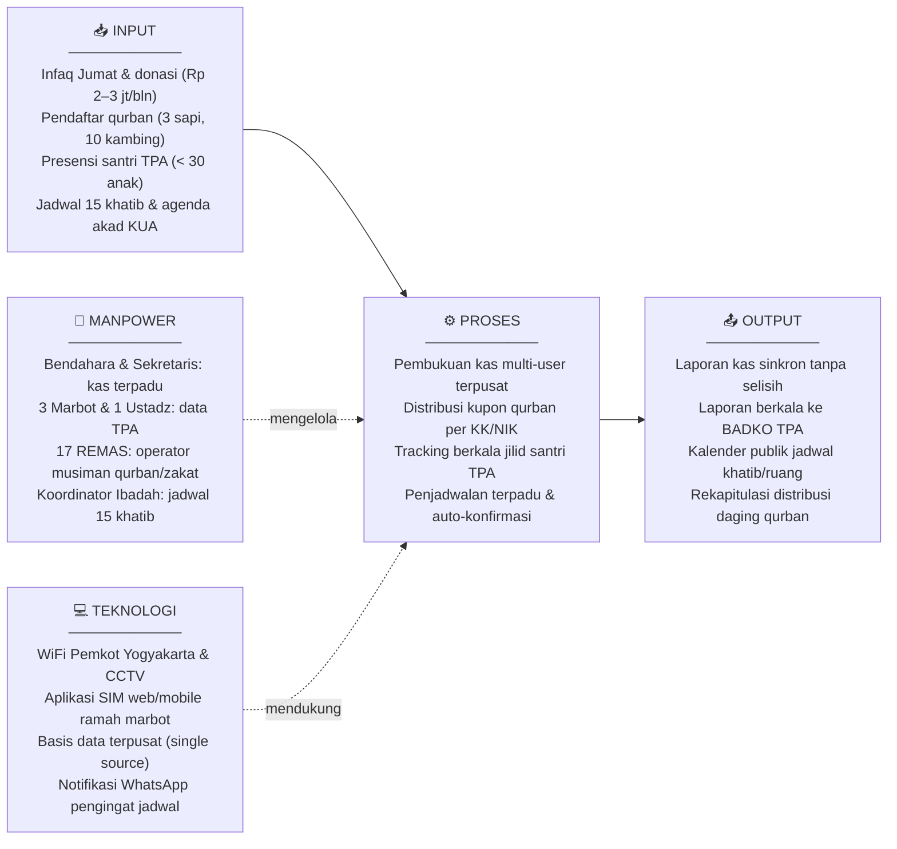
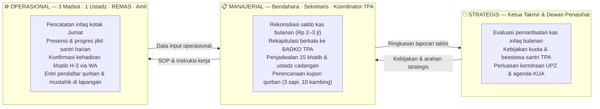

# LAPORAN PRAKTIKUM MINGGUAN
## Manajemen Sistem Informasi — PTF60234
**Universitas Negeri Yogyakarta | Fakultas Teknik | Prodi Pendidikan Teknik Informatika S1**

---

## 1. Identitas Laporan

| Identitas | Isian |
|---|---|
| **Nama Kelompok** | Kelompok 1 — Kelas F1 |
| **Anggota (NIM/Nama)** | 1. Muhammad Riski — 24050530029 |
| | 2. Fajar Ahnaf Mahardika — 24050530030 |
| | 3. Muhadzdzib Terry Al-Fauzan — 24050530052 |
| **Pertemuan ke-** | 1 |
| **Tanggal Pelaksanaan** | 24 Agustus 2026 |
| **Organisasi/Kasus yang Digunakan** | Masjid Besar Baitul Hikmah — SIM-BaitulHikmah |

---

## 2. Tujuan Kegiatan

Mahasiswa mampu menjelaskan peran sistem informasi manajemen dalam organisasi serta memilih dan menetapkan organisasi/kasus yang akan menjadi objek proyek sepanjang satu semester.

---

## 3. Uraian Pelaksanaan Kegiatan

Pada tahap brainstorming, kelompok mengajukan beberapa kandidat kasus yang dianggap memiliki potensi untuk dijadikan objek studi Sistem Informasi Manajemen. Kandidat yang diusulkan antara lain UNYParkir (sistem informasi parkir di lingkungan Universitas Negeri Yogyakarta yang melibatkan unit mahasiswa/dosen, prodi, departemen, fakultas, rektorat, divisi keuangan, divisi sarana prasarana, dan petugas parkir), sistem informasi ekosistem industri kopi (dari petani hingga konsumen akhir), sistem informasi kampung wisata (melibatkan penduduk, RT/RW, UMKM, wisatawan, dan pemerintah daerah), serta Masjid Besar Baitul Hikmah sebagai calon kasus manajemen sistem informasi berbasis organisasi keagamaan.

Setiap kandidat kemudian dibandingkan berdasarkan tiga kriteria: apakah memiliki minimal dua unit kerja yang saling bergantung, apakah terdapat masalah pengelolaan informasi yang dapat diamati secara nyata, dan apakah kasusnya dapat dipahami tanpa memerlukan pengetahuan domain yang terlalu khusus.

Setelah diskusi, kelompok sempat memilih UNYParkir sebagai kasus utama. Namun dalam proses lebih lanjut, kelompok menemukan hambatan yang cukup signifikan: akses ke sistem internal UNY sangat terbatas bagi mahasiswa, data parkir tidak tersedia secara terbuka, dan pengurus yang berwenang sulit untuk dihubungi secara formal. Kondisi ini membuat pengumpulan data empiris menjadi tidak mungkin dilakukan secara memadai dalam waktu satu semester.

Berdasarkan pertimbangan tersebut, kelompok memutuskan untuk memigrasikan topik ke Masjid Besar Baitul Hikmah yang berlokasi di Jl. Balapan No. 27 Klitren, Kemantren Gondokusuman, Kota Yogyakarta. Berdasarkan penelusuran data resmi SIMAS Kemenag RI (ID SIMAS: `01.4.34.71.03.000032`), masjid ini berstatus tipologi Masjid Besar, berdiri sejak tahun 1970 di atas tanah Barang Milik Negara (BMN), dan menaungi sekitar 3 RW dengan perkiraan 400 jamaah aktif. Skala organisasinya cukup besar dengan 23 pengurus takmir terdaftar, 15 khatib, 1 imam tetap, 3 muazin, 3–4 marbot operasional, serta 17 anggota Remaja Masjid (REMAS). Masjid ini mengelola beragam kegiatan rutin—mulai dari shalat rawatib, khutbah Jumat yang dijadwal bergilir, kajian hadits subuh dan dzuhur, pendidikan anak (TK dan TPA dengan santri aktif di bawah 30 anak), hingga pengelolaan UPZ/ZISWAF dan kepanitiaan qurban. Namun di balik skala tersebut, masjid belum memiliki sistem informasi manajemen yang terintegrasi. Seluruh proses operasional masih mengandalkan buku catatan fisik, dokumen Word/Excel yang terpisah-pisah di laptop pengurus, dan koordinasi via grup WhatsApp. Kondisi nyata inilah yang menjadi alasan kuat mengapa manajemen sistem informasi sangat relevan untuk dikaji dan diterapkan pada organisasi ini.

Setelah menetapkan objek studi, kelompok mengisi lembar profil organisasi dan mendiskusikan area-area operasional yang berpotensi didukung oleh sistem informasi. Dari diskusi tersebut, kelompok menyepakati untuk memfokuskan proyek pada dua proses bisnis inti yang dinilai paling bernilai secara strategis, yaitu tata kelola pendataan jamaah dan penyaluran ZIS, serta tata kelola layanan pendidikan TPA dan kemakmuran ibadah.

---

## 4. Hasil/Artefak Praktikum

### 4.1 Lembar Profil Organisasi

| Kolom | Isian |
|---|---|
| **Nama Organisasi** | Masjid Besar Baitul Hikmah (ID SIMAS: `01.4.34.71.03.000032`) beserta unit afiliasi: TK Baitul Hikmah, TPA Baitul Hikmah, dan Kemitraan KUA Kemantren Gondokusuman |
| **Lokasi & Legalitas** | Jl. Balapan No. 27 Klitren, Kemantren Gondokusuman, Kota Yogyakarta, D.I. Yogyakarta (Koordinat: -7.775285, 110.375461). Berdiri tahun 1970 di atas tanah Barang Milik Negara (BMN) dan terdaftar di SIMAS Kemenag RI dengan tipologi Masjid Besar. |
| **Bidang Usaha/Layanan** | Pelayanan ibadah fardhu dan Jumat, pengelolaan ZISWAF dan Unit Pengumpul Zakat (UPZ), pendidikan anak usia dini (TK & TPA Baitul Hikmah), koordinasi kegiatan semi-pemerintah dengan KUA (akad nikah dan bimbingan perkawinan), serta pembinaan sosial kemasyarakatan |
| **Deskripsi Singkat** | Masjid Besar Baitul Hikmah merupakan masjid tingkat kemantren/kecamatan yang melayani sekitar 400 jamaah aktif dari 3 RW sekitar. Masjid mengelola perputaran infaq rutin sekitar Rp 2.000.000 – Rp 3.000.000 per bulan serta kepanitiaan qurban tahunan (rata-rata 3 sapi dan 10 kambing). Masjid memiliki fasilitas memadai (aula serbaguna, ruang belajar TPA, perpustakaan agama, CCTV, dan WiFi publik Pemkot Yogyakarta) serta didukung 23 pengurus takmir, 15 khatib, 3–4 marbot, dan 17 anggota REMAS. Walaupun kegiatannya padat, seluruh tata kelola informasi saat ini masih manual, terfragmentasi, dan belum terintegrasi. |
| **Struktur/Unit Kerja** | Takmir Inti (23 pengurus terdaftar: Ketua, Sekretaris, Bendahara), Pelayan Ibadah (1 imam tetap, 15 khatib bergilir, 3 muazin), Bidang Operasional/Ri'ayah (3–4 marbot yang juga merangkap pengajar TPA), Unit Pengumpul Zakat (UPZ/Amil Zakat), Unit Pendidikan (Kepala & Guru TK, serta TPA yang diampu 3 marbot + 1 ustadz dengan santri < 30 anak), Remaja Masjid / REMAS (17 anggota pemuda yang aktif musiman), dan KUA Kemantren Gondokusuman sebagai mitra perizinan akad nikah bulanan |
| **Kondisi Sistem Informasi Saat Ini** | Belum ada sistem informasi yang terintegrasi. Pencatatan kas infaq (Rp 2–3 juta/bulan) dipegang ganda oleh Bendahara dan Sekretaris menggunakan campuran buku fisik dan Word/Excel di laptop pribadi sehingga kerap terjadi selisih saat rekap bulanan; kartu capaian santri TPA (< 30 santri) masih berupa lembaran manual yang sering tercecer dan menyulitkan pelaporan berkala ke BADKO TPA Gondokusuman; penjadwalan 15 khatib Jumat hanya via chat WhatsApp pribadi yang kerap memicu jadwal bentrok (*double booking*) atau pembatalan mendadak hingga harus mencari ustadz pengganti darurat; pencatatan kepanitiaan qurban (3 sapi dan 10 kambing) serta pembagian kupon daging per KK/NIK masih manual di lapangan; serta pemakaian aula oleh KUA (minimal 1 kali/bulan untuk akad nikah) masih dikoordinasikan secara lisan tanpa kalender pemesanan terpadu. |
| **Area Operasional Potensial** | (1) Tata kelola pendataan jamaah dan verifikasi penyaluran ZIS/UPZ berbasis NIK dengan validasi silang DTKS Kelurahan, (2) Pembukuan kas digital multi-user untuk transparansi donasi, (3) Manajemen penjadwalan terpadu (khatib, kajian, dan penggunaan ruang aula/KUA), (4) Sistem administrasi dan progres akademik santri TPA terintegrasi, (5) Pelaporan berkala kepatuhan zakat ke BAZNAS melalui integrasi standar SIMBA |
| **Justifikasi Pemilihan Kasus** | Objek studi ini menyajikan permasalahan tata kelola informasi yang nyata dan kompleks, memiliki landasan data publik yang jelas (SIMAS Kemenag), melibatkan ragam unit kerja internal dan eksternal yang saling bergantung, memiliki narasumber yang dapat diakses langsung, serta mencakup kebutuhan pengambilan keputusan dari level operasional hingga strategis. |

---

### 4.2 Lima Unsur Sistem Informasi SIM-BaitulHikmah

Mengacu pada kerangka MSI, sistem informasi yang dirancang harus memenuhi lima unsur berikut dengan menyesuaikan kondisi faktual Masjid Besar Baitul Hikmah:

---

### 4.3 Tiga Level Keputusan pada SIM-BaitulHikmah

Sistem informasi manajemen yang baik harus mampu mendukung pengambilan keputusan di tiga level sekaligus. Berikut adalah gambaran ketiga level tersebut berdasarkan alur kerja nyata di Masjid Besar Baitul Hikmah:

---

### 4.4 Kesesuaian Kasus dengan 7 Aspek MSI

| No | Aspek MSI | Manifestasi pada SIM-BaitulHikmah |
|---|---|---|
| 1 | Keselarasan Strategis | Sistem terhubung ke misi masjid sebagai institusi peribadatan dan sosial: memakmurkan ibadah rawatib/Jumat, mendidik santri TPA, dan menyalurkan ZIS serta daging qurban secara berkeadilan |
| 2 | Tata Kelola & Kualitas Informasi | Mengakhiri pencatatan ganda infaq (Rp 2–3 jt/bln) antara Bendahara dan Sekretaris di Word/Excel yang memicu selisih, serta mencegah hilangnya kartu presensi/Iqra santri TPA melalui basis data terpusat |
| 3 | Dukungan Pengambilan Keputusan | Tiga level terpenuhi: operasional (3 marbot input santri dan kotak infaq), manajerial (rekonsiliasi kas dan rekap jadwal khatib), serta strategis (evaluasi pemanfaatan dana donasi dan program dakwah) |
| 4 | Kebutuhan Informasi Stakeholder | Setiap pihak memiliki kebutuhan spesifik: jamaah butuh kepastian jadwal 15 khatib tanpa bentrok mendadak, BADKO TPA butuh laporan capaian santri, warga 3 RW butuh keadilan kupon qurban per KK, dan BAZNAS butuh kepatuhan UPZ |
| 5 | Nilai Informasi | Informasi jadwal khatib yang akurat mencegah kekosongan mimbar Jumat atau pengalihan darurat shalat tarawih ke pembacaan hadits marbot; data mustahik yang valid menjaga kepercayaan donatur |
| 6 | Integrasi Proses Bisnis | Menghubungkan modul internal dengan agenda eksternal: pemakaian aula untuk akad nikah KUA (minimal 1x/bln), pelaporan santri ke BADKO TPA, dan sinkronisasi data warga miskin RW Kelurahan Klitren |
| 7 | Adopsi & Perilaku Organisasi | Memperhitungkan temuan lapangan bahwa 17 anggota REMAS hanya aktif musiman (Idul Fitri dan Idul Adha), sehingga sistem harian dirancang sangat ramah bagi 3–4 marbot dan pengurus senior |

---

## 5. Kendala dan Solusi

Kendala utama yang dihadapi kelompok pada pertemuan ini adalah adanya beberapa ide kasus awal yang sama-sama memiliki potensi, sehingga diperlukan proses seleksi yang cermat. Kandidat awal yang dipilih (UNYParkir) menghadapi hambatan akses: sistem internal UNY bersifat tertutup bagi mahasiswa dan data parkir tidak tersedia terbuka, sehingga pengumpulan data empiris tidak dapat dilakukan memadai.

Untuk mengatasinya, kelompok memutuskan memigrasikan topik ke Masjid Besar Baitul Hikmah yang berlokasi strategis di Gondokusuman dan memiliki keterbukaan data yang baik. Keterbatasan data awal mengenai angka riil operasional masjid berhasil dijembatani melalui wawancara mendalam kepada takmir dan marbot, sehingga diperoleh data faktual mencakup perputaran infaq bulanan (Rp 2–3 juta), volume qurban tahunan (3 sapi, 10 kambing), santri TPA (< 30 anak diajar 3 marbot dan 1 ustadz), serta ketersediaan infrastruktur WiFi Pemkot Yogya dan CCTV.

Satu hal yang masih dalam proses konfirmasi dokumen formal adalah nama lengkap dan SK definitif Ketua Takmir saat ini, yang akan diperbarui seiring berjalannya koordinasi kelompok dengan sekretariat masjid.

---

## 6. Refleksi Pembelajaran

Melalui kegiatan ini, kelompok memahami bahwa Sistem Informasi Manajemen tidak hanya berkaitan dengan pembuatan aplikasi, tetapi lebih pada bagaimana data dikelola dan diolah menjadi informasi yang dapat mendukung pengambilan keputusan organisasi. Kelompok sempat terjebak pada pola pikir yang terlalu berorientasi pada fitur teknis saat memilih UNYParkir, dan baru menyadari bahwa pemilihan kasus yang tepat harus diawali dari pertanyaan mengapa sistem informasi dibutuhkan, bukan dari apa yang ingin dibangun secara teknis.

Selain itu, kelompok juga mulai memahami pentingnya melihat hubungan antarunit kerja dan kebutuhan informasi masing-masing pihak sebelum menentukan arah pengembangan sistem. Pengalaman memilih dan mengganti kasus ini menjadi pelajaran konkret bahwa aksesibilitas data dan keterbukaan narasumber adalah faktor kritis yang tidak boleh diabaikan sejak awal.

---

## 7. Kesimpulan

Berdasarkan hasil diskusi dan pertimbangan kelompok, Masjid Besar Baitul Hikmah ditetapkan sebagai objek proyek Manajemen Sistem Informasi dengan nama kasus SIM-BaitulHikmah. Kasus ini dipilih karena memiliki masalah pengelolaan informasi yang nyata, melibatkan berbagai stakeholder dengan kebutuhan yang berbeda-beda, dan dapat dianalisis dari tingkat operasional hingga strategis. Profil organisasi dan area operasional yang telah diidentifikasi pada pertemuan ini akan menjadi dasar bagi analisis stakeholder dan lingkungan bisnis pada pertemuan berikutnya.

---

## Referensi

- Laudon, K. C., & Laudon, J. P. (2014). *Management information systems: Managing the digital firm* (13th ed.). Pearson Education.
- Sousa, K. J., & Oz, E. (2014). *Management information systems* (7th ed.). Cengage Learning.
- Kementerian Agama RI. (2011). *Undang-Undang No. 23 Tahun 2011 tentang Pengelolaan Zakat*. Kemenag RI.
