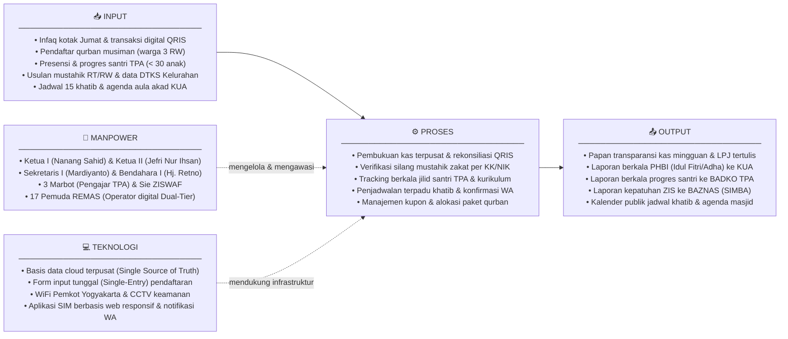
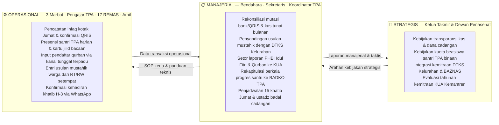

# LAPORAN PRAKTIKUM MINGGUAN
## Manajemen Sistem Informasi — PTF60234
**Universitas Negeri Yogyakarta | Fakultas Teknik | Prodi Pendidikan Teknik Informatika S1**

---

## 1. Identitas Laporan

| Identitas | Isian |
|---|---|
| **Nama Kelompok** | Kelompok 1 — Kelas F1 |
| **Anggota (NIM/Nama)** | 1. Muhammad Riski — 24050530029 |
| | 2. Fajar Ahnaf Mahardika — 24050530030 |
| | 3. Muhadzdzib Terry Al-Fauzan — 24050530052 |
| **Pertemuan ke-** | 1 |
| **Tanggal Pelaksanaan** | 24 Agustus 2026 |
| **Organisasi/Kasus yang Digunakan** | Masjid Besar Baitul Hikmah — SIM-BaitulHikmah |

---

## 2. Tujuan Kegiatan

Mahasiswa mampu menjelaskan peran sistem informasi manajemen dalam organisasi serta memilih dan menetapkan organisasi/kasus yang akan menjadi objek proyek sepanjang satu semester.

---

## 3. Uraian Pelaksanaan Kegiatan

Pada tahap brainstorming, kelompok mengajukan beberapa kandidat kasus yang dianggap memiliki potensi untuk dijadikan objek studi Sistem Informasi Manajemen. Kandidat yang diusulkan antara lain UNYParkir (sistem informasi parkir di lingkungan Universitas Negeri Yogyakarta yang melibatkan unit mahasiswa/dosen, prodi, departemen, fakultas, rektorat, divisi keuangan, divisi sarana prasarana, dan petugas parkir), sistem informasi ekosistem industri kopi (dari petani hingga konsumen akhir), sistem informasi kampung wisata (melibatkan penduduk, RT/RW, UMKM, wisatawan, dan pemerintah daerah), serta Masjid Besar Baitul Hikmah sebagai calon kasus manajemen sistem informasi berbasis organisasi keagamaan.

Setiap kandidat kemudian dibandingkan berdasarkan tiga kriteria: apakah memiliki minimal dua unit kerja yang saling bergantung, apakah terdapat masalah pengelolaan informasi yang dapat diamati secara nyata, dan apakah kasusnya dapat dipahami tanpa memerlukan pengetahuan domain yang terlalu khusus.

Setelah diskusi, kelompok sempat memilih UNYParkir sebagai kasus utama. Namun dalam proses lebih lanjut, kelompok menemukan hambatan yang cukup signifikan: akses ke sistem internal UNY sangat terbatas bagi mahasiswa, data parkir tidak tersedia secara terbuka, dan pengurus yang berwenang sulit untuk dihubungi secara formal. Kondisi ini membuat pengumpulan data empiris menjadi tidak mungkin dilakukan secara memadai dalam waktu satu semester.

Berdasarkan pertimbangan tersebut, kelompok memutuskan untuk memigrasikan topik ke Masjid Besar Baitul Hikmah yang berlokasi di Jl. Balapan No. 27 Klitren, Kemantren Gondokusuman, Kota Yogyakarta. Berdasarkan penelusuran data resmi SIMAS Kemenag RI (ID SIMAS: `01.4.34.71.03.000032`), masjid ini berstatus tipologi Masjid Besar, berdiri sejak tahun 1970 di atas tanah Barang Milik Negara (BMN), dan menaungi sekitar 3 RW dengan perkiraan 400 jamaah aktif. Skala organisasinya cukup besar dengan 23 pengurus takmir terdaftar, 15 khatib, 1 imam tetap, 3 muazin, 3–4 marbot operasional, serta 17 anggota Remaja Masjid (REMAS). Masjid ini mengelola beragam kegiatan rutin—mulai dari shalat rawatib, khutbah Jumat yang dijadwal bergilir, kajian hadits subuh dan dzuhur, pendidikan anak (TK dan TPA dengan santri aktif di bawah 30 anak), hingga pengelolaan ZIS dan kepanitiaan qurban. Namun di balik skala tersebut, masjid belum memiliki sistem informasi manajemen yang terintegrasi.

Data kondisi lapangan diperoleh melalui wawancara langsung dengan **Bpk. Mardianto, Sekretaris I Masjid Besar Baitul Hikmah** (menjabat sejak 2004), yang berperan sebagai narasumber pengganti karena Ketua Takmir belum dapat dihubungi pada saat pelaksanaan wawancara, serta diperkuat oleh **observasi partisipatif internal** oleh kader Remaja Masjid (REMAS) dan panitia hari besar Islam. Bpk. Mardianto merangkap sejumlah fungsi: sekretaris, seksi dakwah (pencari khatib/ustadz), penghubung perizinan luar, koordinator pendaftaran qurban, hingga pembantu administrasi keuangan ibu-ibu majelis taklim. Wawancara dan observasi ini menyingkap fakta bahwa pengelolaan data berjalan sangat terfragmentasi: dokumen tersimpan di rumah pribadi sekretaris, pembukuan kas fisik bendahara tidak dipublikasikan berkala, dan pembaruan data jamaah miskin (mustahik) untuk zakat maupun donasi masih mengandalkan konfirmasi lisan warga sekitar serta usulan RT/RW tanpa integrasi ke Data Terpadu Kesejahteraan Sosial (DTKS) resmi pemerintah. Kondisi nyata inilah yang menjadi alasan kuat mengapa manajemen sistem informasi sangat relevan untuk dikaji dan diterapkan pada organisasi ini.

Setelah menetapkan objek studi, kelompok mengisi lembar profil organisasi dan mendiskusikan area-area operasional yang berpotensi didukung oleh sistem informasi. Dari diskusi tersebut, kelompok menyepakati untuk memfokuskan proyek pada dua proses bisnis inti yang dinilai paling bernilai secara strategis, yaitu tata kelola pendataan jamaah dan penyaluran ZIS, serta tata kelola layanan pendidikan TPA dan kemakmuran ibadah.

---

## 4. Hasil/Artefak Praktikum

### 4.1 Lembar Profil Organisasi

| Kolom | Isian |
|---|---|
| **Nama Organisasi** | Masjid Besar Baitul Hikmah (ID SIMAS: `01.4.34.71.03.000032`) beserta unit afiliasi: TK Baitul Hikmah, TPA Baitul Hikmah, dan Kemitraan KUA Kemantren Gondokusuman |
| **Lokasi & Legalitas** | Jl. Balapan No. 27 Klitren, Kemantren Gondokusuman, Kota Yogyakarta, D.I. Yogyakarta (Koordinat: -7.775285, 110.375461). Berdiri tahun 1970 di atas tanah Barang Milik Negara (BMN) dan terdaftar di SIMAS Kemenag RI dengan tipologi Masjid Besar. |
| **Bidang Usaha/Layanan** | Pelayanan ibadah fardhu dan Jumat, pengelolaan ZISWAF dan Unit Pengumpul Zakat (UPZ), pendidikan anak usia dini (TK & TPA Baitul Hikmah), koordinasi kegiatan semi-pemerintah dengan KUA (akad nikah dan bimbingan perkawinan), serta pembinaan sosial kemasyarakatan |
| **Deskripsi Singkat** | Masjid Besar Baitul Hikmah merupakan masjid tingkat kemantren/kecamatan yang melayani jamaah aktif dari 3 RW sekitar (RW 06 dan RW 16 Kelurahan Klitren). Kepengurusan takmir periode 2026–2030 resmi ditetapkan melalui **SK No. 05/MBBH/VII/2026** (16 Juli 2026), ditandatangani Ketua Takmir Nanang Sahid Wahyudi, S.Pd. Masjid memiliki fasilitas memadai (aula serbaguna, ruang belajar TPA, perpustakaan agama, CCTV, dan WiFi publik Pemkot Yogyakarta). Walaupun kegiatannya padat, seluruh tata kelola informasi saat ini masih manual, terfragmentasi, dan belum terintegrasi. *Catatan: data nominal infaq bulanan dan volume kepanitiaan qurban belum terverifikasi dari sumber resmi — akan dilengkapi melalui wawancara Bendahara/Ketua Takmir.* |
| **Struktur/Unit Kerja** | Berdasarkan **SK No. 05/MBBH/VII/2026** (periode 2026–2030): **Pembina** Kepala KUA Kecamatan Gondokusuman; **Pelindung** Ketua RW 06 & RW 16 Kel. Klitren; **Penasehat** Shidiq Premono, S.Pd.i., M.Pd.; **Ketua I** Nanang Sahid Wahyudi, S.Pd. / **Ketua II** Jefri Nur Ihsan, SE.I. *(merangkap Direktur TPA)*; **Sekretaris I** Mardiyanto / **Sekretaris II** Hafiz Alfarizi; **Bendahara I** Hj. Retno Kusumastuti / **Bendahara II** Dwi Sari Kurnia Putri; **Sie Sarana & Prasarana** (6 anggota); **Sie Humas, Informasi & Dokumentasi** (4 anggota: Lasono M.Hum., Swinarno, Kurniawan, Fajar); **Sie Sosial & ZISWAF** (7 anggota: Dwi Wanto Waluyo dkk.); **RISMA** (Hafiz Wahyu Sukmawan, Burhanuddin Abdullah, Haikal + Remaja Masjid); **Sie Pendidikan, Ibadah & Dakwah** (R. Suharseno S.Pd. dkk.); **TK** Sri Lestari Puji Rahayu; **TPA** Satrio, Fahim, Fajri, Marbot *(pengajar — marbot merangkap pengajar TPA)*; **Sie Keamanan** (5 anggota); **Pembantu Umum** (14 orang); **Konsumsi** (3 orang). |
| **Kondisi Sistem Informasi Saat Ini** | Belum ada sistem informasi yang terintegrasi. Berdasarkan keterangan Bpk. Mardianto (Sekretaris I) dan observasi partisipatif REMAS: (1) **Insiden kritis Feb 2026** — komputer pengurus rusak dan hanya 30% data berhasil di-recovery; 70% data hilang permanen karena tidak ada backup cloud. (2) **Laporan keuangan terhenti** — menurut pengamatan Sekretaris, Bendahara tidak membuat laporan keuangan tertulis selama kurang lebih 3 tahun berturut-turut; pencatatan kas masih berjalan di Word/Excel masing-masing pihak sehingga rentan selisih. (3) **Triple entry Qurban** — pendaftaran hewan qurban dilakukan tiga kali: via WhatsApp, lalu dicatat ulang di buku tulis, lalu diinput ke komputer — tanpa kanal tunggal yang terstandarisasi. (4) **TPA menggunakan Excel lokal** — absensi dan perkembangan santri dicatat via spreadsheet (bukan manual murni), namun tersimpan di perangkat lokal yang rawan hilang, serupa dengan insiden PC Feb 2026. (5) **Khatib terjadwal 1 tahun penuh** namun koordinasi masih via chat WhatsApp pribadi; ada mekanisme ustadz badal jika khatib berhalangan. (6) **QRIS dan rekening bank** atas nama masjid sudah ada namun belum dimanfaatkan untuk pelaporan terstruktur. Dokumen fisik disimpan di rumah pribadi Sekretaris, bukan di sekretariat masjid. (7) **Pendataan mustahik non-DTKS** — pembaruan data warga kurang mampu penerima zakat fitrah, santunan donasi, dan kupon qurban hanya mengandalkan konfirmasi lisan warga sekitar dan usulan RT/RW (RT 01–05 / RW 06 & 16), tanpa pernah mencocokkan dengan data resmi DTKS Kelurahan Klitren, sehingga menimbulkan risiko bantuan tumpang tindih (*inclusion error*) atau warga miskin baru/pendatang terlewat (*exclusion error*). (8) **Ketiadaan SOP kerja dan daur ulang berkas lokal** — ketiadaan dokumentasi SOP resmi memicu hambatan regenerasi bagi pemuda/REMAS (harus konfirmasi berbelit tanya A, B, C, D), sementara kepanitiaan rapat selalu mendaur ulang berkas lama di harddisk lokal (*hard drive legacy*). |
| **Area Operasional Potensial** | (1) Tata kelola pendataan jamaah dan verifikasi penyaluran ZIS/UPZ berbasis NIK dengan validasi silang DTKS Kelurahan, (2) Pembukuan kas digital multi-user untuk transparansi donasi, (3) Manajemen penjadwalan terpadu (khatib, kajian, dan penggunaan ruang aula/KUA), (4) Sistem administrasi dan progres akademik santri TPA terintegrasi, (5) Pelaporan berkala kepatuhan zakat ke BAZNAS melalui integrasi standar SIMBA |
| **Justifikasi Pemilihan Kasus** | Objek studi ini menyajikan permasalahan tata kelola informasi yang nyata dan kompleks, memiliki landasan data publik yang jelas (SIMAS Kemenag), melibatkan ragam unit kerja internal dan eksternal yang saling bergantung, memiliki narasumber yang dapat diakses langsung, serta mencakup kebutuhan pengambilan keputusan dari level operasional hingga strategis. |

---

### 4.2 Lima Unsur Sistem Informasi SIM-BaitulHikmah

Mengacu pada kerangka MSI, sistem informasi yang dirancang harus memenuhi lima unsur berikut dengan menyesuaikan kondisi faktual Masjid Besar Baitul Hikmah:

---

### 4.3 Tiga Level Keputusan pada SIM-BaitulHikmah

Sistem informasi manajemen yang baik harus mampu mendukung pengambilan keputusan di tiga level sekaligus. Berikut adalah gambaran ketiga level tersebut berdasarkan alur kerja nyata di Masjid Besar Baitul Hikmah:

---

### 4.4 Kesesuaian Kasus dengan 7 Aspek MSI

| No | Aspek MSI | Manifestasi pada SIM-BaitulHikmah |
|---|---|---|
| 1 | Keselarasan Strategis | Sistem terhubung ke misi masjid sebagai institusi peribadatan dan sosial: memakmurkan ibadah rawatib/Jumat, mendidik santri TPA, dan menyalurkan ZIS serta daging qurban secara berkeadilan |
| 2 | Tata Kelola & Kualitas Informasi | Mengakhiri pencatatan ganda infaq antara Bendahara dan Sekretaris di Word/Excel yang memicu selisih (nominal infaq belum terverifikasi dari sumber resmi), serta mencegah hilangnya data absensi santri TPA — saat ini tersimpan di **Excel lokal** yang rawan hilang jika perangkat rusak (mirip insiden PC Feb 2026) |
| 3 | Dukungan Pengambilan Keputusan | Tiga level terpenuhi: operasional (3 marbot input santri dan kotak infaq), manajerial (rekonsiliasi kas dan rekap jadwal khatib), serta strategis (evaluasi pemanfaatan dana donasi dan program dakwah) |
| 4 | Kebutuhan Informasi Stakeholder | Setiap pihak memiliki kebutuhan spesifik: jamaah butuh kepastian jadwal 15 khatib tanpa bentrok mendadak, BADKO TPA butuh laporan capaian santri, warga 3 RW dan mustahik butuh kepastian seleksi bantuan ZIS serta kupon qurban yang adil berbasis data objektif (bukan sekadar kedekatan lisan), dan BAZNAS butuh kepatuhan UPZ |
| 5 | Nilai Informasi | Informasi jadwal khatib yang akurat mencegah kekosongan mimbar Jumat atau pengalihan darurat shalat tarawih ke pembacaan hadits marbot; data mustahik yang valid menjaga kepercayaan donatur |
| 6 | Integrasi Proses Bisnis | Menghubungkan modul internal dengan agenda eksternal: pemakaian aula untuk akad nikah KUA (minimal 1x/bln) melalui kalender terpadu, pelaporan santri ke BADKO TPA, dan sinkronisasi data warga miskin dengan DTKS Kelurahan Klitren guna mengakhiri data silo |
| 7 | Adopsi & Perilaku Organisasi | Memperhitungkan kendala sosio-teknis riil: 17 anggota REMAS dan kader muda mengalami disorientasi regenerasi karena ketiadaan SOP tertulis resmi (arus kerja mengandalkan tradisi lisan konfirmasi A, B, C, D) dan fenomena *sleeping committee* pada nama-nama SK. Di sisi lain, para sesepuh terbiasa bekerja manual/komputasi dasar. Sistem dirancang dengan pendekatan *Dual-Tier Operating Model* (antarmuka sederhana bagi pengurus sepuh, modul operasional digital dikelola kader muda REMAS). |

---

## 5. Kendala dan Solusi

Kendala utama yang dihadapi kelompok pada pertemuan ini adalah adanya beberapa ide kasus awal yang sama-sama memiliki potensi, sehingga diperlukan proses seleksi yang cermat. Kandidat awal yang dipilih (UNYParkir) menghadapi hambatan akses: sistem internal UNY bersifat tertutup bagi mahasiswa dan data parkir tidak tersedia terbuka, sehingga pengumpulan data empiris tidak dapat dilakukan memadai.

Untuk mengatasinya, kelompok memutuskan memigrasikan topik ke Masjid Besar Baitul Hikmah yang berlokasi strategis di Gondokusuman dan memiliki keterbukaan data yang baik. Data lapangan berhasil diperoleh melalui wawancara dengan **Bpk. Mardianto (Sekretaris I)** yang bersedia menjadi narasumber pengganti karena **Ketua Takmir belum dapat dihubungi** pada saat pelaksanaan (sedang sibuk), serta diperkuat oleh catatan **observasi partisipatif internal** kader REMAS dan kepanitiaan hari besar Islam. Data yang diperoleh mencakup kondisi operasional harian, insiden kehilangan data, dinamika koordinasi khatib, tata kelola TPA, serta pola pendataan warga miskin berbasis RT/RW.

**Keterbatasan metodologis yang perlu dicatat:** karena narasumber adalah Sekretaris (bukan Ketua Takmir atau Bendahara), data terkait keputusan strategis ZIS, rencana pengembangan jangka panjang, dan kebijakan keuangan resmi **belum diperoleh dari sumber otoritatif** (Ketua Takmir/Bendahara). Selain itu, data kemiskinan warga saat ini terbukti masih berupa *data silo* (belum terhubung dengan DTKS Kelurahan), sehingga analisis awal baru merefleksikan mekanisme konfirmasi lisan pengurus RT/RW setempat. Wawancara lanjutan dengan Ketua Takmir dan Bendahara dijadwalkan pada tahap berikutnya untuk melengkapi data yang masih kurang.

---

## 6. Refleksi Pembelajaran

Melalui kegiatan ini, kelompok memahami bahwa Sistem Informasi Manajemen tidak hanya berkaitan dengan pembuatan aplikasi, tetapi lebih pada bagaimana data dikelola dan diolah menjadi informasi yang dapat mendukung pengambilan keputusan organisasi. Kelompok sempat terjebak pada pola pikir yang terlalu berorientasi pada fitur teknis saat memilih UNYParkir, dan baru menyadari bahwa pemilihan kasus yang tepat harus diawali dari pertanyaan mengapa sistem informasi dibutuhkan, bukan dari apa yang ingin dibangun secara teknis.

Selain itu, kelompok juga mulai memahami pentingnya melihat hubungan antarunit kerja dan kebutuhan informasi masing-masing pihak sebelum menentukan arah pengembangan sistem. Pengalaman memilih dan mengganti kasus ini menjadi pelajaran konkret bahwa aksesibilitas data dan keterbukaan narasumber adalah faktor kritis yang tidak boleh diabaikan sejak awal.

---

## 7. Kesimpulan

Berdasarkan hasil diskusi dan pertimbangan kelompok, Masjid Besar Baitul Hikmah ditetapkan sebagai objek proyek Manajemen Sistem Informasi dengan nama kasus SIM-BaitulHikmah. Kasus ini dipilih karena memiliki masalah pengelolaan informasi yang nyata, melibatkan berbagai stakeholder dengan kebutuhan yang berbeda-beda, dan dapat dianalisis dari tingkat operasional hingga strategis. Profil organisasi dan area operasional yang telah diidentifikasi pada pertemuan ini akan menjadi dasar bagi analisis stakeholder dan lingkungan bisnis pada pertemuan berikutnya.

---

## Referensi

- Laudon, K. C., & Laudon, J. P. (2014). *Management information systems: Managing the digital firm* (13th ed.). Pearson Education.
- Sousa, K. J., & Oz, E. (2014). *Management information systems* (7th ed.). Cengage Learning.
- Kementerian Agama RI. (2011). *Undang-Undang No. 23 Tahun 2011 tentang Pengelolaan Zakat*. Kemenag RI.
- Takmir Masjid Besar Baitul Hikmah. (2026). *Surat Keputusan No. 05/MBBH/VII/2026 tentang Susunan Pengurus Takmir MBBH Periode 2026–2030* (ditetapkan 16 Juli 2026). Yogyakarta: MBBH.
- Mardiyanto. (2026, Agustus). *Wawancara langsung: Tata kelola informasi Masjid Besar Baitul Hikmah* [Narasumber: Sekretaris I MBBH sejak 2004]. Kelompok 1 F1, Praktik MSI UNY.
