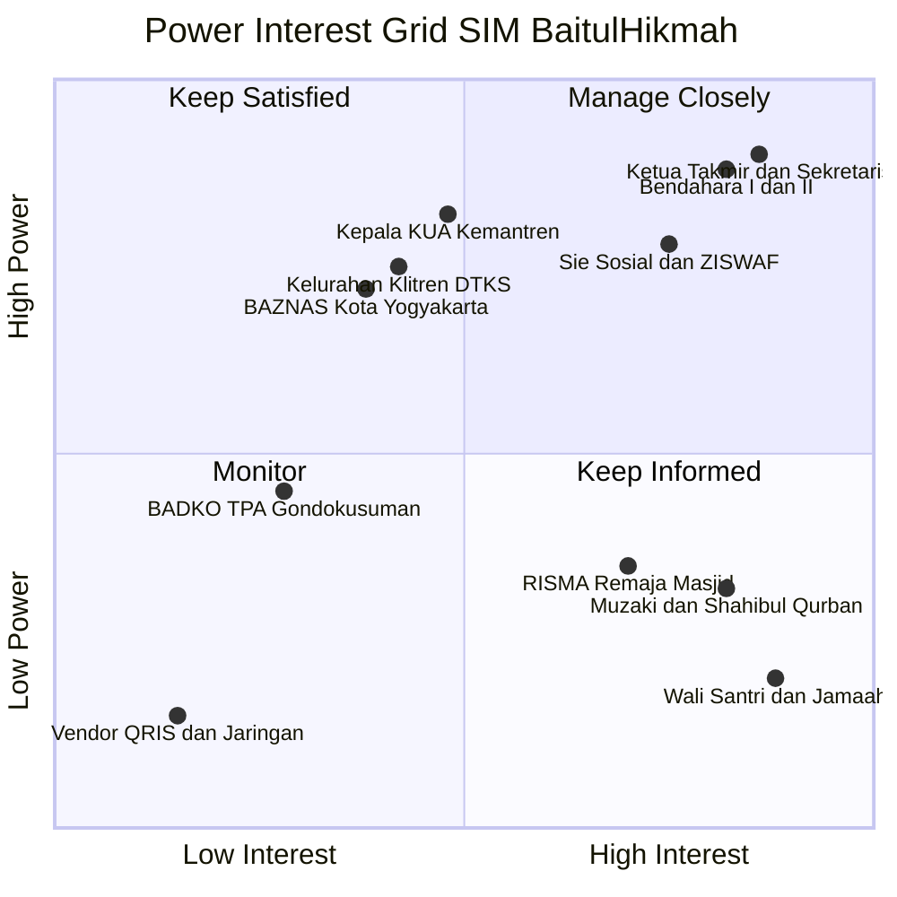
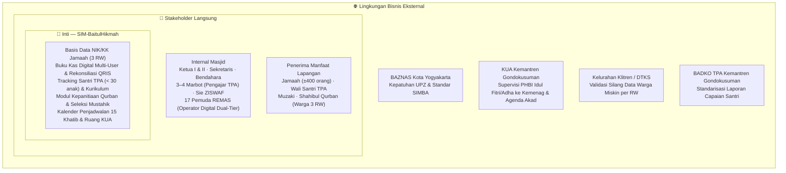
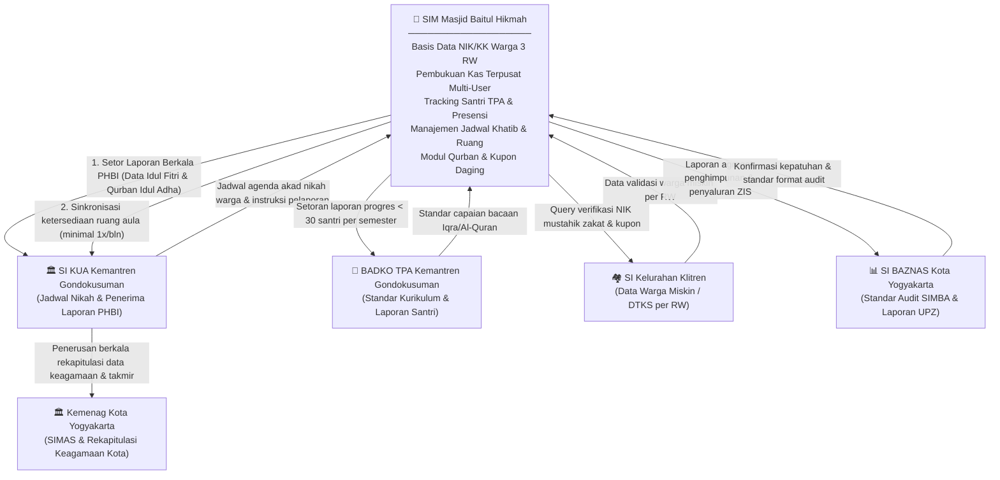
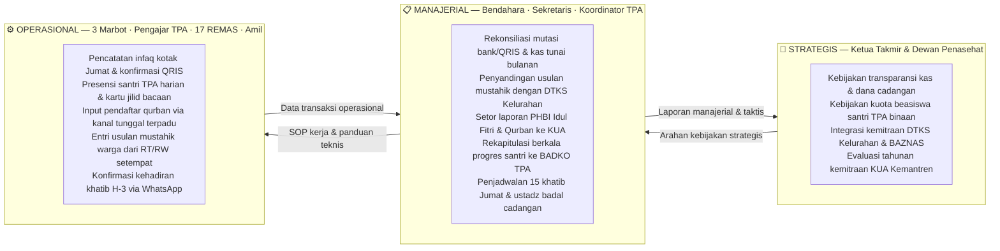

# LAPORAN PRAKTIKUM MINGGUAN
## Manajemen Sistem Informasi — PTF60234
**Universitas Negeri Yogyakarta | Fakultas Teknik | Prodi Pendidikan Teknik Informatika S1**

---

## 1. Identitas Laporan

| Identitas | Isian |
|---|---|
| **Nama Kelompok** | Kelompok 1 — Kelas F1 |
| **Anggota (NIM/Nama)** | 1. Muhammad Riski — 24050530029 |
| | 2. Fajar Ahnaf Mahardika — 24050530030 |
| | 3. Muhadzdzib Terry Al-Fauzan — 24050530052 |
| **Pertemuan ke-** | 2 |
| **Tanggal Pelaksanaan** | 31 Agustus 2026 |
| **Organisasi/Kasus yang Digunakan** | Masjid Besar Baitul Hikmah — SIM-BaitulHikmah |

---

## 2. Tujuan Kegiatan

Mahasiswa mampu mengidentifikasi stakeholder organisasi dan memetakan kepentingan serta pengaruh masing-masing, serta menganalisis faktor lingkungan bisnis yang membentuk kebutuhan informasi organisasi, sebagai dasar rencana pengembangan sistem informasi.

---

## 3. Uraian Pelaksanaan Kegiatan

Kegiatan pada pertemuan ini diawali dengan menyusun daftar seluruh pihak yang berkaitan dengan Masjid Besar Baitul Hikmah (ID SIMAS: `01.4.34.71.03.000032`, berlokasi di Jl. Balapan No. 27 Klitren, Kemantren Gondokusuman), baik internal maupun eksternal, berdasarkan profil organisasi yang telah disusun pada pertemuan sebelumnya. Pemetaan ini diperkuat dengan data wawancara lapangan bersama **Bpk. Mardianto, Sekretaris I Masjid** (menjabat sejak 2004), yang hadir sebagai narasumber pengganti karena **Ketua Takmir belum tersedia** pada saat wawancara, serta diperkaya oleh catatan **observasi partisipatif internal** kader Remaja Masjid (REMAS) dan panitia hari besar Islam. Dari proses ini, kelompok mengidentifikasi stakeholder utama, mulai dari 23 pengurus takmir terdaftar di SK, pelayan ibadah (1 imam, 15 khatib, 3 muazin, 3–4 marbot operasional), pengelola unit pendidikan (TK dan TPA — termasuk Direktur TPA Mas Jefri), 17 anggota Remaja Masjid (REMAS), hingga lembaga eksternal seperti KUA Kemantren Gondokusuman, BAZNAS, Kelurahan Klitren (DTKS), dan BADKO TPA.

Satu temuan penting yang mendasari pemetaan stakeholder eksternal adalah kenyataan bahwa dalam pengelolaan ZIS, santunan sosial, dan kupon qurban, sekretaris dan pengurus selama ini memperbarui data warga kurang mampu hanya melalui konfirmasi lisan tetangga sekitar dan usulan pengurus RT 01–05 / RW 06 & 16, sama sekali terputus dari Data Terpadu Kesejahteraan Sosial (DTKS) resmi Kelurahan Klitren. Hal ini menjadikan pemetaan stakeholder lingkungan eksternal menjadi sangat krusial untuk mengidentifikasi jurang tata kelola informasi (*information governance gap*).

Setelah daftar tersusun, kelompok mendiskusikan tingkat power dan interest masing-masing stakeholder. Yang dimaksud power di sini bukan sekadar posisi jabatan, melainkan sejauh mana pihak tersebut memiliki kewenangan atas keputusan-keputusan yang menyangkut data dan informasi dalam sistem. Sedangkan interest diukur dari seberapa besar ketergantungan mereka terhadap output yang dihasilkan sistem.

Terdapat satu perdebatan yang cukup panjang terkait penempatan Kepala KUA Kecamatan. Sebagian anggota awalnya berpendapat bahwa power-nya hanya sedang karena KUA merupakan pihak eksternal. Namun setelah didiskusikan lebih lanjut berdasarkan fakta wawancara bersama Bpk. Mardianto, kelompok menyepakati bahwa power KUA dinilai **tinggi**. KUA memegang fungsi ganda yang sangat strategis: selain memiliki kewenangan mengikat atas perizinan perwakafan dan koordinasi penggunaan aula masjid untuk prosesi akad nikah warga, **KUA juga bertindak sebagai penerima dan peminta laporan keagamaan berkala dari takmir—seperti Laporan Pelaksanaan Idul Fitri (jamaah shalat Ied), Laporan Qurban Idul Adha (rekapitulasi data hewan dan pendistribusian daging qurban), serta pembaruan data kepengurusan takmir—yang nantinya diagregasikan oleh KUA untuk diserahkan ke tingkat lanjut, yaitu Kementerian Agama (Kemenag Kota Yogyakarta)**. Dengan demikian, KUA bukan sekadar peminjam aula, melainkan pintu gerbang pelaporan dan akuntabilitas keagamaan kenegaraan (*regulatory intermediary*).

Setelah pemetaan selesai, kelompok merumuskan strategi komunikasi yang sesuai untuk masing-masing kuadran, kemudian melanjutkan ke analisis lingkungan bisnis menggunakan empat kategori yang telah dipelajari dari modul: regulasi dan kepatuhan, benchmark, kapasitas internal, serta tren dan tekanan eksternal.

---

## 4. Hasil/Artefak Praktikum

### 4.1 Power-Interest Grid — Visualisasi

Berikut adalah hasil pemetaan seluruh stakeholder SIM-BaitulHikmah ke dalam Power-Interest Grid:

---

### 4.2 Lembar Kerja: Power-Interest Grid

| Nama/Peran Stakeholder | Power | Interest | Kuadran | Strategi Komunikasi |
|---|---|---|---|---|
| Ketua Takmir (Ketua I & II) dan Sekretaris | Tinggi | Tinggi | Manage Closely | Rapat koordinasi bulanan; akses penuh ke pencatatan kas terpusat dan verifikasi ZIS. **Ketua I: Nanang Sahid Wahyudi, S.Pd. / Ketua II: Jefri Nur Ihsan, SE.I. / Sekretaris I: Mardiyanto** (SK No. 05/MBBH/VII/2026). *Catatan: wawancara baru dilakukan ke Sekretaris I (Mardiyanto) — Ketua belum tersedia.* |
| Bendahara (I & II) | Tinggi | Tinggi | Manage Closely | Akses ke data pembukuan kas; audit trail digital untuk mencegah selisih. **Bendahara I: Hj. Retno Kusumastuti / Bendahara II: Dwi Sari Kurnia Putri** (SK 2026). *Data laporan keuangan resmi belum diperoleh langsung — diketahui via pengamatan Sekretaris bahwa laporan tertulis terhenti ~3 tahun.* |
| Sie Sosial & ZISWAF (7 anggota) | Tinggi | Tinggi | Manage Closely | Pengelola ZIS/ZISWAF resmi di SK (7 anggota: Dwi Wanto Waluyo dkk.). Saat ini masih memperbarui data mustahik secara konvensional via usulan lisan tetangga dan RT/RW. Membutuhkan sistem seleksi mustahik yang terstandarisasi berbasis kriteria kemiskinan terukur serta terhubung dengan DTKS Kelurahan |
| Kepala KUA Kemantren Gondokusuman | Tinggi | Sedang/Tinggi | Keep Satisfied | Penerima dan peminta laporan berkala kegiatan keagamaan (Laporan Shalat Idul Fitri, Laporan Qurban Idul Adha, dan pembaruan data kepengurusan takmir) yang diserahkan masjid untuk diteruskan ke tingkat lanjut di Kemenag Kota Yogyakarta; serta koordinasi jadwal penggunaan aula masjid untuk agenda akad nikah warga melalui kalender terpadu (*shared resource calendar*) |
| BAZNAS Kota Yogyakarta | Tinggi | Sedang | Keep Satisfied | Pelaporan berkala penghimpunan dan penyaluran zakat UPZ sesuai regulasi UU 23/2011 dan standar aplikasi SIMBA BAZNAS |
| Kelurahan Klitren / DTKS | Tinggi | Rendah/Sedang | Keep Satisfied | Pengampu basis data kemiskinan resmi pemerintah (DTKS). Mengakhiri *data silo* melalui sinkronisasi berkala data warga fakir miskin tingkat RW guna memvalidasi silang mustahik zakat fitrah, santunan, dan kupon qurban per KK/NIK, guna mencegah *exclusion error* dan *inclusion error* |
| Muzaki & Shahibul Qurban | Rendah/Sedang | Tinggi | Keep Informed | Publikasi laporan transparansi kas bulanan via papan pengumuman/WA broadcast, serta bukti penerimaan hewan qurban |
| Wali Santri & Jamaah 3 RW | Rendah | Tinggi | Keep Informed | Notifikasi kepastian jadwal 15 khatib Jumat/tarawih via grup WA, serta kartu laporan perkembangan santri TPA per semester |
| BADKO TPA Kemantren Gondokusuman | Sedang | Rendah | Monitor | Pengiriman rekapitulasi data santri dan progres kurikulum TPA satu kali setiap semester |
| RISMA / Remaja Masjid (Hafiz Wahyu Sukmawan dkk.) | Rendah/Sedang | Sedang | Keep Informed | Kaderisasi & pelatihan operasional digital berkala; penyusunan SOP tertulis untuk mengeliminasi friksi alur konfirmasi bertingkat ("tanya A, konfirmasi B, cek C dan D") dan kebiasaan daur-ulang berkas lokal; pemberdayaan REMAS sebagai operator SIM dan media publikasi dakwah |
| Vendor QRIS & Jaringan Internet | Rendah | Rendah | Monitor | Pemantauan berkala stabilitas koneksi WiFi Pemkot dan sistem CCTV yang telah terpasang di masjid |

---

### 4.3 Ekosistem SIM-BaitulHikmah — Lingkaran Konsentris

Dalam pendekatan MSI, aplikasi berada di inti, dikelilingi oleh lapisan stakeholder yang berinteraksi langsung, dan dipengaruhi dari luar oleh lingkungan bisnis eksternal. Lapisan terluar inilah yang sesungguhnya menentukan mengapa fitur-fitur tertentu perlu ada dalam sistem:

---

### 4.4 Arsitektur Interkoneksi Lintas Sistem

SIM-BaitulHikmah dirancang bukan sebagai sistem yang berdiri sendiri, melainkan sebagai sistem yang terhubung dan saling memengaruhi dengan sistem informasi di luar masjid:

---

### 4.5 Tiga Level Keputusan — Kaitannya dengan Peta Stakeholder

Hasil pemetaan stakeholder pada pertemuan ini perlu dikaitkan dengan tiga level keputusan organisasi agar terlihat bagaimana informasi mengalir dari bawah ke atas dan sebaliknya:

---

### 4.6 Lembar Kerja: Analisis Lingkungan Bisnis

| Kategori | Temuan pada Masjid Besar Baitul Hikmah |
|---|---|
| **Regulasi dan Kepatuhan** | Beberapa hal yang kami temukan pada aspek regulasi dan kepatuhan sudah berjalan dengan lancar dan baik, seperti status legalitas masjid yang resmi terdaftar di Kementerian Agama RI dengan nomor ID SIMAS (`01.4.34.71.03.000032`), berdirinya bangunan di atas tanah Barang Milik Negara (BMN) yang sah, serta izin operasional (IZOP) TPA dari Kemenag yang telah resmi terbit. Namun demikian, terdapat pula beberapa temuan masalah dan celah tata kelola yang kami rasa perlu untuk dikembangkan: 1. **Pelaporan Keagamaan Berkala ke KUA:** Berdasarkan mandat **PMA No. 34 Tahun 2016**, KUA bertindak sebagai supervisor wilayah yang berwenang meminta dan mengumpulkan laporan berkala kegiatan keagamaan (data jamaah Shalat Idul Fitri serta perolehan dan distribusi hewan qurban Idul Adha) untuk diteruskan ke Kantor Kemenag Kota Yogyakarta; saat ini takmir masih melaporkannya secara insidental manual pasca-acara dan belum teragregasi dalam format sistem yang terstandarisasi. 2. **Kepatuhan Pelaporan ZIS Nasional:** Unit pengumpul zakat masjid belum terintegrasi dengan sistem pelaporan akuntabilitas resmi BAZNAS (UU No. 23 Tahun 2011) melalui aplikasi SIMBA. 3. **Penyaluran ZIS Berbasis Data Kemiskinan Daerah:** Penyaluran zakat fitrah dan daging qurban belum disinkronisasikan dengan Data Terpadu Kesejahteraan Sosial (DTKS) Kelurahan Klitren sebagaimana diamanatkan Instruksi Walikota Yogyakarta tentang Penanggulangan Kemiskinan, sehingga rawan memicu kesalahan sasaran (*exclusion error* dan *inclusion error*). |
| **Benchmark/Kompetisi** | Beberapa praktik baik dari masjid pembanding di tingkat lapangan dan benchmark terdekat menunjukkan tata kelola informasi yang sudah berjalan sangat sukses. Namun, pada Masjid Besar Baitul Hikmah kami menemukan sejumlah kesenjangan tata kelola (*governance gap*) yang menjadi temuan masalah dan perlu dikembangkan: 1. **Kesenjangan Kematangan Digital vs Masjid Nurul Ashri Deresan:** Meskipun tipologi Nurul Ashri lebih kecil (Masjid Jami' lingkungan), tata kelola digitalnya jauh lebih matang dengan website aktif (Next.js), 13 program donasi online dengan progress bar real-time, dan keterlibatan 2.450+ jamaah aktif yang digerakkan pemuda relawan. Sebaliknya, Baitul Hikmah (Masjid Besar tingkat kecamatan) belum memiliki website/portal publikasi daring dan menghadapi krisis keterlibatan generasi muda. 2. **Kesenjangan Transparansi Terbuka vs Masjid Mujur Al-Amin (Karangnongko):** Masjid Mujur Al-Amin sukses menerapkan tata kelola swakelola terbuka melalui *dual custody* kotak infak (dihitung berdua dengan berita acara saksi) serta Papan Terbuka Donasi Takjil 1–30 Ramadhan. Sebaliknya, Baitul Hikmah mengalami masalah asimetri informasi di mana saldo kas fisik tidak dipublikasikan secara tertulis selama ~3 tahun dan slot donasi logistik sering kosong akibat ketiadaan papan informasi terbuka bagi warga. |
| **Kapasitas Internal** | Beberapa sarana dan kapasitas internal organisasi yang kami temukan sudah berjalan lancar, antara lain ketersediaan SK kepengurusan formal (SK No. 05/MBBH/VII/2026) dengan pembagian bidang yang lengkap, ketersediaan fasilitas WiFi publik Pemkot Yogyakarta, CCTV, rekening bank dan QRIS aktif atas nama masjid, serta pencatatan absensi santri TPA yang sudah menggunakan Excel lokal. Namun demikian, terdapat beberapa temuan masalah mendasar pada kapasitas internal yang perlu dibenahi dan dikembangkan: 1. **Fenomena *Sleeping Committee* & *Key-Person Dependency*:** Banyak nama tercatat dalam struktur SK kepengurusan namun pasif dalam eksekusi fisik di lapangan, sehingga beban operasional menumpuk ekstrem pada figur Sekretaris I yang merangkap lebih dari 6 fungsi sekaligus tanpa pelapis. 2. **Stagnasi Akuntabilitas Keuangan:** Pembukuan kas masjid terpusat pada buku fisik pribadi Bendahara I tanpa pernah mempublikasikan laporan keuangan tertulis berkala kepada jamaah selama ~3 tahun berturut-turut. 3. **Ketiadaan SOP & Kerentanan Penyimpanan Lokal:** Organisasi tidak memiliki SOP tertulis dan kebijakan pencadangan data (*backup policy*); insiden rusaknya PC sekretariat pada Februari 2026 mengakibatkan 70% data riwayat arsip organisasi musnah permanen. 4. **Hambatan Regenerasi & Alur Kerja Turun-Temurun:** Pengurus baru mengalami disorientasi kerja karena ketiadaan SOP tertulis (harus konfirmasi manual ke figur A, B, C, D) dan rapat kepanitiaan selalu mengandalkan daur-ulang berkas lama di harddisk lokal (*hard drive legacy*). *(Catatan: data nominal infaq dan volume qurban belum diverifikasi langsung dari buku kas Bendahara).* |
| **Tren dan Tekanan Eksternal** | Beberapa adaptasi terhadap tren eksternal sudah berjalan baik, khususnya kesiapan adopsi pembayaran non-tunai di mana fasilitas rekening bank dan QRIS resmi atas nama masjid sudah tersedia dan aktif digunakan oleh jamaah. Namun, terdapat beberapa temuan masalah pada aspek integrasi dan transparansi yang perlu dikembangkan: 1. **Ketiadaan Integrasi Transaksi Digital ke Pembukuan Kas:** Transaksi masuk melalui QRIS dan transfer bank belum terintegrasi ke dalam pembukuan kas masjid, melainkan hanya mengendap di mutasi rekening bank tanpa rekonsiliasi dan pelaporan berkala. 2. **Tuntutan Transparansi Donatur Milenial:** Jamaah dan muzaki generasi muda semakin menuntut transparansi pelaporan penyaluran dana secara terbuka dan mudah diakses, bukan sekadar konfirmasi bukti transfer. 3. **Kebutuhan Informasi Wali Santri TPA/TK:** Para orang tua santri membutuhkan keterbukaan informasi progres belajar anak serta transparansi iuran secara berkala yang saat ini belum terfasilitasi secara rutin. |

---

## 5. Kendala dan Solusi

Kendala yang dihadapi kelompok pada pertemuan ini terutama muncul saat menilai power dan interest beberapa stakeholder yang posisinya tidak sepenuhnya jelas:
1. **Dilema Penempatan Kepala KUA:** Statusnya sebagai pihak eksternal sempat membuat sebagian anggota menilai power-nya hanya sedang. Namun, setelah ditinjau dari **PMA No. 34 Tahun 2016** serta keterangan wawancara bahwa **KUA bertindak sebagai penerima dan peminta laporan keagamaan berkala (Laporan Idul Fitri dan Idul Adha) yang wajib diagregasikan untuk diserahkan ke tingkat lanjut di Kemenag Kota Yogyakarta**, di samping kewenangan mengikat atas perizinan perwakafan dan aula nikah, kelompok menyepakati penilaian power tinggi (*Keep Satisfied*).
2. **Dilema Kelurahan Klitren (DTKS):** Fakta lapangan menunjukkan takmir selama ini "memutus" atau mengabaikan aliran data DTKS resmi dan hanya mengandalkan usulan lisan RT/RW. Sempat timbul perdebatan apakah Kelurahan relevan diposisikan sebagai stakeholder berkekuasaan tinggi. Dalam kacamata MSI, kelompok menyepakati bahwa Kelurahan memiliki *Power Tinggi* secara regulasi dan kualitas data; ketiadaan integrasi saat ini adalah bukti adanya kesenjangan informasi (*data silo gap*) yang justru wajib dijembatani oleh sistem baru.
3. **Keterbatasan Akses Narasumber Otoritatif:** **Ketua Takmir tidak dapat diwawancara** pada saat pertemuan ini karena sedang sibuk, sehingga wawancara dilakukan kepada **Bpk. Mardianto (Sekretaris I)** sebagai pengganti. Konsekuensinya, data terkait keputusan strategis ZIS, kebijakan keuangan, dan rencana pengembangan jangka panjang **belum diperoleh dari sumber otoritatif** (Ketua Takmir/Bendahara). Data tersebut bersifat pengamatan Sekretaris dan diperkuat oleh observasi partisipatif internal REMAS.

Selain itu, kelompok juga mengalami kesulitan saat pertama kali mengisi analisis lingkungan bisnis karena isian awal cenderung terlalu umum. Setelah melakukan riset tambahan mengenai UU No. 23/2011, Instruksi Walikota Yogyakarta, serta memadukan benchmark **Masjid Nurul Ashri Deresan** dan **Masjid Mujur Al-Amin**, analisis lingkungan bisnis menjadi sangat tajam dan kontekstual.

---

## 6. Refleksi Pembelajaran

Melalui kegiatan ini, kelompok memahami bahwa memetakan stakeholder dalam konteks MSI berbeda dengan yang biasa dilakukan dalam manajemen proyek umum. Dalam MSI, yang dipetakan bukan sekadar siapa yang mendukung atau menentang proyek, melainkan siapa yang memiliki kewenangan atas data tertentu dan siapa yang paling bergantung pada informasi yang dihasilkan sistem.

Kelompok juga mulai memahami mengapa analisis lingkungan bisnis perlu dilakukan berdampingan dengan pemetaan stakeholder. BAZNAS dan Kelurahan, misalnya, mungkin tidak akan pernah membuka aplikasi SIM-BaitulHikmah secara langsung, tetapi merekalah yang menentukan mengapa fitur pelaporan ZIS dan verifikasi mustahik perlu ada. Tanpa memahami tekanan dari lapisan luar ini, sistem bisa dirancang dengan baik secara teknis tetapi tidak menjawab kebutuhan nyata organisasi.

---

## 7. Kesimpulan

Berdasarkan hasil pemetaan pada pertemuan ini, kelompok berhasil mengidentifikasi sembilan stakeholder SIM-BaitulHikmah dan menempatkan masing-masing ke dalam kuadran yang sesuai: dua stakeholder masuk kuadran Manage Closely, tiga masuk Keep Satisfied, dua masuk Keep Informed, dan dua masuk Monitor. Analisis lingkungan bisnis juga mengidentifikasi empat faktor utama yang mempengaruhi kebutuhan informasi masjid, mulai dari regulasi pengelolaan zakat, benchmark tata kelola **Masjid Nurul Ashri Deresan**, keterbatasan kapasitas internal relawan, hingga tren digitalisasi jamaah.

Hasil pemetaan stakeholder dan analisis lingkungan bisnis ini akan menjadi dasar bagi identifikasi masalah dan penentuan prioritas solusi pada pertemuan berikutnya.

---

## Referensi

- Laudon, K. C., & Laudon, J. P. (2014). *Management information systems: Managing the digital firm* (13th ed.). Pearson Education.
- Sousa, K. J., & Oz, E. (2014). *Management information systems* (7th ed.). Cengage Learning.
- Kementerian Agama RI. (2011). *Undang-Undang No. 23 Tahun 2011 tentang Pengelolaan Zakat*. Kemenag RI.
- BAZNAS. (2023). *Sistem Manajemen Informasi BAZNAS (SIMBA)*. Badan Amil Zakat Nasional.
- Takmir Masjid Besar Baitul Hikmah. (2026). *Surat Keputusan No. 05/MBBH/VII/2026 tentang Susunan Pengurus Takmir MBBH Periode 2026–2030*. Yogyakarta: MBBH.
- Mardiyanto. (2026, Agustus). *Wawancara langsung: Tata kelola informasi Masjid Besar Baitul Hikmah* [Narasumber: Sekretaris I MBBH sejak 2004]. Kelompok 1 F1, Praktik MSI UNY.
