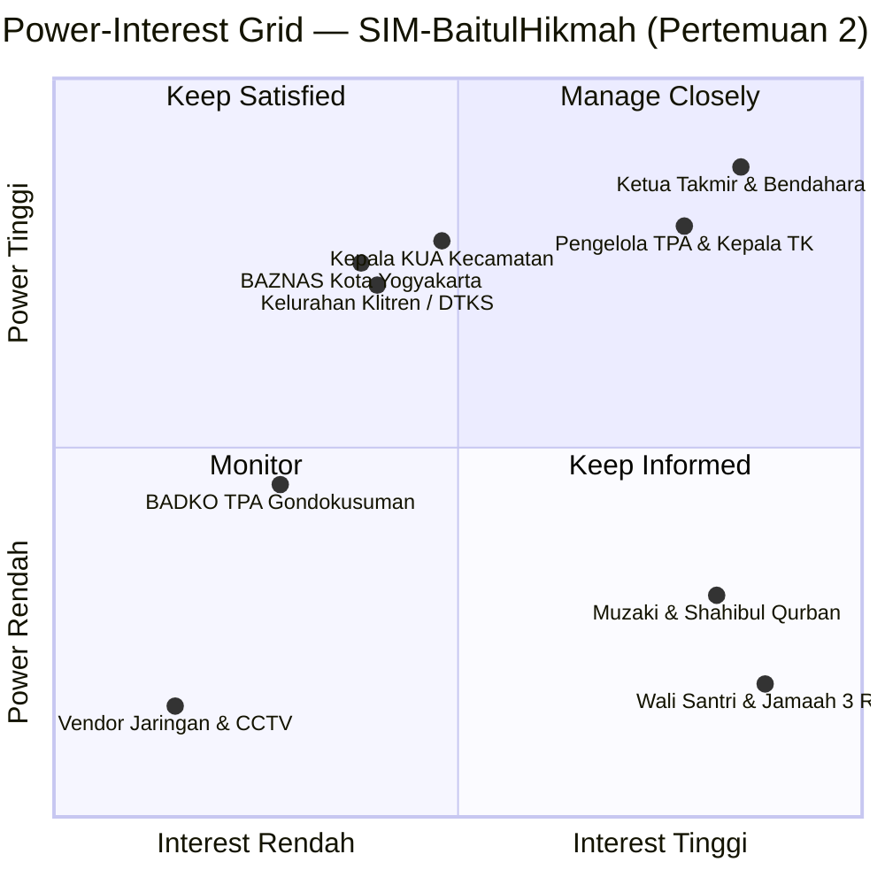
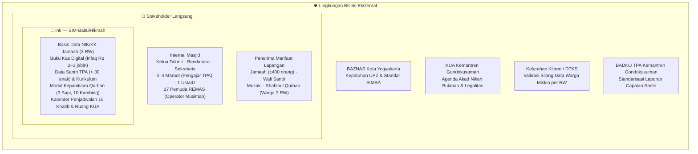
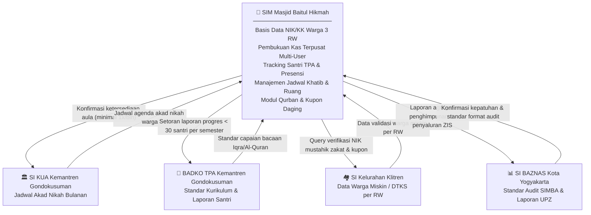
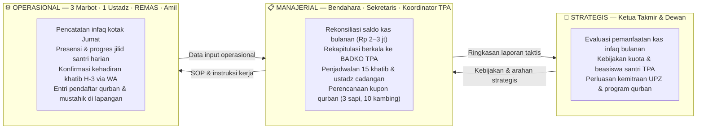

# LAPORAN PRAKTIKUM MINGGUAN
## Manajemen Sistem Informasi — PTF60234
**Universitas Negeri Yogyakarta | Fakultas Teknik | Prodi Pendidikan Teknik Informatika S1**

---

## 1. Identitas Laporan

| Identitas | Isian |
|---|---|
| **Nama Kelompok** | Kelompok 1 — Kelas F1 |
| **Anggota (NIM/Nama)** | 1. Muhammad Riski — 24050530029 |
| | 2. Fajar Ahnaf Mahardika — 24050530030 |
| | 3. Muhadzdzib Terry Al-Fauzan — 24050530052 |
| **Pertemuan ke-** | 2 |
| **Tanggal Pelaksanaan** | 31 Agustus 2026 |
| **Organisasi/Kasus yang Digunakan** | Masjid Besar Baitul Hikmah — SIM-BaitulHikmah |

---

## 2. Tujuan Kegiatan

Mahasiswa mampu mengidentifikasi stakeholder organisasi dan memetakan kepentingan serta pengaruh masing-masing, serta menganalisis faktor lingkungan bisnis yang membentuk kebutuhan informasi organisasi, sebagai dasar rencana pengembangan sistem informasi.

---

## 3. Uraian Pelaksanaan Kegiatan

Kegiatan pada pertemuan ini diawali dengan menyusun daftar seluruh pihak yang berkaitan dengan Masjid Besar Baitul Hikmah (ID SIMAS: `01.4.34.71.03.000032`, berlokasi di Jl. Balapan No. 27 Klitren, Kemantren Gondokusuman), baik internal maupun eksternal, berdasarkan profil organisasi yang telah disusun pada pertemuan sebelumnya. Pemetaan ini diperkuat dengan data wawancara lapangan bersama **Bpk. Mardianto, Sekretaris Masjid** (menjabat sejak 2004), yang hadir sebagai narasumber pengganti karena **Ketua Takmir belum tersedia** pada saat wawancara. Dari proses ini, kelompok mengidentifikasi stakeholder utama, mulai dari 23 pengurus takmir terdaftar, pelayan ibadah (1 imam, 15 khatib, 3 muazin, 3–4 marbot), pengelola unit pendidikan (TK dan TPA — termasuk Direktur TPA Mas Jefri), 17 anggota Remaja Masjid (REMAS), hingga lembaga eksternal seperti KUA Kemantren Gondokusuman, BAZNAS, Kelurahan Klitren (DTKS), dan BADKO TPA.

Setelah daftar tersusun, kelompok mendiskusikan tingkat power dan interest masing-masing stakeholder. Yang dimaksud power di sini bukan sekadar posisi jabatan, melainkan sejauh mana pihak tersebut memiliki kewenangan atas keputusan-keputusan yang menyangkut data dan informasi dalam sistem. Sedangkan interest diukur dari seberapa besar ketergantungan mereka terhadap output yang dihasilkan sistem.

Terdapat satu perdebatan yang cukup panjang terkait penempatan Kepala KUA Kecamatan. Sebagian anggota berpendapat bahwa power-nya hanya sedang karena KUA merupakan pihak eksternal. Namun setelah didiskusikan lebih lanjut, kelompok menyepakati bahwa power KUA seharusnya dinilai tinggi, karena KUA memiliki kewenangan resmi dari pemerintah yang mengikat atas penggunaan ruang utama masjid untuk agenda-agenda formal seperti akad nikah dan bimbingan perkawinan. Keputusan KUA bersifat otoritatif dan tidak dapat diabaikan begitu saja oleh pengurus masjid.

Setelah pemetaan selesai, kelompok merumuskan strategi komunikasi yang sesuai untuk masing-masing kuadran, kemudian melanjutkan ke analisis lingkungan bisnis menggunakan empat kategori yang telah dipelajari dari modul: regulasi dan kepatuhan, benchmark, kapasitas internal, serta tren dan tekanan eksternal.

---

## 4. Hasil/Artefak Praktikum

### 4.1 Power-Interest Grid — Visualisasi

Berikut adalah hasil pemetaan seluruh stakeholder SIM-BaitulHikmah ke dalam Power-Interest Grid:

---

### 4.2 Lembar Kerja: Power-Interest Grid

| Nama/Peran Stakeholder | Power | Interest | Kuadran | Strategi Komunikasi |
|---|---|---|---|---|
| Ketua Takmir (Ketua I & II) dan Sekretaris | Tinggi | Tinggi | Manage Closely | Rapat koordinasi bulanan; akses penuh ke pencatatan kas terpusat dan verifikasi ZIS. **Ketua I: Nanang Sahid Wahyudi, S.Pd. / Ketua II: Jefri Nur Ihsan, SE.I. / Sekretaris I: Mardiyanto** (SK No. 05/MBBH/VII/2026). *Catatan: wawancara baru dilakukan ke Sekretaris I (Mardiyanto) — Ketua belum tersedia.* |
| Bendahara (I & II) | Tinggi | Tinggi | Manage Closely | Akses ke data pembukuan kas; audit trail digital untuk mencegah selisih. **Bendahara I: Hj. Retno Kusumastuti / Bendahara II: Dwi Sari Kurnia Putri** (SK 2026). *Data laporan keuangan resmi belum diperoleh langsung — diketahui via pengamatan Sekretaris bahwa laporan tertulis terhenti ~3 tahun.* |
| Sie Sosial & ZISWAF (7 anggota) | Tinggi | Tinggi | Manage Closely | Pengelola ZIS/ZISWAF resmi di SK — 7 anggota: Dwi Wanto Waluyo dkk. Perlu sistem seleksi mustahik yang terstandarisasi dan terhubung DTKS Kelurahan. |
| Kepala KUA Kemantren Gondokusuman | Tinggi | Sedang | Keep Satisfied | Notifikasi otomatis ketersediaan jadwal aula masjid untuk agenda akad nikah warga |
| BAZNAS Kota Yogyakarta | Tinggi | Sedang | Keep Satisfied | Pelaporan berkala penghimpunan dan penyaluran zakat UPZ sesuai regulasi UU 23/2011 dan standar SIMBA |
| Kelurahan Klitren / DTKS | Tinggi | Rendah/Sedang | Keep Satisfied | Sinkronisasi berkala data warga fakir miskin tingkat RW untuk validasi silang mustahik zakat fitrah dan kupon qurban per KK/NIK |
| Muzaki & Shahibul Qurban | Rendah/Sedang | Tinggi | Keep Informed | Publikasi laporan transparansi kas bulanan via papan pengumuman/WA broadcast, serta bukti penerimaan hewan qurban |
| Wali Santri & Jamaah 3 RW | Rendah | Tinggi | Keep Informed | Notifikasi kepastian jadwal 15 khatib Jumat/tarawih via grup WA, serta kartu laporan perkembangan santri TPA per semester |
| BADKO TPA Kemantren Gondokusuman | Sedang | Rendah | Monitor | Pengiriman rekapitulasi data santri dan progres kurikulum TPA satu kali setiap semester |
| RISMA / Remaja Masjid (Hafiz Wahyu Sukmawan dkk.) | Rendah/Sedang | Sedang | Keep Informed | Pembekalan teknis operasional sistem sebelum hari raya besar (Idul Adha & Idul Fitri) — aktif musiman |
| Vendor QRIS & Jaringan Internet | Rendah | Rendah | Monitor | Pemantauan berkala stabilitas koneksi WiFi Pemkot dan sistem CCTV yang telah terpasang di masjid |

---

### 4.3 Ekosistem SIM-BaitulHikmah — Lingkaran Konsentris

Dalam pendekatan MSI, aplikasi berada di inti, dikelilingi oleh lapisan stakeholder yang berinteraksi langsung, dan dipengaruhi dari luar oleh lingkungan bisnis eksternal. Lapisan terluar inilah yang sesungguhnya menentukan mengapa fitur-fitur tertentu perlu ada dalam sistem:

---

### 4.4 Arsitektur Interkoneksi Lintas Sistem

SIM-BaitulHikmah dirancang bukan sebagai sistem yang berdiri sendiri, melainkan sebagai sistem yang terhubung dan saling memengaruhi dengan sistem informasi di luar masjid:

---

### 4.5 Tiga Level Keputusan — Kaitannya dengan Peta Stakeholder

Hasil pemetaan stakeholder pada pertemuan ini perlu dikaitkan dengan tiga level keputusan organisasi agar terlihat bagaimana informasi mengalir dari bawah ke atas dan sebaliknya:

---

### 4.6 Lembar Kerja: Analisis Lingkungan Bisnis

| Kategori | Temuan pada Masjid Besar Baitul Hikmah |
|---|---|
| Regulasi dan Kepatuhan | UU No. 23 Tahun 2011 tentang Pengelolaan Zakat mewajibkan setiap Unit Pengumpul Zakat (UPZ) memiliki legalitas dan menyampaikan laporan berkala yang transparan kepada BAZNAS. Sebagai masjid berstatus tipologi Masjid Besar tingkat Kemantren Gondokusuman yang telah memiliki ID SIMAS resmi Kemenag RI (`01.4.34.71.03.000032`) serta berdiri di atas tanah Barang Milik Negara (BMN), masjid memikul kewajiban akuntabilitas tata kelola yang tinggi. Selain itu, TK Baitul Hikmah yang terafiliasi wajib memenuhi standar pelaporan PAUD dari Dinas Pendidikan, dan TPA wajib sinkron dengan standar pelaporan santri ke BADKO TPA. |
| Benchmark/Kompetisi | **Masjid Nurul Ashri Deresan** (Yogyakarta) menjadi acuan yang relevan karena meski bertipologi lebih kecil (Masjid Jami' lingkungan) dibandingkan Baitul Hikmah (Masjid Besar kecamatan), digitalisasi tata kelola informasinya jauh lebih matang: memiliki website aktif (Next.js) dengan 13 campaign donasi real-time, 2.450+ jamaah aktif, dan program terstruktur (Qurban, Education, Peduli, Kebencanaan). Paradoks ini — masjid lebih kecil namun lebih transparan — menjadi cermin bahwa kematangan tata kelola informasi tidak ditentukan oleh ukuran tipologi, melainkan oleh kesungguhan pengelolaan. Data desk research diperoleh dari `masjidnurulashri.com` (diakses September 2026); wawancara lapangan dijadwalkan untuk mendapatkan data mendalam. |
| Kapasitas Internal | Berdasarkan **SK No. 05/MBBH/VII/2026**, struktur pengurus takmir periode 2026–2030 mencakup: Ketua I (Nanang Sahid Wahyudi, S.Pd.) & Ketua II, Sekretaris I & II, Bendahara I & II, **Sie Humas-Informasi-Dokumentasi** (4 anggota), **Sie Sosial & ZISWAF** (7 anggota), Sie Sarana-Prasarana (6 anggota), Sie Pendidikan-Ibadah-Dakwah, TPA (Satrio, Fahim, Fajri, Marbot), TK, RISMA, Sie Keamanan, Pembantu Umum (14 orang), dan Konsumsi. Dari sisi fasilitas: WiFi Pemkot Yogyakarta, CCTV, dan **QRIS + rekening bank atas nama masjid sudah aktif**. Temuan lapangan: RISMA hanya aktif musiman (Idul Fitri/Adha); rutinitas harian bertumpu pada marbot dan sekretaris. TPA sudah menggunakan **Excel lokal** untuk absensi (data Mas Jefri), IZOP sudah terbit dari Kemenag. *Catatan: data nominal infaq dan volume qurban belum terverifikasi dari Bendahara.* |
| Tren dan Tekanan Eksternal | Jamaah generasi muda dan muzaki milenial semakin terbiasa dengan transaksi non-tunai. Infrastruktur QRIS dan rekening bank atas nama masjid **sudah tersedia** — yang dibutuhkan bukan adopsi awal, melainkan **integrasi pelaporan** agar setiap transaksi digital dapat terhubung ke sistem pembukuan dan dilaporkan secara transparan kepada donatur. Tuntutan transparansi dari donatur semakin meningkat — muzaki tidak hanya ingin berdonasi, tetapi juga ingin tahu secara berkala ke mana dana disalurkan. Tekanan serupa datang dari wali santri TK/TPA yang menginginkan informasi perkembangan anak dan transparansi iuran secara berkala. |

---

## 5. Kendala dan Solusi

Kendala yang dihadapi kelompok pada pertemuan ini terutama muncul saat menilai power dan interest beberapa stakeholder yang posisinya tidak sepenuhnya jelas. Kasus Kepala KUA menjadi yang paling banyak didiskusikan, karena statusnya sebagai pihak eksternal sempat membuat sebagian anggota menilai power-nya hanya sedang. Setelah berdiskusi lebih dalam dengan mengacu pada fakta bahwa kewenangan KUA bersifat formal dan mengikat atas penggunaan fasilitas masjid, akhirnya kelompok menyepakati penilaian power tinggi untuk Kepala KUA.

Kendala akses narasumber juga menjadi catatan penting: **Ketua Takmir tidak dapat diwawancara** pada saat pertemuan ini karena sedang sibuk, sehingga wawancara dilakukan kepada **Bpk. Mardianto (Sekretaris)** sebagai pengganti. Konsekuensinya, data terkait keputusan strategis ZIS, kebijakan keuangan, dan rencana pengembangan jangka panjang **belum diperoleh dari sumber otoritatif** (Ketua Takmir/Bendahara). Data tersebut bersifat pengamatan Sekretaris. Hal ini menjadi catatan keterbatasan metodologis yang perlu dilengkapi melalui wawancara lanjutan.

Selain itu, kelompok juga mengalami kesulitan saat pertama kali mengisi analisis lingkungan bisnis karena isian awal cenderung terlalu umum. Setelah melakukan riset tambahan mengenai UU No. 23/2011 dan melakukan desk research terhadap praktik **Masjid Nurul Ashri Deresan** sebagai benchmark tipologi terdekat, kelompok dapat memperkuat analisis dengan contoh-contoh yang lebih konkret dan relevan.

---

## 6. Refleksi Pembelajaran

Melalui kegiatan ini, kelompok memahami bahwa memetakan stakeholder dalam konteks MSI berbeda dengan yang biasa dilakukan dalam manajemen proyek umum. Dalam MSI, yang dipetakan bukan sekadar siapa yang mendukung atau menentang proyek, melainkan siapa yang memiliki kewenangan atas data tertentu dan siapa yang paling bergantung pada informasi yang dihasilkan sistem.

Kelompok juga mulai memahami mengapa analisis lingkungan bisnis perlu dilakukan berdampingan dengan pemetaan stakeholder. BAZNAS dan Kelurahan, misalnya, mungkin tidak akan pernah membuka aplikasi SIM-BaitulHikmah secara langsung, tetapi merekalah yang menentukan mengapa fitur pelaporan ZIS dan verifikasi mustahik perlu ada. Tanpa memahami tekanan dari lapisan luar ini, sistem bisa dirancang dengan baik secara teknis tetapi tidak menjawab kebutuhan nyata organisasi.

---

## 7. Kesimpulan

Berdasarkan hasil pemetaan pada pertemuan ini, kelompok berhasil mengidentifikasi sembilan stakeholder SIM-BaitulHikmah dan menempatkan masing-masing ke dalam kuadran yang sesuai: dua stakeholder masuk kuadran Manage Closely, tiga masuk Keep Satisfied, dua masuk Keep Informed, dan dua masuk Monitor. Analisis lingkungan bisnis juga mengidentifikasi empat faktor utama yang mempengaruhi kebutuhan informasi masjid, mulai dari regulasi pengelolaan zakat, benchmark tata kelola **Masjid Nurul Ashri Deresan**, keterbatasan kapasitas internal relawan, hingga tren digitalisasi jamaah.

Hasil pemetaan stakeholder dan analisis lingkungan bisnis ini akan menjadi dasar bagi identifikasi masalah dan penentuan prioritas solusi pada pertemuan berikutnya.

---

## Referensi

- Laudon, K. C., & Laudon, J. P. (2014). *Management information systems: Managing the digital firm* (13th ed.). Pearson Education.
- Sousa, K. J., & Oz, E. (2014). *Management information systems* (7th ed.). Cengage Learning.
- Kementerian Agama RI. (2011). *Undang-Undang No. 23 Tahun 2011 tentang Pengelolaan Zakat*. Kemenag RI.
- BAZNAS. (2023). *Sistem Manajemen Informasi BAZNAS (SIMBA)*. Badan Amil Zakat Nasional.
- Takmir Masjid Besar Baitul Hikmah. (2026). *Surat Keputusan No. 05/MBBH/VII/2026 tentang Susunan Pengurus Takmir MBBH Periode 2026–2030*. Yogyakarta: MBBH.
- Mardiyanto. (2026, Agustus). *Wawancara langsung: Tata kelola informasi Masjid Besar Baitul Hikmah* [Narasumber: Sekretaris I MBBH sejak 2004]. Kelompok 1 F1, Praktik MSI UNY.
