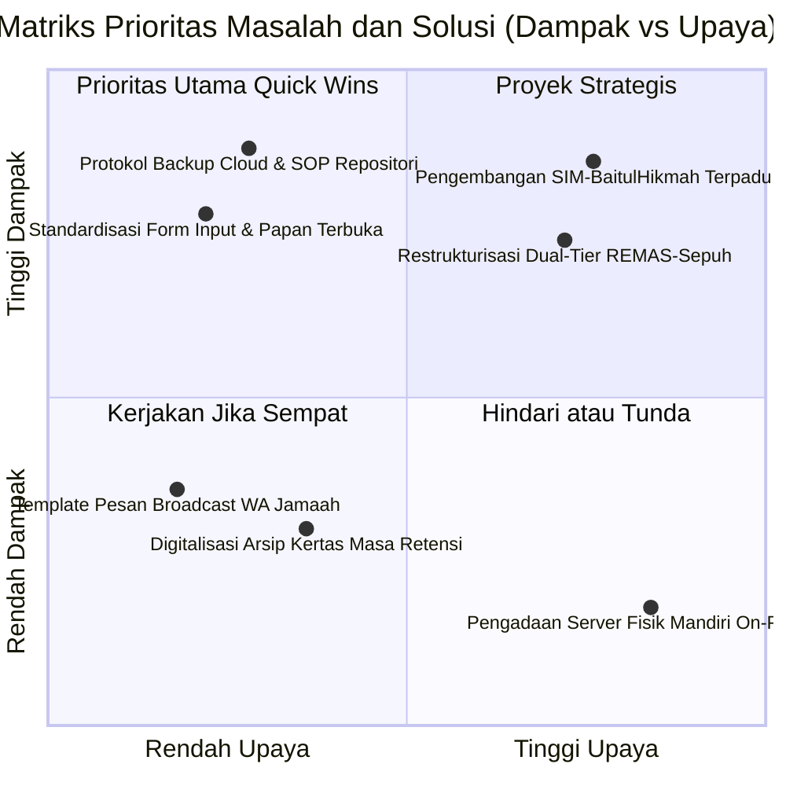

# LAPORAN PRAKTIKUM MINGGUAN
## Manajemen Sistem Informasi — PTF60234
**Universitas Negeri Yogyakarta | Fakultas Teknik | Prodi Pendidikan Teknik Informatika S1**

---

## 1. Identitas Laporan

| Identitas | Isian |
|---|---|
| **Nama Kelompok** | Kelompok 1 — Kelas F1 |
| **Anggota (NIM/Nama)** | 1. Muhammad Riski — 24050530029 |
| | 2. Fajar Ahnaf Mahardika — 24050530030 |
| | 3. Muhadzdzib Terry Al-Fauzan — 24050530052 |
| **Pertemuan ke-** | 3 |
| **Tanggal Pelaksanaan** | 7 September 2026 |
| **Organisasi/Kasus yang Digunakan** | Masjid Besar Baitul Hikmah — SIM-BaitulHikmah |

---

## 2. Tujuan Kegiatan

Mahasiswa mampu mengidentifikasi akar masalah pengelolaan sistem informasi pada organisasi kasus Masjid Besar Baitul Hikmah dan menentukan prioritas solusi menggunakan metode penelusuran terstruktur (*Fishbone Diagram* dan teknik *5-Why*) serta Matriks Prioritas (Dampak vs Upaya) berbasis bukti empiris lapangan yang tervalidasi.

---

## 3. Uraian Pelaksanaan Kegiatan

### 3.1 Identifikasi Masalah Berbasis Triangulasi Bukti Multi-Sumber
Kegiatan praktikum Pertemuan 3 diawali dengan membedah data empiris yang telah dihimpun dari berbagai instrumen lapangan pada Pertemuan 1 dan 2. Sesuai instruksi modul dan penegasan akademis dosen pengampu (Dr. Ratna Wardani, S.Si., M.T.), perancangan sistem informasi tidak boleh berangkat dari asumsi, opini sepihak, atau bias solusi (*solution-first bias*). Sebaliknya, analisis wajib berakar pada pemahaman mendalam atas persoalan tata kelola organisasi nyata. Oleh karena itu, kelompok menerapkan **metode triangulasi data empiris** dengan memadukan empat sumber bukti yang saling mengonfirmasi:
1. **Wawancara Mendalam Narasumber Primer:** Keterangan langsung dari Bpk. Mardiyanto selaku Sekretaris I Takmir Masjid Besar Baitul Hikmah (menjabat aktif sejak 2004) yang menguraikan alur operasional harian, insiden fatal kerusakan perangkat keras sekretariat pada Februari 2026, kondisi pembukuan manual bendahara, mekanisme pendaftaran hewan qurban, serta penentuan mustahik zakat fitrah.
2. **Observasi Partisipatif Internal (*Participant Observation*):** Catatan lapangan langsung dari Fajar Ahnaf Mahardika (anggota tim peneliti sekaligus kader aktif Remaja Masjid / REMAS dan panitia operasional kegiatan Ramadhan serta Idul Adha di Masjid Baitul Hikmah). Observasi ini menyingkap fakta gesekan di tingkat akar rumput: ketiadaan Standard Operating Procedure (SOP) tertulis, alur koordinasi berbelit (harus bertanya dan konfirmasi silang ke figur A, B, C, D), tradisi daur-ulang berkas kepanitiaan lama dari harddisk lokal secara turun-temurun (*hard drive legacy*), serta fenomena *sleeping committee* di mana puluhan nama tercantum di Surat Keputusan (SK) namun pasif dalam eksekusi fisik.
3. **Data Parsial Unit Pendidikan TPA:** Formulir checklist dan konfirmasi daring bersama Bpk. Jefri Nur Ihsan, SE.I. (Ketua II Takmir merangkap Direktur TPA Baitul Hikmah) yang memverifikasi bahwa presensi santri dan ustadz masih tersimpan di lembar kerja Excel lokal pada komputer personal, serta jalur perizinan operasional (IZOP) Kemenag yang masih mengandalkan relasi pesan instan personal staf tanpa kanal institusional formal.
4. **Studi Komparasi Lapangan & Benchmark Digital:** Analisis komparatif terhadap praktik transparansi terbuka berbasis swadaya di Masjid Mujur Al-Amin (Karangnongko) dengan sistem *dual custody* kas kotak infak Jumat dan Papan Takjil Terbuka, serta benchmark kematangan digitalisasi publikasi dan 13 *campaign* donasi daring terintegrasi di Masjid Nurul Ashri Deresan (*masjidnurulashri.com*).

Melalui proses triangulasi multi-sumber tersebut, kelompok mengidentifikasi 5 (lima) persoalan mendasar dalam ekosistem pengelolaan informasi organisasi.

### 3.2 Penelusuran Sebab-Akibat Menggunakan *Fishbone Diagram* (Ishikawa, 1976)
Setelah memetakan daftar masalah, kelompok memilih satu insiden paling kritis yang menjadi ancaman kelangsungan organisasi (*business continuity threat*), yaitu: **Hilangnya 70% data arsip dan administrasi masjid akibat kerusakan PC sekretariat pada Februari 2026**. 

Kelompok menyusun *Fishbone Diagram* (Diagram Tulang Ikan) dengan membaginya ke dalam 6 (enam) kategori penyebab yang disesuaikan dengan konteks organisasi pengelola tempat ibadah non-profit:
1. **Manusia (*People*):** Karakteristik pengurus sepuh, ketergantungan figur tunggal, dan keterbatasan peran generasi muda.
2. **Proses (*Process*):** Ketiadaan SOP pencadangan, alur koordinasi *ad-hoc*, redundansi input data, dan ketiadaan evaluasi pasca-acara.
3. **Teknologi (*Technology*):** Ketergantungan penyimpanan tunggal (*single point of failure*), ketiadaan repositori *cloud*, dan pemanfaatan gawai yang sebatas percakapan instan.
4. **Kebijakan & Tata Kelola (*Policy & Governance*):** Ketiadaan regulasi aset informasi internal, nihilnya SOP audit kas, serta SK formal yang belum memuat rincian akuntabilitas data.
5. **Data & Informasi (*Data*):** Terjadinya isolasi data (*data silo*), tradisi *hard drive legacy*, asimetri informasi kas, dan ketidakterhubungan dengan data kemiskinan pemerintah (DTKS).
6. **Lingkungan Organisasi (*Environment*):** Budaya kesungkanan (*ewuh pakewuh*), asumsi komunal bahwa administrasi bersifat sekunder selama ibadah ritual berjalan, serta jurang komunikasi lintas generasi.

Dalam penyusunan diagram ini, kelompok secara ketat menegakkan prinsip anti-slop akademis: **tidak mencantumkan ketiadaan aplikasi atau teknologi (seperti: "karena belum ada aplikasi web") sebagai penyebab**. Ketiadaan perangkat lunak adalah kondisi ketiadaan solusi teknis, bukan akar penyebab masalah tata kelola.

### 3.3 Penelusuran Mendalam Menuju Akar Masalah Menggunakan Teknik *5-Why* (Ohno, 1988)
Untuk membawa analisis melampaui gejala permukaan fisik (*surface symptoms*) menuju penyebab sistemik yang paling mendasar, kelompok menerapkan teknik penelusuran kausalitas bertingkat *5-Why*.

Diskusi kritis kelompok menguji premis awal: *Apakah rusaknya PC merupakan akar masalah teknis murni?* Berlandaskan filosofi perkuliahan MSI (Dr. Ratna Wardani), sistem informasi terdiri atas **5 unsur minimal: Input, Proses, Output, Manpower, dan Teknologi**. Kerusakan PC hanyalah peristiwa pemicu (*trigger event*) pada tataran teknologi fisik. Menggunakan analogi dosen: *"Sebuah motor balap (aplikasi/teknologi) tidak bernilai fungsional jika tidak ada jalan raya (infrastruktur), aturan lalu lintas (SOP), dan lisensi pengemudi (otoritas SK Takmir)"*. 

Apabila organisasi takmir memiliki "aturan lalu lintas" tata kelola data yang baik (SOP pencadangan berkala) dan "lisensi" akuntabilitas yang jelas, maka kerusakan satu unit komputer tidak akan memusnahkan riwayat organisasi karena data telah terduplikasi secara aman di repositori cadangan. Dengan demikian, rantai kausalitas *5-Why* dilanjutkan secara logis hingga menyentuh akar terdalam: **Ketiadaan kerangka tata kelola informasi (*information governance framework*) dan regulasi internal organisasi**.

### 3.4 Penilaian Kelayakan Menggunakan Matriks Prioritas (Dampak vs Upaya)
Seluruh masalah dan opsi intervensi yang teridentifikasi diposisikan ke dalam Matriks Prioritas Masalah (Dampak vs Upaya) dalam format kuadran (Mermaid *quadrantChart*). Evaluasi penempatan kuadran mempertimbangkan:
- Keterbatasan horizon waktu praktikum (1 semester akademik).
- Kesiapan dan kapasitas adopsi pengurus takmir senior (*Task-Technology Fit*).
- Tingkat urgensi mitigasi risiko kehilangan data serta pemenuhan akuntabilitas publik di hadapan jamaah, KUA, dan BAZNAS.

### 3.5 Perumusan Pernyataan Masalah Prioritas (*Final Problem Statement*)
Tahap akhir dari praktikum ini adalah menyintesis seluruh hasil analisis menjadi satu kalimat pernyataan masalah prioritas yang padat, presisi, dan berorientasi pada kondisi penyebab sistemik organisasi. Pernyataan ini menjadi fondasi utama penentuan batasan proyek (*Project Scope*) dan *Work Breakdown Structure* (WBS) pada Pertemuan 4.

---

## 4. Hasil/Artefak Praktikum

### 4.1 Lembar Kerja: Dokumen Analisis Masalah Organisasi
Berikut adalah lembar kerja dokumen analisis masalah pengelolaan sistem informasi Masjid Besar Baitul Hikmah yang disusun berdasarkan bukti empiris multi-sumber:

| Bagian | Isian | Sumber/Metode Perolehan Data *(Minimal 2 Sumber Berbeda yang Saling Menguatkan)* |
|:---|:---|:---|
| **Daftar Masalah Teridentifikasi (Min. 3 Masalah)** | Beberapa aktivitas operasional dan peribadatan pada Masjid Besar Baitul Hikmah yang kami temukan sudah berjalan dengan lancar, seperti ketersediaan perangkat komputer meja di kantor sekretariat, penerimaan infaq via kotak Jumat dan QRIS resmi yang aktif, penyelenggaraan shalat Jumat dan qurban tahunan yang padat jamaah, serta kepengurusan takmir yang memiliki legalitas resmi SK No. 05/MBBH/VII/2026. Namun demikian, terdapat 5 temuan masalah mendasar dalam tata kelola sistem informasi yang kami rasa perlu untuk dikembangkan dan diatasi:<br><br>**1. Kerentanan Penyimpanan Tunggal & Hilangnya 70% Data Organisasi:** Seluruh arsip surat, data kepanitiaan, inventaris, dan database jamaah tersimpan terisolasi di satu unit PC sekretariat tanpa salinan cadangan (*single point of failure*), mengakibatkan 70% riwayat data musnah permanen saat PC rusak pada Februari 2026.<br><br>**2. Stagnasi Akuntabilitas Keuangan & Ketiadaan Laporan Tertulis Berkala:** Pembukuan kas masjid terpusat pada buku fisik pribadi Bendahara I dan tidak pernah mempublikasikan laporan keuangan tertulis berkala kepada publik jamaah selama ~3 tahun berturut-turut, menciptakan asimetri informasi.<br><br>**3. Inefisiensi Alur Pendaftaran Layanan & Kepanitiaan (*Triple-Entry*):** Pendaftaran hewan qurban dan kepanitiaan hari besar harus melalui tiga tahapan input manual (pesan WhatsApp pengurus $\rightarrow$ dicatat di buku tulis fisik $\rightarrow$ diketik ulang ke komputer lokal), memicu redundansi kerja, kerentanan salah rekap, dan inkonsistensi data.<br><br>**4. Krisis Kaderisasi, Ketiadaan SOP, dan Fenomena *"Sleeping Committee"*:** Pengurus baru mengalami disorientasi kerja karena tidak ada SOP tertulis (harus konfirmasi silang ke figur A, B, C, D); puluhan nama tercatat di SK kepanitiaan namun pasif di lapangan, sehingga beban operasional menumpuk pada Sekretaris I tanpa pelapis dan transfer pengetahuan.<br><br>**5. Penentuan Mustahik ZIS & Pelaporan PHBI Terisolasi (*Data Silo*):** Penyaluran zakat fitrah dan daging qurban hanya mengandalkan amatan kasat mata dan konfirmasi lisan RT/RW tanpa verifikasi silang basis data kemiskinan (DTKS Kelurahan Klitren), serta pelaporan kegiatan Idul Fitri dan Qurban ke KUA Gondokusuman (sesuai PMA No. 34 Tahun 2016) masih bersifat insidental manual tanpa integrasi sistem. | **Verifikasi Bukti Riil per Butir Masalah:**<br><br>• **Bukti Masalah 1:**<br>1. *Wawancara Primer:* Keterangan Bpk. Mardiyanto (Sekretaris I) bahwa PC rusak Feb 2026, data hanya selamat 30%, 70% hilang permanen.<br>2. *Observasi Partisipatif:* Catatan kader REMAS (Fajar Ahnaf) bahwa rapat panitia selalu mengandalkan file sisa di harddisk komputer meja kantor; data TPA Mas Jefri juga tersimpan di Excel lokal tanpa backup.<br><br>• **Bukti Masalah 2:**<br>1. *Wawancara Primer:* Keterangan Sekretaris I mengenai ketiadaan laporan kas tertulis dari bendahara selama ~3 tahun terakhir.<br>2. *Observasi & Komparasi:* Ketiadaan lembar/papan pengumuman saldo kas berkala bagi jamaah; dibandingkan dengan Masjid Mujur Al-Amin yang sukses menerapkan *dual custody* dan papan transparansi swadaya.<br><br>• **Bukti Masalah 3:**<br>1. *Wawancara Primer:* Penjelasan alur pendaftaran qurban oleh Bpk. Mardiyanto (WA $\rightarrow$ buku $\rightarrow$ komputer).<br>2. *Bukti Fisik:* Pengecekan langsung buku registrasi fisik panitia Qurban dan lembar rekapitulasi manual panitia Idul Adha.<br><br>• **Bukti Masalah 4:**<br>1. *Observasi Partisipatif:* Catatan lapangan Fajar Ahnaf mengenai disorientasi kepanitiaan Ramadhan/Qurban karena nihil SOP tertulis dan berkas lama di harddisk diwariskan turun-temurun.<br>2. *Dokumen Resmi:* SK Takmir No. 05/MBBH/VII/2026 memuat puluhan pengurus seksi, namun konfirmasi lapangan membuktikan Sekretaris I merangkap 6+ fungsi sekaligus.<br><br>• **Bukti Masalah 5:**<br>1. *Wawancara Primer:* Pernyataan Sekretaris I bahwa penentuan mustahik warga kurang mampu dilakukan via konfirmasi RT/RW tanpa akses DTKS Kelurahan.<br>2. *Regulasi & Observasi:* Tinjauan PMA No. 34 Tahun 2016 mengenai kewenangan KUA dalam supervisi PHBI, di mana takmir belum memiliki format pelaporan terintegrasi ke KUA maupun BAZNAS. |
| **Masalah Terpilih untuk Analisis Akar** | Beberapa upaya penanganan fisik pasca-kerusakan PC Februari 2026 telah diusahakan pengurus (seperti membawa harddisk ke teknisi servis lokal). Namun, persoalan paling mendesak yang kami pilih untuk analisis akar masalah mendalam adalah: **Hilangnya 70% data arsip dan administrasi organisasi akibat kerusakan PC sekretariat pada Februari 2026 karena ketiadaan protokol pencadangan berkala (*backup policy*) dan penyimpanan data terisolasi (*data silo*).** | • **Sumber 1:** Transkrip verbatim wawancara Bpk. Mardiyanto (Sekretaris I): *"Komputer sekretariat rusak Februari 2026 kemarin mas, cuma bisa diselamatkan sekitar 30 persen, sisanya hilang total."*<br>• **Sumber 2:** Observasi partisipatif REMAS: Rapat panitia PHBI selalu mengandalkan file sisa di folder lokal harddisk lama dengan update seadanya.<br>• **Sumber 3:** Komparasi tata kelola data cloud tersentralisasi pada benchmark Masjid Nurul Ashri Deresan (*masjidnurulashri.com*). |
| **Hasil Analisis Akar Masalah (Fishbone & 5-Why)** | Beberapa pihak sempat menduga penyebabnya adalah kerusakan perangkat keras PC murni. Namun analisis bertingkat membuktikan bahwa akar masalah terdalam adalah: **Ketiadaan kerangka tata kelola informasi (*information governance framework*) dan regulasi internal organisasi yang mengatur standardisasi penyimpanan, protokol pencadangan data (*backup policy*), pemisahan wewenang (*segregation of duties*), serta dokumentasi prosedur kerja (SOP) untuk transfer pengetahuan antar-generasi.** | • **Sumber 1:** Analisis SK Takmir No. 05/MBBH/VII/2026 (memuat struktur nama namun nihil rincian akuntabilitas data, hak akses, dan tata kelola aset digital).<br>• **Sumber 2:** Wawancara Bpk. Mardiyanto (dokumen fisik tersimpan tersebar di rumah pribadi tanpa standardisasi penyimpanan kantor sekretariat).<br>• **Sumber 3:** Landasan Teori Akademis: Nonaka & Takeuchi (1995) tentang *Knowledge Conversion Failure* (jebakan pengetahuan *tacit*) dan Romney & Steinbart (2018) tentang *Internal Control Deficit*. |
| **Matriks Prioritas (Dampak vs Upaya)** | Beberapa usulan awal sempat mengarah ke pengadaan server fisik mandiri atau pembuatan aplikasi kompleks sekaligus. Namun melalui penilaian matriks kelayakan (Dampak vs Upaya), intervensi dipilah secara rasional: **Prioritas Utama (Quick Wins)** difokuskan pada (1) Standardisasi SOP & Protokol Pencadangan Data Hibrid Berbasis Cloud, dan (2) Penerapan Lembar Pencatatan Tunggal (*Single-Entry*) serta Papan Transparansi Terbuka. Sedangkan pengembangan SIM terpadu skala penuh ditempatkan sebagai **Proyek Strategis** jangka menengah. | • **Sumber 1:** Telaah kapasitas operasional takmir dan REMAS (wawancara Sekretaris I & observasi panitia muda).<br>• **Sumber 2:** Matriks Dampak vs Upaya (*quadrantChart*) berdasarkan prinsip *Task-Technology Fit* (Goodhue & Thompson, 1995). |
| **Pernyataan Masalah Prioritas Akhir** | Rumusan masalah prioritas akhir yang ditetapkan berorientasi penuh pada akar penyebab tata kelola: **"Ketiadaan kerangka tata kelola informasi (*information governance framework*) dan regulasi internal pada Masjid Besar Baitul Hikmah menyebabkan data administrasi, aset, dan layanan tersimpan secara terisolasi (*data silo*) pada perangkat lokal tanpa prosedur pencadangan berkala (*backup policy*), ketiadaan SOP kerja yang terdokumentasi memicu disorientasi regenerasi kepengurusan, serta ketiadaan transparansi berkala menghambat akuntabilitas pengelolaan organisasi kepada jamaah dan pemangku kepentingan."** | • **Sumber 1:** Sintesis kausalitas 5-Why yang menghubungkan dampak musnahnya riwayat data Feb 2026 dengan ketiadaan kebijakan organisasi.<br>• **Sumber 2:** Keselarasan strategis dengan Standar Manajemen Idarah Masjid Besar Kemenag RI (Keputusan Dirjen Bimas Islam No. DJ.II/802 Tahun 2014). |

---

### 4.2 Diagram Tulang Ikan (*Fishbone Diagram*)
Penyelidikan kausalitas terhadap insiden musnahnya data sekretariat dipetakan ke dalam 6 dimensi utama pengelolaan sistem informasi:

```mermaid
flowchart LR
    subgraph P["👥 1. MANUSIA (PEOPLE)"]
        P1["Dominasi pengurus sepuh nyaman sistem manual/Word-Excel"]
        P2["Ketergantungan ekstrem pada figur Sekretaris I (rangkap 6 fungsi)"]
        P3["Fenomena sleeping committee nama di SK pasif di lapangan"]
        P4["Kader 17 pemuda REMAS belum dilibatkan dalam tata kelola data"]
        P_CAT["Simpul Faktor Manusia"]
        P1 --> P_CAT
        P2 --> P_CAT
        P3 --> P_CAT
        P4 --> P_CAT
    end

    subgraph PR["🔄 2. PROSES (PROCESS)"]
        PR1["Ketiadaan SOP resmi pencadangan data berkala"]
        PR2["Alur koordinasi ad-hoc tanpa panduan tertulis tanya A B C D"]
        PR3["Redundansi pencatatan triple-entry WA buku fisik PC"]
        PR4["Ketiadaan evaluasi berkala dan pelaporan baku PHBI ke KUA"]
        PR_CAT["Simpul Faktor Proses"]
        PR1 --> PR_CAT
        PR2 --> PR_CAT
        PR3 --> PR_CAT
        PR4 --> PR_CAT
    end

    subgraph T["💻 3. TEKNOLOGI (TECHNOLOGY)"]
        T1["Penyimpanan bertumpu pada 1 PC kantor single point of failure"]
        T2["Ketiadaan repositori cloud terpusat Google Workspace"]
        T3["Pemanfaatan gawai terbatas pesan instan obrolan WA personal"]
        T4["Presensi TPA tersimpan di spreadsheet lokal PC pribadi Mas Jefri"]
        T_CAT["Simpul Faktor Teknologi"]
        T1 --> T_CAT
        T2 --> T_CAT
        T3 --> T_CAT
        T4 --> T_CAT
    end

    subgraph POL["📜 4. KEBIJAKAN (POLICY & GOVERNANCE)"]
        POL1["Nihil regulasi internal takmir tentang klasifikasi aset informasi"]
        POL2["Ketiadaan SOP audit internal dan pemisahan tugas keuangan"]
        POL3["SK Takmir No. 05/MBBH/VII/2026 tidak mengatur supervisi audit kas"]
        POL4["SK Takmir tidak merinci otoritas dan akuntabilitas data"]
        POL_CAT["Simpul Faktor Kebijakan"]
        POL1 --> POL_CAT
        POL2 --> POL_CAT
        POL3 --> POL_CAT
        POL4 --> POL_CAT
    end

    subgraph D["📊 5. DATA & INFORMASI (DATA)"]
        D1["Data silo terisolasi di harddisk PC dan rumah pribadi"]
        D2["Daur ulang berkas lama turun-temurun hard drive legacy"]
        D3["Asimetri informasi kas fisik tidak dipublikasikan 3 tahun"]
        D4["Data mustahik terisolir dari DTKS Kelurahan Klitren"]
        D_CAT["Simpul Faktor Data"]
        D1 --> D_CAT
        D2 --> D_CAT
        D3 --> D_CAT
        D4 --> D_CAT
    end

    subgraph E["🏛️ 6. LINGKUNGAN (ENVIRONMENT)"]
        E1["Budaya ewuh pakewuh sungkan menuntut transparansi tertulis"]
        E2["Asumsi komunal selama fisik berjalan administrasi nomor dua"]
        E3["Jurang komunikasi lintas generasi sepuh vs kader muda"]
        E4["Paradoks status Masjid Besar tapi operasional RT"]
        E_CAT["Simpul Faktor Lingkungan"]
        E1 --> E_CAT
        E2 --> E_CAT
        E3 --> E_CAT
        E4 --> E_CAT
    end

    AKIBAT["💥 AKIBAT UTAMA:\nHilangnya 70% Data Administrasi &\nLayanan Masjid pada Insiden PC Rusak\nFeb 2026 Serta Terhambatnya Regenerasi"]

    P_CAT --> AKIBAT
    PR_CAT --> AKIBAT
    T_CAT --> AKIBAT
    POL_CAT --> AKIBAT
    D_CAT --> AKIBAT
    E_CAT --> AKIBAT
```



---

### 4.3 Analisis Bertingkat *5-Why* (Ohno, 1988)
Untuk membuktikan bahwa akar masalah berada pada ranah tata kelola (*governance*) dan bukan sekadar masalah teknis komputer, kelompok menyusun rangkaian pertanyaan *5-Why* sebagai berikut:

```
[GEJALA UTAMA / SURFACE SYMPTOM]
70% riwayat data administrasi, surat keluar-masuk, inventaris, dan database layanan 
Masjid Besar Baitul Hikmah hilang permanen saat komputer sekretariat rusak pada Februari 2026.
    │
    ▼
[MENGAPA 1? — Mengapa data hilang permanen saat PC mengalami kerusakan teknis?]
Karena seluruh dokumen digital hanya tersimpan di dalam satu unit hard drive komputer 
lokal di meja sekretariat tanpa ada salinan di tempat penyimpanan lain (Single Point of Failure).
    │
    ▼
[MENGAPA 2? — Mengapa data hanya tersimpan di satu hard drive lokal tanpa salinan cadangan?]
Karena staf sekretariat dan pengurus tidak pernah melakukan pencadangan data (backup) 
secara berkala, baik ke media penyimpanan eksternal maupun ke repositori cloud.
    │
    ▼
[MENGAPA 3? — Mengapa tidak pernah dilakukan pencadangan data secara berkala?]
Karena organisasi takmir tidak memiliki Standard Operating Procedure (SOP) tertulis 
maupun pembagian wewenang yang mewajibkan dan memandu prosedur pencadangan data operasional.
    │
    ▼
[MENGAPA 4? — Mengapa takmir tidak menyusun SOP dan pembagian tanggung jawab pengelolaan data?]
Karena pengurus takmir memandang pengelolaan dokumen dan data sebatas tugas klerikal 
individual sekretaris/bendahara secara pribadi, bukan sebagai aset strategis organisasi 
yang memerlukan protokol mitigasi risiko keberlangsungan (business continuity).
    │
    ▼
[MENGAPA 5? — AKAR MASALAH / ROOT CAUSE]
Mengapa takmir memandang data sebatas urusan klerikal pribadi tanpa mitigasi risiko?
Ketiadaan kerangka tata kelola informasi (information governance framework) dan regulasi 
internal organisasi yang mengatur standardisasi penyimpanan data, hak kepemilikan aset informasi, 
mitigasi risiko kehilangan data, pembagian peran kerja (role clarity), serta transfer 
pengetahuan terdokumentasi antar-generasi.
```

---

### 4.4 Matriks Prioritas Masalah (Dampak vs Upaya)
Mempertimbangkan keterbatasan waktu 1 semester, kapasitas pengurus sepuh, dan keterlibatan kader muda REMAS, seluruh inisiatif pemecahan masalah diposisikan ke dalam matriks kuadran berikut:



#### Rasionalisasi Penempatan Kuadran:
1. **Kuadran 2: Prioritas Utama / Quick Wins (Dampak Tinggi, Upaya Rendah):**
   - **Penerapan Protokol Pencadangan Data Hibrid Berbasis Cloud:** Memanfaatkan platform penyimpanan cloud non-profit terpusat (misalnya Google Workspace for Nonprofits) yang disinkronisasikan otomatis dengan folder kerja sekretariat dan TPA. Upaya teknisnya rendah (tidak butuh koding rumit), namun langsung meniadakan risiko hilangnya riwayat organisasi secara permanen.
   - **Standardisasi Formulir Pendaftaran Tunggal (*Single Entry*) & Papan Transparansi Terbuka:** Mengadopsi praktik baik Masjid Mujur Al-Amin, yaitu menghentikan rantai *triple-entry* dengan menyediakan satu lembar/formulir terstandarisasi untuk pendaftaran qurban dan takjil, serta mempublikasikan saldo kas Jumat di papan fisik masjid.
2. **Kuadran 1: Proyek Strategis (Dampak Tinggi, Upaya Tinggi):**
   - **Rancang Bangun SIM-BaitulHikmah Terpadu:** Sistem informasi manajemen berbasis web yang mengintegrasikan master data jamaah ber-NIK, modul pencatatan buku kas digital transparan, modul TPA, serta kroscek kriteria mustahik zakat dengan DTKS Kelurahan. Inisiatif ini berdampak jangka panjang sangat besar namun membutuhkan waktu perancangan dan pengujian multi-fase.
   - **Restrukturisasi Operasional Generasi Ganda (*Dual-Tier Operating Model*):** Menata ulang pembagian peran: para sesepuh berfokus pada pengawasan, nilai syariah, dan otorisasi kebijakan, sedangkan kader pemuda REMAS diberi mandat operasional digital.
3. **Kuadran 3: Kerjakan Jika Sempat (Dampak Rendah, Upaya Rendah):**
   - Digitalisasi tumpukan surat kertas lama yang sudah lewat masa retensi 5 tahun dan pembuatan template pesan siaran WhatsApp broadcast untuk jadwal pengajian.
4. **Kuadran 4: Hindari / Tunda (Dampak Rendah, Upaya Tinggi):**
   - **Pengadaan Server Fisik Mandiri (*On-Premise Server*) di Kantor Sekretariat:** Pembelian perangkat server fisik berbiaya mahal membutuhkan perawatan teknis khusus, konsumsi listrik konstan, serta risiko fisik yang sama (kebanjiran, korsleting listrik, atau kerusakan komponen) tanpa memberikan keunggulan dibanding arsitektur cloud.

---

### 4.5 Pernyataan Masalah Prioritas Akhir (*Final Problem Statement*)
Berdasarkan sintesis triangulasi data, diagram sebab-akibat, dan matriks prioritas, kelompok menetapkan rumusan masalah prioritas akhir sebagai berikut:

> **"Ketiadaan kerangka tata kelola informasi (*information governance framework*) dan regulasi internal pada Masjid Besar Baitul Hikmah menyebabkan data administrasi, aset, dan layanan tersimpan secara terisolasi (*data silo*) pada perangkat lokal tanpa prosedur pencadangan berkala (*backup policy*), ketiadaan SOP kerja yang terdokumentasi memicu disorientasi regenerasi kepengurusan, serta ketiadaan transparansi berkala menghambat akuntabilitas pengelolaan organisasi kepada jamaah dan pemangku kepentingan."**

---

## 5. Kendala dan Solusi

### 5.1 Kendala 1: Memisahkan Gejala Permukaan (*Symptoms*) dari Akar Masalah (*Root Causes*)
* **Deskripsi Kendala:** Pada diskusi awal, anggota kelompok cenderung menganggap "PC sekretariat rusak pada Februari 2026" dan "anak-anak muda tidak aktif di takmir" sebagai akar masalah utama. Muncul kecenderungan mahasiswa untuk langsung menyimpulkan bahwa solusinya adalah "membeli laptop baru" atau "membuatkan website canggih".
* **Solusi Metodologis:** Kelompok menerapkan teknik *5-Why* secara disiplin dengan uji kausalitas kontra-faktual: *"Apakah jika PC diganti dengan perangkat baru yang canggih, risiko kehilangan riwayat data di masa depan otomatis hilang?"* Jawabannya adalah tidak, karena tanpa kebijakan pencadangan berkala (*backup policy*) dan SOP tertulis, perangkat baru pun akan mengalami nasib yang sama saat terjadi lonjakan listrik atau kerusakan teknis. Dengan metode ini, fokus analisis berhasil dialihkan dari kegagalan instrumen fisik ke kelemahan tata kelola (*governance*) organisasi.

### 5.2 Kendala 2: Jebakan Solusi-Sentris (*Technology Solution Bias*) & Analogi Ekosistem MSI
* **Deskripsi Kendala:** Terdapat bias keilmuan di kalangan mahasiswa teknik informatika untuk langsung merancang arsitektur perangkat lunak yang rumit (misalnya usulan modul payment gateway otomatis atau presensi biometrik santri TPA) sebelum membedah proses bisnis nyata di lapangan.
* **Solusi Metodologis:** Berlandaskan pedoman akademis dosen pengampu (Dr. Ratna Wardani) mengenai analogi ekosistem kendaraan: *"Aplikasi hanyalah motor balap; ia tidak memiliki nilai fungsional jika tidak ada jalan raya (infrastruktur), aturan lalu lintas (SOP), dan SIM (lisensi/otoritas formal SK)"*. Mengacu pada teori *Task-Technology Fit* (Goodhue & Thompson, 1995), kelompok menyaring setiap ide fitur dengan memeriksa profil pengguna akhir: jika marbot sepuh dan sekretaris senior terbiasa dengan catatan fisik dan Excel dasar, memaksakan sistem yang rumit tanpa menyiapkan SOP dan pendampingan justru akan memicu penolakan sistem (*system rejection*). Solusinya adalah mendahulukan pembenahan tata kelola dan SOP kerja.

### 5.3 Kendala 3: Asimetri Informasi dan Batasan Akses Data Keuangan Bendahara
* **Deskripsi Kendala:** Hingga penyusunan laporan ini, kelompok belum dapat mengakses dan mengaudit buku kas fisik Bendahara I (Hj. Retno Kusumastuti) secara langsung karena kesibukan personal beliau. Kelompok hanya memegang keterangan sekunder dari Sekretaris I serta amatan jamaah bahwa tidak pernah ada laporan keuangan tertulis selama ~3 tahun terakhir.
* **Solusi Metodologis:** Menjunjung tinggi integritas akademik anti-halusinasi, kelompok tidak mengarang angka nominal saldo atau arus kas bulanan. Status pembukuan kas secara eksplisit dicatat sebagai *"temuan lapangan yang terkonfirmasi dari keterangan sekretaris dan amatan publik jamaah, namun belum terverifikasi oleh buku kas bendahara langsung"*. Kelompok kemudian melakukan triangulasi dengan data observasi kepanitiaan Idul Adha/Ramadhan dan mengomparasikannya dengan praktik tata kelola kas terpisah dan *dual custody* di Masjid Mujur Al-Amin (Karangnongko).

### 5.4 Kendala 4: Fragmentasi dan Isolasi Data Antar-Lembaga (*Data Silo* DTKS Kelurahan & Supervisi KUA)
* **Deskripsi Kendala:** Penentuan mustahik zakat dan pembagian daging qurban selama ini terisolir dari basis data kemiskinan pemerintah, sementara koordinasi pelaporan PHBI ke KUA Gondokusuman (PMA No. 34 Tahun 2016) masih berjalan manual dan insidental pasca-acara.
* **Solusi Metodologis:** Kelompok tidak berasumsi bahwa sistem masjid dapat langsung menembus API database dinas sosial/kelurahan secara otomatis. Sebagai langkah realistis (*feasible*), kelompok merekomendasikan standardisasi formulir pendataan mustahik internal berbasis Nomor Induk Kependudukan (NIK) dan verifikasi faktual berjenjang bersama pengurus RT/RW, yang secara berkala disandingkan (*data matching*) dengan data DTKS Kelurahan, serta merancang format rekapitulasi data qurban yang sesuai dengan standar formulir supervisi KUA.

---

## 6. Refleksi Pembelajaran

### 6.1 Beda Mendasar Gejala vs Akar Masalah dalam Perspektif MSI
Praktikum Pertemuan 3 ini memberikan transformasi paradigma yang sangat fundamental bagi kelompok: membedakan rekayasa perangkat lunak teknis dari disiplin **Manajemen Sistem Informasi (MSI)**. Dalam MSI, sebuah sistem tidak pernah beroperasi di ruang hampa teknologi. Insiden musnahnya 70% data arsip di Masjid Besar Baitul Hikmah membuktikan secara nyata bahwa **teknologi hanyalah instrumen penyimpan data, sedangkan penentu utama integritas dan keberlanjutan informasi adalah manusia (*manpower*), alur kerja (*process*), dan kebijakan organisasi (*governance*)**.

Mengidentifikasi gejala permukaan (seperti PC rusak, kepanitiaan bingung, atau ketiadaan laporan kas) sangat mudah diamati secara kasat mata. Namun, menemukan akar masalah menuntut keberanian membongkar kelemahan kultural dan struktural organisasi:
- Budaya kesungkanan (*ewuh pakewuh*) yang membuat pengurus sungkan menuntut akuntabilitas laporan tertulis kepada sesepuh.
- Jebakan pengetahuan tak tertulis (*tacit knowledge trap* — Nonaka & Takeuchi, 1995), di mana seluruh tata cara pengelolaan masjid hanya tersimpan di ingatan personal figur senior tanpa pernah dibukukan menjadi Standar Operasional Prosedur (SOP) tertulis.
- Anggapan komunal bahwa *"yang terpenting shalat jamaah dan pengajian berjalan lancar, urusan administrasi dan data nomor dua"*, yang mengabaikan fakta bahwa tanpa tata kelola data yang baik, keberlangsungan organisasi berada di ujung tanduk saat terjadi suksesi kepemimpinan.

### 6.2 Integrasi dengan Kerangka 7 Aspek Pengelolaan Sistem Informasi
Temuan dan analisis pada Modul 3 ini terhubung erat dengan kerangka 7 Aspek MSI yang diajarkan dalam perkuliahan:
1. **Aspek 1 (Keselarasan Strategis):** Tata kelola informasi harus selaras dengan misi masjid sebagai institusi sosial-keagamaan yang dipercaya umat. Ketidakteraturan data dan ketiadaan laporan tertulis berisiko mengikis *trust* jamaah dan muzaki.
2. **Aspek 2 (Tata Kelola dan Kualitas Informasi — Fokus Utama Modul 3):** Kerapuhan informasi di Baitul Hikmah bukan karena ketiadaan teknologi, melainkan ketiadaan regulasi internal: siapa pemilik data (*data owner*), siapa yang berwenang memperbarui, kapan jadwal wajib pencadangan, dan di mana data disimpan. Ketiadaan *single source of truth* memicu data tercecer di rumah pribadi dan folder lokal tanpa perlindungan.
3. **Aspek 3 (Dukungan Pengambilan Keputusan):** Informasi yang tidak akurat melumpuhkan tiga level keputusan organisasi:
   - *Level Operasional:* Marbot dan panitia kesulitan mencatat pendaftaran qurban karena alur *triple-entry* yang lambat dan rawan salah rekap.
   - *Level Manajerial:* Sekretaris dan ketua takmir tidak dapat mengevaluasi tren infaq dan pertumbuhan santri TPA karena data tersimpan di berkas fisik pribadi yang tidak teragregasi.
   - *Level Strategis:* Rapat takmir 3 bulanan tidak dapat merumuskan program pemberdayaan jamaah jangka panjang karena ketiadaan *evidence-based decision making* yang valid.
4. **Aspek 6 (Integrasi Proses Bisnis):** Kegagalan integrasi antar-unit (Masjid, TPA, Panitia PHBI, KUA, Kelurahan DTKS, dan BAZNAS) menciptakan fenomena *Silo Informasi*. Sesuai arahan dosen, ini adalah bentuk *Governance Failure* yang menghambat peran masjid di tengah ekosistem masyarakat.
5. **Aspek 7 (Adopsi dan Perilaku Organisasi):** Menjawab tantangan jurang generasi, kelompok merumuskan solusi sosio-teknis berupa **Dual-Tier Operating Model (Model Operasional Generasi Ganda)**:
   - *Tier 1 (Strategic & Oversight):* Para sesepuh takmir tetap memegang otoritas moral, fatwa syariah, dan persetujuan kebijakan strategis (*steering committee*).
   - *Tier 2 (Operational & Execution):* Generasi muda REMAS diberdayakan secara resmi melalui SK Takmir sebagai operator data digital, pengelola repositori cloud, perancang publikasi visual, dan penyusun lembar transparansi kas mingguan.

Melalui pendekatan ini, digitalisasi tidak menyingkirkan para sesepuh, melainkan memuliakan peran mereka sekaligus membuka jalan regenerasi kepengurusan yang berkelanjutan sesuai siklus peningkatan mutu berkelanjutan (*Continuous Quality Improvement* / PDCA).

---

## 7. Kesimpulan

1. Berdasarkan triangulasi data multi-sumber (wawancara mendalam Sekretaris I Bpk. Mardiyanto, observasi partisipatif kader REMAS Fajar Ahnaf, data parsial TPA Mas Jefri, dan studi komparasi lapangan), kelompok berhasil mengidentifikasi 5 persoalan mendasar dalam ekosistem informasi Masjid Besar Baitul Hikmah.
2. Penelusuran kausalitas mendalam dengan *Fishbone Diagram* (6 dimensi) dan teknik *5-Why* membuktikan bahwa insiden musnahnya 70% data arsip pada Februari 2026 berakar pada **ketiadaan kerangka tata kelola informasi (*information governance framework*) dan regulasi internal organisasi**, bukan semata kerusakan fisik perangkat komputer.
3. Ketiadaan dokumentasi Standar Operasional Prosedur (SOP) tertulis, ketergantungan ekstrem pada satu figur senior, dan kebiasaan daur-ulang berkas kepanitiaan lama secara turun-temurun (*hard drive legacy*) terbukti menjadi faktor struktural yang memicu disorientasi kepengurusan baru dan menghambat regenerasi pemuda.
4. Evaluasi Matriks Prioritas Masalah (Dampak vs Upaya) menetapkan bahwa intervensi jangka pendek yang paling mendesak (*Quick Wins*) adalah: penyusunan SOP tata kelola pencadangan data hibrid berbasis cloud serta penyederhanaan alur pendaftaran layanan menjadi satu pintu (*single-entry*). Sedangkan rancang bangun sistem informasi terpadu (SIM-BaitulHikmah) diposisikan sebagai proyek strategis jangka menengah.
5. Rumusan masalah prioritas akhir yang telah ditetapkan berfokus penuh pada kondisi penyebab tata kelola organisasi, memberikan landasan yang kokoh bagi kelompok untuk melangkah ke **Pertemuan 4: Penyusunan Batasan Proyek (*Project Scope*) dan *Work Breakdown Structure* (WBS)**.

---

## Referensi

- Davis, F. D. (1989). Perceived usefulness, perceived ease of use, and user acceptance of information technology. *MIS Quarterly*, 13(3), 319–340.
- Goodhue, D. L., & Thompson, R. L. (1995). Task-technology fit and individual performance. *MIS Quarterly*, 19(2), 213–236.
- Ishikawa, K. (1976). *Guide to quality control*. Asian Productivity Organization.
- Kementerian Agama Republik Indonesia. (2014). *Keputusan Direktur Jenderal Bimbingan Masyarakat Islam Nomor DJ.II/802 Tahun 2014 tentang Standar Pembinaan Manajemen Masjid*. Jakarta: Kemenag RI.
- Kementerian Agama Republik Indonesia. (2016). *Peraturan Menteri Agama (PMA) Nomor 34 Tahun 2016 tentang Organisasi dan Tata Kerja Kantor Urusan Agama*. Jakarta: Kemenag RI.
- Laudon, K. C., & Laudon, J. P. (2014). *Management information systems: Managing the digital firm* (13th ed.). Boston: Pearson Education.
- Nonaka, I., & Takeuchi, H. (1995). *The knowledge-creating company: How Japanese companies create the dynamics of innovation*. Oxford: Oxford University Press.
- Ohno, T. (1988). *Toyota production system: Beyond large-scale production*. New York: Productivity Press.
- Romney, M. B., & Steinbart, P. J. (2018). *Accounting information systems* (14th ed.). New York: Pearson.
