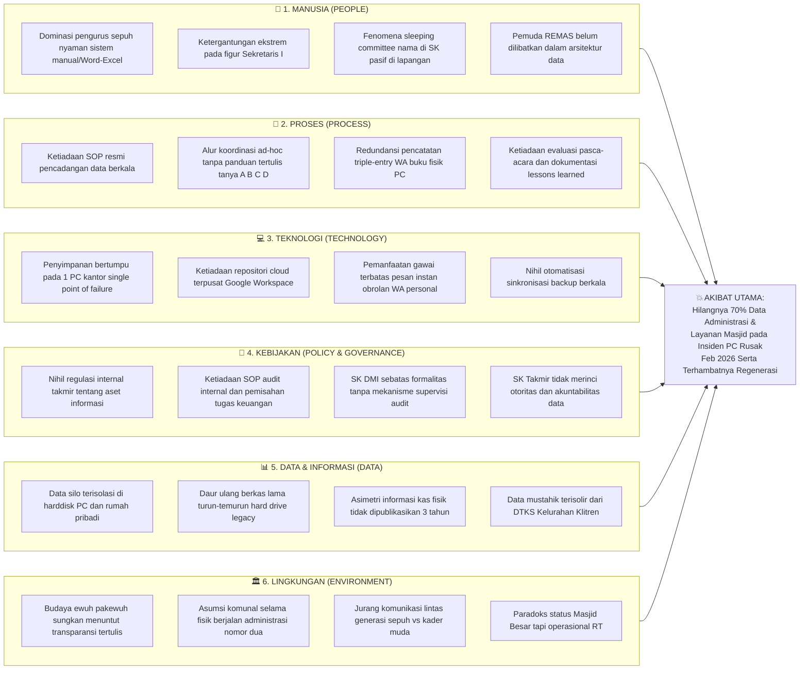

# LAPORAN PRAKTIKUM MINGGUAN
## Manajemen Sistem Informasi — PTF60234
**Universitas Negeri Yogyakarta | Fakultas Teknik | Prodi Pendidikan Teknik Informatika S1**

---

## 1. Identitas Laporan

| Identitas | Isian |
|---|---|
| **Nama Kelompok** | Kelompok 1 — Kelas F1 |
| **Anggota (NIM/Nama)** | 1. Muhammad Riski — 24050530029 |
| | 2. Fajar Ahnaf Mahardika — 24050530030 |
| | 3. Muhadzdzib Terry Al-Fauzan — 24050530052 |
| **Pertemuan ke-** | 3 |
| **Tanggal Pelaksanaan** | 7 September 2026 |
| **Organisasi/Kasus yang Digunakan** | Masjid Besar Baitul Hikmah — SIM-BaitulHikmah |

---

## 2. Tujuan Kegiatan

Mahasiswa mampu mengidentifikasi akar masalah pengelolaan sistem informasi pada organisasi kasus Masjid Besar Baitul Hikmah dan menentukan prioritas solusi menggunakan metode penelusuran terstruktur (*Fishbone Diagram* dan teknik *5-Why*) serta Matriks Prioritas (Dampak vs Upaya) berbasis bukti empiris lapangan yang tervalidasi.

---

## 3. Uraian Pelaksanaan Kegiatan

### 3.1 Identifikasi Masalah Berbasis Triangulasi Bukti Multi-Sumber
Kegiatan praktikum Pertemuan 3 diawali dengan membedah data empiris yang telah dikumpulkan dari berbagai instrumen lapangan pada Pertemuan 1 dan 2. Sesuai instruksi modul dan arahan akademis dosen pengampu, tim tidak diperkenankan merumuskan masalah berdasarkan asumsi atau opini sepihak. Oleh karena itu, kelompok menerapkan **metode triangulasi data** dengan memadukan empat sumber bukti nyata:
1. **Wawancara Mendalam Narasumber Utama:** Bpk. Mardiyanto selaku Sekretaris I Takmir Masjid Besar Baitul Hikmah (menjabat sejak 2004) yang memberikan keterangan mengenai operasional harian, insiden kerusakan perangkat keras sekretariat pada Februari 2026, kondisi pembukuan bendahara, serta mekanisme pendaftaran qurban dan ZIS.
2. **Observasi Partisipatif Internal (*Participant Observation*):** Catatan lapangan langsung dari Fajar Ahnaf Mahardika (anggota tim peneliti sekaligus kader Remaja Masjid / REMAS dan panitia aktif kegiatan Ramadhan serta Idul Adha di Masjid Baitul Hikmah). Observasi ini menyingkap realitas gesekan operasional di tingkat akar rumput, ketiadaan Standard Operating Procedure (SOP) tertulis, dan fenomena daur-ulang berkas lama secara turun-temurun.
3. **Data Parsial Unit Pendidikan TPA:** Formulir checklist dan transkrip percakapan daring bersama Bpk. Jefri Nur Ihsan, SE.I. (Ketua II Takmir merangkap Direktur TPA Baitul Hikmah) mengenai pencatatan presensi santri via lembar kerja Excel lokal dan koordinasi pengurusan izin operasional (IZOP) Kemenag.
4. **Studi Komparasi Lapangan & Benchmark Digital:** Analisis komparatif terhadap praktik transparansi terbuka Masjid Mujur Al-Amin (Karangnongko) serta kematangan digitalisasi publikasi dan donasi online Masjid Nurul Ashri Deresan (masjidnurulashri.com).

Dari proses triangulasi ini, kelompok berhasil mengidentifikasi 5 (lima) persoalan riil dalam pengelolaan informasi organisasi.

### 3.2 Penelusuran Sebab-Akibat Menggunakan *Fishbone Diagram* (Ishikawa, 1976)
Setelah mengidentifikasi daftar masalah, kelompok memilih satu insiden paling kritis yang berdampak langsung terhadap integritas organisasi, yaitu: **Hilangnya 70% data arsip dan administrasi masjid akibat kerusakan PC sekretariat pada Februari 2026**. 

Kelompok menyusun *Fishbone Diagram* dengan 6 (enam) kategori penyebab yang disesuaikan dengan konteks organisasi pengelola tempat ibadah: **Manusia (*People*)**, **Proses (*Process*)**, **Teknologi (*Technology*)**, **Kebijakan & Tata Kelola (*Policy & Governance*)**, **Data & Informasi (*Data*)**, dan **Lingkungan Organisasi (*Environment*)**. 

Dalam penyusunan diagram ini, kelompok secara ketat mematuhi prinsip anti-solusi, yaitu: **tidak mencantumkan ketiadaan perangkat lunak (misalnya: "karena belum ada aplikasi web") sebagai penyebab**. Seluruh cabang tulang ikan diisi oleh faktor-faktor tata kelola riil yang didukung oleh data wawancara dan observasi.

### 3.3 Penelusuran Mendalam Menuju Akar Masalah Menggunakan Teknik *5-Why* (Ohno, 1988)
Untuk membawa analisis dari tingkat gejala permukaan (*surface symptoms*) menuju penyebab yang paling mendasar, kelompok menerapkan teknik pertanyaan berulang *5-Why*. 

Diskusi kelompok sempat berlangsung intensif pada tingkatan kedua dan ketiga: apakah rusaknya PC merupakan akar masalah teknis murni? Kelompok menyepakati bahwa kerusakan perangkat keras hanyalah peristiwa pemicu fisik (*trigger event*). Apabila sebuah organisasi memiliki tata kelola informasi yang matang, kerusakan satu unit PC tidak akan melenyapkan 70% riwayat data organisasi karena tersedianya salinan cadangan (*backup redundancy*). Dengan demikian, penelusuran dilanjutkan hingga menyentuh level filosofi kepengurusan: ketiadaan kerangka tata kelola informasi (*information governance*) dan regulasi internal organisasi.

### 3.4 Penilaian Kelayakan Menggunakan Matriks Prioritas (Dampak vs Upaya)
Seluruh masalah dan opsi intervensi yang dirumuskan kemudian dipetakan ke dalam Matriks Prioritas Masalah (Dampak vs Upaya). Evaluasi kuadran mempertimbangkan tiga batasan nyata:
- Keterbatasan horizon waktu praktikum (1 semester akademik).
- Kesiapan dan literasi digital pengurus takmir yang didominasi generasi sepuh.
- Tingkat urgensi penyelamatan data dan akuntabilitas publik di mata jamaah.

### 3.5 Perumusan Pernyataan Masalah Prioritas (*Final Problem Statement*)
Tahap akhir kegiatan adalah menyintesis seluruh temuan menjadi satu kalimat pernyataan masalah prioritas yang ringkas, lugas, dan berfokus pada kondisi penyebab sistemik organisasi. Pernyataan ini menjadi fondasi utama penentuan cakupan proyek (*Project Scope*) pada Pertemuan 4.

---

## 4. Hasil/Artefak Praktikum

### 4.1 Lembar Kerja: Dokumen Analisis Masalah Organisasi
Berikut adalah lembar kerja dokumen analisis masalah pengelolaan sistem informasi Masjid Besar Baitul Hikmah yang disusun berdasarkan bukti multi-sumber:

| Bagian | Isian | Sumber/Metode Perolehan Data *(Minimal 2 Sumber Berbeda)* |
|:---|:---|:---|
| **Daftar Masalah Teridentifikasi (Min. 3 Masalah)** | **1. Kerentanan Penyimpanan Tunggal & Hilangnya 70% Data Organisasi:** Seluruh arsip surat, data kepanitiaan, inventaris, dan database jamaah tersimpan lokal di satu PC sekretariat tanpa cadangan (*single point of failure*), mengakibatkan 70% data musnah permanen saat PC rusak pada Februari 2026.<br><br>**2. Stagnasi Akuntabilitas Keuangan & Ketiadaan Laporan Tertulis Berkala:** Bendahara I hanya mencatat kas secara manual di buku fisik pribadi dan tidak mempublikasikan laporan keuangan tertulis kepada jamaah selama ~3 tahun berturut-turut, memicu asimetri informasi.<br><br>**3. Inefisiensi Alur Pendaftaran Layanan & Kepanitiaan (*Triple-Entry*):** Pendaftaran hewan qurban dan kepanitiaan hari besar harus melalui tiga tahapan manual (WhatsApp pengurus $\rightarrow$ dicatat di buku tulis fisik $\rightarrow$ diketik ulang ke komputer lokal), rawan salah rekap dan inkonsistensi data.<br><br>**4. Krisis Kaderisasi, Ketiadaan SOP, dan Fenomena *"Sleeping Committee"*:** Pengurus baru mengalami disorientasi kerja karena tidak ada SOP tertulis (harus konfirmasi silang ke figur A, B, C, D); puluhan nama tercatat di SK kepanitiaan namun pasif di lapangan, sehingga beban menumpuk pada satu orang pengurus sepuh tanpa pelapis.<br><br>**5. Penentuan Mustahik ZIS Terisolasi dari DTKS Pemerintah:** Penyaluran zakat fitrah dan daging qurban hanya mengandalkan amatan kasat mata pengurus lingkungan tanpa verifikasi silang Data Terpadu Kesejahteraan Sosial (DTKS) Kelurahan Klitren, berisiko menimbulkan *exclusion error* dan *inclusion error*. | **Triangulasi Sumber Beragam:**<br>• **Sumber 1 (Wawancara Primer):** Keterangan Bpk. Mardiyanto (Sekretaris I Takmir) mengenai PC rusak Feb 2026, data kas bendahara, triple-entry qurban, dan penentuan mustahik mandiri.<br>• **Sumber 2 (Observasi Partisipatif Internal):** Catatan lapangan Fajar Ahnaf Mahardika (kader REMAS & Panitia Ramadhan/Idul Adha) mengenai ketiadaan SOP kerja, alur konfirmasi berbelit, ketergantungan dokumen di harddisk lokal secara turun-temurun, dan fenomena panitia pasif.<br>• **Sumber 3 (Data Parsial TPA):** Transkrip WA dan checklist Mas Jefri (Direktur TPA) yang membuktikan absensi santri hanya mengandalkan Excel lokal tanpa sinkronisasi cloud.<br>• **Sumber 4 (Komparasi Empiris):** Observasi Masjid Mujur Al-Amin (bukti keberhasilan *dual custody* kas infak dan papan transparansi takjil) serta benchmark Masjid Nurul Ashri Deresan (transparansi 13 campaign donasi via website Next.js). |
| **Masalah Terpilih untuk Analisis Akar** | **Hilangnya 70% data arsip dan administrasi organisasi akibat kerusakan PC sekretariat pada Februari 2026 karena ketiadaan protokol pencadangan berkala (*backup policy*) dan penyimpanan data terisolasi (*data silo*).** | • **Sumber 1:** Transkrip verbatim wawancara Bpk. Mardiyanto (Sekretaris I): *"Komputer sekretariat rusak Februari 2026 kemarin mas, cuma bisa diselamatkan sekitar 30 persen, sisanya hilang total."*<br>• **Sumber 2:** Observasi partisipatif REMAS: Rapat panitia PHBI selalu mengandalkan file sisa di folder lokal harddisk lama dengan update seadanya.<br>• **Sumber 3:** Komparasi tata kelola data cloud tersentralisasi pada benchmark Masjid Nurul Ashri Deresan. |
| **Hasil Analisis Akar Masalah (Fishbone & 5-Why)** | Ditemukan bahwa akar masalah terdalam bukanlah kerusakan teknis PC, melainkan: **Ketiadaan kerangka tata kelola informasi (*information governance framework*) dan regulasi internal organisasi yang mengatur standardisasi penyimpanan, protokol pencadangan data (*backup policy*), pemisahan tugas (*segregation of duties*), serta dokumentasi prosedur kerja (SOP) untuk transfer pengetahuan antar-generasi.** | • **Sumber 1:** Analisis SK Takmir No. 05/MBBH/VII/2026 (memuat struktur nama namun nihil rincian akuntabilitas data dan tata kelola aset digital).<br>• **Sumber 2:** Wawancara Bpk. Mardiyanto (dokumen fisik tersimpan tersebar di rumah pribadi tanpa standardisasi penyimpanan kantor sekretariat).<br>• **Sumber 3:** Teori Manajemen Sistem Informasi: Nonaka & Takeuchi (1995) tentang *Knowledge Conversion Failure* dan Romney & Steinbart (2018) tentang *Internal Control Deficit*. |
| **Matriks Prioritas (Dampak vs Upaya)** | Terpetakan 4 kuadran prioritas, dengan **Prioritas Utama (Quick Wins)** diarahkan pada: (1) Standardisasi SOP & Protokol Pencadangan Data Hibrid Berbasis Cloud, dan (2) Penerapan Lembar Pencatatan Tunggal (*Single-Entry*) serta Papan Transparansi Terbuka. Sedangkan pengembangan SIM terpadu skala penuh ditempatkan sebagai **Proyek Strategis**. | • **Sumber 1:** Telaah kapasitas operasional takmir dan REMAS (wawancara Sekretaris I & observasi panitia muda).<br>• **Sumber 2:** Matriks Dampak vs Upaya (quadrantChart) berdasarkan prinsip *Task-Technology Fit* (Goodhue & Thompson, 1995). |
| **Pernyataan Masalah Prioritas Akhir** | **Ketiadaan kerangka tata kelola informasi (*information governance framework*) dan regulasi internal pada Masjid Besar Baitul Hikmah menyebabkan data administrasi, aset, dan layanan tersimpan secara terisolasi (*data silo*) pada perangkat lokal tanpa prosedur pencadangan berkala, ketiadaan SOP kerja tertulis memicu disorientasi regenerasi kepengurusan, serta ketiadaan transparansi berkala menghambat akuntabilitas pengelolaan organisasi kepada jamaah dan pemangku kepentingan.** | • **Sumber 1:** Sintesis kausalitas 5-Why yang menghubungkan dampak kerugian data Feb 2026 dengan ketiadaan kebijakan organisasi.<br>• **Sumber 2:** Keselarasan strategis dengan Standar Manajemen Idarah Masjid Besar Kemenag RI (Keputusan Dirjen Bimas Islam No. DJ.II/802 Tahun 2014). |

---

### 4.2 Diagram Tulang Ikan (*Fishbone Diagram*)
Penyelidikan kausalitas terhadap insiden musnahnya data sekretariat dipetakan ke dalam 6 dimensi utama pengelolaan sistem informasi:



---

### 4.3 Analisis Bertingkat *5-Why* (Ohno, 1988)
Untuk membuktikan bahwa akar masalah berada pada ranah tata kelola (*governance*) dan bukan sekadar masalah teknis komputer, kelompok menyusun rangkaian pertanyaan *5-Why* sebagai berikut:

```
[GEJALA UTAMA / SURFACE SYMPTOM]
70% riwayat data administrasi, surat keluar-masuk, inventaris, dan database layanan 
Masjid Besar Baitul Hikmah hilang permanen saat komputer sekretariat rusak pada Februari 2026.
    │
    ▼
[MENGAPA 1? — Mengapa data hilang permanen saat PC mengalami kerusakan teknis?]
Karena seluruh dokumen digital hanya tersimpan di dalam satu unit hard drive komputer 
lokal di meja sekretariat tanpa ada salinan di tempat penyimpanan lain (Single Point of Failure).
    │
    ▼
[MENGAPA 2? — Mengapa data hanya tersimpan di satu hard drive lokal tanpa salinan cadangan?]
Karena staf sekretariat dan pengurus tidak pernah melakukan pencadangan data (backup) 
secara berkala, baik ke media penyimpanan eksternal maupun ke repositori cloud.
    │
    ▼
[MENGAPA 3? — Mengapa tidak pernah dilakukan pencadangan data secara berkala?]
Karena organisasi takmir tidak memiliki Standard Operating Procedure (SOP) tertulis 
maupun pembagian wewenang yang mewajibkan dan memandu prosedur pencadangan data operasional.
    │
    ▼
[MENGAPA 4? — Mengapa takmir tidak menyusun SOP dan pembagian tanggung jawab pengelolaan data?]
Karena pengurus takmir memandang pengelolaan dokumen dan data sebatas tugas klerikal 
individual sekretaris/bendahara secara pribadi, bukan sebagai aset strategis organisasi 
yang memerlukan protokol mitigasi risiko keberlangsungan (business continuity).
    │
    ▼
[MENGAPA 5? — AKAR MASALAH / ROOT CAUSE]
Mengapa takmir memandang data sebatas urusan klerikal pribadi tanpa mitigasi risiko?
Ketiadaan kerangka tata kelola informasi (information governance framework) dan regulasi 
internal organisasi yang mengatur standardisasi penyimpanan data, hak kepemilikan aset informasi, 
mitigasi risiko kehilangan data, pembagian peran kerja (role clarity), serta transfer 
pengetahuan terdokumentasi antar-generasi.
```

---

### 4.4 Matriks Prioritas Masalah (Dampak vs Upaya)
Mempertimbangkan keterbatasan waktu 1 semester, kapasitas pengurus sepuh, dan keterlibatan kader muda REMAS, seluruh inisiatif pemecahan masalah diposisikan ke dalam matriks kuadran berikut:

```mermaid
quadrantChart
    title Matriks Prioritas Masalah & Intervensi Solusi (Dampak vs Upaya)
    x-axis "Rendah Upaya (Low Effort)" --> "Tinggi Upaya (High Effort)"
    y-axis "Rendah Dampak (Low Impact)" --> "Tinggi Dampak (High Impact)"
    quadrant-1 Proyek Strategis (High Impact, High Effort)
    quadrant-2 Prioritas Utama / Quick Wins (High Impact, Low Effort)
    quadrant-3 Kerjakan Jika Sempat (Low Impact, Low Effort)
    quadrant-4 Hindari / Tunda (Low Impact, High Effort)
    "Protokol Backup Cloud & SOP Repositori": [0.28, 0.88]
    "Standardisasi Form Input & Papan Terbuka": [0.22, 0.78]
    "Pengembangan SIM-BaitulHikmah Terpadu": [0.76, 0.86]
    "Restrukturisasi Dual-Tier REMAS-Sepuh": [0.72, 0.74]
    "Digitalisasi Arsip Kertas Masa Retensi": [0.36, 0.30]
    "Template Pesan Broadcast WA Jamaah": [0.18, 0.36]
    "Pengadaan Server Fisik Mandiri On-Premise": [0.84, 0.18]
```

#### Rasionalisasi Penempatan Kuadran:
1. **Kuadran 2: Prioritas Utama / Quick Wins (Dampak Tinggi, Upaya Rendah):**
   - **Penerapan Protokol Pencadangan Data Hibrid Berbasis Cloud:** Memanfaatkan platform penyimpanan cloud non-profit terpusat (misalnya Google Workspace for Nonprofits) yang disinkronisasikan otomatis dengan folder kerja sekretariat dan TPA. Upaya teknisnya rendah (tidak butuh koding rumit), namun langsung meniadakan risiko hilangnya riwayat organisasi secara permanen.
   - **Standardisasi Formulir Pendaftaran Tunggal (*Single Entry*) & Papan Transparansi Terbuka:** Mengadopsi praktik baik Masjid Mujur Al-Amin, yaitu menghentikan rantai *triple-entry* dengan menyediakan satu lembar/formulir terstandarisasi untuk pendaftaran qurban dan takjil, serta mempublikasikan saldo kas Jumat di papan fisik masjid.
2. **Kuadran 1: Proyek Strategis (Dampak Tinggi, Upaya Tinggi):**
   - **Rancang Bangun SIM-BaitulHikmah Terpadu:** Sistem informasi manajemen berbasis web yang mengintegrasikan master data jamaah ber-NIK, modul pencatatan buku kas digital transparan, modul TPA, serta kroscek kriteria mustahik zakat dengan DTKS Kelurahan. Inisiatif ini berdampak jangka panjang sangat besar namun membutuhkan waktu perancangan dan pengujian multi-fase.
   - **Restrukturisasi Operasional Generasi Ganda (*Dual-Tier Operating Model*):** Menata ulang pembagian peran: para sesepuh berfokus pada pengawasan, nilai syariah, dan otorisasi kebijakan, sedangkan kader pemuda REMAS diberi mandat operasional digital.
3. **Kuadran 3: Kerjakan Jika Sempat (Dampak Rendah, Upaya Rendah):**
   - Digitalisasi tumpukan surat kertas lama yang sudah lewat masa retensi 5 tahun dan pembuatan template pesan siaran WhatsApp broadcast untuk jadwal pengajian.
4. **Kuadran 4: Hindari / Tunda (Dampak Rendah, Upaya Tinggi):**
   - **Pengadaan Server Fisik Mandiri (*On-Premise Server*) di Kantor Sekretariat:** Pembelian perangkat server fisik berbiaya mahal membutuhkan perawatan teknis khusus, konsumsi listrik konstan, serta risiko fisik yang sama (kebanjiran, korsleting listrik, atau kerusakan komponen) tanpa memberikan keunggulan dibanding arsitektur cloud.

---

### 4.5 Pernyataan Masalah Prioritas Akhir (*Final Problem Statement*)
Berdasarkan sintesis triangulasi data, diagram sebab-akibat, dan matriks prioritas, kelompok menetapkan rumusan masalah prioritas akhir sebagai berikut:

> **"Ketiadaan kerangka tata kelola informasi (*information governance framework*) dan regulasi internal pada Masjid Besar Baitul Hikmah menyebabkan data administrasi, aset, dan layanan tersimpan secara terisolasi (*data silo*) pada perangkat lokal tanpa prosedur pencadangan berkala (*backup policy*), ketiadaan SOP kerja yang terdokumentasi memicu disorientasi regenerasi kepengurusan, serta ketiadaan transparansi berkala menghambat akuntabilitas pengelolaan organisasi kepada jamaah dan pemangku kepentingan."**

---

## 5. Kendala dan Solusi

### 5.1 Kendala 1: Memisahkan Gejala Permukaan (*Symptoms*) dari Akar Masalah (*Root Causes*)
* **Deskripsi Kendala:** Pada diskusi awal, anggota kelompok cenderung menganggap "PC sekretariat rusak pada Februari 2026" dan "anak-anak muda tidak aktif di takmir" sebagai akar masalah utama. Muncul kecenderungan langsung menyimpulkan bahwa solusinya adalah "membeli laptop baru" atau "membuatkan website canggih".
* **Solusi Metodologis:** Kelompok menggunakan teknik *5-Why* secara ketat dengan aturan verifikasi kausalitas: *"Apakah jika PC diganti baru, masalah kehilangan data di masa depan otomatis terselesaikan?"* Jawabannya adalah tidak, karena tanpa kebijakan pencadangan dan SOP, PC baru pun akan mengalami nasib yang sama saat rusak. Dengan cara ini, kelompok berhasil menggeser fokus analisis dari kegagalan perangkat fisik ke kegagalan tata kelola organisasi.

### 5.2 Kendala 2: Jebakan Solusi-Sentris (*Technology Solution Bias*)
* **Deskripsi Kendala:** Terdapat bias di kalangan mahasiswa teknik informatika untuk langsung merancang modul-modul fitur perangkat lunak yang kompleks (misalnya integrasi payment gateway dan sistem absensi RFID) sebelum memahami proses bisnis nyata masjid.
* **Solusi Metodologis:** Mengacu pada teori *Task-Technology Fit* (Goodhue & Thompson, 1995) dan arahan akademis dosen pengampu, kelompok menyaring setiap ide fitur dengan memeriksa: siapa penggunanya di lapangan? Jika pengguna operasionalnya adalah marbot sepuh atau sekretaris senior yang terbiasa manual, memaksakan antarmuka yang rumit justru akan memicu penolakan sistem (*system rejection*). Solusinya adalah mendahulukan perbaikan alur kerja dan standardisasi SOP terlebih dahulu.

### 5.3 Kendala 3: Asimetri Informasi dan Batasan Akses Data Keuangan Bendahara
* **Deskripsi Kendala:** Hingga saat penyusunan laporan ini, kelompok belum dapat mewawancarai Bendahara I (Hj. Retno Kusumastuti) secara langsung untuk mendapatkan buku kas resmi, karena kesibukan beliau. Kelompok hanya memegang keterangan sekunder dari Sekretaris I serta amatan jamaah bahwa laporan tertulis nihil selama ~3 tahun terakhir.
* **Solusi Metodologis:** Kelompok tidak mengarang angka nominal infaq bulanan. Kelompok secara transparan mencantumkan status data keuangan sebagai "data belum terverifikasi oleh bendahara", lalu melakukan triangulasi dengan data observasi partisipatif internal jamaah/REMAS serta memperkuatnya dengan komparasi empiris praktik baik di Masjid Mujur Al-Amin (Karangnongko).

---

## 6. Refleksi Pembelajaran

### 6.1 Beda Mendasar Gejala vs Akar Masalah dalam Perspektif MSI
Melalui praktikum Pertemuan 3 ini, kelompok memahami secara mendalam bahwa disiplin Manajemen Sistem Informasi memiliki perbedaan fundamental dengan rekayasa perangkat lunak teknis. Sebuah masalah sistem informasi tidak pernah berdiri sendiri di ruang hampa teknologi. Insiden hilangnya 70% data arsip di Masjid Besar Baitul Hikmah memberikan pelajaran berharga bahwa **teknologi hanyalah instrumen penyimpan, sedangkan penentu integritas data adalah manusia, proses kerja, dan kebijakan tata kelola**. 

Mengidentifikasi gejala (seperti PC meledak/rusak atau laporan keuangan macet) relatif mudah, namun menemukan akar masalah membutuhkan keberanian menelusuri kelemahan budaya organisasi, seperti budaya *ewuh pakewuh* (sungkan menegur rekan pengurus), kebiasaan mengandalkan tradisi lisan turun-temurun (*hard drive legacy*), dan minimnya kesadaran bahwa data adalah aset publik yang harus dilindungi.

### 6.2 Integrasi dengan Kerangka 7 Aspek Pengelolaan Sistem Informasi
Hasil praktikum ini secara khusus merefleksikan **Aspek 2: Tata Kelola dan Kualitas Informasi** serta **Aspek 7: Adopsi dan Perilaku Organisasi**:
1. **Aspek 2 (Tata Kelola dan Kualitas Informasi):** Terbukti bahwa kualitas informasi di Masjid Baitul Hikmah rapuh bukan karena komputer mereka lambat, melainkan karena tidak adanya aturan main (*governance*): siapa yang wajib mem-backup data, kapan backup dilakukan, di mana data disimpan, dan siapa yang berhak mengaksesnya. Tanpa adanya *single source of truth*, data tercecer di rumah pribadi pengurus dan laptop personal.
2. **Aspek 7 (Adopsi dan Perilaku Organisasi):** Transformasi sistem informasi di masjid ini tidak akan berhasil jika hanya menyerahkan aplikasi kepada pengurus sepuh. Diperlukan pendekatan sosio-teknis berupa **Dual-Tier Operating Model (Model Operasional Generasi Ganda)**:
   - Para sesepuh takmir tetap menjalankan fungsi luhur sebagai penasihat spiritual, pengarah kebijakan, dan pemegang otorisasi moral (*Strategic & Oversight Level*).
   - Kader Remaja Masjid (REMAS) yang melek digital diberdayakan sebagai motor penggerak operasional: bertindak sebagai operator input data, pengelola repositori cloud, perancang grafis syiar media sosial, dan penyusun transparansi infaq mingguan (*Operational & Execution Level*).

Dengan model ini, digitalisasi tidak menyingkirkan para sesepuh, melainkan justru memuliakan mereka dengan membebaskan mereka dari beban klerikal yang melelahkan.

---

## 7. Kesimpulan

1. Melalui proses triangulasi data multi-sumber (wawancara Sekretaris I, observasi partisipatif REMAS, data parsial TPA, dan studi komparasi lapangan), kelompok berhasil mengidentifikasi 5 persoalan utama pengelolaan informasi di Masjid Besar Baitul Hikmah.
2. Penelusuran sebab-akibat dengan *Fishbone Diagram* (6 kategori) dan teknik *5-Why* membuktikan bahwa insiden musnahnya 70% data organisasi pada Februari 2026 berakar pada **ketiadaan kerangka tata kelola informasi (*information governance framework*) dan regulasi internal organisasi**, bukan semata kerusakan fisik perangkat keras.
3. Ketiadaan dokumentasi Standard Operating Procedure (SOP) resmi dan kebiasaan daur-ulang berkas lama dari harddisk lokal secara turun-temurun terbukti menjadi faktor utama yang menghambat proses kaderisasi dan regenerasi pemuda di tubuh kepengurusan takmir.
4. Matriks Prioritas Masalah (Dampak vs Upaya) menetapkan bahwa intervensi jangka pendek yang mendesak (*Quick Wins*) adalah penyusunan SOP tata kelola pencadangan data hibrid berbasis cloud serta penyederhanaan alur pendaftaran layanan menjadi satu kanal (*single-entry*). Sedangkan pengembangan sistem informasi terpadu (SIM-BaitulHikmah) diposisikan sebagai proyek strategis jangka menengah.
5. Rumusan masalah prioritas akhir yang telah ditetapkan menjadi pijakan kokoh bagi kelompok untuk melangkah ke **Pertemuan 4: Penyusunan Batasan Proyek (*Project Scope*) dan *Work Breakdown Structure* (WBS)**.

---

## Referensi

- Davis, F. D. (1989). Perceived usefulness, perceived ease of use, and user acceptance of information technology. *MIS Quarterly*, 13(3), 319–340.
- Goodhue, D. L., & Thompson, R. L. (1995). Task-technology fit and individual performance. *MIS Quarterly*, 19(2), 213–236.
- Ishikawa, K. (1976). *Guide to quality control*. Asian Productivity Organization.
- Kementerian Agama Republik Indonesia. (2014). *Keputusan Direktur Jenderal Bimbingan Masyarakat Islam Nomor DJ.II/802 Tahun 2014 tentang Standar Pembinaan Manajemen Masjid*. Jakarta: Kemenag RI.
- Kementerian Agama Republik Indonesia. (2016). *Peraturan Menteri Agama (PMA) Nomor 34 Tahun 2016 tentang Organisasi dan Tata Kerja Kantor Urusan Agama*. Jakarta: Kemenag RI.
- Laudon, K. C., & Laudon, J. P. (2014). *Management information systems: Managing the digital firm* (13th ed.). Boston: Pearson Education.
- Nonaka, I., & Takeuchi, H. (1995). *The knowledge-creating company: How Japanese companies create the dynamics of innovation*. Oxford: Oxford University Press.
- Ohno, T. (1988). *Toyota production system: Beyond large-scale production*. New York: Productivity Press.
- Romney, M. B., & Steinbart, P. J. (2018). *Accounting information systems* (14th ed.). New York: Pearson.
