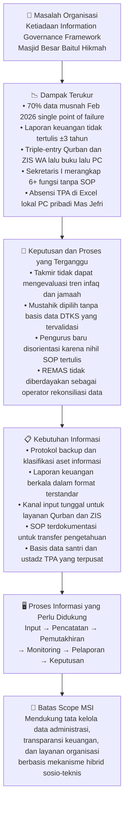
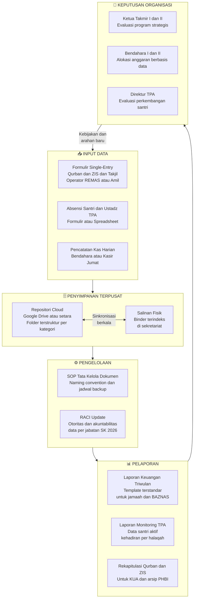
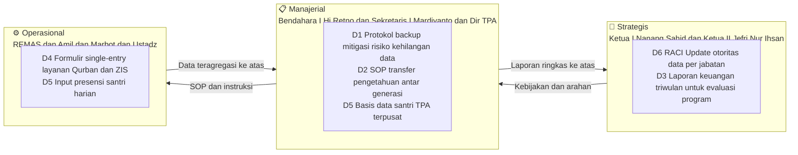

# LAPORAN PRAKTIKUM MINGGUAN
## Manajemen Sistem Informasi — PTF60234
**Universitas Negeri Yogyakarta | Fakultas Teknik | Prodi Pendidikan Teknik Informatika S1**

---

## 1. Identitas Laporan

| Identitas | Isian |
|---|---|
| **Nama Kelompok** | Kelompok 1 — Kelas F1 |
| **Anggota (NIM/Nama)** | 1. Muhammad Riski — 24050530029 |
| | 2. Fajar Ahnaf Mahardika — 24050530030 |
| | 3. Muhadzdzib Terry Al-Fauzan — 24050530052 |
| **Pertemuan ke-** | 4 |
| **Tanggal Pelaksanaan** | 14 September 2026 |
| **Organisasi/Kasus yang Digunakan** | Masjid Besar Baitul Hikmah — SIM-BaitulHikmah |

---

## 2. Tujuan Kegiatan

Mahasiswa mampu menyusun ruang lingkup, tujuan, dan *deliverables* proyek sistem informasi berdasarkan masalah prioritas yang telah ditetapkan pada pertemuan sebelumnya.

> *Konteks kasus:* Pada praktikum ini, kelompok menerjemahkan pernyataan masalah prioritas Masjid Besar Baitul Hikmah (SIM-BaitulHikmah) menjadi *Project Scope Statement* yang berorientasi pada **kebutuhan informasi organisasi**, bukan semata daftar fitur teknis perangkat lunak.

---

## 3. Uraian Pelaksanaan Kegiatan

### 3.1 Titik Tolak: Pernyataan Masalah Prioritas dari Pertemuan 3

Seluruh proses perumusan *scope* pada Pertemuan 4 ini berangkat dari satu titik tolak tunggal yang telah ditetapkan secara kolektif di Pertemuan 3, yaitu:

> **"Ketiadaan kerangka tata kelola informasi (*information governance framework*) dan regulasi internal pada Masjid Besar Baitul Hikmah menyebabkan data administrasi, aset, dan layanan tersimpan secara terisolasi (*data silo*) pada perangkat lokal tanpa prosedur pencadangan berkala (*backup policy*), ketiadaan SOP kerja yang terdokumentasi memicu disorientasi regenerasi kepengurusan, serta ketiadaan transparansi berkala menghambat akuntabilitas pengelolaan organisasi kepada jamaah dan pemangku kepentingan."**

Pernyataan ini lahir dari triangulasi wawancara mendalam Bpk. Mardiyanto (Sekretaris I), observasi partisipatif kader REMAS (Fajar Ahnaf), data parsial Mas Jefri Nur Ihsan (Ketua II/Direktur TPA), dan studi komparasi lapangan terhadap Masjid Mujur Al-Amin dan Masjid Nurul Ashri Deresan. Ia menjadi kompas utama seluruh keputusan *scope* pada pertemuan ini.

### 3.2 Alur Penerjemahan Masalah Menjadi Scope MSI

Sesuai pendekatan yang digariskan dalam modul, kelompok tidak langsung melompat ke daftar fitur aplikasi. Kelompok terlebih dahulu menelusuri alur kausal dari masalah organisasi hingga batas intervensi sistem informasi yang relevan, mengikuti kerangka: **Masalah → Dampak → Keputusan/Proses Terganggu → Kebutuhan Informasi → Proses Informasi → Batas Scope MSI**.

### 3.3 Perumusan Tujuan Proyek Menggunakan Kriteria SMART

Setelah alur kausal dipetakan, kelompok merumuskan tujuan proyek menggunakan kriteria SMART. Diskusi kritis di antara anggota kelompok secara tegas menolak rumusan yang berorientasi produk teknologi seperti *"membuat aplikasi manajemen masjid"*, karena rumusan tersebut belum menjawab siapa penggunanya, informasi apa yang didukung, dan ukuran keberhasilan apa yang digunakan.

Tiga pertimbangan utama yang memengaruhi perumusan tujuan:

**Pertama, profil adopsi pengguna (*Task-Technology Fit* — Goodhue & Thompson, 1995).** Pengurus senior seperti Sekretaris I Bpk. Mardiyanto dan Bendahara I Hj. Retno Kusumastuti terbiasa dengan sistem manual dan Excel dasar. Mendorong adopsi teknologi tinggi tanpa pendampingan terstruktur berisiko memicu penolakan sistem (*system abandonment* — Davis, 1989). Oleh karena itu, tujuan dirancang untuk mendukung **Dual-Tier Operating Model**: para sesepuh takmir tetap memegang otoritas moral dan kebijakan (*strategic oversight*), sementara 17 pemuda REMAS diberdayakan sebagai **operator rekonsiliasi data digital** yang menjalankan prosedur backup, pengarsipan, dan pelaporan berkala.

**Kedua, cakrawala waktu proyek.** Proyek hanya memiliki satu semester akademik (September 2026 – Januari 2027) dengan tiga mahasiswa sebagai tim pelaksana. Tujuan yang terlalu ambisius berisiko tidak selesai dan tidak memberikan nilai apapun.

**Ketiga, integritas data.** Hanya fakta yang dikonfirmasi langsung dari wawancara yang boleh menjadi dasar ukuran keberhasilan. Angka nominal kas dan volume hewan qurban tidak digunakan karena belum diverifikasi bendahara secara langsung.

### 3.4 Penetapan Ruang Lingkup (*In-Scope* dan *Out-of-Scope*)

Kelompok mengevaluasi setiap kandidat item ruang lingkup menggunakan lima pertanyaan relevansi dari modul:
1. Apakah item ini berkaitan langsung dengan masalah prioritas yang teridentifikasi?
2. Siapa stakeholder yang membutuhkan informasi ini?
3. Keputusan atau proses apa yang menjadi lebih baik jika informasi tersedia?
4. Apakah item ini benar-benar diperlukan, ataukah hanya menarik secara teknis?
5. Apa konsekuensinya bagi organisasi jika informasi ini tidak disediakan?

Penetapan *out-of-scope* dilakukan secara **eksplisit dan beralasan** — bukan dibiarkan ambigu — mengikuti prinsip Laudon & Laudon (2014) bahwa proyek sistem informasi yang gagal sering kali bukan karena teknologi yang dipilih salah, melainkan karena ruang lingkup tidak pernah didefinisikan dengan jelas sejak awal, sehingga rentan terhadap *scope creep*.

### 3.5 Penyusunan Deliverables dan Kriteria Penerimaan

Setiap *deliverable* yang ditetapkan merepresentasikan perubahan konkret pada **proses tata kelola informasi** organisasi — bukan sekadar produk teknis. Kelompok memastikan setiap *deliverable* memiliki minimal satu kriteria penerimaan yang dapat diverifikasi secara objektif, konsisten dengan Aspek 5 MSI: nilai sistem informasi diukur dari perbaikan kualitas keputusan yang dihasilkan, bukan dari kompleksitas teknologi yang diterapkan.

### 3.6 Identifikasi Asumsi dan Batasan Proyek

Kelompok secara jujur mendaftar asumsi yang menopang perencanaan proyek serta batasan yang memengaruhinya — termasuk keterbatasan akses data yang belum terverifikasi langsung oleh Bendahara I. Komitmen anti-halusinasi ditegakkan: **angka nominal infaq dan volume hewan qurban tidak dicantumkan di mana pun dalam dokumen ini karena belum dikonfirmasi dari sumber primer**.

---

## 4. Hasil/Artefak Praktikum

### 4.1 Lembar Kerja: Project Scope Statement — SIM-BaitulHikmah

| **Bagian** | **Isian** |
|---|---|
| **Tujuan Proyek (SMART)** | Menyediakan kerangka tata kelola informasi hibrid berbasis SOP tertulis dan repositori cloud terpusat yang memungkinkan pengurus Masjid Besar Baitul Hikmah (Sekretaris I, Bendahara, Direktur TPA, dan operator REMAS) untuk: **(1)** memastikan minimal 80% dokumen administrasi aktif tersimpan di repositori terpusat yang dapat diakses sewaktu-waktu; **(2)** menerbitkan laporan keuangan berkala setiap 3 bulan dalam format terstandar; **(3)** menyelenggarakan pendaftaran layanan Qurban dan ZIS melalui satu kanal input yang terdokumentasi; **dalam satu semester akademik (September 2026 – Januari 2027)**. |
| **In-Scope** | 1. Protokol pencadangan data hibrid (cloud + fisik) beserta panduan teknis operasionalnya untuk pengurus non-teknis 2. SOP tata kelola dokumen administrasi dan mekanisme transfer pengetahuan antar-generasi kepengurusan 3. Template laporan keuangan berkala triwulan yang dapat diisi secara manual maupun digital — termasuk format rekapitulasi PHBI (Qurban & Idul Fitri) untuk pelaporan ke KUA Gondokusuman sesuai PMA No. 34 Tahun 2016 4. Mekanisme input tunggal (*single-entry*) untuk pendaftaran layanan Qurban dan ZIS menggantikan alur *triple-entry* saat ini (WA → buku fisik → PC) 5. Desain basis data santri dan ustadz TPA Baitul Hikmah beserta mekanisme monitoring kehadiran yang dapat disinkronisasikan ke repositori terpusat 6. Dokumen rancangan distribusi peran informasi (*RACI Update*) berbasis SK Takmir No. 05/MBBH/VII/2026 yang mengatur otoritas, akuntabilitas, dan hak akses data per jabatan |
| **Out-of-Scope** | 1. Pembangunan aplikasi web atau mobile dari awal dalam semester ini — melampaui kapasitas waktu dan memiliki risiko *scope creep* yang signifikan 2. Integrasi sistem langsung dengan SIMBA BAZNAS — akses API pihak ketiga belum tersedia 3. Sinkronisasi *real-time* dengan basis data DTKS Kelurahan Klitren — data mustahik masih berstatus hipotesis parsial, belum divalidasi koordinator ZIS 4. Penggantian atau modifikasi sistem QRIS dan rekening bank masjid — sudah berfungsi dengan baik dan bukan masalah prioritas 5. Pengembangan kurikulum atau silabus TPA/TK Baitul Hikmah — di luar domain tata kelola informasi kepengurusan 6. Perubahan mekanisme pemilihan atau masa jabatan pengurus takmir — domain organisasi, bukan domain MSI |
| **Daftar Deliverables dan Kriteria Penerimaan** | **D1 — Dokumen Panduan Protokol Backup Hibrid** *Kriteria:* Panduan memuat langkah-langkah operasional yang dapat dipahami pengurus non-teknis; mencakup jadwal backup, lokasi repositori cloud, dan prosedur verifikasi keberhasilan backup  **D2 — Dokumen SOP Tata Kelola Dokumen dan Transfer Pengetahuan** *Kriteria:* Memuat naming convention file, kategori dokumen prioritas, jadwal pengarsipan, dan panduan orientasi pengurus baru; dapat langsung digunakan pada saat serah terima jabatan  **D3 — Template Laporan Keuangan Berkala (Format Triwulan)** *Kriteria:* Mencakup kolom saldo awal, pemasukan per sumber, pengeluaran per pos, saldo akhir, dan catatan keterangan; dapat diisi manual maupun di spreadsheet oleh Bendahara  **D4 — Formulir Input Tunggal Layanan Qurban/ZIS** *Kriteria:* Satu formulir menggantikan triple-entry; memuat field nama, nomor kontak, jenis/jumlah layanan, status pembayaran, dan tanggal; dilengkapi panduan pengisian untuk operator  **D5 — Desain Struktur Basis Data Santri TPA** *Kriteria:* Rancangan minimal memuat field NIK/Nomor Induk, nama lengkap, kelas/halaqah, nama ustadz pengampu, dan status aktif/nonaktif; disertai panduan input untuk operator REMAS  **D6 — Dokumen Rancangan RACI Update: Otoritas Data per Jabatan** *Kriteria:* Matriks RACI memetakan setiap jenis data/dokumen ke penanggung jawab berdasarkan SK Takmir No. 05/MBBH/VII/2026; menegaskan siapa yang *Responsible*, *Accountable*, *Consulted*, dan *Informed* untuk setiap aset informasi |
| **Asumsi** | 1. Data dan keterangan dari wawancara Bpk. Mardiyanto (Sekretaris I, September 2026) dianggap representatif terhadap kondisi tata kelola informasi terkini organisasi 2. Tujuh belas pemuda REMAS bersedia dilibatkan sebagai operator rekonsiliasi data digital secara sukarela sebagai bagian dari program kemakmuran masjid 3. Pengurus takmir senior dapat menjalankan prosedur backup minimum dengan bimbingan panduan bergambar sederhana 4. Data parsial TPA dari Jefri Nur Ihsan (via WhatsApp 7 & 14 September 2026) memadai sebagai dasar rancangan awal yang siap divalidasi lebih lanjut 5. SK Takmir No. 05/MBBH/VII/2026 yang ditandatangani Ketua I Nanang Sahid Wahyudi, S.Pd. berstatus aktif dan sah sebagai dasar penetapan otoritas data |
| **Batasan (Constraints)** | 1. Proyek dikerjakan dalam satu semester akademik (± 16 minggu) oleh 3 mahasiswa tanpa anggaran pengembangan teknis tambahan 2. Tidak ada akses ke data keuangan riil (nominal infaq, total kas ZIS) karena verifikasi langsung ke Bendahara I belum terlaksana — rancangan pelaporan menggunakan format template tanpa angka aktual 3. Data mustahik dan volume Qurban aktual tidak dapat dimasukkan ke dalam rancangan selama statusnya masih hipotesis parsial yang belum divalidasi koordinator ZIS 4. Keterbatasan infrastruktur digital di kantor sekretariat (komputer terbatas, koneksi internet tidak selalu stabil) membatasi pilihan solusi pada arsitektur ringan yang toleran terhadap koneksi intermiten |

---

### 4.2 Diagram Alur Proses Informasi yang Dicakup Scope

---

### 4.3 Diagram Keselarasan Scope dengan Tiga Level Pengambilan Keputusan

---

## 5. Kendala dan Solusi

### 5.1 Kendala: Memisahkan Scope Kebutuhan Informasi dari Daftar Fitur Teknis

**Deskripsi Kendala:**
Pada diskusi awal penetapan *in-scope*, anggota kelompok dengan latar belakang informatika secara refleks mendaftar kandidat *scope* dalam bentuk fitur teknis: "modul login, CRUD jamaah, dashboard keuangan, notifikasi WhatsApp otomatis". Rumusan-rumusan tersebut berorientasi pada produk teknologi, bukan pada kebutuhan informasi organisasi.

**Solusi Metodologis:**
Kelompok menerapkan uji orientasi dua langkah untuk setiap kandidat item. *Pertama*, setiap rumusan teknis diubah menjadi: *"Siapa membutuhkan informasi apa, untuk keputusan apa, dalam rentang waktu apa?"* Contoh: rumusan *"membuat notifikasi otomatis"* diubah menjadi *"menyediakan mekanisme pengingat kepada pengurus yang bertanggung jawab atas dokumen yang belum diperbarui sesuai jadwal SOP"* — rumusan kedua memperjelas kebutuhan informasi dan proses organisasi yang didukung. *Kedua*, setiap kandidat item diuji menggunakan lima pertanyaan relevansi modul sehingga hanya item yang langsung menjawab masalah prioritas yang dipertahankan.

### 5.2 Kendala: Mengoperasionalkan Ukuran Keberhasilan Tanpa Data Aktual Keuangan

**Deskripsi Kendala:**
Kriteria SMART mensyaratkan ukuran (*measurable*) yang konkret. Namun kelompok belum dapat mengakses buku kas Bendahara I secara langsung. Terdapat dorongan untuk menggunakan estimasi nominal kas sebagai referensi, yang bertentangan dengan komitmen anti-halusinasi kelompok.

**Solusi Metodologis:**
Kelompok menggeser ukuran keberhasilan dari *angka nominal keuangan* ke *indikator proses tata kelola* yang dapat diverifikasi tanpa akses buku kas: persentase dokumen yang berhasil diarsipkan di repositori terpusat, frekuensi penerbitan laporan keuangan berkala, dan jumlah langkah input yang berhasil direduksi dari tiga menjadi satu. Pendekatan ini konsisten dengan Aspek 5 MSI: nilai sistem diukur dari perbaikan kualitas proses keputusan, bukan hanya efisiensi teknis.

### 5.3 Kendala: Menetapkan Batas Out-of-Scope Tanpa Mengecilkan Ambisi Proyek

**Deskripsi Kendala:**
Saat pertama kali mendaftar *out-of-scope*, muncul kekhawatiran bahwa menempatkan "pembangunan aplikasi web" di luar scope terkesan terlalu konservatif — terlebih mengingat Masjid Nurul Ashri Deresan telah memiliki website Next.js dengan 13 *campaign* donasi daring aktif sebagai *benchmark* kematangan digital.

**Solusi Metodologis:**
Kelompok memisahkan dua konsep yang berbeda: *ruang lingkup semester ini* versus *visi jangka menengah SIM-BaitulHikmah*. Mengacu pada Matriks Prioritas Modul 3 (Dampak vs Upaya), pembangunan aplikasi terpadu ditempatkan sebagai **Proyek Strategis** jangka menengah yang membutuhkan fondasi tata kelola yang kuat terlebih dahulu. Tanpa SOP, RACI, dan protokol backup yang mapan, sebuah aplikasi secanggih apapun akan mengalami *system abandonment* (Davis, 1989) karena data tidak terisi dan fitur tidak digunakan. Dengan mendahulukan fondasi tata kelola, proyek semester ini justru memaksimalkan peluang keberhasilan SIM terpadu di masa mendatang.

### 5.4 Kendala: Menentukan Kedudukan Data TPA dalam Scope

**Deskripsi Kendala:**
Data TPA dari Mas Jefri Nur Ihsan bersifat parsial (diperoleh via WhatsApp) dan wawancara mendalam belum terlaksana. Terdapat perdebatan apakah komponen TPA memiliki cukup landasan evidensial untuk dimasukkan ke dalam scope.

**Solusi Metodologis:**
Kelompok memutuskan memasukkan **desain basis data santri TPA** ke dalam *in-scope* dengan status *"rancangan awal berbasis data parsial yang siap divalidasi dan diperhalus saat wawancara mendalam dengan Mas Jefri terlaksana"*. Keputusan ini diambil karena: *(1)* presensi TPA yang tersimpan di Excel lokal tanpa backup merupakan risiko identik dengan insiden PC sekretariat Februari 2026; *(2)* eksistensi absensi santri di spreadsheet lokal sudah dikonfirmasi; *(3)* rancangan awal yang terbuka untuk revisi lebih baik daripada mengabaikan risiko nyata. Setiap komponen TPA dalam laporan ini diberi catatan status data untuk transparansi akademis.

---

## 6. Refleksi Pembelajaran

### 6.1 Perbedaan Fundamental Scope MSI versus Scope Proyek Perangkat Lunak

Pertemuan 4 ini memperjelas satu perbedaan fundamental yang sering kabur bagi mahasiswa teknik informatika: **scope proyek perangkat lunak** mendaftar fitur dan modul yang akan dibangun, sedangkan **scope proyek MSI** menetapkan batas intervensi pada *kebutuhan informasi organisasi* — data apa yang dikelola, keputusan apa yang didukung, proses apa yang diperbaiki. Perbedaan ini bukan soal selera teknis, melainkan soal cara pandang terhadap masalah: apakah kita mendefinisikan masalah dari teknologi yang tersedia, atau dari kebutuhan organisasi yang nyata?

Dalam kasus Masjid Besar Baitul Hikmah, tekanan untuk langsung membangun aplikasi web terasa wajar bagi mahasiswa informatika. Namun setelah menelusuri alur kausal lengkap — dari masalah organisasi, ke dampak terukur, ke keputusan yang terganggu, ke kebutuhan informasi, ke proses informasi, baru ke batas scope — kelompok menyadari bahwa **membangun aplikasi tanpa memperbaiki SOP, RACI, dan protokol backup terlebih dahulu hanya akan memindahkan kerapuhan ke lapisan baru yang lebih mahal untuk diperbaiki**.

### 6.2 Scope Creep sebagai Ancaman Nyata

Proses negosiasi *in-scope* vs *out-of-scope* dalam diskusi kelompok membuktikan bahwa *scope creep* bukan hanya konsep teori dalam Laudon & Laudon (2014) — ini adalah dinamika nyata yang terjadi bahkan dalam skala kelompok tiga mahasiswa. Setiap kali seorang anggota mengusulkan tambahan kandidat scope yang menarik secara teknis, kelompok harus kembali mengajukan pertanyaan: *"Apakah ini menjawab masalah prioritas Modul 3, ataukah ini hanya menarik untuk dibuat?"* Disiplin untuk menjawab pertanyaan ini dengan jujur adalah keterampilan manajerial yang jauh lebih sulit dari sekadar menulis kode.

### 6.3 Integrasi dengan 7 Aspek MSI

Proses penyusunan *Project Scope Statement* ini secara langsung bersentuhan dengan seluruh 7 Aspek MSI sebagai berikut:

**Aspek 1 — Keselarasan Strategis:** Tujuan proyek SMART secara eksplisit dihubungkan ke misi masjid sebagai institusi yang bertanggung jawab kepada umat. Transparansi keuangan berkala bukan sekadar fitur laporan teknis — ini adalah pemenuhan *amanah* yang menjadi fondasi legitimasi sosial masjid di mata jamaah dan muzaki.

**Aspek 2 — Tata Kelola dan Kualitas Informasi:** Keenam *deliverable* proyek ini pada hakikatnya adalah instrumen tata kelola informasi: siapa berwenang atas data apa (D6-RACI), bagaimana data disimpan dan dilindungi (D1-Backup), bagaimana data ditransfer antar-generasi (D2-SOP), bagaimana data dilaporkan (D3-Laporan Keuangan), dan bagaimana data dikumpulkan secara efisien (D4-Single Entry, D5-TPA).

**Aspek 3 — Dukungan Pengambilan Keputusan:** Scope dirancang untuk mendukung ketiga level keputusan. Di level *operasional*, formulir single-entry mempercepat pencatatan layanan bagi marbot dan amil. Di level *manajerial*, laporan triwulan memberikan Bendahara dan Sekretaris basis evaluasi berkala. Di level *strategis*, RACI Update memberikan Ketua Takmir visibilitas atas distribusi tanggung jawab informasi di seluruh organisasi.

**Aspek 4 — Kebutuhan Informasi Stakeholder:** Setiap *deliverable* dipetakan ke stakeholder spesifik: D1 (protokol backup) dan D2 (SOP) untuk Sekretaris I Mardiyanto dan operator 17 REMAS; D3 (laporan keuangan triwulan) untuk Bendahara I Hj. Retno Kusumastuti, jamaah/muzaki, dan KUA Gondokusuman (pelaporan PHBI); D4 (formulir single-entry) untuk amil zakat dan operator layanan Qurban; D5 (basis data santri) untuk Direktur TPA Jefri Nur Ihsan, SE.I. dan wali santri, serta sebagai bahan laporan ke BADKO TPA; D6 (RACI Update) untuk Ketua I Nanang Sahid Wahyudi, S.Pd. dan Ketua II Jefri Nur Ihsan sebagai pemegang kebijakan tertinggi berdasarkan SK No. 05/MBBH/VII/2026.

**Aspek 5 — Nilai Informasi:** Kehilangan 70% data pada Februari 2026 telah membuktikan secara konkret bahwa informasi memiliki nilai ekonomis dan sosial yang nyata. Riwayat kepanitiaan yang musnah berarti panitia berikutnya harus memulai dari nol tanpa *lessons learned*. Scope ini dirancang untuk melindungi nilai tersebut melalui proteksi (backup), standardisasi (SOP), dan distribusi otoritas (RACI).

**Aspek 6 — Integrasi Proses Bisnis:** Scope secara sadar mencakup konektivitas antar-unit: masjid ↔ TPA (D5 — basis data santri terpusat), pengurus ↔ jamaah (D3 — laporan keuangan triwulan yang terbuka), pengurus ↔ KUA Gondokusuman (D3 — format rekapitulasi PHBI Qurban & Idul Fitri sesuai PMA No. 34 Tahun 2016 yang selama ini dilakukan secara insidental manual), serta pengurus ↔ BAZNAS (D3 — template laporan ZIS yang mengarah ke standar SIMBA). Batas *out-of-scope* untuk integrasi langsung sistem BAZNAS/SIMBA dan sinkronisasi DTKS Kelurahan Klitren ditetapkan secara eksplisit dengan alasan *feasibilitas* nyata, bukan karena keduanya tidak penting.

**Aspek 7 — Adopsi dan Perilaku Organisasi:** Keputusan terpenting yang terefleksikan dalam scope ini adalah pemilihan **Dual-Tier Operating Model**: para pengurus senior tetap memegang otoritas moral dan kebijakan, sementara kader REMAS diberdayakan secara formal sebagai operator data digital. Pendekatan ini tidak menyingkirkan para sesepuh, melainkan membangun jembatan regenerasi kepengurusan yang terstruktur dan bermartabat — sebuah solusi *sosio-teknis* yang lebih tahan lama dibanding solusi teknis murni manapun.

---

## 7. Kesimpulan

1. Berbekal *pernyataan masalah prioritas* yang ditetapkan pada Pertemuan 3, kelompok berhasil menyusun **Project Scope Statement** yang berpijak pada kebutuhan informasi organisasi Masjid Besar Baitul Hikmah — bukan pada daftar fitur teknis yang seringkali menjebak proyek sistem informasi pada solusi mencari masalah.

2. Tujuan proyek memenuhi seluruh kriteria SMART: *Spesifik* (menyebut pengguna dan informasi yang didukung secara eksplisit), *Terukur* (80% dokumen tersimpan terpusat, laporan keuangan terbit setiap 3 bulan), *Achievable* (berbasis kapasitas REMAS dan pengurus yang sudah ada), *Relevan* (langsung menjawab insiden data Februari 2026 dan nihilnya laporan keuangan ±3 tahun), dan *Time-bound* (satu semester akademik).

3. Enam item *in-scope* yang ditetapkan — protokol backup hibrid, SOP transfer pengetahuan, template laporan keuangan, formulir single-entry layanan, desain basis data TPA, dan rancangan RACI — semuanya merepresentasikan **intervensi pada lapisan tata kelola informasi**, bukan sekadar penambahan fitur perangkat lunak. Enam item *out-of-scope* ditetapkan secara eksplisit dan beralasan untuk mencegah *scope creep*.

4. Praktikum ini mengonfirmasi bahwa penetapan ruang lingkup proyek MSI adalah proses **negosiasi berbasis bukti** yang menuntut disiplin untuk terus-menerus menguji relevansi setiap kandidat item terhadap masalah prioritas — bukan proses kreatif memilih fitur yang menarik secara teknis.

5. **Project Scope Statement** ini menjadi fondasi siap pakai untuk Pertemuan 5: penyusunan **Struktur Tim dan Pembagian Peran** (*Work Breakdown Structure* dan pembaruan Matriks RACI), di mana setiap *deliverable* yang telah ditetapkan akan dialokasikan ke penanggung jawab spesifik dalam ekosistem pengurus dan REMAS Masjid Besar Baitul Hikmah.

---

## Referensi

- Davis, F. D. (1989). Perceived usefulness, perceived ease of use, and user acceptance of information technology. *MIS Quarterly*, 13(3), 319–340.
- Goodhue, D. L., & Thompson, R. L. (1995). Task-technology fit and individual performance. *MIS Quarterly*, 19(2), 213–236.
- Kementerian Agama Republik Indonesia. (2014). *Keputusan Direktur Jenderal Bimbingan Masyarakat Islam Nomor DJ.II/802 Tahun 2014 tentang Standar Pembinaan Manajemen Masjid*. Jakarta: Kemenag RI.
- Kementerian Agama Republik Indonesia. (2016). *Peraturan Menteri Agama (PMA) Nomor 34 Tahun 2016 tentang Organisasi dan Tata Kerja Kantor Urusan Agama*. Jakarta: Kemenag RI.
- Laudon, K. C., & Laudon, J. P. (2014). *Management information systems: Managing the digital firm* (13th ed.). Boston: Pearson Education.
- SK Takmir Masjid Besar Baitul Hikmah Nomor 05/MBBH/VII/2026, ditetapkan 16 Juli 2026, ditandatangani Ketua I Nanang Sahid Wahyudi, S.Pd.

---

> **Catatan Revisi Audit (14 September 2026):** Laporan ini telah diaudit menggunakan sistem glosarium entitas SIM-BaitulHikmah. Revisi mencakup: (1) penyelarasan Tujuan Kegiatan dengan template modul; (2) penghapusan "takjil" dari In-Scope karena bersifat musiman/seasonal; (3) penambahan konteks KUA Gondokusuman dan PMA No. 34/2016 pada In-Scope item 3 dan Aspek 6; (4) koreksi atribusi deliverable pada Aspek 4 dan 6 (sebelumnya salah merujuk D4 untuk pelaporan KUA, padahal yang tepat adalah D3); (5) pembersihan referensi yang tidak diacu dalam teks (Nonaka & Takeuchi 1995, Romney & Steinbart 2018, PMI 2021) untuk menjaga integritas akademis.
