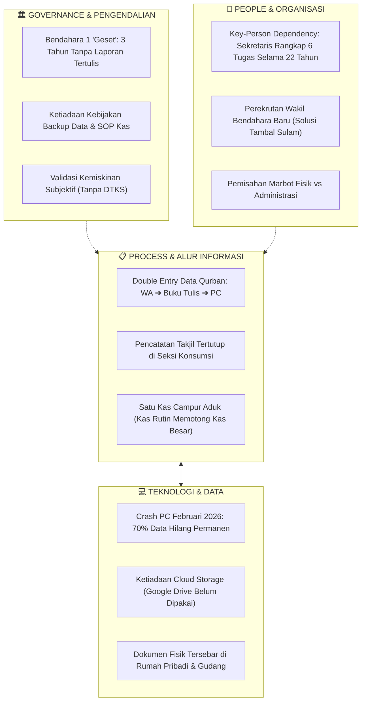

# ANALISIS TEMUAN LAPANGAN & SPEKTRUM MASALAH TATA KELOLA INFORMASI
## Objek Studi: Masjid Besar Baitul Hikmah (Klitren, Gondokusuman, Yogyakarta)
*Berdasarkan Transkrip Wawancara Sekretariat (Bpk. Mardianto) — 2026*  
*Mata Kuliah: Praktik Manajemen Sistem Informasi (PTF60234) — Kelompok 1 F1*

---

## 📌 STATUS PENGUMPULAN DATA
- [x] **Tata Kelola Sekretariat & Operasional:** Bpk. Mardianto (Sekretaris Takmir sejak 2004 – 22 tahun menjabat).
- [ ] **Tata Kelola TPA (Pendidikan Santri):** *Pending* — Direktur TPA adalah Mas Jefri (akan diwawancarai terpisah).
- [ ] **Benchmark Skala Besar:** *Pending* — Masjid Nurul Ashri Deresan (menunggu konfirmasi jadwal).

---

## 1. TABEL TEMUAN EMPIRIS & ANALISIS MANAJEMEN SISTEM INFORMASI (MSI)

| No | Klaster Tata Kelola | Fakta Lapangan (Empiris) | Analisis Kritis MSI (Konsep & Implikasi) |
|:--:|:---|:---|:---|
| **1** | **Profil & Ketergantungan Figur (*Key-Person Dependency*)** | • Bpk. Mardianto menjabat sekretaris sejak 2004 (22 tahun).<br>• Merangkap banyak fungsi sekaligus: surat/notulen, seksi dakwah (mencari seluruh ustadz Jumat/Ramadhan/Ied), bantu keuangan majelis taklim, pembuat undangan warga, PIC pendaftaran qurban, dan operator IT. | **Risiko *Single Point of Failure* Ekstrem.** Aliran informasi masjid terpusat pada satu individu. Jika beliau berhalangan, operasional dakwah, administrasi, dan koordinasi qurban terancam lumpuh total (*knowledge silos*). |
| **2** | **Insiden Kehilangan Data (*Disaster Recovery Failure*)** | • Februari 2026 komputer kantor macet/rusak total menjelang Ramadhan.<br>• Servis hanya berhasil memulihkan ~30% data; **70% data hilang permanen**.<br>• Belum pernah menggunakan cloud storage (Google Drive).<br>• Berkas AD/ART digital ikut hilang.<br>• Berkas fisik tersimpan di rumah pribadi sekretaris & gudang. | **Ketiadaan *Business Continuity Plan* (BCP) & Redudansi Data.** Konsep digitalisasi yang dipahami masjid baru sebatas *komputerisasi lokal offline* tanpa prosedur pencadangan (*backup policy*). Dokumen resmi yang disimpan di rumah pribadi melanggar prinsip sentralisasi arsip organisasi. |
| **3** | **Pengendalian Keuangan Internal (*Internal Control & Fraud Risk*)** | • Kotak infak Jumat dihitung per seksi lalu disetor ke Bendahara 1.<br>• **Temuan Kritis:** Bendahara 1 "geset" (lambat/kurang rajin) dan **selama 3 tahun TIDAK PERNAH membuat laporan tertulis** (hanya lisan tanpa rincian/bukti).<br>• Tidak ada laporan rutin mingguan/Jumat ke jamaah.<br>• Solusi takmir: Merekrut Wakil Bendahara baru (Agustus 2026) untuk mem-*backup*. | **Pelanggaran Berat Prinsip Akuntabilitas & *Segregation of Duties*.** Ketiadaan audit trail selama 3 tahun membuka celah *information asymmetry* yang membahayakan kepercayaan publik (*muzaki/jamaah*). Perekrutan wakil bendahara adalah perbaikan struktural manusia (*people*), namun belum menyentuh SOP pelaporan (*process*). |
| **4** | **Struktur Arsitektur Kas (Kas Besar vs Kas Kecil)** | • Hanya ada satu kas besar (biaya listrik, operasional, kebersihan langsung memotong kas besar).<br>• Kas kecil hanya dibuat temporer saat Idul Adha.<br>• Pengeluaran diputuskan rapat internal 5–6 orang pengurus inti.<br>• Sudah memiliki rekening bank dan QRIS. | **Inefisiensi Alur Keputusan Operasional.** Tanpa *petty cash system* (kas kecil) dengan pagu batas tetap, pengeluaran rutin sepele tetap harus membebani kas besar dan bergantung pada ketersediaan pengurus inti. Adopsi QRIS belum diimbangi prosedur rekonsiliasi kas berkala. |
| **5** | **Manajemen Beban Puncak (Ramadhan & Takjil)** | • Kebutuhan 200 bungkus takjil/hari dipikul bergilir oleh donatur (4 orang @50 bungkus) + 3 jumbo teh.<br>• Warga boleh mengisi slot, tapi wajib koordinasi manual dengan panitia.<br>• Jika slot takjil kosong, ditalangi kas takmir (meskipun kondisi kas takmir sering tipis/kosong). | **Distribusi Beban Informasi Tersentralisasi.** Tidak ada papan pengumuman/sistem terbuka untuk melihat tanggal takjil yang masih kosong. Jamaah mengalami asimetri informasi sehingga tidak tahu kapan masjid butuh donasi darurat. |
| **6** | **Manajemen Idul Adha & Qurban (Peak-Load)** | • Sapi patungan Rp 3,5 jt/orang (cash atau tabungan Rp 350rb/bln).<br>• Pendaftaran via WA langsung ke Sekretaris, dicatat manual lalu diketik ulang ke komputer.<br>• Kupon dan jatah daging dibagikan dengan standar **per jiwa** (bukan per KK).<br>• Evaluasi: Pernah ada warga yang terlewat; distribusi meluas hingga panti luar kota (Bantul, Gunungkidul). | **Redundansi Entri Data (WA → Manual Kertas → Komputer).** Proses *double-handling* memperbesar risiko *human error* (salah ketik nomor/jatah). Basis alokasi "per jiwa" memerlukan akurasi master data keluarga yang tinggi agar tidak terjadi defisit daging di lapangan. |
| **7** | **Hubungan Eksternal & Keterhubungan Regulasi** | • Ke RT/RW: Hanya mengirim laporan pembagian qurban.<br>• Ke Kelurahan/Kecamatan: Sebatas surat permohonan izin (Shalat Ied di Superindo) dan permohonan bantuan.<br>• Ke Kemenag/KUA: Terdaftar di SIMAS; update data via KUA Gondokusuman (data takmir, data shalat Ied).<br>• KUA meminjam aula untuk akad nikah via surat resmi.<br>• Data kemiskinan (mustahik): Tidak memakai DTKS Kelurahan formal, mengandalkan pengamatan warga sekitar. | **Sistem Kepulauan (*Data Island* / Silo Eksternal).** Hubungan dengan pemerintah bersifat *reaktif-prosedural* (izin dan pinjam tempat), bukan pertukaran data strategis. Validasi kemiskinan secara subjektif warga berisiko menimbulkan *bias kedekatan* (*favoritism*) dan data tumpang tindih dengan bantuan sosial kelurahan. |
| **8** | **Kemitraan Swasta (CSR Superindo)** | • Kerja sama dengan Superindo Klitren: Pinjam area parkir untuk Shalat Ied, bantuan kurma & konsumsi Ramadhan, serta pembelian logistik buka bersama. | **Aset Strategis Hubungan Industri-Komunitas.** Merupakan poin kuat keterhubungan eksternal masjid semi-urban. Sinergi ini perlu dipayungi tata kelola inventaris dan arsip MoU tertulis agar berkelanjutan siapapun takmirnya. |

---

## 2. PEMETAAN SPEKTRUM MASALAH TATA KELOLA MSI

### Diagram Arsitektur Permasalahan (Sosio-Teknis)


---

### SPEKTRUM 1: Berdasarkan Tiga Level Keputusan Manajemen (Anthony's Triangle)

```
        ▲
       / \     LEVEL STRATEGIS (Ketua Takmir & Dewan Syuro)
      /   \    • Tidak ada laporan keuangan tertulis selama 3 tahun ➔ Keputusan arah 
     /     \     pengembangan masjid berbasis "perkiraan/asumsi", bukan data riil.
    /───────\  • Legalitas SK DMI & AD/ART digital lenyap ➔ Kelemahan payung hukum.
   /         \
  /           \  LEVEL MANAJERIAL (Sekretaris, Bendahara, Seksi)
 /             \ • Informasi tertutup pada figur sekretaris (jadwal, ustadz, qurban).
/               \• Ketiadaan pemisahan Kas Kecil vs Kas Besar ➔ Manajer kas tidak punya pagu.
/─────────────────\• Rekonsiliasi QRIS & infak kotak Jumat terhambat kelalaian pelaporan bendahara.
/                   \
/                     \ LEVEL OPERASIONAL (Marbot, Relawan, Panitia Lapangan)
/                       \• Input data berulang (WA dicatat kertas lalu diketik lagi).
/                         \• Kupon qurban per jiwa berpotensi salah hitung saat beban puncak.
/                           \• Arsip fisik dicari ke gudang atau rumah pribadi saat mendesak.
/─────────────────────────────\
```

---

### SPEKTRUM 2: Berdasarkan Segitiga Kerapuhan Sistem (Vulnerability Spectrum)

#### 🔴 Level Kritis (High Risk — Mengancam Keberlangsungan Organisasi)
1. **Kegagalan Akuntabilitas Keuangan (3 Tahun Tanpa Laporan Tertulis):**
   * *Akar Masalah:* Ketiadaan sistem pemaksa (*enforcement control*) terhadap bendahara. Pengurus hanya mengandalkan kepercayaan moral (*trust-based*) tanpa audit periodik.
   * *Dampak:* Potensi hilangnya transparansi, kecurigaan jamaah, dan kesulitan saat mengajukan proposal hibah ke instansi resmi (Kemenag/Pemda).
2. **Kerapuhan Data Tunggal (*Single Point of Data Loss*):**
   * *Akar Masalah:* Ketiadaan prosedur pencadangan otomatis 3-2-1 (*3 copies, 2 media, 1 offsite*).
   * *Dampak:* Insiden Februari 2026 (70% data hilang) membuktikan operasional masjid bisa lumpuh seketika saat perangkat keras rusak.

#### 🟡 Level Menengah (Medium Risk — Inefisiensi & Hambatan Operasional)
1. **Bottleneck Sekretariat (*Key-Person Overload*):**
   * Semua alur komunikasi (khatib, perizinan Superindo, donatur qurban, persuratan) melewati satu orang (Bpk. Mardianto). Jika beliau sakit atau berhalangan, rantai koordinasi putus.
2. **Data Silo dengan Pemerintah Kelurahan:**
   * Takmir tidak memanfaatkan data DTKS Kelurahan Klitren untuk verifikasi mustahik, melainkan mengandalkan "kebiasaan saling kenal". Ini berisiko memunculkan kelompok rentan baru (seperti warga pendatang/anak kos dhuafa) yang tidak terdata.

#### 🟢 Level Ringan / Potensi Positif (Strengths to Leverage)
1. **Adopsi Kanal Finansial Modern:** Sudah ada rekening resmi dan QRIS (fondasi bagus untuk integrasi pencatatan digital).
2. **Jejaring Eksternal Kuat:** Sinergi perizinan Shalat Ied dan logistik dengan pihak Koramil, Polsek, Kemantren, dan Superindo berjalan sangat harmonis.
3. **Kesiapan Menerima Perubahan (*Openness to Change*):** Sekretaris secara sadar mengakui kebutuhan penyimpanan cloud (Google Drive) dan merekrut wakil bendahara baru untuk perbaikan sistem.

---

## 3. IMPLIKASI UNTUK PERANCANGAN MSI (MODUL 3 & SETERUSNYA)

Berdasarkan temuan ini, proyek MSI Kelompok 1 F1 **tidak boleh sekadar membuat "aplikasi website masjid" yang generik**, melainkan harus memprioritaskan arsitektur tata kelola informasi:
1. **SOP Tata Kelola Digital Hibrid:** Panduan pencatatan fisik yang tersinkronisasi berkala ke penyimpanan cloud terpusat (mengatasi trauma data hilang).
2. **Desain Dual-Control Buku Kas:** Memisahkan peran pencatat kas harian (kas kecil) dari pemegang rekening bank (kas besar), lengkap dengan format berita acara infak Jumat.
3. **Master Template Rekapitulasi Peak-Load:** Formulir pendaftaran qurban & jadwal takjil transparan yang bisa diakses bersama oleh tim panitia, bukan hanya tersimpan di nomor WA sekretaris.

---

## 4. ANALISIS TATA KELOLA ATAS-KE-BAWAH (TOP-DOWN REGULATORY HIERARCHY)
### Evaluasi Keselarasan Regulasi Resmi Pemerintah & Skala Tipologi "Masjid Besar"

Dalam standar pembinaan Kementerian Agama RI, **Masjid Besar Baitul Hikmah** menyandang tipologi formal sebagai **Masjid Besar (Tingkat Kecamatan/Kemantren Gondokusuman)**. Berdasarkan regulasi negara, tipologi ini membawa konsekuensi tata kelola informasi dan tanggung jawab manajerial yang jauh lebih tinggi daripada masjid lingkungan (Masjid Jami' / Masjid RT).

Berikut adalah pembedahan hierarki regulasi dari otoritas tertinggi (Kemenag RI) hingga tingkat kelurahan dan pencocokannya dengan fakta empiris di lapangan:

```mermaid
flowchart TD
    subgraph MAKRO["🏛️ TINGKAT MAKRO / NASIONAL"]
        KEMENAG["Kementerian Agama RI & Bimas Islam\n(Kepdirjen DJ.II/802/2014 & SIMAS)"]
        BAZNAS_PUSAT["BAZNAS RI\n(UU No. 23/2011 & SIMBA)"]
        BWI["Badan Wakaf Indonesia (BWI)\n(UU No. 41/2004)"]
    end

    subgraph MESO_KOTA["🏢 TINGKAT KOTA / KABUPATEN & KECAMATAN"]
        KEMENAG_KOTA["Kemenag Kota Yogyakarta"]
        KUA["KUA Kemantren Gondokusuman\n(PPAIW & Pembina Idarah-Imarah-Ri'ayah)"]
        DMI["Dewan Masjid Indonesia (DMI) Gondokusuman\n(Penerbit SK Takmir)"]
        KEMANTREN["Kemantren Gondokusuman\n(Pamong Praja & Trantib)"]
        BAZNAS_KOTA["BAZNAS Kota Yogyakarta"]
    end

    subgraph MIKRO_MASJID["🕌 TINGKAT OPERASIONAL (TARGET STUDI)"]
        BAITUL["Masjid Besar Baitul Hikmah\n(Klitren, Gondokusuman)"]
    end

    subgraph BASIS_WARGA["🏘️ LINGKUNGAN MASYARAKAT & SWASTA"]
        KELURAHAN["Kelurahan Klitren\n(Data DTKS / Kemiskinan)"]
        RT_RW["Pengurus RW & RT 01-05"]
        SUPERINDO["Mitra Swasta: Superindo Klitren"]
        JAMAAN["Jamaah, Santri, & Mustahik"]
    end

    KEMENAG -->|Standar Manajemen & ID SIMAS| KUA
    BAZNAS_PUSAT -->|Regulasi UPZ & SIMBA| BAZNAS_KOTA
    KUA -->|Registrasi SIMAS & Pengawasan Nikah| BAITUL
    DMI -->|Surat Keputusan (SK) Takmir| BAITUL
    KEMANTREN -->|Izin Keramaian Shalat Ied| BAITUL
    BAZNAS_KOTA -.->|Proposal Bantuan Insidental| BAITUL
    BAITUL -->|Laporan Qurban| RT_RW
    BAITUL -->|Izin Penggunaan Halaman Parkir| SUPERINDO
    KELURAHAN -.->|Data DTKS Terputus (Tidak Terintegrasi)| BAITUL
    BAITUL -->|Layanan Ibadah & Sosial| JAMAAN
```

---

### TABEL MATRIKS HIERARKI REGULASI VS FAKTA LAPANGAN BAITUL HIKMAH

| Tingkatan Regulasi | Otoritas / Lembaga | Dasar Hukum & Aturan Resmi | Standar Normatif Tipologi "Masjid Besar" | Fakta Empiris Masjid Baitul Hikmah (Hasil Wawancara) | Evaluasi Kesenjangan (*Gap Analysis*) & Isu MSI |
|:---|:---|:---|:---|:---|:---|
| **1. Nasional / Makro (Kemenag RI)** | Kementerian Agama RI (Ditjen Bimas Islam) | • **Keputusan Dirjen Bimas Islam No. DJ.II/802 Tahun 2014** tentang Standar Pembinaan Manajemen Masjid.<br>• Sistem Informasi Masjid (**SIMAS** Kemenag). | • Menjadi **pusat rujukan dan pembina** masjid-masjid jami' di satu kecamatan.<br>• Standar tata kelola 3 bidang formal: **Idarah** (organisasi/administrasi), **Imarah** (kemakmuran ibadah), dan **Ri'ayah** (sarpras & fisik).<br>• Profil terdaftar dan terverifikasi di SIMAS nasional secara dinamis. | • Masjid sudah terdaftar resmi di SIMAS Kemenag.<br>• Pembagian bidang (Idarah/Imarah/Ri'ayah) secara struktur ada, namun beban idarah bertumpu pada satu figur sekretaris.<br>• **Belum menjalankan fungsi pembinaan** terhadap masjid-masjid lain di wilayah Gondokusuman. | **Kesenjangan Skala Peran:** Masjid Besar Baitul Hikmah secara de jure berstatus Masjid Besar tingkat kecamatan, namun secara de facto masih beroperasi sebagai **masjid jami' lingkungan lokal** (fokus urusan internal jamaah sendiri). |
| **2. Meso-Kecamatan (KUA & Kepenghuluan)** | Kantor Urusan Agama (KUA) Kemantren Gondokusuman | • **PMA No. 34 Tahun 2016** tentang Organisasi dan Tata Kerja KUA.<br>• KUA sebagai PPAIW (Pejabat Pembuat Akta Ikrar Wakaf).<br>• Koordinasi Bimbingan Perkawinan (Bimwin) & Hisab Rukyat. | • Sinkronisasi jadwal layanan nikah & peribadatan.<br>• Pengiriman update berkala data keagamaan (jamaah shalat Ied, data hewan qurban, data takmir) dari KUA ke Kemenag Kota.<br>• KUA sebagai supervisor perwakafan dan arah kiblat. | • Hubungan berjalan harmonis dan rutin.<br>• KUA sering meminjam aula masjid untuk prosesi akad nikah dengan surat permohonan resmi.<br>• Update data SIMAS disalurkan masjid lewat KUA secara lancar (misal data salat Id & jumlah takmir). | **Arsip Transaksional Manual:** Koordinasi peminjaman aula KUA masih berbasis surat kertas lepas. Belum ada kalender ruang (*shared resource calendar*) terintegrasi yang mencegah bentrok jadwal antara akad nikah KUA dan kegiatan majelis taklim masjid. |
| **3. Tata Kelola Keorganisasian (DMI)** | Dewan Masjid Indonesia (DMI) Cabang Gondokusuman | • **AD/ART Dewan Masjid Indonesia**.<br>• Standar Pembukuan Akuntansi Masjid & Pengesahan Takmir. | • Masa bakti kepengurusan takmir 3–5 tahun yang disahkan lewat **Surat Keputusan (SK)** DMI/KUA.<br>• Pembinaan periodik akuntabilitas keuangan takmir dan transparansi kotak infak. | • Legalitas takmir resmi memegang SK dari DMI Cabang Kecamatan Gondokusuman dengan masa bakti 5 tahun.<br>• Pemilihan melalui musyawarah terbuka jamaah (sistem suara terbanyak).<br>• **DMI tidak melakukan supervisi/audit** saat laporan keuangan bendahara macet 3 tahun. | **Ketiadaan Pengawasan Eksternal (*External Governance Void*):** SK dari DMI hanya berfungsi sebagai legitimasi formal administratif di awal periode, tanpa mekanisme audit atau evaluasi berkala terhadap kepatuhan tata kelola kas masjid. |
| **4. Pemerintahan Wilayah (Kemantren & Kelurahan)** | Kemantren Gondokusuman & Kelurahan Klitren | • **SKB 2 Menteri No. 9 & 8 Tahun 2006** (Pedoman Pemeliharaan Kerukunan Umat Beragama).<br>• Regulasi Ketertiban Umum & Izin Keramaian Publik.<br>• Instruksi Walikota Yogyakarta tentang Penanggulangan Kemiskinan. | • Perizinan penggunaan fasilitas publik untuk ibadah massa (Shalat Ied di luar gedung).<br>• Sinergi penyaluran bantuan sosial mustahik berbasis **Data Terpadu Kesejahteraan Sosial (DTKS)** Kelurahan. | • Perizinan Shalat Ied di area Superindo Klitren berjalan sangat tertib (melibatkan Kelurahan, Kemantren, Koramil, Polsek).<br>• **Data Mustahik Menolak DTKS:** Takmir tidak meminta dan tidak menggunakan data DTKS kelurahan untuk menentukan warga miskin penerima zakat/qurban; mengandalkan perkiraan tim warga sendiri. | **Data Silo & Risiko Bias Subjektif:** Sikap takmir yang memutus alur data DTKS dari Kelurahan berisiko menimbulkan *exclusion error* (warga miskin baru/pendatang terlewat karena tidak akrab dengan takmir) dan *inclusion error* (bantuan tumpang tindih dengan penerima bansos PKH kelurahan). |
| **5. Regulasi Pengelolaan ZIS (BAZNAS)** | BAZNAS Kota Yogyakarta | • **UU No. 23 Tahun 2011** tentang Pengelolaan Zakat.<br>• **Perbaznas No. 2 Tahun 2016** tentang Pembentukan dan Tata Kerja Unit Pengumpul Zakat (UPZ).<br>• Pelaporan Sistem Manajemen BAZNAS (**SIMBA**). | • Masjid Besar tingkat kecamatan wajib membentuk **UPZ Resmi** ber-SK BAZNAS Kota.<br>• Wajib menyetorkan laporan penghimpunan dan penyaluran ZIS secara semesteran/tahunan yang terintegrasi SIMBA. | • Pembentukan panitia zakat masih ad-hoc musiman.<br>• Hubungan ke BAZNAS sebatas mengirimkan proposal permohonan bantuan dana sosial, bukan pelaporan kepatuhan UPZ.<br>• Tidak terhubung ke aplikasi SIMBA. | **Kepatuhan Regulasi Zakat Rendah:** Dari kacamata UU 23/2011, pengumpulan zakat tanpa status UPZ resmi berisiko hukum dan tidak memiliki standar audit syariah yang terstandarisasi secara nasional. |

---

## 5. SINTESIS KESESUAIAN SEBAGAI "MASJID BESAR" DARI PERSPEKTIF MSI

Dari pencocokan data atas-ke-bawah (*top-down regulatory matching*), ditemukan 3 paradoks mendasar pada skala operasional Masjid Besar Baitul Hikmah:

1. **Paradoks Status Yuridis vs Realitas Pembinaan:**
   Masjid ini memegang predikat **Masjid Besar** (kecamatan), tetapi pola kerjanya masih bersifat mikro-lingkungan (swadaya rukun warga). Sistem informasi yang dibutuhkan bukan sekadar internal masjid, melainkan modul komunikasi kelembagaan agar Baitul Hikmah mampu menjadi simpul informasi (*hub*) dakwah bagi mushalla dan masjid jami' di wilayah Klitren dan Gondokusuman.

2. **Paradoks Kemitraan Eksternal (Sangat Baik di Fisik, Terputus di Data):**
   * Hubungan fisik dan perizinan dengan instansi wilayah (KUA, Kemantren, Polsek, Koramil, Superindo) berada pada level **sangat memuaskan**.
   * Namun, hubungan pertukaran informasi (*data governance*) berada pada level **terisolasi (silo)**: KUA tidak tahu jadwal ruang masjid secara real-time, Kelurahan tidak tersinkronisasi data mustahiknya, dan DMI tidak memonitor buku kas masjid.

3. **Urgensi Arsitektur MSI Tingkat Kecamatan:**
   Sistem Informasi Manajemen Masjid (SIM-BaitulHikmah) yang akan dirancang harus memposisikan masjid sebagai **entitas penghubung (Inter-organizational System / IOS)**:
   * **Level Atas:** Menyediakan fitur cetak rekapitulasi otomatis berstandar Kemenag (SIMAS) dan BAZNAS (format SIMBA).
   * **Level Sejajar:** Integrasi kalender peminjaman ruang untuk KUA dan mitra CSR (Superindo).
   * **Level Bawah:** Formulir pendataan mustahik yang dapat dikroscek dengan data DTKS Kelurahan Klitren guna menjamin keadilan sosial berbasis bukti (*evidence-based distribution*).
