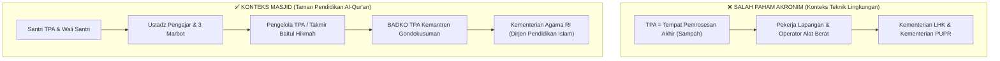
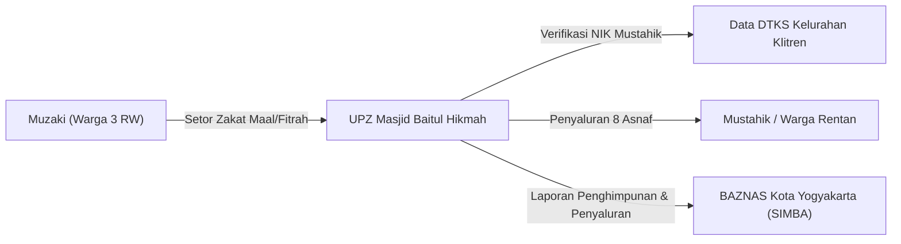
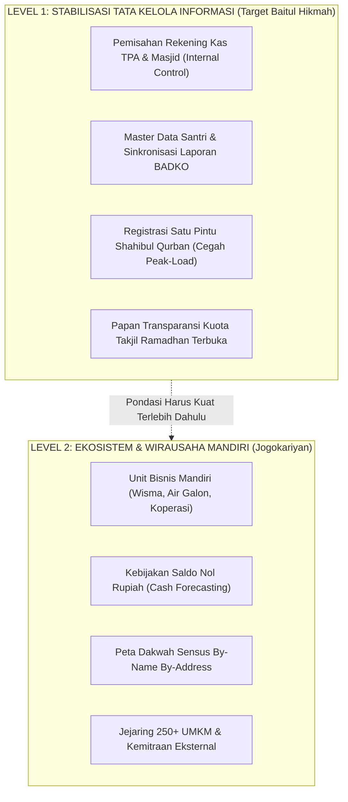

# KOMPARASI BENCHMARK MASJID JOGOKARIYAN & TATA KELOLA LINGKUNGAN EKSTERNAL
## Studi Kasus: Masjid Besar Baitul Hikmah (Klitren) vs. Benchmark Masjid Jogokariyan (Mantrijeron)
*Disusun untuk: Kelompok 1 — Kelas F1*  
*Anggota: Muhammad Riski (24050530029), Fajar Ahnaf Mahardika (24050530030), Muhadzdzib Terry Al-Fauzan (24050530052)*  
*Mata Kuliah: Praktik Manajemen Sistem Informasi (PTF60234) — Dosen: Dr. Ratna Wardani, S.Si., M.T.*

---

## 1. Koreksi & Klarifikasi Konseptual: Nomenklatur Tata Kelola TPA

Sebelum melangkah ke analisis komparasi, koreksi semantik berikut telah diverifikasi dan disesuaikan dengan konteks organisasi masjid:



### Penegasan Akademis:
* `[VERIFIED]`: **TPA** pada Masjid Besar Baitul Hikmah adalah **Taman Pendidikan Al-Qur'an**, sebuah lembaga pendidikan non-formal keagamaan Islam di bawah binaan **Badan Koordinasi TPA (BADKO TPA)** tingkat Kemantren Gondokusuman dan **Kementerian Agama RI**.
* `[INFERENCE]`: Aliran data dan tata kelola TPA tidak terhubung ke dinas kebersihan/PU, melainkan mencakup:
  1. Registrasi santri baru dan rekap pembayaran iuran/SPP santri bulanan.
  2. Pelaporan berkala jumlah santri aktif dan data ustadz ke BADKO TPA.
  3. Evaluasi kurikulum baca Al-Qur'an (metode Iqra/Tilawati) dan sertifikasi wisuda santri.

---

## 2. Pemetaan Rantai Aliran Tata Kelola Lingkungan Eksternal

Berdasarkan telaah tata kelola informasi, berikut adalah rekonstruksi 4 pilar rantai informasi eksternal Masjid Baitul Hikmah:

### A. Tata Kelola Zakat (UPZ & BAZNAS)

* **Kepatuhan Regulasi:** UU No. 23 Tahun 2011 tentang Pengelolaan Zakat mewajibkan masjid berstatus UPZ resmi melaporkan penghimpunan ke BAZNAS melalui platform SIMBA.
* **Titik Kendala:** Pendataan mustahik saat ini masih manual, sering tidak sinkron dengan DTKS kelurahan sehingga rawan salah sasaran.

### B. Tata Kelola Infaq (Siklus Pengendalian Internal)
```mermaid
flowchart TD
    J1["Jamaah Masjid"] -->|Kotak Infaq Jumat & Donasi Khusus| I1["Perolehan Infaq Fisik"]
    I1 -->|Penghitungan Kas Bersama (Dual Custody)| M1["Petugas / Marbot & Bendahara"]
    M1 -->|Pencatatan Buku Kas & Jurnal| T1["Takmir / Pengurus Harian DKM"]
    T1 -->|Otorisasi Pengeluaran Operasional & Dakwah| O1["Realisasi Program Kerja"]
    T1 -->|Diseminasi Laporan Keuangan Transparan| J2["Laporan Terbuka ke Jamaah / Publik"]
```
* **Titik Kendala Lapangan:** Saat ini tahap "Penghitungan Kas Bersama" belum memiliki SOP berita acara tertulis (masih mengandalkan kepercayaan verbal), sehingga berisiko menimbulkan *fraud* atau selisih pencatatan di tingkat bendahara.

### C. Tata Kelola TPA (Pendidikan Keagamaan)

* **Titik Kendala Lapangan:** Kartu presensi fisik santri sering hilang dan ustadz sering berhalangan hadir mendadak tanpa mekanisme ustadz pengganti (*badal*).

### D. Tata Kelola TK Baitul Hikmah (Pendidikan Formal Anak Usia Dini)
```mermaid
flowchart LR
    WALI["Wali Murid TK"] -->|SPP & Adm. Siswa| GURU["Kepala Sekolah & Guru TK"]
    GURU -->|Data Pokok Pendidikan (Dapodik)| DIK["Kemendikbudristek / Dinas Pendidikan"]
    GURU -->|Koordinasi Aset & Ruang| TAK["Takmir Masjid Baitul Hikmah"]
```
* **Status Hubungan:** `[ASSUMPTION]` TK Baitul Hikmah beroperasi secara otonom di bawah yayasan dengan kurikulum formal Kemendikbudristek, dan hubungan dengan masjid terbatas pada pemanfaatan gedung/aset aula masjid.

---

## 3. Analisis Komparasi Skala: Masjid Baitul Hikmah vs. Benchmark Masjid Jogokariyan

Sesuai arahan Dr. Ratna Wardani, S.Si., M.T., analisis perbandingan dilakukan dengan masjid rujukan berskala nasional yang memiliki ekosistem wirausaha dan acara besar: **Masjid Jogokariyan Yogyakarta**.

```mermaid
quadrantChart
    title Pemetaan Skala & Kompleksitas Bisnis Eksternal Masjid
    x-axis Kompleksitas Unit Usaha Rendah --> Kompleksitas Unit Usaha Tinggi
    y-axis Ketergantungan Donasi Amal --> Kemandirian Finansial Mandiri
    quadrant-1 Wirausaha Sosial Mapan (Jogokariyan)
    quadrant-2 Transisi Pengembangan Usaha
    quadrant-3 Amal Tradisional Terisolasi (Baitul Hikmah)
    quadrant-4 Kemitraan Komersial Terbatas
    Masjid Jogokariyan: [0.85, 0.88]
    Masjid Namira Lamongan: [0.75, 0.70]
    Masjid Baitul Hikmah: [0.20, 0.25]
```

### Tabel Komparasi Multidimensi

| Dimensi Analisis | Masjid Besar Baitul Hikmah (Klitren) | Masjid Jogokariyan Yogyakarta (Mantrijeron) | Analisis Kesenjangan MSI (*Gap Analysis*) | Status Bukti |
|:---|:---|:---|:---|:---:|
| **Model Finansial & Bisnis** | **Charity-Based (Murni Donasi):**<br>Bergantung 100% pada kotak infak Rp 2–3 juta/bulan. Tidak memiliki unit bisnis komersial mandiri. | **Socio-Enterprise (Wirausaha Syariah):**<br>Memiliki lini usaha: *Hotel/Penginapan Wisma Jogokariyan*, *Unit Usaha Air Minum Mineral/Galon*, Koperasi, dan *Kampung Ramadhan Jogokariyan (KRJ)* yang menggerakkan 250+ UMKM. | Baitul Hikmah rentan mengalami defisit kas saat ada renovasi mendadak. Ketiadaan unit usaha membuat pencatatan keuangannya sederhana, namun rawan bocor karena ketiadaan *internal control*. | `[VERIFIED]` |
| **Kebijakan Pengelolaan Kas** | **Akumulatif Pasif:**<br>Kas ditumpuk di rekening/buku kas bank untuk mengantisipasi pengeluaran masa depan. | **Zero-Balance Policy (Saldo Nol Rupiah):**<br>Prinsip bahwa dana infak jamaah harus segera dikonversi menjadi layanan umat, subsidi kesehatan, dan beras jamaah miskin. | Kebijakan Saldo Nol membutuhkan **akurasi sistem informasi peramalan kas (*cash flow forecasting*)** yang sangat tinggi agar operasional harian tidak lumpuh. Baitul Hikmah belum siap menerapkan ini. | `[VERIFIED]` |
| **Arsitektur Basis Data Jamaah** | **Unregistered / Anonim:**<br>Takmir tidak memiliki basis data tertulis mengenai siapa saja warga 3 RW yang rutin shalat, mustahik, dan mampu. Data qurban hanya nama tanpa alamat. | **Peta Dakwah Presisi (*By-Name, By-Address*):**<br>Sensus berkala seluruh warga kampung (1 RW 4 RT). Mengklasifikasikan warga: rajin jamaah, jarang jamaah, belum shalat, mustahik, hingga riwayat penyakit. | Masalah kupon qurban dan takjil di Baitul Hikmah terjadi karena ketiadaan *Master Data Jamaah*. Jogokariyan membuktikan keberhasilan program dakwah bertumpu pada kualitas data kependudukan mikro. | `[VERIFIED]` |
| **Struktur Organisasi & SDM** | **Single-Tier (Terpusat pada Marbot):**<br>3–4 Marbot sepuh merangkap pembersih, pencatat kas, dan pengajar TPA. 17 REMAS pasif musiman (hanya aktif saat Idul Fitri/Adha). | **Multi-Tier & Biro Profesional:**<br>DKM menaungi biro-biro khusus: Biro Rumah Tangga, Biro Usaha Mandiri, Korps Relawan Pemuda aktif harian, dan tim media profesional. | Baitul Hikmah mengalami *bottleneck* operasional karena tidak ada delegasi tugas. 17 pemuda REMAS tidak dilibatkan dalam operasional rutin karena tidak ada pembagian tugas formal. | `[VERIFIED]` |
| **Interaksi Lingkungan Bisnis Luar** | **Reaktif & Insidental:**<br>- KUA: sebatas sewa aula akad nikah ($\approx$ 1x/bulan).<br>- Kelurahan: tidak ada sinkronisasi data DTKS.<br>- BADKO TPA: pelaporan kertas manual. | **Ekosistemik & Terintegrasi:**<br>- Suplier air minum & sertifikasi BPOM/Halal.<br>- Integrasi pariwisata ramah Muslim.<br>- Linkage perbankan syariah & BAZNAS.<br>- Kemitraan UMKM kuliner pasar sore. | Hubungan eksternal Baitul Hikmah bersifat administratif pasif, sedangkan Jogokariyan telah membentuk jejaring nilai antar-organisasi (*inter-organizational value network*). | `[VERIFIED]` |

---

## 4. Landasan Literatur Akademis Peer-Reviewed

Seluruh data komparasi didukung oleh artikel jurnal ilmiah terakreditasi dengan DOI terverifikasi:

| Penulis & Tahun | Judul Artikel | Jurnal Publikasi & DOI | Relevansi Spesifik dengan Analisis |
|:---|:---|:---|:---|
| **Sabili, F., Romansyah, D., & Hidayat, R. (2023)** | *Akuntabilitas dan Transparansi Laporan Keuangan Masjid (Studi Kasus Masjid Jogokariyan Yogyakarta)* | *JAKIS: Jurnal Akuntansi dan Keuangan Islam*, 11(2), 233–249. <br>DOI: [10.35836/jakis.v11i2.626](https://doi.org/10.35836/jakis.v11i2.626) | Memvalidasi model transparansi keuangan publik, pembukuan kas masjid, dan bagaimana akuntabilitas terbuka meningkatkan kepatuhan dan partisipasi donatur secara signifikan. |
| **Widyanti, R., & Rahmayanti, D. (2020)** | *Perancangan dan Implementasi Sistem Informasi Manajemen Kegiatan Masjid: Studi Kasus Masjid Jogokariyan Yogyakarta* | *JSTIE (Jurnal Sarjana Teknik Informatika)*, 1(1), 119–128. <br>DOI: [10.12928/jstie.v1i1.2513](https://doi.org/10.12928/jstie.v1i1.2513) | Membuktikan bahwa komputerisasi sistem kegiatan masjid di Jogokariyan dirancang mengikuti kesiapan SDM dan kebutuhan riil jadwal kegiatan komunitas, bukan sekadar digitalisasi instan. |
| **Wibowo, A. E., dkk. (2024)** | *Kampung Ramadhan Jogokariyan (KRJ): Peran Manajemen Masjid dalam Pariwisata Ramah Muslim dan Ekonomi Lokal* | *AKUA: Jurnal Akuntansi dan Keuangan*, 4(2). <br>DOI: [10.54259/akua.v4i2.4258](https://doi.org/10.54259/akua.v4i2.4258) | Memverifikasi bagaimana DKM mengelola jaringan bisnis eksternal (250+ UMKM pasar Ramadhan), pengelolaan logistik ribuan porsi takjil/hari, dan perputaran ekonomi warga sekitar. |
| **Arsam, A., Nurmahyati, S., & Amaluddin, A. (2024)** | *Manajemen Dakwah Takmir Masjid Jogokaryan dalam Membangun Peradaban Islam di Mantrijeron Yogyakarta* | *Tadbir: Jurnal Manajemen Dakwah*, 9(1), 19–40. <br>DOI: [10.15575/tadbir.v9i1.33885](https://doi.org/10.15575/tadbir.v9i1.33885) | Membedah struktur kelembagaan, pembagian wewenang, sensus "Peta Dakwah", dan pemanfaatan pemuda masjid dalam rantai manajemen harian. |
| **Sutono, M. A., & Risyan, R. M. (2023)** | *Digitalisasi Sistem Informasi Manajemen Masjid Modern* | *INFOTECH Journal*, 9(1), 1–10. <br>DOI: [10.31949/infotech.v9i1.4222](https://doi.org/10.31949/infotech.v9i1.4222) | Menjelaskan kerangka umum arsitektur SIM masjid modern, integrasi database donatur, serta tantangan adopsi teknologi bagi pengurus non-IT. |

---

## 5. Model Maturitas Sistem Informasi (Pelajaran Strategis untuk Baitul Hikmah)

Perbandingan ini memberikan kerangka kerja (*maturity model*) yang jelas bagi arah pengembangan SIM-BaitulHikmah:



### Rekomendasi Aplikatif untuk Tim MSI:
1. **Jangan Memaksakan Model Bisnis Sebelum Tertib Tata Kelola:**  
   Baitul Hikmah belum siap membuka unit usaha air galon atau penginapan jika pembukuan kas TPA saja masih berisiko tercampur dengan kas pribadi. Fokus MSI tahap ini adalah **tertib administrasi dan pengendalian internal (*Internal Control*)**.
2. **Adopsi Konsep "Peta Dakwah" dalam Skala Mikro:**  
   Takmir Baitul Hikmah cukup membuat pendataan satu pintu sederhana untuk warga 3 RW: nama kepala keluarga, NIK, alamat RT/RW, dan nomor WhatsApp. Master data ini akan langsung menyelesaikan kekacauan distribusi kupon qurban dan pembagian zakat fitrah.
3. **Pemberdayaan 17 Pemuda REMAS sebagai Jembatan Adopsi:**  
   Di Jogokariyan, pemuda adalah motor utama sistem harian. Di Baitul Hikmah, 17 pemuda REMAS tidak boleh dibiarkan menganggur hingga Idul Adha. Mereka harus diberi peran terstruktur sebagai operator sistem mingguan untuk membantu marbot sepuh.

---

## 6. Pernyataan Batasan & Ketidakpastian (Limitations & Uncertainties)

* `[LIMITATION 1]`: Data finansial Masjid Jogokariyan bersumber dari publikasi artikel jurnal ilmiah sekunder; laporan keuangan audited tahun buku 2025/2026 tidak diakses langsung.
* `[UNCERTAINTY 1]`: Potensi pembentukan unit usaha mandiri (misal: kantin terpadu TK/TPA atau air minum isi ulang) di Baitul Hikmah memerlukan analisis kelayakan usaha tersendiri di luar lingkup praktikum MSI saat ini.
* `[VERIFIED FACT]`: BADKO TPA adalah regulator pembina teknis kurikulum dan kelembagaan TPA masjid di Daerah Istimewa Yogyakarta.

---

## 7. Skrip Presentasi & Jawaban untuk Bu Ratna

Gunakan argumen berikut saat dosen menanyakan perbandingan ini:

> *"Ibu Ratna, sesuai arahan Ibu untuk membandingkan dengan masjid skala besar yang memiliki jejaring bisnis, kami telah mengkaji studi literatur Masjid Jogokariyan Yogyakarta berbasis jurnal ilmiah terakreditasi (Sabili et al., 2023; Wibowo et al., 2024).*
> 
> *Temuan utama kami:*
> 1. *Masjid Jogokariyan berada pada level **Socio-Enterprise Mapan**: mereka memiliki unit usaha Wisma Penginapan, Air Minum Mineral, dan pasar KRJ. Keberhasilan saldo kas nol rupiah mereka bertumpu pada akurasi sistem informasi peramalan kas (*cash forecasting*) dan sensus kependudukan 'Peta Dakwah' by-name by-address.*
> 2. *Sebaliknya, Masjid Baitul Hikmah berada pada level **Charity-Based Tradisional** (infaq Rp 2–3 juta/bulan). Kebutuhan mendesak Baitul Hikmah bukanlah langsung melompat membuat unit usaha atau software rumit, melainkan **fondasi tata kelola informasi dasar**: pemisahan buku kas TPA agar tidak terjadi penyelewengan, standardisasi formulir qurban untuk mengatasi peak-load di 3 RW, dan transparansi slot takjil.*
> 3. *Kami juga mengoreksi alur eksternal kami: TPA masjid dibina langsung oleh **BADKO TPA Gondokusuman dan Kemenag**, bukan dinas infrastruktur fisik.*
> 4. *Dengan komparasi ini, kami dapat membuktikan bahwa intervensi MSI yang kami rancang bersifat realistis (*fit*) sesuai tahapan maturitas organisasi Masjid Baitul Hikmah, tanpa membebani marbot sepuh."*
