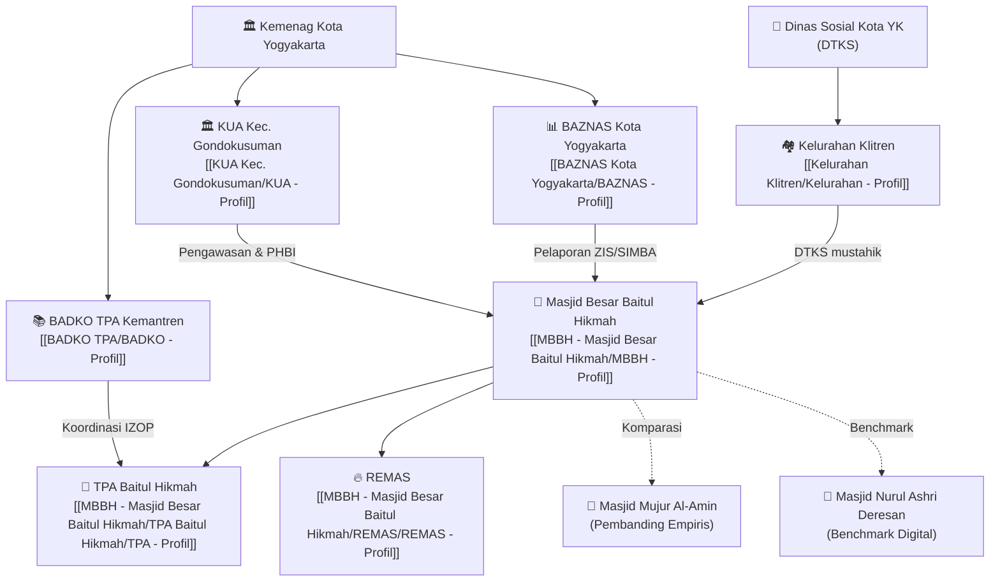

# 🗂️ GLOSARIUM MASTER — SIM-BaitulHikmah

> Setiap entitas memiliki file glosariumnya sendiri sebagai **Single Source of Truth**.  
> Butuh data tentang KUA? Buka KUA - Profil.md — tidak perlu buka laporan.

---

## 🗺️ Peta Entitas & Hierarki

---

## 📁 Direktori Entitas

### 🕌 Entitas Utama (Target Studi)

| Entitas | File | Status Data |
|---|---|:---:|
| **Masjid Besar Baitul Hikmah** | [[MBBH - Masjid Besar Baitul Hikmah/MBBH - Profil]] | ✅ Lengkap |
| **TPA Baitul Hikmah** | [[MBBH - Masjid Besar Baitul Hikmah/TPA Baitul Hikmah/TPA - Profil]] | 🟡 Parsial |
| **REMAS** | [[MBBH - Masjid Besar Baitul Hikmah/REMAS/REMAS - Profil]] | ✅ Cukup |

### 🏛️ Entitas Eksternal (Ekosistem)

| Entitas | File | Status Data |
|---|---|:---:|
| **KUA Kec. Gondokusuman** | [[KUA Kec. Gondokusuman/KUA - Profil]] | 🟡 Parsial |
| **BAZNAS Kota Yogyakarta** | [[BAZNAS Kota Yogyakarta/BAZNAS - Profil]] | 🟡 Parsial |
| **Kelurahan Klitren** | [[Kelurahan Klitren/Kelurahan - Profil]] | 🟡 Hipotesis |
| **BADKO TPA** | [[BADKO TPA/BADKO - Profil]] | 🟡 Parsial |

### 🕌 Masjid Pembanding & Benchmark

| Entitas | File | Peran |
|---|---|---|
| **Masjid Mujur Al-Amin** | [[Masjid Pembanding/Mujur Al-Amin - Profil]] | Pembanding empiris lapangan |
| **Masjid Nurul Ashri Deresan** | [[Masjid Pembanding/Nurul Ashri - Profil]] | Benchmark kematangan digital |

---

## 🔄 Alur Data Antar Entitas (Quick Reference)

| Dari | Ke | Data yang Mengalir | Dasar Hukum | Status |
|---|---|---|---|:---:|
| MBBH | KUA | Laporan PHBI (Idul Fitri & Qurban) | PMA 34/2016 | ❌ Belum terstandar |
| KUA | Kemenag Kota | Rekapitulasi PHBI wilayah | PMA 34/2016 | — |
| MBBH | BAZNAS | Laporan ZIS via SIMBA | UU Zakat | ❌ Belum terimplementasi |
| Kelurahan | MBBH | Data mustahik DTKS | — | ❌ Belum ada alur |
| TPA | BADKO | Laporan kegiatan & data santri | — | 🟡 Belum terverifikasi |
| BADKO | Kemenag | Rekapitulasi TPA wilayah | — | — |
| MBBH | Jamaah | Laporan keuangan berkala | — | ❌ Tidak ada |

---

## 📊 Status Validasi Data per Entitas

| Entitas | Data Tervalidasi | Data Hipotesis | Data Kosong |
|---|:---:|:---:|:---:|
| MBBH | Banyak ✅ | Mustahik DTKS 🟡 | Nominal kas ❌ |
| TPA | Absensi Excel ✅ | Data internal 🟡 | Jumlah santri ❌ |
| KUA | Regulasi ✅ | — | Format laporan ❌ |
| BAZNAS | SIMBA ada ✅ | — | Integrasi MBBH ❌ |
| Kelurahan | DTKS ada ✅ | Koordinasi MBBH 🟡 | Verifikasi langsung ❌ |
| BADKO | IZOP selesai ✅ | Laporan rutin 🟡 | Format standar ❌ |

---

## ✏️ Cara Menambah Data Baru

Saat ada informasi baru (dari wawancara, WA, observasi):
1. **Buka file glosarium entitas yang relevan** (misal: `MBBH - Profil.md`)
2. **Tambahkan data baru** di bagian yang tepat
3. **Tandai statusnya**: ✅ Tervalidasi / 🟡 Hipotesis / ❌ Belum ada
4. **Update `last-updated`** di bagian YAML frontmatter
5. Jika relevan untuk laporan, buka laporan terkait dan update dari sini

> 💡 **Prinsip:** Data masuk ke glosarium dulu, laporan referensikan dari glosarium — bukan sebaliknya.

---

*Glosarium dibuat: 14 September 2026 | Kelompok 1 F1*
