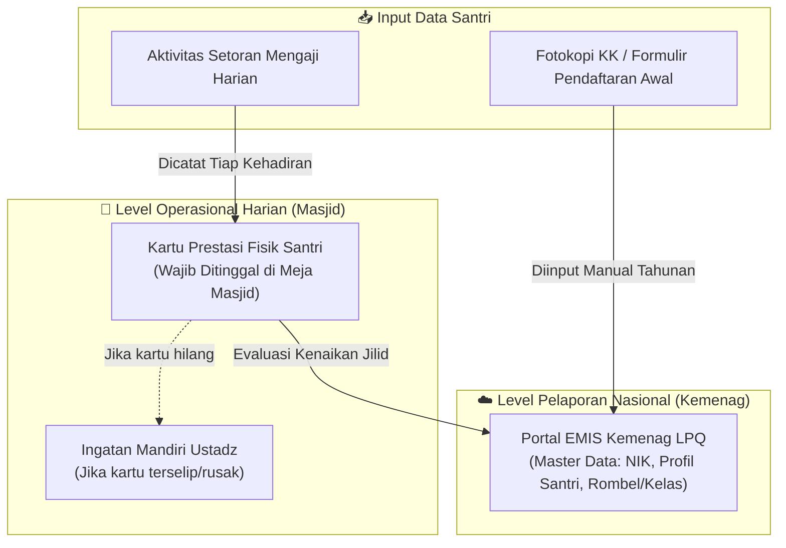
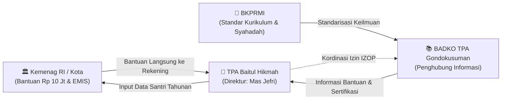

# 📖 TPA Baitul Hikmah — Glosarium & Profil Entitas

> **Status Data:** ✅ TERVALIDASI EMPIRIS PENUH — Berdasarkan wawancara mendalam tatap muka dengan Direktur TPA (Jefri Nur Ihsan, SE.I.) dan transkrip verbatim rekaman audio `PAA.mp3` (September 2026).  
> Dokumen ini adalah **Single Source of Truth (SSOT)** untuk seluruh analisis tata kelola informasi pendidikan TPA Baitul Hikmah.

---

## 📌 1. Profil Lembaga & Legalitas Formal

| Parameter | Data Lapangan | Keterangan Tata Kelola |
|---|---|---|
| **Nama Lembaga** | **TPA Baitul Hikmah** | Unit pelayanan pendidikan Al-Qur'an anak di bawah naungan takmir masjid |
| **Lembaga Induk** | **Masjid Besar Baitul Hikmah (MBBH)** | Terletak di Kelurahan Klitren, Kemantren Gondokusuman, Kota Yogyakarta |
| **Pimpinan / Direktur** | **Jefri Nur Ihsan, SE.I.** | Merangkap sebagai **Ketua II Takmir MBBH** (SK No. 05/MBBH/VII/2026) dan ex-officio Komite TK |
| **Izin Operasional (IZOP)** | ✅ **Sudah Diperpanjang** *(Kemenag RI)* | Siklus 5 tahunan. Sempat kadaluwarsa selama 2 tahun karena ketiadaan delegasi serah terima |
| **Basis Sistem Informasi** | **EMIS Kemenag (Kategori LPQ/TPA)** | Portal nasional Kemenag RI untuk lembaga pendidikan Al-Qur'an (bukan EMIS 4.0 madrasah) |
| **Afiliasi Kelembagaan** | **BADKO TPA Kemantren Gondokusuman** | Menginduk ke standar kurikulum **BKPRMI** (Badan Komunikasi Pemuda Remaja Masjid Indonesia) |
| **Jadwal Operasional** | **3× seminggu (Ba'da Maghrib)** | Dipindahkan dari jadwal lama (pukul 16.00 sore) guna mengakomodasi kepulangan *Full-Day School* |

> ⚠️ **ANTI-HALUSINASI PENGURUS:**  
> Nama-nama yang tercantum pada SK Takmir (Satrio, Fahim, Fajri, Marbot) adalah **tim pengajar teknis**, BUKAN Direktur TPA.  
> Direktur TPA tunggal yang memegang otoritas manajerial adalah **Jefri Nur Ihsan, SE.I.**

---

## 👥 2. Struktur Kepengurusan & Beban Kerja Manajerial

### Pola Manajemen Tunggal (*Solo Management & Single-Person Dependency*)
Kondisi operasional TPA Baitul Hikmah mengalami fenomena *extreme key-person dependency*. Tidak ada divisi atau pengurus harian formal di level manajerial:
* **Jefri Nur Ihsan, SE.I. (Direktur TPA):** Menangani seluruh aspek organisasi secara mandiri:
  1. Tata kelola administrasi & legalitas perizinan (IZOP, EMIS Kemenag, BADKO TPA).
  2. Perumusan kurikulum, konsep pembelajaran, dan standarisasi bacaan.
  3. Hubungan masyarakat (humas), komunikasi orang tua, dan koordinasi dengan takmir.
  4. Pengelolaan rekening keuangan kas TPA mandiri.
* **Tim Pengajar (4 Orang Marbot Masjid):**
  * TPA didukung oleh 4 orang marbot masjid yang difungsikan ganda sebagai ustadz pengajar Al-Qur'an.
  * **Standarisasi Pengajar Berjenjang (*Tiered Teaching Qualification*):**
    * **Tier 1 (Dasar - Makharijul Huruf):** 2 orang marbot yang belum lancar panjang-pendek (*mad*) dibatasi **hanya boleh mengajar maksimal sampai Iqro jilid 2**.
    * **Tier 2 (Lanjutan - Tartil):** 2 orang marbot yang sudah lancar dan bertartil memegang santri Iqro jilid 3 hingga Al-Qur'an.
  * Mas Jefri menerapkan supervisi ketat: santri boleh membaca terputus-putus asalkan makhraj dan panjang-pendeknya tepat sebelum dinaikkan jilidnya.

---

## 🗄️ 3. Master Data Santri & Arsitektur Sistem Informasi

Arsitektur data santri TPA Baitul Hikmah menerapkan model **Dual-Tier System (Hibrid Fisik–Digital)**:

### Rincian Komponen Data:
1. **Pencatatan Harian (Kartu Prestasi Fisik):**
   * Berisi: Tanggal kehadiran, surat/jilid yang dibaca, nomor halaman, status (Lanjut / Mengulang), dan paraf pengajar.
   * **Mitigasi Kehilangan:** Berbeda dengan anggapan awal, **kartu prestasi TIDAK dibawa pulang oleh santri**, melainkan wajib disimpan dan dikumpulkan di masjid setelah sesi belajar selesai.
   * **Kelemahan Tata Kelola:** Belum ada buku register induk/duplikat harian (*backup master logbook*). Jika kartu di masjid rusak atau tercecer, pengajar hanya mengandalkan ingatan mandiri (*informal recall*).
2. **Master Data Digital (Portal EMIS Kemenag RI):**
   * TPA menginput data ke portal **EMIS (Education Management Information System)** Kemenag untuk kategori LPQ (Lembaga Pendidikan Al-Qur'an).
   * Memuat: Nomor Induk Santri, NIK santri/wali, profil santri, rombongan belajar (rombel kelas per jilid), dan data ustadz.
   * **Siklus Pembaruan:** Dilakukan secara berkala **setahun sekali setiap awal tahun ajaran baru** (menyerupai sistem administrasi sekolah madrasah).

---

## 📉 4. Dinamika Santri & Investigasi Penurunan Murid

### Fakta Kuantitatif Lapangan:
* **Jumlah Santri Aktif Terdaftar:** **15 anak** (Angka riil terverifikasi).
* **Perbandingan Benchmark Lokal:** Masjid Al-Wahid Gambiran (tempat lain Mas Jefri beraktivitas) memiliki **140 santri aktif**.
* **Kondisi Demografi Santri:** Mayoritas santri saat ini duduk di bangku kelas 5 dan kelas 6 SD. Terdapat risiko tinggi santri putus mengaji (*drop-out*) saat lulus SD memasuki jenjang SMP.

### Analisis Akar Masalah Kemerosotan Santri:
1. **Faktor Sosio-Kultural (Erosi Komitmen Orang Tua):**
   * Faktor utama penurunan santri **BUKAN semata kelelahan akibat Full-Day School atau distraksi gawai/gadget**, melainkan **sikap pasif-permisif orang tua warga sekitar MBBH** (*lack of parental support and push*).
   * Orang tua cenderung membebaskan anak ("terserah anak mau TPA atau tidak"). Sebaliknya di masjid benchmark (Al-Wahid), orang tua secara aktif mengantar, menunggu anak mengaji, dan memprioritaskan pendidikan Quran meski anak sudah sekolah di SD Islam terpadu.
2. **Faktor Jadwal Sekolah:**
   * Diatasi dengan memindahkan jadwal mengaji dari jam 16.00 ke **ba'da Maghrib**, sehingga waktu tempuh dan istirahat santri terpenuhi.
3. **Intervensi Retensi yang Pernah Dilakukan:**
   * Mas Jefri memanfaatkan sisa dana bantuan lama untuk memberikan **uang pembinaan setiap santri naik 2 jilid Iqro** dan menyelenggarakan **makan bersama sebulan sekali**. Program ini berhasil menghidupkan kembali 15 santri setelah sempat vakum total, namun terancam terhenti karena keterbatasan anggaran.
4. **Rencana Integrasi Strategis (*Horizontal Feeder System*):**
   * Mas Jefri merancang peleburan manajemen TPA ke dalam **TK Baitul Hikmah**. Dengan posisi Mas Jefri sebagai Ketua II Takmir (yang ex-officio menjadi Komite TK), TPA akan menyerap langsung lulusan TK sebagai santri baru yang berkelanjutan sejak usia dini.

---

## 💰 5. Tata Kelola Keuangan & Internal Control

| Komponen Finansial | Fakta Lapangan | Evaluasi Pengendalian Internal (*Internal Control*) |
|---|---|---|
| **Iuran SPP Santri** | **Rp 0 (GRATIS / Bebas SPP)** | Keputusan strategis: pengenaan SPP dikhawatirkan mematikan motivasi 15 santri yang tersisa |
| **Rekening Kas TPA** | **Rekening Bank Khusus atas nama TPA** | ✅ *Segregation of funds* terpenuhi: kas TPA terpisah dari kas takmir dan bukan rekening pribadi |
| **Subsidi Kas Takmir Masjid** | **Rp 0 / Nol Subsidi dari Masjid** | Takmir MBBH belum memberikan alokasi anggaran rutin sama sekali untuk operasional TPA |
| **Bisyarah Pengajar & Direktur** | **Rp 0 (Tidak ada bisyarah uang tunai)** | Pengajar (marbot) dan Direktur tidak menerima honorarium rutin dari kas TPA maupun takmir |
| **Insentif Pengajar** | **Natura / Makan Bersama Bulanan** | Diambil dari sisa dana program ketika kas masih mencukupi |

### 🚨 Insiden Kritis Tata Kelola: Hangusnya Bantuan Kemenag Rp 10.000.000
* **Deskripsi Insiden:** TPA Baitul Hikmah memiliki hak alokasi bantuan operasional kelembagaan dari Kementerian Agama RI sebesar **Rp 10.000.000 (10 juta rupiah)** yang langsung disalurkan ke rekening bank TPA.
* **Dampak Kerugian:** Selama 2 tahun berturut-turut, alokasi dana bantuan Rp 10 juta tersebut **GAGAL CAIR / HANGUS**, memaksa TPA menghabiskan saldo cadangan kas tahun-tahun sebelumnya hingga menipis.
* **Penyebab Kegagalan (Akar Masalah MSI):**
  1. Izin Operasional (IZOP) TPA Baitul Hikmah telah **kadaluwarsa (siklus 5 tahunan)**.
  2. **Ketiadaan Sistem Pengingat & Delegasi:** Pengurus lama tidak mendokumentasikan atau memberitahukan masa berlaku IZOP kepada Mas Jefri saat pergantian kepengurusan (*no formal handover*).
  3. Mas Jefri baru mengetahui IZOP kadaluwarsa ketika proposal pengajuan bantuan ditolak secara otomatis oleh sistem Kemenag.

---

## 🏛️ 6. Relasi Kelembagaan Eksternal & Regulasi

1. **BADKO TPA Kemantren Gondokusuman:**
   * Berfungsi sebagai simpul koordinasi perizinan dan penyalur informasi program kerja/bantuan dari Kemenag ke unit TPA.
   * **Bukan lembaga penerima laporan keuangan atau absensi:** BADKO tidak meminta laporan audit internal rutin dari TPA.
2. **Standarisasi BKPRMI (Badan Komunikasi Pemuda Remaja Masjid Indonesia):**
   * Standar materi pengajaran (bacaan salat, doa harian, gerakan wudhu/salat) menginduk pada pedoman resmi BKPRMI.
   * **Syahadah Pengajar (Sertifikasi Guru Quran):** Kemenag mensyaratkan guru TPA memiliki sertifikat syahadah resmi (Tingkat 1, 2, atau 3) untuk perpanjangan IZOP.
   * *Solusi Darurat:* Akibat kendala waktu ujian sertifikasi mandiri, Mas Jefri mengunggah sertifikat syahadah rekan pengajar terverifikasi agar berkas perpanjangan izin operasional TPA dapat disetujui Kemenag.
3. **Validasi Kerancuan Administratif Takmir MBBH:**
   * Mas Jefri mengonfirmasi bahwa saat rapat kerja takmir (pembahasan program kerja), evaluasi kas Bendahara macet selama 1,5 jam (pukul 08.00–10.00) tanpa penyelesaian karena tidak adanya laporan keuangan tertulis.
   * Kepengurusan takmir saat ini didominasi generasi sepuh, sehingga mendesak dibutuhkan SOP tertulis formal dan pelibatan generasi muda untuk modernisasi tata kelola informasi.

---

## 📊 7. Ringkasan Evaluasi 7 Aspek MSI pada TPA Baitul Hikmah

| No | Aspek MSI | Kondisi Riil TPA Baitul Hikmah | Rekomendasi Solusi Sosio-Teknis |
|:---:|---|---|---|
| 1 | **Keselarasan Strategis** | TPA terancam punah karena penurunan santri (15 anak) dan putusnya pasokan santri usia SMP. | Sinergi horizontal: integrasi TPA sebagai program lanjutan wajib bagi lulusan TK Baitul Hikmah. |
| 2 | **Tata Kelola & Kualitas Informasi** | Master data ada di EMIS Kemenag, namun absensi harian hanya kartu fisik tanpa salinan master. | Buat lembar rekapitulasi capaian bulanan berbasis lembar logbook sederhana (*Dual-Tier*). |
| 3 | **Dukungan Pengambilan Keputusan** | Evaluasi kenaikan jilid dan seleksi santri diputuskan sepihak oleh Direktur berdasarkan amatan. | Laporan rekapitulasi capaian santri berkala sebagai dasar rapat koordinasi takmir dan komite TK. |
| 4 | **Kebutuhan Informasi Stakeholder** | Kemenag butuh data EMIS; orang tua tidak menerima laporan rutin capaian mengaji anak. | Kartu laporan capaian semesteran sederhana yang dikirim via grup WhatsApp orang tua santri. |
| 5 | **Nilai Informasi (Information Value)** | Kelalaian tracking IZOP menyebabkan hilangnya nilai finansial **Rp 10.000.000**. | Kalender administrasi legalitas (*lifecycle registry*) berperingatan dini untuk seluruh perizinan masjid. |
| 6 | **Integrasi Proses Bisnis** | TPA berjalan terisolasi (*data silo*); takmir tidak tahu data santri dan tidak mengucurkan subsidi. | Rapat koordinasi triwulanan terjadwal antara Takmir, Direktur TPA, dan Pengelola TK. |
| 7 | **Adopsi & Perilaku Organisasi** | Seluruh beban bertumpu pada Mas Jefri (*solo management*); ustadz marbot bekerja tanpa insentif tunai. | Distribusi peran manajerial ke pemuda REMAS untuk administrasi pencatatan dan pelaporan digital. |

---

## 🎙️ 8. Kutipan Verbatim Terpilih (Bukti Empiris)

* **Tentang Rangkap Jabatan & Beban Solo:**  
  > *"Tapi kalau di Baitul Hikmah itu ya itu sendiri kan enggak ada karena tidak ada sumber daya SDM-nya. Jadi otomatis saya sebagai pengelola ini handle semuanya mulai dari administrasi, konsep pembelajaran, dan untuk hubungan humas dan lain-lain..."* *(Mas Jefri, Transkrip PAA.mp3)*
* **Tentang Portal EMIS Kemenag:**  
  > *"Nah, kemudian kalau untuk administrasi data itu sekarang masuk di website EMIS namanya... EMIS itu ada dua, yang 4.0 untuk madrasah, kalau EMIS biasa untuk pondok dan LPQ kayak TPA. Nah kita masuk yang EMIS biasa itu. Di situ isinya mulai dari profil masjid, profil TPA sampai profil santri semua masuk di situ... Update-nya setiap pergantian tahun ajaran baru."* *(Mas Jefri, Transkrip PAA.mp3)*
* **Tentang Penurunan Santri & Sikap Orang Tua:**  
  > *"Baitul Hikmah itu yang tercatat 15. Penyebabnya pertama itu kalau di lingkungan sini memang tidak ada dorongan dari orang tua. Orang tua terserah mau TPA ya monggo, enggak ya terserah kamu... Bandingkan dengan di Al-Wahid Gambiran itu santrinya 140, orang tuanya nunggu mulai dari datang sampai pulang."* *(Mas Jefri, Transkrip PAA.mp3)*
* **Tentang Hangusnya Dana Bantuan Kemenag Rp 10 Juta:**  
  > *"2 tahun lalu dan tahun kemarin itu ada bantuan Rp 10 juta untuk TPA, tapi enggak keambil karena izin operasionalnya Baitul Hikmah habis belum sempat ngurus... dan aku enggak dikasih tahu kalau ini sudah habis. Baru tahu ketika pengajuan bantuan ditolak izin operasionalnya habis."* *(Mas Jefri, Transkrip PAA.mp3)*
* **Tentang Keuangan & SPP:**  
  > *"Untuk santri enggak ada pungutan SPP ya, karena kita kondisi santri masih seperti ini, takutnya malah mengundurkan motivasi... Untuk kasnya rekening mandiri TPA, masjid belum bisa kasih bantuan sama sekali."* *(Mas Jefri, Transkrip PAA.mp3)*

---

*Last updated: 15 September 2026 | Sumber: Wawancara Langsung Direktur TPA (PAA.mp3)*

