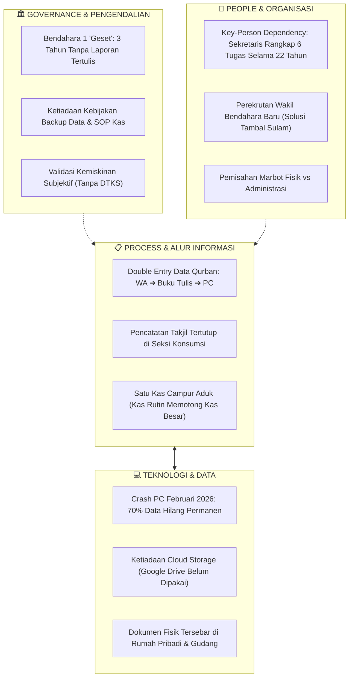

# ANALISIS TEMUAN LAPANGAN & SPEKTRUM MASALAH TATA KELOLA INFORMASI
## Objek Studi: Masjid Besar Baitul Hikmah (Klitren, Gondokusuman, Yogyakarta)
*Berdasarkan Transkrip Wawancara Sekretariat (Bpk. Mardianto) — 2026*  
*Mata Kuliah: Praktik Manajemen Sistem Informasi (PTF60234) — Kelompok 1 F1*

---

## 📌 STATUS PENGUMPULAN DATA
- [x] **Tata Kelola Sekretariat & Operasional:** Bpk. Mardianto (Sekretaris Takmir sejak 2004 – 22 tahun menjabat).
- [ ] **Tata Kelola TPA (Pendidikan Santri):** *Pending* — Direktur TPA adalah Mas Jefri (akan diwawancarai terpisah).
- [ ] **Benchmark Skala Besar:** *Pending* — Masjid Nurul Ashri Deresan (menunggu konfirmasi jadwal).

---

## 1. TABEL TEMUAN EMPIRIS & ANALISIS MANAJEMEN SISTEM INFORMASI (MSI)

| No | Klaster Tata Kelola | Fakta Lapangan (Empiris) | Analisis Kritis MSI (Konsep & Implikasi) |
|:--:|:---|:---|:---|
| **1** | **Profil & Ketergantungan Figur (*Key-Person Dependency*)** | • Bpk. Mardianto menjabat sekretaris sejak 2004 (22 tahun).<br>• Merangkap banyak fungsi sekaligus: surat/notulen, seksi dakwah (mencari seluruh ustadz Jumat/Ramadhan/Ied), bantu keuangan majelis taklim, pembuat undangan warga, PIC pendaftaran qurban, dan operator IT. | **Risiko *Single Point of Failure* Ekstrem.** Aliran informasi masjid terpusat pada satu individu. Jika beliau berhalangan, operasional dakwah, administrasi, dan koordinasi qurban terancam lumpuh total (*knowledge silos*). |
| **2** | **Insiden Kehilangan Data (*Disaster Recovery Failure*)** | • Februari 2026 komputer kantor macet/rusak total menjelang Ramadhan.<br>• Servis hanya berhasil memulihkan ~30% data; **70% data hilang permanen**.<br>• Belum pernah menggunakan cloud storage (Google Drive).<br>• Berkas AD/ART digital ikut hilang.<br>• Berkas fisik tersimpan di rumah pribadi sekretaris & gudang. | **Ketiadaan *Business Continuity Plan* (BCP) & Redudansi Data.** Konsep digitalisasi yang dipahami masjid baru sebatas *komputerisasi lokal offline* tanpa prosedur pencadangan (*backup policy*). Dokumen resmi yang disimpan di rumah pribadi melanggar prinsip sentralisasi arsip organisasi. |
| **3** | **Pengendalian Keuangan Internal (*Internal Control & Fraud Risk*)** | • Kotak infak Jumat dihitung per seksi lalu disetor ke Bendahara 1.<br>• **Temuan Kritis:** Bendahara 1 "geset" (lambat/kurang rajin) dan **selama 3 tahun TIDAK PERNAH membuat laporan tertulis** (hanya lisan tanpa rincian/bukti).<br>• Tidak ada laporan rutin mingguan/Jumat ke jamaah.<br>• Solusi takmir: Merekrut Wakil Bendahara baru (Agustus 2026) untuk mem-*backup*. | **Pelanggaran Berat Prinsip Akuntabilitas & *Segregation of Duties*.** Ketiadaan audit trail selama 3 tahun membuka celah *information asymmetry* yang membahayakan kepercayaan publik (*muzaki/jamaah*). Perekrutan wakil bendahara adalah perbaikan struktural manusia (*people*), namun belum menyentuh SOP pelaporan (*process*). |
| **4** | **Struktur Arsitektur Kas (Kas Besar vs Kas Kecil)** | • Hanya ada satu kas besar (biaya listrik, operasional, kebersihan langsung memotong kas besar).<br>• Kas kecil hanya dibuat temporer saat Idul Adha.<br>• Pengeluaran diputuskan rapat internal 5–6 orang pengurus inti.<br>• Sudah memiliki rekening bank dan QRIS. | **Inefisiensi Alur Keputusan Operasional.** Tanpa *petty cash system* (kas kecil) dengan pagu batas tetap, pengeluaran rutin sepele tetap harus membebani kas besar dan bergantung pada ketersediaan pengurus inti. Adopsi QRIS belum diimbangi prosedur rekonsiliasi kas berkala. |
| **5** | **Manajemen Beban Puncak (Ramadhan & Takjil)** | • Kebutuhan 200 bungkus takjil/hari dipikul bergilir oleh donatur (4 orang @50 bungkus) + 3 jumbo teh.<br>• Warga boleh mengisi slot, tapi wajib koordinasi manual dengan panitia.<br>• Jika slot takjil kosong, ditalangi kas takmir (meskipun kondisi kas takmir sering tipis/kosong). | **Distribusi Beban Informasi Tersentralisasi.** Tidak ada papan pengumuman/sistem terbuka untuk melihat tanggal takjil yang masih kosong. Jamaah mengalami asimetri informasi sehingga tidak tahu kapan masjid butuh donasi darurat. |
| **6** | **Manajemen Idul Adha & Qurban (Peak-Load)** | • Sapi patungan Rp 3,5 jt/orang (cash atau tabungan Rp 350rb/bln).<br>• Pendaftaran via WA langsung ke Sekretaris, dicatat manual lalu diketik ulang ke komputer.<br>• Kupon dan jatah daging dibagikan dengan standar **per jiwa** (bukan per KK).<br>• Evaluasi: Pernah ada warga yang terlewat; distribusi meluas hingga panti luar kota (Bantul, Gunungkidul). | **Redundansi Entri Data (WA → Manual Kertas → Komputer).** Proses *double-handling* memperbesar risiko *human error* (salah ketik nomor/jatah). Basis alokasi "per jiwa" memerlukan akurasi master data keluarga yang tinggi agar tidak terjadi defisit daging di lapangan. |
| **7** | **Hubungan Eksternal & Keterhubungan Regulasi** | • Ke RT/RW: Hanya mengirim laporan pembagian qurban.<br>• Ke Kelurahan/Kecamatan: Sebatas surat permohonan izin (Shalat Ied di Superindo) dan permohonan bantuan.<br>• Ke Kemenag/KUA: Terdaftar di SIMAS; update data via KUA Gondokusuman (data takmir, data shalat Ied).<br>• KUA meminjam aula untuk akad nikah via surat resmi.<br>• Data kemiskinan (mustahik): Tidak memakai DTKS Kelurahan formal, mengandalkan pengamatan warga sekitar. | **Sistem Kepulauan (*Data Island* / Silo Eksternal).** Hubungan dengan pemerintah bersifat *reaktif-prosedural* (izin dan pinjam tempat), bukan pertukaran data strategis. Validasi kemiskinan secara subjektif warga berisiko menimbulkan *bias kedekatan* (*favoritism*) dan data tumpang tindih dengan bantuan sosial kelurahan. |
| **8** | **Kemitraan Swasta (CSR Superindo)** | • Kerja sama dengan Superindo Klitren: Pinjam area parkir untuk Shalat Ied, bantuan kurma & konsumsi Ramadhan, serta pembelian logistik buka bersama. | **Aset Strategis Hubungan Industri-Komunitas.** Merupakan poin kuat keterhubungan eksternal masjid semi-urban. Sinergi ini perlu dipayungi tata kelola inventaris dan arsip MoU tertulis agar berkelanjutan siapapun takmirnya. |

---

## 2. PEMETAAN SPEKTRUM MASALAH TATA KELOLA MSI

### Diagram Arsitektur Permasalahan (Sosio-Teknis)


---

### SPEKTRUM 1: Berdasarkan Tiga Level Keputusan Manajemen (Anthony's Triangle)

```
        ▲
       / \     LEVEL STRATEGIS (Ketua Takmir & Dewan Syuro)
      /   \    • Tidak ada laporan keuangan tertulis selama 3 tahun ➔ Keputusan arah 
     /     \     pengembangan masjid berbasis "perkiraan/asumsi", bukan data riil.
    /───────\  • Legalitas SK DMI & AD/ART digital lenyap ➔ Kelemahan payung hukum.
   /         \
  /           \  LEVEL MANAJERIAL (Sekretaris, Bendahara, Seksi)
 /             \ • Informasi tertutup pada figur sekretaris (jadwal, ustadz, qurban).
/               \• Ketiadaan pemisahan Kas Kecil vs Kas Besar ➔ Manajer kas tidak punya pagu.
/─────────────────\• Rekonsiliasi QRIS & infak kotak Jumat terhambat kelalaian pelaporan bendahara.
/                   \
/                     \ LEVEL OPERASIONAL (Marbot, Relawan, Panitia Lapangan)
/                       \• Input data berulang (WA dicatat kertas lalu diketik lagi).
/                         \• Kupon qurban per jiwa berpotensi salah hitung saat beban puncak.
/                           \• Arsip fisik dicari ke gudang atau rumah pribadi saat mendesak.
/─────────────────────────────\
```

---

### SPEKTRUM 2: Berdasarkan Segitiga Kerapuhan Sistem (Vulnerability Spectrum)

#### 🔴 Level Kritis (High Risk — Mengancam Keberlangsungan Organisasi)
1. **Kegagalan Akuntabilitas Keuangan (3 Tahun Tanpa Laporan Tertulis):**
   * *Akar Masalah:* Ketiadaan sistem pemaksa (*enforcement control*) terhadap bendahara. Pengurus hanya mengandalkan kepercayaan moral (*trust-based*) tanpa audit periodik.
   * *Dampak:* Potensi hilangnya transparansi, kecurigaan jamaah, dan kesulitan saat mengajukan proposal hibah ke instansi resmi (Kemenag/Pemda).
2. **Kerapuhan Data Tunggal (*Single Point of Data Loss*):**
   * *Akar Masalah:* Ketiadaan prosedur pencadangan otomatis 3-2-1 (*3 copies, 2 media, 1 offsite*).
   * *Dampak:* Insiden Februari 2026 (70% data hilang) membuktikan operasional masjid bisa lumpuh seketika saat perangkat keras rusak.

#### 🟡 Level Menengah (Medium Risk — Inefisiensi & Hambatan Operasional)
1. **Bottleneck Sekretariat (*Key-Person Overload*):**
   * Semua alur komunikasi (khatib, perizinan Superindo, donatur qurban, persuratan) melewati satu orang (Bpk. Mardianto). Jika beliau sakit atau berhalangan, rantai koordinasi putus.
2. **Data Silo dengan Pemerintah Kelurahan:**
   * Takmir tidak memanfaatkan data DTKS Kelurahan Klitren untuk verifikasi mustahik, melainkan mengandalkan "kebiasaan saling kenal". Ini berisiko memunculkan kelompok rentan baru (seperti warga pendatang/anak kos dhuafa) yang tidak terdata.

#### 🟢 Level Ringan / Potensi Positif (Strengths to Leverage)
1. **Adopsi Kanal Finansial Modern:** Sudah ada rekening resmi dan QRIS (fondasi bagus untuk integrasi pencatatan digital).
2. **Jejaring Eksternal Kuat:** Sinergi perizinan Shalat Ied dan logistik dengan pihak Koramil, Polsek, Kemantren, dan Superindo berjalan sangat harmonis.
3. **Kesiapan Menerima Perubahan (*Openness to Change*):** Sekretaris secara sadar mengakui kebutuhan penyimpanan cloud (Google Drive) dan merekrut wakil bendahara baru untuk perbaikan sistem.

---

## 3. IMPLIKASI UNTUK PERANCANGAN MSI (MODUL 3 & SETERUSNYA)

Berdasarkan temuan ini, proyek MSI Kelompok 1 F1 **tidak boleh sekadar membuat "aplikasi website masjid" yang generik**, melainkan harus memprioritaskan arsitektur tata kelola informasi:
1. **SOP Tata Kelola Digital Hibrid:** Panduan pencatatan fisik yang tersinkronisasi berkala ke penyimpanan cloud terpusat (mengatasi trauma data hilang).
2. **Desain Dual-Control Buku Kas:** Memisahkan peran pencatat kas harian (kas kecil) dari pemegang rekening bank (kas besar), lengkap dengan format berita acara infak Jumat.
3. **Master Template Rekapitulasi Peak-Load:** Formulir pendaftaran qurban & jadwal takjil transparan yang bisa diakses bersama oleh tim panitia, bukan hanya tersimpan di nomor WA sekretaris.
