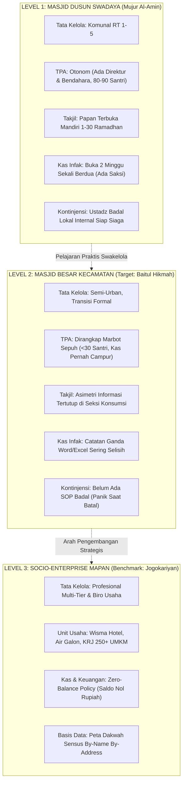

# HASIL WAWANCARA LAPANGAN MASJID PEMBANDING & ANALISIS KOMPARASI TATA KELOLA MSI
## Studi Komparasi Empiris: Masjid Mujur Al-Amin (Karangnongko) vs. Masjid Besar Baitul Hikmah (Klitren)
*Disusun untuk: Tim Proyek Praktik Manajemen Sistem Informasi — Kelompok 1 Kelas F1*  
*Mata Kuliah: Praktik Manajemen Sistem Informasi (PTF60234) — Dosen: Dr. Ratna Wardani, S.Si., M.T.*

---

## 📌 IDENTITAS DOKUMEN & OBJEK STUDI PEMBANDING
* **Nama Objek Pembanding:** Masjid Mujur Al-Amin (TPA Al-Amin)
* **Lokasi Administratif:** Karangnongko (Lingkungan Warga RT 1 – RT 5)
* **Status Tipologi:** Masjid Lingkungan / Dusun Swadaya Warga
* **Tujuan Observasi:** Menggali *empirical village baseline* untuk membandingkan proses bisnis tata kelola tingkat masjid dusun/lingkungan dengan target studi utama (**Masjid Besar Baitul Hikmah**) dan benchmark nasional (**Masjid Jogokariyan**).
* **Waktu Wawancara:** Menjelang agenda kumpulan warga RT (Pukul 19.40 – 20.10 WIB).

---

## 🎙️ BAGIAN 1: Transkrip Harfiah Audio Wawancara Lapangan (Berdasarkan 6 Klaster Payung)

Berikut adalah rekaman percakapan harfiah antara pewawancara mahasiswa dan narasumber pengurus masjid:

### Klaster 1: Legalitas Tanah, Bangunan, & Naungan Pemerintah
* **Pewawancara**: *"Niki ee pertanyaan ee yang pertama tuh ee riwayat status masjid ee mulai tanahnya tuh apakah sudah bersertifikat ee wakaf resmi atau kas desa. Nah, apakah terdaftar resmi di Kemenak ee atau KUA dan apakah operasionalnya ee murni suat su swada warga atau ada bantuan pemerintah."*
* **Narasumber**: *"Untuk masalah wakaf ini kan sementara ini sudah wakaf murni wakaf murni dari Mbah Pairo yang sebelah utara masjid itu waka murni untuk surat-suratnya ini baru diproses belum jadi. Jadi sertifikatnya resmi wakaf murni tapi sertifikatnya belum jadi. Terus untuk biaya pensertifikatan itu alhamdulillah dari warga masyarakat Mas lewat diumumkan kemarin siapa yang mau nyumbang untuk pencertifikatan tanah wakaf gitu. Jadi tidak ada bantuan pemerintah. Mungkin di bantuan pemerintah diproses di sananya mungkin lebih dipermudah mungkin tapi sampai sekarang ini 1 tahun ini belum selesai tuh. Terus tadi ada pertanyaan sudah terdaftar di Kemenak atau itu sementara belum wong sertifikatnya belum jadi. Nah kalau nanti sudah sertifikatnya jadi baru kita daftarkan ke sana bahwasanya Masjid Gubur Alami nanti salah satu terdaftar di Kemenang sementara belum karena memang sertifikatnya belum."*
* **Pewawancara**: *"Iya Pak."*

### Klaster 2: Struktur Takmir, Wewenang, & Regenerasi Pemuda
* **Pewawancara**: *"Untuk pertanyaan yang kedua tuh bagaimana struktur ee kepengurusan takmir ee dibentuk dan dijalankan apakah ada pemilihan berkala dan buku ee ART tertulis tentang ee serta bagaimana pembagian tugas sehari-hari antara pengurus sepuh dan anak-anak pemuda."*
* **Narasumber**: *"Oh, kalau struktur kepengurusannya itu ada masa periodenya itu 5 tahun. Periodenya 5 tahun. Kemarin pemilihannya dipilih oleh warga masyarakat. Jadi dari yang dari RT 1 sampai RT 5 perwakilan perkeluarga perkata. Kemudian untuk job pengemurusan itu sudah ada pos-pos masing-masing kinerjanya masing-masing sudah dirapatkan dan sudah disosialisasikan kepada pengurus-pengurus semuanya. Untuk strukturnya bisa dilihat di masjid sana nanti foto aja, Pak. I itu. Terus masalah kinerjanya, pembagian pos-posnya sudah ada pada waktu kita pertama kali rapat pengurus itu sudah ada job declisinnya masing-masing. Jadi ada sudah ada pilah-pilahnya masing-masing. Ada di situ urusan kepemudaan juga ada. Oh dian pemudaan juga. Juga ada TPA juga sudah ada komplit itu ya."*

### Klaster 3: Pengelolaan Kas, Infaq, & Zakat
* **Pewawancara**: *"Nah, untuk yang selanjutnya itu bagaimana siklus uang kas di masjid ini dikelola mulai dari cara menghitung dan mencatat kota infak Jumat ee apakah dihitung berdua bersama saksi ee lalu tempat menyimpan uang kas fisiknya hingga bagaimana penentuan warga penerima zakat fitrah?"*
* **Narasumber**: *"Waduh sampai zakat fitrah."*
* **Pewawancara**: *"Engghi Pak."*
* **Narasumber**: *"Ya untuk untuk penyaluran infak. Infak itu kan dari jemaah, dari warga infak itu. Nah, untuk membukanya itu ada kotak infak diletakkan harian di situ dibuat di depan pintu itu dan lalu Pak Jumat dibuat kotakan muter itu. Nah, untuk membukanya itu ada saksinya. Bahkan bukan hanya bendahara, ada yang diminta jam itu dibuka setiap 2 minggu sekali. Oh, nanti jadi setiap bulan. Kemudian dilaporkan, ditempelkan di papan penguman itu oleh bendahara. Jadi itu untuk zakat fitrahnya sementara ini ee saya ee sudah ada ee apa ya seksi zakat. Jadi sudah ada zakat, infak, dan sodqah sama sosial. Itu di situ untuk zakat itu ee apa ya dikerjakan oleh panitia sendiri. Kemudian dikumpulkan bapak-bapak RT kumpulkan siapa yang berhak menerima itu penting karena yang berhak menerima itulah yang sangat fundamental. Kalau penzatnya, mengzakinya itu di sini sudah luar biasa, kesadarannya sudah luar biasa. Hanya supaya tidak salah ee ketentuan-ketentuan di agama, maka perlu kerajaan-kajian Pak RT, Pak RT itu dikumpulkan untuk mendata memang yang benar-benar menerima."*

### Klaster 4: Pelayanan Jamaah, Tren Kehadiran, & Manajemen Ustadz
* **Pewawancara**: *"Ee untuk yang selanjutnya itu mengenai jemaah dan Ustaz, Pak. Nah, bagaimana masjid ee menyusun jadwal khatib atau imam serta menangani jika ustaz berhalangan mendadak dan dibandingkan tahun-tahun lalu, apakah jemaah salat fardu di sini cenderung berkurang atau stabil?"*
* **Narasumber**: *"Oke. Untuk jadwal isi misalnya Jumat itu sudah ada ee apa ya? Jalah data khusus Jumat Ping, Jumat tegi dan seterusnya sudah ada didakwa ada. Kemudian di kegiatannya itu juga ada kegiatan-kegiatan di lain Jumat, khotbah Jumat itu ada ustaz dari luar tiap Ahad pagi. Ahad pagi itu kita mendatangkan dari ustaz-ustaz terkenal salah satunya dari Pondok Alfatih, kemudian Pak Haji Sunani dari MUI seperti itu. Ahad pagi misalkan nanti kok berhalangan yang ustaz-ustaz yang sudah didata, di jadwal itu halangan. Kita sudah punya cadangan ada cadangan cadangan cadangan. Nah, cadangan ini dari lokal kita sendiri. Oh, seperti itu. Terus yang kedua tadi apa itu yang..."*
* **Pewawancara**: *"Ee itu jemah salat."*
* **Narasumber**: *"Jamaah. Oh, untuk jemaah alhamdulillah kita itu kemungkinan ya saya tidak anu itu makmurlah kalau di Masjid Bujur Almi makmur. Kita lihat dari salat subuh saja sebagai acuan tuh salat subuh. Salat subuh itu yang laki-laki itu minimal dua sof. Dua sof yang panjang mesti minimal itu bisa lebih sama yang ibu-ibu. Itu kalau saya ibu-ibu juga itu acuan saya itu kalau magrib itu full ngis juga anak-anak dan banyak yang full kalau magrib itu isya juga tiga sof empat sh ya itu belum yang perempuan ngih."*

### Klaster 5: Tata Kelola TPA & Isu Santri
* **Pewawancara**: *"Iya untuk yang selanjutnya itu. Nah ini untuk TPA Pak bagaimana cara mencatat kenaikan jilid IQRA anak-anak ee lalu bagaimana pengelolaan uang kas SPP-nya dan bagaimana tren jumlah santrinya akhir-akhir akhir-akhir ini apa apakah mengalami kenaikan atau penurunan?"*
* **Narasumber**: *"Kalau untuk TPA ini kan memang tak bentuk khusus, Mas. Untuk khusus itu ada kepengurusan sendiri namanya direktur. Ada direkturnya saya terus ada sekretaris direkturnya, bendara direkturnya itu untuk menangani kasus khusus TPA di sini. TPA di sini seperti itu namanya TPA Alamin ya. Itu untuk apa istilahnya? Santrinya itu. Alhamdulillah kita kan awal kemarin 1 Muharam kita madangan kirap untuk menarik supaya santri itu semangat gitu loh ya. Alhamdulillah sekarang semangat sekitar 80-an 90-an santri yang aktif. Heeh. Itu terus tadi untuk masalah apa? SPP ya tadi ya. SPP itu kita tidak narik SPP seperti sekolah umum. Tidak. Kita hanya infak sukaral. Dari orang tua kemarin dikumpulkan wali santrinya dikumpulkan terus punya kesepakatan tiap bulan itu untuk infak. Infak itu tidak pasti ngih. Nah, tidak pasti yo ada yang 5.000 yang punya ada yang Rp10.000 ada yang Rp2.000 tergantung kemarin sepakti pendapatan pada bulan itu. Kalau memang pendapatannya orang tuanya ya enggak infak tidak apa-apa gitu ya gitu. Ada lagiah gitu itu."*

### Intermeso Koordinasi Waktu
* **Pewawancara**: *"Em Masih banyak ya, Pak? 15 lagi."*
* **Narasumber**: *"15 lagi. Kumpulan RT di anu dipi jam piro kui? Jam 8 lewat 10, Pak."*
* **Narasumber**: *"Wah, anu dua pertanyaan lagi."*
* **Pewawancara**: *"Oh."*
* **Narasumber**: *"Besok dilanjut."*

### Klaster 6: Beban Puncak (Qurban & Ramadhan), UMKM, & Sinergi Luar
* **Pewawancara**: *"Ee lalu untuk saat acara besar ee musiman seperti kurban dan Ramadan, bagaimana koordinasi datanya agar tidak kacau seperti pencatatan sahibul kurban, pembagian kupon, keterbukaan jadwal takjil ee serta apa? Apakah ada pedagang UMKM atau hubungan kerja sama dengan ee masjid sekitar?"*
* **Narasumber**: *"Alhamdulillah untuk kegiatan besar seperti hari raya korban itu toh itu alhamdulillah kita luar biasa menurut saya. Saya mengamati yang kemarin kan saya takri yang baru ya ngih itu dari data yang korban sama yang menerima korban itu pendataannya luar biasa. Untuk UMKM tidak ada. Kemudian untuk yang takjil itu kita memang tidak istilahnya biar ee apa ya jemah sendiri yang akan merelakan atau mengikhlaskan untuk takjil itu. Maka kita tidak mendata jadwal dari RT 1 sampai RT 2 warga gak ada ditempelkan kertas kosong dari Ramadan pertama sampai 30 misalkan seperti itu ngisi sendiri-sendiri. Oh jadi ngisi sendiri-sendiri tajil besar atau takjil kecil di situ sudah tertulis kalau tak besar itu makan sambil makan kalau tak kecil hanya snack di situ sudah terpampang di jadwal di situ. Jadi tiap harinya alhamdulillah ada untuk UMKM-nya belum UMKM masyarakat sekitar itu dodol di anu belum belum belum anu malah yang dodol pas waktu ada TPA itu aja oh TPA itu banyak UMKM tapi kebanyakan itu yo yang jualan ojek dan seluruh anak-anak kecil itu. Kemudian apa tadi yang terakhir itu..."*
* **Pewawancara**: *"Ee di sini hubungan kerja sama antar masjid."*
* **Narasumber**: *"Hubungan kerja dengan antar masjid di situ untuk sementara ini untuk korban untuk zakat itu atau apa itu masih kita ee budayakan untuk masyarakat sini aja ya karena masyarakat sini masih membutuhkan untuk jalur yang lain kita belum misal kita memberikan ke masjid yang lain yang membutuhkan belum masyarakat kita masih butuh di sini dia mendapat masukan dari darul masjid yang lain sementara juga belum i Kak itu."*

### Penutup
* **Pewawancara**: *"Untuk yang ini terakhir, Pak. Heeh. Oh, ternyata niku mawon, Pak. Sudah."*
* **Narasumber**: *"Sudah niku mau."*
* **Pewawancara**: *"Sudah cukup."*
* **Narasumber**: *"Oh, ya wis alhamdulillah. Pas berarti wis cukup toh."*
* **Pewawancara**: *"Sudah."*
* **Narasumber**: *"Nah, aku tak kumpulan berarti neh toen ya. Oke, siap. K nomor piro anake masakan nomor piro? Setunggal semester piro saiki? Semester li pak. Semester li mbahe Karang Nongko to? Enggih. Oh, ora neng mbahe Mbah Jung kene. Ano kancane wah jum."*

---

## 📊 BAGIAN 2: Evaluasi Kritis Ketercapaian Parameter MSI

| No | Parameter Klaster | Fakta yang Berhasil Digali | Ketercapaian & Kualitas Data | Celah Informasi yang Terlewat |
|:---:|:---|:---|:---:|:---|
| 1 | **Legalitas & Pemerintah** | • Tanah wakaf dari Mbah Pairo. • Proses sertifikat sudah 1 tahun belum selesai. • Biaya pensertifikatan 100% swadaya warga. • Belum terdaftar ID SIMAS Kemenag. | **90%** (Sangat baik menggambarkan realitas masjid akar rumput) | Belum diketahui tipologi resmi Kemenag (apakah tergolong Masjid Jami' atau Masjid Lingkungan/Dusun). |
| 2 | **Struktur Takmir & Wewenang** | • Masa bakti periode 5 tahun. • Dipilih perwakilan warga RT 1–5 per KK. • Struktur bagan & job description tertulis ada di masjid. | **80%** (Menjelaskan proses meso dengan baik) | Belum tergali apakah ada SK resmi (Kepala Desa/KUA) dan keaktifan harian pemuda dalam sistem administrasi. |
| 3 | **Pengendalian Kas & Zakat** | • **Dual custody terbukti:** Buka kotak infak 2 minggu sekali bersama saksi. • Rekap bulanan ditempel di papan pengumuman. • Rapat RT 1–5 untuk validasi mustahik zakat. | **95%** (Sangat tajam pada prinsip *Internal Control*) | Belum ditanyakan apakah kas disimpan di rekening bank atas nama masjid atau kas fisik bendahara. |
| 4 | **Jamaah & Prosedur Ustadz** | • Jadwal Jumat teratur (Pon, Wage, Kliwon, Legi, Pahing). • **SOP Kontinjensi:** Ustadz cadangan/badal lokal internal siap siaga. • Jamaah makmur (Subuh 2 shaf, Maghrib penuh, Isya 3–4 shaf). | **90%** (Sangat baik membuktikan adanya mitigasi risiko) | Belum ada basis data kependudukan tertulis (by-name by-address). |
| 5 | **Tata Kelola Pendidikan TPA** | • **Entitas Otonom:** Ada Direktur, Sekretaris, & Bendahara TPA terpisah. • Strategi kirab 1 Muharram sukses menarik 80–90 santri. • SPP sukarela musyawarah (Rp 2k–10k). | **85%** (Sangat kuat dalam pemisahan entitas kas TPA) | Belum sempat ditanyakan pencatatan kenaikan jilid Iqra jika kartu hilang dan pelaporan ke BADKO TPA. |
| 6 | **Beban Puncak (Qurban & Takjil)** | • **Papan Terbuka Ramadhan:** Sistem pendaftaran takjil mandiri (self-service) 1–30 hari (takjil besar vs kecil). • UMKM baru sebatas ojek/jajanan santri TPA. • Penyaluran zakat/qurban murni internal. | **90%** (Memberikan bukti solusi informasi tanpa software) | Rincian teknis pembagian kupon qurban belum sempat dijelaskan secara mendalam. |

---

## ⚖️ BAGIAN 3: Spektrum Komparasi Tiga Tingkat (Tri-Level Spectrum)

Hasil wawancara empiris di Karangnongko melahirkan pemetaan komparasi tiga tingkat yang sangat kokoh untuk dianalisis di hadapan Dr. Ratna Wardani, S.Si., M.T.:

### Tabel Komparasi Temuan: Mujur Al-Amin vs. Target Utama Baitul Hikmah

| Aspek Tata Kelola | Masjid Pembanding: Mujur Al-Amin (Dusun) | Target Utama: Baitul Hikmah (Masjid Besar) | Analisis Kritis Perspektif MSI |
|:---|:---|:---|:---|
| **1. Pengelolaan Takjil Ramadhan** | **Papan Terbuka Partisipatif (Self-Service):** Takmir menempel kertas jadwal 1–30 Ramadhan di dinding masjid. Jamaah menulis sendiri menu takjil besar (makan) atau kecil (snack). | **Tertutup & Asimetri Informasi:** Jadwal dipegang seksi konsumsi lewat chat WhatsApp pribadi. Warga mengira sudah penuh sehingga ada tanggal yang kosong makanan. | **Pelajaran MSI:** Solusi asimetri informasi tidak harus berupa aplikasi web/coding. Sistem fisik sederhana berupa papan display terbuka yang dapat diakses publik (*public open dashboard*) terbukti 100% menyelesaikan masalah. |
| **2. Tata Kelola & Otonomi TPA** | **Kepengurusan Terpisah (Otonom):** TPA memiliki Direktur, Sekretaris, dan Bendahara TPA sendiri. Kas SPP sukarela terpisah. Mengadakan kirab 1 Muharram $\rightarrow$ 80–90 santri aktif. | **Sentralistik & Dititipkan Marbot:** TPA dikelola oleh 3 marbot sepuh. Kas TPA pernah tercampur dengan uang pribadi marbot. Santri menyusut drastis di bawah 30 anak. | **Pelajaran MSI:** Kasus penyalahgunaan dana TPA di Baitul Hikmah adalah bukti gagalnya *Segregation of Duties*. Mujur Al-Amin membuktikan pemisahan entitas pembukuan (*fund accounting*) mutlak diperlukan. |
| **3. Pengendalian Kas Infak (Internal Control)** | **Dual Custody Berjalan:** Kotak infak dibuka rutin 2 minggu sekali dengan **saksi** (tidak sendirian). Hasil rekap bulanan ditempel terbuka di papan pengumuman. | **Pencatatan Ganda Tanpa Rekonsiliasi:** Bendahara dan Sekretaris mencatat sendiri-sendiri di buku dan file Word/Excel tanpa prosedur pencocokan formal $\rightarrow$ sering selisih saldo di akhir bulan. | **Pelajaran MSI:** Kelemahan di Baitul Hikmah bukan karena memakai Excel, melainkan karena ketiadaan SOP rekonsiliasi dan *dual control* saat data pertama kali dicatat. |
| **4. Mitigasi Risiko Ustadz Batal** | **SOP Ustadz Badal Lokal:** Takmir sudah menyiapkan daftar ustadz cadangan dari jamaah lokal internal jika penceramah utama luar/Ahad pagi berhalangan hadir. | **Ketiadaan Prosedur Kontinjensi:** Belum ada aturan baku pengganti. Jika ustadz membatalkan mendadak, pengurus panik atau marbot dadakan disuruh membaca kitab hadits. | **Pelajaran MSI:** Sistem informasi wajib memiliki *contingency workflow* (penanganan kondisi eksepsi/kegagalan sistem). |
| **5. Tren Kehadiran Jamaah** | **Makmur & Partisipasi Tinggi:** Subuh minimal 2 shaf panjang laki-laki + shaf ibu-ibu. Maghrib penuh dengan anak-anak. Isya 3–4 shaf. | **Tren Penurunan Jamaah:** Jamaah shalat cenderung sepi, didominasi lansia/pensiunan, dan minim kehadiran generasi muda usia produktif. | **Pelajaran MSI:** Ketiadaan saluran komunikasi modern dan minimnya pelibatan remaja membuat masjid kehilangan daya tarik bagi generasi penerus. |

---

## 🎯 BAGIAN 4: Pertanyaan Penajaman untuk Wawancara Baitul Hikmah Besok

Gunakan hasil wawancara Mujur Al-Amin di atas sebagai bahan pancingan berkelas tinggi (*probing questions*) saat tim Anda mewawancarai Takmir Masjid Besar Baitul Hikmah besok:

1. **Tentang Alur Donasi Takjil:**  
   *"Pak, kemarin kami mengamati di masjid tingkat lingkungan/dusun, mereka menggunakan papan fisik 1–30 Ramadhan di mana warga bisa mendaftar sendiri menu takjil besar dan kecil agar tidak ada tanggal yang kosong. Kalau di Masjid Besar Baitul Hikmah, alur pendaftaran takjilnya seperti apa nggih Pak? Apakah ada jadwal terbuka yang bisa dilihat warga?"*
2. **Tentang Pemisahan Kas & Manajemen TPA:**  
   *"Terkait TPA, apakah pengurus TPA di Baitul Hikmah memiliki struktur bendahara dan buku kas khusus yang terpisah dari kas utama takmir masjid, atau pengelolaannya langsung menyatu di bendahara masjid?"*
3. **Tentang Pengendalian Kotak Infak Jumat:**  
   *"Saat penghitungan kotak infak Jumat, apakah pembukaan kotak dilakukan oleh tim bersama saksi dengan berita acara penghitungan, dan bagaimana rekonsiliasi catatan antara Bendahara dan Sekretaris dilakukan agar saldo tidak selisih?"*
4. **Tentang Prosedur Ustadz Cadangan:**  
   *"Jika ustadz khatib Jumat atau penceramah pengajian berhalangan hadir 1 jam sebelum adzan, siapa ustadz cadangan (badal) yang sudah disiapkan oleh masjid untuk otomatis menggantikan?"*

---

## 💡 BAGIAN 5: Implikasi Desain Sistem Informasi Manajemen (MSI)

Temuan ini membuktikan secara akademis di hadapan Bu Ratna bahwa:
1. **MSI $\neq$ Coding / Aplikasi Semata:** Praktik di Masjid Mujur Al-Amin membuktikan bahwa tata kelola informasi yang baik (papan terbuka takjil, pembukuan kas 2 minggu sekali dengan saksi, dan pemisahan pengurus TPA) bisa berjalan sangat efektif menggunakan media fisik terstandarisasi.
2. **Task-Technology Fit (Goodhue & Thompson, 1995):** Solusi untuk Masjid Besar Baitul Hikmah nantinya tidak boleh memaksakan aplikasi rumit yang membingungkan marbot sepuh, melainkan menata **aturan bisnis (*business rules*)** dan alur informasi terpadu terlebih dahulu, baru kemudian memilih teknologi yang tepat (sistem hibrid).
