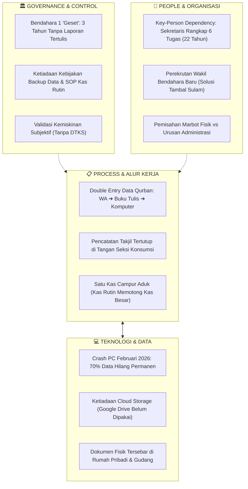

Berikut adalah transkrip audio harfiah (verbatim) tanpa dipersingkat khusus untuk bagian PEMBUKA & PERKENALAN dari rekaman wawancara (Masjidddd.mp3):

PEMBUKA & PERKENALAN
Pewawancara: "Mungkin bisa dijelaskan dari Bapak siapa selaku ee apa ya divisinya di masjid itu apa dan tugas-tugasnya itu sebagai apa?"
Narasumber: "I terima kasih ya. Sebelumnya ucapkan selamat datang Mas Fajar dan Mas Rizki ya. Bismillahirrahmanirrahim. Saya nama Martianto ee jabatan sekretaris Masjid Besar Baitullah dari tahun tahun 2004 hingga saat ini 2026. Jadi tugas pokok ee selain membuat surat-surat pengarsipan serta membuat ee notulan rapat. Kemudian ada tambahan yaitu sebagai seksi dakwah yaitu mencari ustaz atau khatib. Baik ustaz ee Khatib Jumat, terus Ustaz Ramadan maupun khatib salat Idul Adha dan Idul Fitri. Selain itu juga bantu keuangan ee ibu-ibu majelis taklim Jumat sore itu membantu buat undangan sama buat laporan keuangan. Selain itu sama warga atau jemaah kadang diminta buat undang yasinan atau akikah dan sebagainya. Kemudian memasuki di sekitar ee yaitu ee selama ini ee sudah pakai apa digital. Tapi berhubung dari apa kemarin bulan kemarin ee sebelum Ramadan itu kan bulan Februari itu kebetulan komputernya rusak macet, sehingga banyak data-data yang hilang. Kemudian diseruskan di tempat servis itu hanya pulih sekitar 30% lainnya itu sudah enggak bisa di recovery gitu. Jadi kalau masalah yang bersifat manual itu saya harus mencari data. Kalau mendadak ya agak sulit soalnya kan ada di gudang gitu."
Pewawancara: "Iya. Baik."

Apakah Anda ingin kita lanjutkan ke topik berikutnya, yaitu Klaster A: Takmir & Struktur Kepengurusan?
Berikut adalah transkrip audio harfiah (verbatim) tanpa dipersingkat khusus untuk bagian Klaster A: Takmir & Struktur Kepengurusan dari rekaman wawancara (Masjidddd.mp3):

KLASTER A: TAKMIR & STRUKTUR KEPENGURUSAN
Pewawancara: "Nggih. Lanjut ke pertanyaan pertama tentang takmir sendiri dan struktur pengurusan. Jadi mungkin bisa dijawab sedisanya Pak Ardianto sendiri. Ee bisa diceritakan bagaimana kepengurusan takmir di masjid mungkin dari awal. Lalu apakah ada yang memilih misal musyawarah atau voting? Lalu setiap takmir itu adakah periode jabatannya? Lalu pembagian tugas sehari-harinya tuh seperti apa? Misal ee apakah ada pemilihan musyawarah atau ditunjuk atau otomatis secara turun menurun?"
Narasumber: "Ya. Baik. Ee dari ketakmiran itu masa baktinya sekitar kurang lebih 5 tahun. Kemudian anggota dan ketua itu dipilih dari jemaah. Jadi jemaah ee membuat apa itu ee catatan atau apa itu. Nanti siapa yang namanya ditunjuk itu ditulis di depan dan secara jemaah itu mana yang suara terbanyak itu."
Pewawancara: "Oh iya. Lalu untuk masjid sendiri apakah ada surat keterangan resmi dari lurah, KUA, atau DMI atau bagaimana ini untuk ee takmirnya?"
Narasumber: "Untuk legalitas itu, legalitas takmiran itu dulu yang ditujukan Dewan Masjid Indonesia cabang ee Kecamatan Gondokusuman itu yang keluar dari kecamatan..."
Pewawancara: "Lalu untuk, kan Bapak juga menjabat sebagai ee bisa dibilang bendahara/sekretaris, ee itu ada AD/ART-nya itu tertulis nopo sudah digital?"
Narasumber: "Ya dulu ya dua-duanya ada, berhubung tadi komputernya rusak itu banyak data yang hilang. Sudah ada itu di digital..."
Pewawancara: "Digitalnya belum... di komputer?"
Narasumber: "Di komputer, di komputer."
Pewawancara: "Di komputer aja, bukan misal di Google Drive gitu belum?"
Narasumber: "Oh belum. Ya di komputer sama fisik."
Pewawancara: "Fisik ya. Lalu misal pembagian bidangnya itu kan ada di sini ada administrasi, ibadah, sama sarana prasarana. Itu pembagiannya seperti apa? Apakah ada sendiri kayak misal dari administrasi masjid itu menghubungi ke siapa, lalu ada orang yang terkait ibadah seperti apa itu pengajian atau apa, lalu sarana prasarana ditangani satu atau dua orang aja atau ada seksinya?"
Narasumber: "Ada seksinya sendiri... ya sesuai tugas masing-masing seksi itu."
Pewawancara: "Oh... nggih. Oke. Baik. Berarti singkatnya ada nggih?"
Narasumber: "Ada, sampun."
Pewawancara: "Baik. Lalu lanjut untuk misal di kepengurusan takmir itu kan di masjid ada yang tinggal kayak marbot gitu. Itu masuk ke struktur pengurusan takmir atau tidak?"
Narasumber: "Masuk di struktur takmir."
Pewawancara: "Masuk takmir."
Narasumber: "Iya."
Pewawancara: "Untuk apa ya kewajiban-kewajiban marbot sendiri apa saja yang meliputinya?"
Narasumber: "Ya selain mengimami salat lima waktu, juga bersih-bersih masjid terutama hari Jumat sama ngajar TPA."
Pewawancara: "Berarti untuk dari segi ee misal mengurus administrasi itu enggak ya?"
Narasumber: "Oh enggak."
Pewawancara: "Enggak. Oke."

Apakah Anda ingin kita lanjutkan ke topik berikutnya, yaitu Klaster B: Operasional Harian & Tata Kelola Arsip?
Berikut adalah transkrip audio harfiah (verbatim) tanpa dipersingkat khusus untuk bagian Klaster B: Operasional Harian & Tata Kelola Arsip dari rekaman wawancara (Masjidddd.mp3):

KLASTER B: OPERASIONAL HARIAN & TATA KELOLA ARSIP
Pewawancara: "Lalu kita masuk ke pertanyaan topik kedua yaitu operasional harian. Jadi nanti untuk kegiatan sehari-hari masjid niku bagaimana sekretariat mengelola agenda, terus lalu surat masuk keluar, dan dokumen-dokumen penting masjid? Apakah ada sistem penyimpanan khusus atau masih bercampur? Jadi misal kayak surat-surat terkait keuangan, ibadah, dan lain-lain itu sudah didokumentasikan secara terpisah dan detail campur."
Narasumber: "Ee terpisah. Surat-surat masuk, surat keluar, sama keuangan itu terpisah."
Pewawancara: "Apakah ada masalah-masalah terkait persuratan? Kan tadi bilangnya masih belum di apa disimpan di Google Drive. Jadi mungkin ee karena misal ada surat masuk dan keluar misal ada penjatuhan imam itu apakah ada kendala misal lempar-lemparan ke orang ini atau bagaimana atau misal ada perlu satu surat itu mencarinya lama gitu?"
Narasumber: "Nah, selama ini gak ada masalah."
Pewawancara: "Lalu di sini yang menjalankan untuk imam, khatib Jumat, sama pengajian rutin itu disimpan di mana dan apakah ada pengumuman di papan masjid atau di WhatsApp grup?"
Narasumber: "Ee sementara di grup..."
Pewawancara: "Jadi tidak ada di papan masjid?"
Narasumber: "Ee kalau di papan gak ada, hanya masih umum aja itu."
Pewawancara: "Umum aja. Baru kalau dokumen-dokumen yang fisik itu disimpannya di mana?"
Narasumber: "Di di rumah."
Pewawancara: "Di rumahnya Bapak."
Narasumber: "Heeh."
Pewawancara: "Oke. Lalu dari Takmir sendiri apakah ada rapat rutin? Biasanya membahas apa aja di rapat rutin?"
Narasumber: "Ada setiap 3 bulan. Ya, selain program kerja takmir, ee ya nanti menampung saran-saran dari jemaah. Apa yang perlu dikerjakan, apa perlu yang perlu dijalankan."
Pewawancara: "Lalu biasanya ee kalau untuk jadwal-jadwal khatib salat Jumat apakah sudah terd- apa sudah terjadwal?"
Narasumber: "Sudah terjadwal selama setahun."
Pewawancara: "Selama 1 tahun sudah terjadwal."
Narasumber: "Sudah terjadwal."
Pewawancara: "Kalau misalnya ustaznya itu membatalkan jadwal mendadak itu ada gantinya enggak?"
Narasumber: "Ada."
Pewawancara: "Dari mana biasanya?"
Narasumber: "Ya sekitar-sekitar Jogja. Warga sekitar... luar... luar..."
Pewawancara: "Oh, dari luar juga?"
Narasumber: "Luar Jogja, luar... luar kecamatan, luar kemantren."

Apakah Anda ingin kita lanjutkan ke topik berikutnya, yaitu Klaster C: Infaq, Kas Kecil & Kas Besar?
Berikut adalah transkrip audio harfiah (verbatim) tanpa dipersingkat khusus untuk bagian Klaster C: Infaq, Kas Kecil & Kas Besar dari rekaman wawancara (Masjidddd.mp3):

KLASTER C: INFAQ, KAS KECIL & KAS BESAR
Pewawancara: "Untuk topik yang tadi sudah. Lalu masuk ke topik ketiga yaitu keuangan. Di sini ada infak kas kecil dan kas besar. Mengenai keuangan masjid. Di sini bisa Bapak ceritakan bagaimana alur ruang kas dari mulai kota infak lalu dikumpulkan atau diambil dicatat lalu digunakan kembali untuk keperluan masjid itu bagaimana"
Narasumber: "ya selama ini ada tenaga yang menghitung kotak infak mungkin dari Ramadan ada seksinya kemudian dietorkan ke bendara kalau infak Jumat juga sama ada yang menghitung kemudian dian ke bendara mengenai laporan keuangan lah sampai saat ini itu bendaranya agak geset ya. Jadi selama ini belum pernah laporan selama 3 tahun itu"
Pewawancara: "3 tahun tidak pernah laporan."
Narasumber: "Perah laporan hanya lisan saja tidak tertulis"
Pewawancara: "hanya sad segini tapi enggak ada buktian enggak ada."
Narasumber: "enggak ada pencatatan hanya di bendara tapi tidak melaporkan rinciannya itu. Makanya yang tahun ini mulai Agustus kita merekrut wakil bendahara yaitu Bia. Jadi dia ini yang mau mengghandle bendahara satu supaya lancar dalam pelaporan baik pelaporan rutin tahunan maupun ya bulanan. Terutama tiap hari Jumat itu supaya di kan macet cuma agak kurang rajin. Tiap Jumat tu kadang jarang menurunkan menurunkan."
Pewawancara: "Oke. Kalau di masjid sendiri ada istilah kas kecil atau kas besar atau satu kas?"
Narasumber: "Sebenarnya masih satu kas."
Pewawancara: "Satu kas."
Narasumber: "Tapi kalau peringatan Idul Korban apa Idul Adang ada kas kecil."
Pewawancara: "Oh"
Narasumber: "itu operasional"
Pewawancara: "berarti dipisah."
Narasumber: "Dipisah ngih."
Pewawancara: "Lalu biasanya berarti di sini untuk anggaran operasional harian misal listrik kebersihan gitu masuknya langsung ke kas"
Narasumber: "langsung kas besar. Nanti rencana membuat kas kecil kalau sudah tertib laporannya itu"
Pewawancara: "sudah tertib ngih"
Narasumber: "ngih sampai jalan nanti dia kan ahli keuangan namanya kita minta bantuan untuk mwa up bendara satu"
Pewawancara: "i lalu untuk misal nih masjid memerlukan ee pengeluaran uang nah itu tuh apakah langsung diputuskan oleh takmir atau sekretariat atau ada rapat dulu"
Narasumber: "ya kayaknya rapat rapat internal lah yang sering ketemu di masjid kira-kira ya lima apa enam orang ya kita."
Pewawancara: "Lalu uang kas itu disimpan dalam bentuk fisik atau sudah ada rekening?"
Narasumber: "Rekening."
Pewawancara: "Rekening."
Pewawancara: "Apakah masjid sudah melayani infak melalui curis atau donasi?"
Narasumber: "Ya donasi tapi ya lewat itu"
Pewawancara: "rekening tadi."
Narasumber: "He rekening pakai kiris. Oh. Oh. Oh ya, karena tadi tasnya itu belum ada pencatatan, jadi pertanyaan-pertanyaan yang lain mungkin belum bisa terjawab. Langsung masuk ke topik selanjutnya yaitu event besar Idul Fitri sama Idul Adha."

Apakah Anda ingin kita lanjutkan ke topik berikutnya, yaitu Klaster D: Event Besar — Idul Fitri & Idul Adha?
Berikut adalah transkrip audio harfiah (verbatim) tanpa dipersingkat khusus untuk bagian Klaster D: Event Besar — Idul Fitri & Idul Adha dari rekaman wawancara (Masjidddd.mp3):

KLASTER D: EVENT BESAR — IDUL FITRI & IDUL ADHA
Pewawancara: "Jadi di sini saat ada event besar seperti Idul Fitri atau Idul Adha, bagaimana sekretariat dan takmir itu ngatur koordinasi mulai dari pendataan, mungkin dari sebelum Ramadan atau sebelum Idul Adha lalu perizinan terus langsung apa takjil dan lain-lain. Lalu di Idul Adha misal dari sohibul datang lalu penyembelihan lalu perhitungan lalu diantarkan ke sohibul dan warga kembali ya."
Narasumber: "Ya. Ee dari Ramadan itu ee sebelumnya takmir membentuk panitia Ramadan nanti ee nya sesuai seksi masing-masing ee untuk mencari ustaz sementara masih saya sekretarisnya juga hotel IT juga masih saya untuk infak terutama infak tarawih sama subuh itu ada yang menghitung kemudian disetorkan ke bendahara satu. Kemudian kalau qurban ya sebenarnya hampir membentuk panitia korban kemudian ya menjalankan seksinya masing-masing. Ini kan kebetulan ada iuran sapi patungan."
Pewawancara: "Oh iya."
Narasumber: "Jadi per A kalau cash ya 3,5 juta. Kalau apa itu dicicil ya itu 350 per bulan. Kebetulan yang terakhir Rp500.000 kemudian genap 3,5 juta. Uang itu disetorkan ke bendahara pertama tadi itu. Kemudian dibelikan ee hewan korban lembu. Nanti yang mencari lembu itu nanti tim kira-kira empat orang yang mencari hewan korban itu. Tahun kemarin carinya di sekitar Klaten. Oh, barat Klaten."
Pewawancara: "Ini di Idul Fitri kan ada salat Id dan salat Id kan biasanya di Superindo. Nah, itu untuk perizinan khususnya bagaimana?"
Narasumber: "Ya sebelum pelaksanaan salat Id itu kita minta perizinan terutama ee kelurahan terus kemantren, Koramil, Polsek. Ya Kelurahan, Kemantren. El bos."
Pewawancara: "Lalu ee untuk takjil sendiri kan itu ada donatur takjil 30 hari. Itu pencatatannya itu gimana? Apakah terbuka transparan ke jemaah? Lalu apakah ada kendala-kendala dalam takjil selama Ramadan itu mengingat prosesnya dia sangat berat dan butuh keuangan yang panjang untuk jemaah yang sebanyak itu."
Narasumber: "Ee Jadi untuk takjil itu dari panitia mengedarkan edaran untuk buka bersama jemaah. Jumlahnya kurang lebih jemaah itu 200 orang. Kemudian juga ini jumlahnya nasi bungkus juga 200 bungkus. Nah, itu dipikul 4 orang. Ini per orang 50 bungkus. Ya selama 1 bulan untuk minuman teh panas itu per hari tiga tiga jumbo. Dipikul tiga orang selama Ramadan. Jadi per orang satu jumbo tiga orang."
Pewawancara: "Lalu apakah sistemnya itu boleh mengisi sendiri atau digilir?"
Narasumber: "Mengisi juga boleh, tapi harus koordinasi dengan ee panitia takjil ini supaya tidak bentrok dengan harinya hari yang lain."
Pewawancara: "Kalau pas satu hari ternyata ada yang kosong itu masjid backup-nya seperti apa?"
Narasumber: "Ee misalnya kalau dari jemaah enggak ada backup dari takmir, dari kas takmir. Kas takmir kok saya lihat memang kosong-kosong benar untuk kas takmir tapi selama ini alhamdulillah."
Pewawancara: "Lalu untuk Idul Korban sendiri, untuk sohibul kurban itu yang dicatat apa aja? Misal ada sohibul korban datang, lalu ee apakah hanya apakah dicatat nama, nomor telepon atau termasuk data wilayah seperti ee alamat RT RW? Lalu kan itu perlu untuk data pengiriman sohib. Berarti lengkap ya selain alamat korban, nomor telepon korban juga jumlah jatahnya dapat berapa kilo itu tercatat nanti ada tim yang mengantarkan ke alamat si korban tapi sementara ini untuk pencatatan itu masih secara manual."
Narasumber: "Ya manual tapi kan masuk di komputer itu."
Pewawancara: "Untuk misal ada ada orang yang ingin mendaftar kurban di masjid itu ada formulir khusus online atau langsung daftar langsung datang ke masjid atau ada WA?"
Narasumber: "Langsung WA takmir. Biasanya WA takmir biasanya menghubungi saya, saya mau berkurban apa ini saya catat termasuk ya nanti biayanya berapa biaya penyembelihan dan sebagainya."
Pewawancara: "Lalu sistem distribusi dagingnya itu itu seperti apa? Ee nanti apa itu namanya? Apakah menggunakan nomor seri atau cuman kertas kupon? Nah, itu apakah pernah ada kupon yang dobel atau tidak terbagi? Misal ada satu warga yang terlewat gitu, pernah?"
Narasumber: "Ee dulu pernah ada yang terlewat, tapi kita tiap tahun selalu apa ya update."
Pewawancara: "Update ya."
Narasumber: "Kekurangannya apa gitu nggih."
Pewawancara: "Untuk pembagian daging sendiri dari wilayah RW sendiri atau dari luar juga dibagi?"
Narasumber: "Dari luar juga dikasih apa apalagi ada yang ada permohonan permintaan kita lihat, kita seleksi kalau memungkinkan ya kita kasih. Nah, kemarin tuh ya dikasih tiga: Gunung Kidul, Bantul sama Madania. Itu Gedongkuning tiga itu panti asuhan."
Pewawancara: "Lalu untuk pembagian keluarga sendiri itu dihitung per KK atau per jumlah orang?"
Narasumber: "Ya, per jiwa."
Pewawancara: "Per jiwa."
Narasumber: "Iya. Jatahnya berapa. Nah, ada standar pembagiannya."
Pewawancara: "Berarti ada surat apa? Ada kupon semacam keterangan kupon itu jumlah jiwa berapa?"
Pewawancara: "Lalu untuk pemutusan dari perhitungan misal ee kan jumlah sapi dan jumlah kambing per tahun kan beda-beda. Nah, itu nanti pemutus untuk pembagiannya biar adil per jiwa itu seperti apa?"
Narasumber: "Ya, dari jumlah jiwa itu. Jadi, jumlah jiwa menentukan besar kecilnya jatah itu tadi, jatah hewan korban itu makin banyak jiwanya juga makin banyak pemberian ya pembagiannya."

🤝 Apakah ingin kita lanjutkan ke bagian berikutnya, yaitu Klaster E: Hubungan Eksternal (RT, RW, Kelurahan, Kemenag, KUA, DMI & Pihak Luar)?
Berikut adalah transkrip audio harfiah (verbatim) tanpa dipersingkat khusus untuk bagian Klaster E: Hubungan Eksternal (RT, RW, Kelurahan, Kemenag, KUA, DMI & Pihak Luar) serta bagian PENUTUP dari rekaman wawancara (Masjidddd.mp3):

KLASTER E: HUBUNGAN EKSTERNAL (RT, RW, KELURAHAN, KEMENAG, KUA, DMI & PIHAK LUAR)
Pewawancara: "Lalu sisa satu topik lagi ya. Sisa satu lagi itu hubungan eksternal dari masjid seperti RT, RW, Kelurahan, Kemenang, KUA, BAZNAS dan lain-lain. Lalu dari masjid sendiri dari yang saya sebutkan tadi RT RW, Kelurahan, Kemenak dan lain-lain bisa diceritakan ee hubungannya itu seperti apa. Apakah ada laporan terkhusus? Misal masjid harus melaporkan tertentu setiap waktu tertentu ke RW, ke Kecamatan atau ke Kemenak misalnya seperti itu."
Narasumber: "Kalau ke RT RW itu biasanya hanya melaporkan itu tadi ee masalah korban tadi pembagian dan bantu RT RW kita kasih laporan."
Pewawancara: "Kalau ke kelurahan..."
Narasumber: "apa? Kemantren itu hanya kita ee hanya permohonan aja atau permohonan minta bantuan atau apa itu bantuan... itu RT RW Kelurahan Kemantren juga seperti permohonan mohon bantuan ke Kemenak atau Gundur itu lewat itu selain AKM juga RT RW Kelurahan Kecamatan permohonan khusus."
Pewawancara: "Berarti berarti untuk ee masjid sendiri tidak melaporkan seperti misal audit tahunan atau bulanan ke... tidak?"
Narasumber: "Mereka tidak meminta..."
Pewawancara: "tidak... tidak ada permintaan."
Narasumber: "Enggak ada enggak ada. Hanya intern jemaah."
Pewawancara: "Misalkan masjid kan ee kadang dipakai sama KUA kan. Nah, atau TK juga. Nah, itu perizinannya seperti apa?"
Narasumber: "ya? Hanya surat permohonan aja."
Pewawancara: "Surat permohonan aja."
Narasumber: "Yang sering makai itu KUA untuk acara nikah."
Pewawancara: "Iya. Seperti itu... pembedaan itu... jadi setiap acara niku KUA memberikan surat..."
Narasumber: "surat permohonan pinjam tempat."
Pewawancara: "untuk... kan tadi RT RW meminta untuk data korban. Nah, itu apakah jemaah dari Masjid Baitul Hikmah sendiri itu juga didata misal jemaah lalu apa itu namanya ee meminta data dari RT RW atau kelurahan jemaah yang sering salat atau berkegiatan di masjid?"
Narasumber: "Ee kalau jemaah enggak pernah minta kadang hanya lihat laporan itu sudah sudah cukup gitu. sama itu banyak..."
Pewawancara: "misal untuk kayak ee apa ya prioritas dari warga yang kurang mampu itu biasanya mendapat bantuan dari masjid misal untuk prioritas untuk zakat misalnya. Nah, itu kan ee datanya update. Nah, itu minta dari RT RW atau kelurahan atau ada tim sendiri untuk mencatat?"
Narasumber: "Ya, ada tim sendiri yang ya dari warga. Warga kan terutama ya sudah paham dengan banyak mana yang kurang mampu atau yang perlu dibantu itu sudah sudah tahu lah pada paham. Oke ada."
Pewawancara: "Lalu saya lihat ee masjidnya sudah tercatat di sistem informasi masjid Kemenak."
Narasumber: "Sudah Kemenak sudah..."
Pewawancara: "itu apakah Kemenak minta data update kan di situ kemarin dicatat ada takmirnya berapa terus remaja Masnya berapa? Lalu apakah Kemenak mau minta update?"
Narasumber: "Update tapi lewat KUA biasanya."
Pewawancara: "Update-nya lewat KUA?"
Narasumber: "Heeh. KUA meminta nanti KUA silakan ke... ngirim ke itu Kemenak... ya. Kayak salat Id itu KUA minta data itu jumlahnya berapa."
Pewawancara: "Oh ya berarti untuk datanya sendiri nanti dari masjid mengirim ke KUA."
Narasumber: "Heeh."
Pewawancara: "Dari KUA mengirim ke..."
Narasumber: "Iya."
Pewawancara: "Pernah ada kendala enggak? Misal pas KUA minta data, lalu karena tadi misal pencatatannya ternyata ada masalah, nah itu ee misal masjid belum bisa memberikan laporan ke KUA gitu..."
Narasumber: "ya. Alhamdulillah selama ini lancar enggak ada kendala."
Pewawancara: "biasanya ee yang menyusun laporan untuk ke KUA dan Kemenak Bapak sendirian meliputi tadi ngih setiap acara Ramadan terus Idul Fitri, Idul Adha."
Narasumber: "Heeh."
Pewawancara: "Untuk data misal kayak... data korban... data korban."
Pewawancara: "Kalau untuk proses misal ee keuangan atau acara-acara seperti dan lain-lain itu memberikan data ke KUA untuk ke Kemenak mboten?"
Narasumber: "enggak? Hanya ke KUA saja... saja. nanti KUA ngirim ke Kemenak."
Pewawancara: "Oke. Apakah Masjid ee menerima bantuan dari APBD Kemenak atau program pemerintah lainnya? Lalu prosedurnya itu seperti apa? Apakah masjid meminta dulu atau dari atas langsung turun ke bawah?"
Narasumber: "Ee kita ajukan itu ke Baznas apa..."
Pewawancara: "Lalu apakah masjid sendiri ada kerja sama dengan pihak eksternal? Misal seperti UMKM atau ee masjid sendiri kan misal ada kegiatan seperti takjil untuk Ramadan atau hewan kurban atau misal operasional-operasional kecil seperti snack dan air minum itu apakah ada apa ya kerja sama dari masjid sendiri?"
Narasumber: "Kalau dari masjid-masjid sendiri ada kita kerja sama dengan Superindo karena kita butuh untuk beli apa minum atau konsumsi itu buka puasa Superindo."
Pewawancara: "benefitnya dari kerja sama niku..."
Narasumber: "ya selain kita pinjam tempat salat ya... salat Id ini juga minta bantuan konsumsi... terutama ya di Ramadan itu Ramadan kadang-kadang ngasih kurma untuk buka puasa."

PERTANYAAN PENUTUP & PENYELESAIAN
Pewawancara: "Baik dari mungkin dari pertanyaannya ee yang topik tadi itu. Lalu ini pertanyaan ringkas aja dari Bapak sendiri selaku sekretariat yang sudah menjabat kurang lebih tadi 20 tahun lebih nggih... kan Bapak sendiri pasti menjumpai hal-hal yang mungkin berkesulitan. Nah, itu sekiranya ee nanti di... ada suatu sistem yang digital yang lebih digital yang menghindari masalah-masalah tadi seperti ee apa itu namanya data hilang dan lain itu apakah mempermudah atau sebenarnya malah ee perlu pembiasaan?"
Narasumber: "ya sebenarnya kita juga perlu itu nyimpen Drive atau apa itu supaya tidak terjadi kemarin itu."
Pewawancara: "Sementara niku mawon sudah cukup pertanyaannya kami... dari saya Fajar dan rekan saya Mas Rizki mengucapkan banyak terima kasih kepada Bapak Mardianto. Mungkin nanti kalau misalnya ada pertanyaan yang mungkin lebih lanjut mungkin saya tanyakan ke WA. Jadi mungkin bisa dijawab lewat WA."
Narasumber: "Oh ya."
Pewawancara: "Oke. Pertanyaan-pertanyaan seperti ini sudah cukup. Nanti untuk yang TPA mungkin saya bisa tanya ke Mas Jefri."
Narasumber: "Iya. Dia kan direktur TPA... Mas Jefri direktur TPA."
Pewawancara: "Oh. Walaupun Mas Jefri tidak di sini tapi dia masih direktur?"
Narasumber: "masih... masih aktif ngajar TPA juga. Kalau sore itu 1 minggu tiga kali."
Pewawancara: "Oh, ini untuk TPA saya kirim apa ya... saya konfirmasi ke Mas Jefri lagi. Berhubung nanti mungkin sekiranya Pak Nanang masih belum bisa menjawab nanti saya koordinasi ke Bapak Mardianto sendiri. Mungkin mawon saya terima kasih ke Bapak... minum dulu ya."
Narasumber: "Minum-minum dulu. Boleh. Difoto..."
---

# BAGIAN II: TABEL TEMUAN EMPIRIS & ANALISIS TATA KELOLA INFORMASI (MSI)

> **Catatan Status Data Khusus:**
> 1. **Data TPA (Pendidikan Santri):** Belum tercakup di dalam tabel ini karena wawancara khusus mengenai TPA akan dilakukan terpisah bersama **Mas Jefri (Direktur TPA)** yang mengajar aktif 3× seminggu di sore hari.
> 2. **Benchmark Masjid Besar (Nurul Ashri):** Menunggu pelaksanaan jadwal observasi pembanding.

| No | Klaster Tata Kelola | Fakta Lapangan (Empiris Verbatim) | Analisis Kritis MSI (Konsep & Dampak Tata Kelola) |
|:--:|:---|:---|:---|
| **1** | **Profil & Ketergantungan Figur (*Key-Person Dependency*)** | • Bpk. Mardianto menjabat sekretaris sejak tahun 2004 (22 tahun berturut-turut).<br>• Merangkap berbagai fungsi krusial: surat-menyurat, notulensi rapat, seksi dakwah (mencari seluruh ustadz/khatib Jumat, Ramadhan, Shalat Ied), membantu pembukuan keuangan majelis taklim ibu-ibu, pembuat surat undangan warga, PIC pendaftaran qurban via WA, dan operator IT. | **Risiko *Single Point of Failure* (SPOF) Ekstrem:** Terjadi konsentrasi beban kerja dan informasi (*knowledge silo*) pada satu orang. Apabila beliau berhalangan, alur administrasi, jadwal khatib, dan koordinasi qurban terancam terhenti karena tidak ada dokumentasi prosedur baku antar-pengurus. |
| **2** | **Insiden Kehilangan Data (*Disaster Recovery Failure*)** | • Februari 2026 komputer sekretariat macet/rusak total menjelang Ramadhan.<br>• Biaya servis hanya berhasil me-*recovery* sekitar 30% data; **70% data hilang permanen**.<br>• Belum menggunakan cloud storage (Google Drive).<br>• Berkas AD/ART digital ikut hilang.<br>• Berkas fisik tersimpan terpisah di rumah pribadi sekretaris dan sebagian di gudang masjid (sulit dicari jika mendadak). | **Ketiadaan *Business Continuity Plan* (BCP) & Redudansi Data:** Konsep digitalisasi takmir masih berupa *komputerisasi lokal offline* tanpa kebijakan pencadangan (*backup policy* 3-2-1). Penyimpanan dokumen resmi di kediaman pribadi melanggar prinsip sentralisasi tata kelola arsip organisasi. |
| **3** | **Pengendalian Kas Internal (*Internal Control & Fraud Risk*)** | • Kotak infak Jumat dihitung per seksi lalu disetor ke Bendahara 1.<br>• **Temuan Kritis:** Bendahara 1 berkinerja lambat ("geset") dan **selama 3 TAHUN TIDAK PERNAH membuat laporan tertulis** (hanya lisan tanpa rincian/bukti pembukuan).<br>• Tidak ada laporan keuangan rutin mingguan/Jumat yang dibagikan atau ditempel ke jamaah.<br>• Tindakan takmir: Merekrut Wakil Bendahara baru (Bia, per Agustus 2026) untuk mem-*backup*. | **Pelanggaran Berat Akuntabilitas Publik & *Segregation of Duties*:** Tidak adanya *audit trail* selama 3 tahun memicu asimetri informasi akut antara pengurus dan jamaah. Perekrutan wakil bendahara baru menyelesaikan aspek SDM (*people*), namun belum membenahi SOP dan sistem pelaporan otomatis (*process & technology*). |
| **4** | **Arsitektur Kas (Kas Besar vs Kas Kecil)** | • Hanya ada 1 kas besar (operasional, listrik, kebersihan langsung memotong kas besar).<br>• Kas kecil hanya dibuat temporer saat peringatan Idul Adha/Qurban.<br>• Pengeluaran kas diputuskan melalui rapat internal 5–6 pengurus yang sering bertemu di masjid.<br>• Sudah memiliki rekening bank atas nama masjid dan QRIS infak digital. | **Inefisiensi Alur Keputusan Operasional:** Belum ada *petty cash system* mandiri dengan batas pagu tetap untuk pengeluaran rutin harian. Adopsi QRIS belum diimbangi dengan prosedur rekonsiliasi berkala antara riwayat transaksi digital dan buku kas fisik. |
| **5** | **Manajemen Beban Puncak (Ramadhan & Takjil)** | • Kebutuhan 200 bungkus takjil/hari digilir ke donatur (4 orang per hari @50 bungkus) + 3 jumbo teh panas.<br>• Jamaah boleh mengisi slot takjil sendiri, tetapi harus koordinasi manual dengan panitia agar tidak bentrok.<br>• Jika ada slot kosong, ditalangi oleh kas takmir (meskipun kas takmir diakui sering kosong). | **Asimetri Informasi & Alur Tertutup:** Tidak ada papan kendali terbuka/kalender digital yang menampilkan tanggal-tanggal takjil yang masih kosong. Akibatnya, jamaah mengira kuota selalu penuh dan masjid menanggung beban talangan saat ada hari yang kosong. |
| **6** | **Manajemen Qurban (Peak-Load Idul Adha)** | • Sapi patungan Rp 3,5 jt/orang (cash atau tabungan Rp 350rb/bln).<br>• Pendaftaran via pesan WhatsApp langsung ke Sekretaris, dicatat manual di kertas, baru diketik ke komputer.<br>• Kupon dan jatah daging dibagikan dengan standar **per jiwa** (bukan per KK).<br>• Evaluasi: Pernah ada warga yang terlewat; distribusi daging juga mencakup permohonan luar kota (Bantul, Gunungkidul, panti asuhan). | **Redundansi Alur Entri Data (*Double Handling*):** Alur data tiga lapis (WA ➔ Buku Kertas ➔ Komputer) rawan kesalahan ketik (*human error*). Alokasi kupon per jiwa menuntut akurasi master data jumlah anggota keluarga secara dinamis agar tidak terjadi defisit daging saat hari-H. |
| **7** | **Hubungan Eksternal & Keterhubungan Regulasi** | • Ke RT/RW: Laporan pembagian hewan qurban (tidak ada laporan keuangan berkala).<br>• Ke Kelurahan/Kecamatan: Surat permohonan izin (Shalat Ied di Superindo) dan proposal permohonan bantuan.<br>• Ke Kemenag/KUA: Terdaftar di SIMAS; pembaharuan data berkala disalurkan lewat KUA Gondokusuman.<br>• KUA rutin meminjam aula masjid untuk pernikahan via surat resmi.<br>• Kriteria Mustahik: Tidak menggunakan DTKS formal kelurahan, mengandalkan pengamatan warga setempat. | **Data Silo Antar-Lembaga:** Hubungan dengan instansi pemerintah bersifat reaktif-administratif (izin dan pinjam tempat), belum pada level pertukaran data strategis. Penentuan mustahik tanpa DTKS berisiko memunculkan bias kedekatan (*favoritism*) dan melewatkan kelompok rentan baru/pendatang. |
| **8** | **Kemitraan Swasta (CSR Superindo Klitren)** | • Kerja sama dengan Superindo Klitren: Izin pinjam area parkir untuk Shalat Ied, bantuan kurma & konsumsi Ramadhan, serta pembelian logistik buka bersama. | **Aset Kolaborasi Strategis:** Bentuk kemitraan mutualisme antara institusi keagamaan dan sektor retail modern yang sangat potensial dikembangkan dalam tata kelola CSR formal berbasis MoU. |

---

# BAGIAN III: ANALISIS SPEKTRUM MASALAH TATA KELOLA INFORMASI



---

### 1. Spektrum Tingkatan Keputusan (Hierarki Anthony)

1. **Level Strategis (Ketua Takmir & Dewan Syuro):**
   * **Masalah:** Mengambil keputusan tanpa dukungan data akurat. Karena selama 3 tahun bendahara tidak menerbitkan laporan kas tertulis, arah kebijakan pembangunan dan program dakwah hanya didasarkan pada asumsi perkiraan saldo lisan.
   * **Dampak:** Kerentanan legalitas dan hilangnya kepercayaan muzaki/donatur besar. Berkas AD/ART digital yang hilang akibat rusaknya PC melemahkan landasan konstitusi takmir.

2. **Level Manajerial (Sekretaris, Bendahara, Koordinator Seksi):**
   * **Masalah:** Beban koordinasi menumpuk (*bottleneck*) pada sekretaris (jadwal ustadz, perizinan, qurban, IT). 
   * **Dampak:** Tidak adanya pemisahan *kas kecil* (operasional) membuat pengeluaran rutin harus menunggu rapat internal pengurus inti; rekonsiliasi dana QRIS dan infak kotak Jumat tidak termonitor secara periodik.

3. **Level Operasional (Marbot, Relawan, Panitia Lapangan):**
   * **Masalah:** Proses administrasi berulang dan rentan keliru. Pendaftaran qurban dilakukan via WA ➔ ditulis di buku ➔ diketik di PC.
   * **Dampak:** Berkas fisik tercecer di gudang atau rumah pengurus; informasi takjil tertutup memicu pembengkakan talangan kas saat slot donatur kosong.

---

### 2. Spektrum Kerapuhan Sosio-Teknis (Vulnerability Spectrum)

* **🔴 Tingkat Risiko Tinggi (Critical Risk — Mengancam Akuntabilitas Organisasi):**
  1. **Kelalaian Laporan Keuangan 3 Tahun berturut-turut:** Menunjukkan ketiadaan mekanisme kontrol internal dan ketiadaan *audit trail* yang sah.
  2. **Kehilangan 70% Data Master Tanpa Backup:** Mengindikasikan organisasi sama sekali tidak memiliki mitigasi bencana (*Disaster Recovery Plan*).

* **🟡 Tingkat Risiko Sedang (Medium Risk — Inefisiensi & Hambatan Layanan):**
  1. **Ketergantungan Figur (Key-Person Risk):** Terpusatnya seluruh urusan harian pada Bpk. Mardianto tanpa adanya transfer pengetahuan kepada pengurus muda.
  2. **Data Kemiskinan Silo:** Penentuan mustahik tanpa integrasi DTKS Kelurahan Klitren berpotensi memunculkan ketidaktepatan sasaran bagi warga rentan baru/pendatang.

* **🟢 Potensi & Keunggulan Positif (Strengths to Leverage):**
  1. Takmir telah memiliki rekening bank resmi dan kanal QRIS.
  2. Kemitraan eksternal yang sangat baik dengan instansi wilayah (Koramil, Polsek, Kemantren, KUA) dan CSR Superindo.
  3. Sikap terbuka pengurus untuk mengadopsi penyimpanan cloud (*Google Drive*) dan kesadaran merekrut tenaga akuntansi (Wakil Bendahara) untuk perbaikan tata kelola.

---

# BAGIAN IV: ANALISIS TATA KELOLA ATAS-KE-BAWAH (TOP-DOWN REGULATORY HIERARCHY)
### Evaluasi Keselarasan Regulasi Resmi Pemerintah & Skala Tipologi "Masjid Besar"

Dalam standar pembinaan Kementerian Agama RI, **Masjid Besar Baitul Hikmah** menyandang tipologi formal sebagai **Masjid Besar (Tingkat Kecamatan/Kemantren Gondokusuman)**. Berdasarkan regulasi negara, tipologi ini membawa konsekuensi tata kelola informasi dan tanggung jawab manajerial yang jauh lebih tinggi daripada masjid lingkungan (Masjid Jami' / Masjid RT).

```mermaid
flowchart TD
    subgraph MAKRO["🏛️ TINGKAT MAKRO / NASIONAL"]
        KEMENAG["Kementerian Agama RI & Bimas Islam\n(Kepdirjen DJ.II/802/2014 & SIMAS)"]
        BAZNAS_PUSAT["BAZNAS RI\n(UU No. 23/2011 & SIMBA)"]
        BWI["Badan Wakaf Indonesia (BWI)\n(UU No. 41/2004)"]
    end

    subgraph MESO_KOTA["🏢 TINGKAT KOTA / KABUPATEN & KECAMATAN"]
        KEMENAG_KOTA["Kemenag Kota Yogyakarta"]
        KUA["KUA Kemantren Gondokusuman\n(PPAIW & Pembina Idarah-Imarah-Ri'ayah)"]
        DMI["Dewan Masjid Indonesia (DMI) Gondokusuman\n(Penerbit SK Takmir)"]
        KEMANTREN["Kemantren Gondokusuman\n(Pamong Praja & Trantib)"]
        BAZNAS_KOTA["BAZNAS Kota Yogyakarta"]
    end

    subgraph MIKRO_MASJID["🕌 TINGKAT OPERASIONAL (TARGET STUDI)"]
        BAITUL["Masjid Besar Baitul Hikmah\n(Klitren, Gondokusuman)"]
    end

    subgraph BASIS_WARGA["🏘️ LINGKUNGAN MASYARAKAT & SWASTA"]
        KELURAHAN["Kelurahan Klitren\n(Data DTKS / Kemiskinan)"]
        RT_RW["Pengurus RW & RT 01-05"]
        SUPERINDO["Mitra Swasta: Superindo Klitren"]
        JAMAAN["Jamaah, Santri, & Mustahik"]
    end

    KEMENAG -->|Standar Manajemen & ID SIMAS| KUA
    BAZNAS_PUSAT -->|Regulasi UPZ & SIMBA| BAZNAS_KOTA
    KUA -->|Registrasi SIMAS & Pengawasan Nikah| BAITUL
    DMI -->|Surat Keputusan (SK) Takmir| BAITUL
    KEMANTREN -->|Izin Keramaian Shalat Ied| BAITUL
    BAZNAS_KOTA -.->|Proposal Bantuan Insidental| BAITUL
    BAITUL -->|Laporan Qurban| RT_RW
    BAITUL -->|Izin Penggunaan Halaman Parkir| SUPERINDO
    KELURAHAN -.->|Data DTKS Terputus (Tidak Terintegrasi)| BAITUL
    BAITUL -->|Layanan Ibadah & Sosial| JAMAAN
```

---

### TABEL MATRIKS HIERARKI REGULASI VS FAKTA LAPANGAN BAITUL HIKMAH

| Tingkatan Regulasi | Otoritas / Lembaga | Dasar Hukum & Aturan Resmi | Standar Normatif Tipologi "Masjid Besar" | Fakta Empiris Masjid Baitul Hikmah (Hasil Wawancara) | Evaluasi Kesenjangan (*Gap Analysis*) & Isu MSI |
|:---|:---|:---|:---|:---|:---|
| **1. Nasional / Makro (Kemenag RI)** | Kementerian Agama RI (Ditjen Bimas Islam) | • **Keputusan Dirjen Bimas Islam No. DJ.II/802 Tahun 2014** tentang Standar Pembinaan Manajemen Masjid.<br>• Sistem Informasi Masjid (**SIMAS** Kemenag). | • Menjadi **pusat rujukan dan pembina** masjid-masjid jami' di satu kecamatan.<br>• Standar tata kelola 3 bidang formal: **Idarah** (organisasi/administrasi), **Imarah** (kemakmuran ibadah), dan **Ri'ayah** (sarpras & fisik).<br>• Profil terdaftar dan terverifikasi di SIMAS nasional secara dinamis. | • Masjid sudah terdaftar resmi di SIMAS Kemenag.<br>• Pembagian bidang (Idarah/Imarah/Ri'ayah) secara struktur ada, namun beban idarah bertumpu pada satu figur sekretaris.<br>• **Belum menjalankan fungsi pembinaan** terhadap masjid-masjid lain di wilayah Gondokusuman. | **Kesenjangan Skala Peran:** Masjid Besar Baitul Hikmah secara de jure berstatus Masjid Besar tingkat kecamatan, namun secara de facto masih beroperasi sebagai **masjid jami' lingkungan lokal** (fokus urusan internal jamaah sendiri). |
| **2. Meso-Kecamatan (KUA & Kepenghuluan)** | Kantor Urusan Agama (KUA) Kemantren Gondokusuman | • **PMA No. 34 Tahun 2016** tentang Organisasi dan Tata Kerja KUA.<br>• KUA sebagai PPAIW (Pejabat Pembuat Akta Ikrar Wakaf).<br>• Koordinasi Bimbingan Perkawinan (Bimwin) & Hisab Rukyat. | • Sinkronisasi jadwal layanan nikah & peribadatan.<br>• Pengiriman update berkala data keagamaan (jamaah shalat Ied, data hewan qurban, data takmir) dari KUA ke Kemenag Kota.<br>• KUA sebagai supervisor perwakafan dan arah kiblat. | • Hubungan berjalan harmonis dan rutin.<br>• KUA sering meminjam aula masjid untuk prosesi akad nikah dengan surat permohonan resmi.<br>• Update data SIMAS disalurkan masjid lewat KUA secara lancar (misal data salat Id & jumlah takmir). | **Arsip Transaksional Manual:** Koordinasi peminjaman aula KUA masih berbasis surat kertas lepas. Belum ada kalender ruang (*shared resource calendar*) terintegrasi yang mencegah bentrok jadwal antara akad nikah KUA dan kegiatan majelis taklim masjid. |
| **3. Tata Kelola Keorganisasian (DMI)** | Dewan Masjid Indonesia (DMI) Cabang Gondokusuman | • **AD/ART Dewan Masjid Indonesia**.<br>• Standar Pembukuan Akuntansi Masjid & Pengesahan Takmir. | • Masa bakti kepengurusan takmir 3–5 tahun yang disahkan lewat **Surat Keputusan (SK)** DMI/KUA.<br>• Pembinaan periodik akuntabilitas keuangan takmir dan transparansi kotak infak. | • Legalitas takmir resmi memegang SK dari DMI Cabang Kecamatan Gondokusuman dengan masa bakti 5 tahun.<br>• Pemilihan melalui musyawarah terbuka jamaah (sistem suara terbanyak).<br>• **DMI tidak melakukan supervisi/audit** saat laporan keuangan bendahara macet 3 tahun. | **Ketiadaan Pengawasan Eksternal (*External Governance Void*):** SK dari DMI hanya berfungsi sebagai legitimasi formal administratif di awal periode, tanpa mekanisme audit atau evaluasi berkala terhadap kepatuhan tata kelola kas masjid. |
| **4. Pemerintahan Wilayah (Kemantren & Kelurahan)** | Kemantren Gondokusuman & Kelurahan Klitren | • **SKB 2 Menteri No. 9 & 8 Tahun 2006** (Pedoman Pemeliharaan Kerukunan Umat Beragama).<br>• Regulasi Ketertiban Umum & Izin Keramaian Publik.<br>• Instruksi Walikota Yogyakarta tentang Penanggulangan Kemiskinan. | • Perizinan penggunaan fasilitas publik untuk ibadah massa (Shalat Ied di luar gedung).<br>• Sinergi penyaluran bantuan sosial mustahik berbasis **Data Terpadu Kesejahteraan Sosial (DTKS)** Kelurahan. | • Perizinan Shalat Ied di area Superindo Klitren berjalan sangat tertib (melibatkan Kelurahan, Kemantren, Koramil, Polsek).<br>• **Data Mustahik Menolak DTKS:** Takmir tidak meminta dan tidak menggunakan data DTKS kelurahan untuk menentukan warga miskin penerima zakat/qurban; mengandalkan perkiraan tim warga sendiri. | **Data Silo & Risiko Bias Subjektif:** Sikap takmir yang memutus alur data DTKS dari Kelurahan berisiko menimbulkan *exclusion error* (warga miskin baru/pendatang terlewat karena tidak akrab dengan takmir) dan *inclusion error* (bantuan tumpang tindih dengan penerima bansos PKH kelurahan). |
| **5. Regulasi Pengelolaan ZIS (BAZNAS)** | BAZNAS Kota Yogyakarta | • **UU No. 23 Tahun 2011** tentang Pengelolaan Zakat.<br>• **Perbaznas No. 2 Tahun 2016** tentang Pembentukan dan Tata Kerja Unit Pengumpul Zakat (UPZ).<br>• Pelaporan Sistem Manajemen BAZNAS (**SIMBA**). | • Masjid Besar tingkat kecamatan wajib membentuk **UPZ Resmi** ber-SK BAZNAS Kota.<br>• Wajib menyetorkan laporan penghimpunan dan penyaluran ZIS secara semesteran/tahunan yang terintegrasi SIMBA. | • Pembentukan panitia zakat masih ad-hoc musiman.<br>• Hubungan ke BAZNAS sebatas mengirimkan proposal permohonan bantuan dana sosial, bukan pelaporan kepatuhan UPZ.<br>• Tidak terhubung ke aplikasi SIMBA. | **Kepatuhan Regulasi Zakat Rendah:** Dari kacamata UU 23/2011, pengumpulan zakat tanpa status UPZ resmi berisiko hukum dan tidak memiliki standar audit syariah yang terstandarisasi secara nasional. |

---

# BAGIAN V: SINTESIS KESESUAIAN SEBAGAI "MASJID BESAR" DARI PERSPEKTIF MSI

Dari pencocokan data atas-ke-bawah (*top-down regulatory matching*), ditemukan 3 paradoks mendasar pada skala operasional Masjid Besar Baitul Hikmah:

1. **Paradoks Status Yuridis vs Realitas Pembinaan:**
   Masjid ini memegang predikat **Masjid Besar** (tingkat kemantren/kecamatan), namun pola operasionalnya masih bercorak masjid jami' lingkungan RT/RW. Sistem informasi yang dirancang harus membantu masjid mengemban fungsi pembinaan (*coordination hub*) bagi masjid-masjid sekitar di Gondokusuman.

2. **Paradoks Hubungan Eksternal (Harmonis Fisik, Terisolasi Informasi):**
   Hubungan fisik/kemitraan dengan KUA, Kemantren, Polsek, Koramil, dan Superindo berjalan sangat baik. Namun, secara tata kelola data masih berupa **silo terisolir** (tidak ada pertukaran jadwal ruang nikah real-time dengan KUA, tidak ada rekonsiliasi data mustahik dengan DTKS kelurahan, dan tidak ada supervisi audit buku kas dari DMI).

3. **Arah Intervensi MSI (Inter-Organizational System):**
   SIM-BaitulHikmah harus bertindak sebagai jembatan informasi:
   * **Ke Atas:** Format ekspor pelaporan terstandarisasi sesuai modul SIMAS Kemenag dan SIMBA BAZNAS.
   * **Ke Samping (Sejajar):** Kalender reservasi fasilitas aula terpadu untuk acara nikah KUA dan kegiatan CSR mitra.
   * **Ke Bawah:** Modul seleksi mustahik transparan berbasis kriteria objektif yang dapat dikroscek dengan data kemiskinan kelurahan demi akuntabilitas publik.

---

# BAGIAN VI: KLASTER 5 — TATA KELOLA TPA BAITUL HIKMAH
## Data Parsial dari Mas Jefri (Direktur TPA) — 7 September 2026

> **⚠️ STATUS DATA:** Data ini bersumber dari dua saluran: (1) **formulir checklist** yang diisi Mas Jefri secara tertulis, dan (2) **percakapan WhatsApp** antara Fajar dan Mas Jefri (7 September 2026). Data ini bersifat parsial — wawancara mendalam belum dilakukan. Gunakan sebagai **data awal yang tervalidasi**, bukan evidence penuh.

---

## A. Temuan dari Checklist Tertulis (Jawaban Mas Jefri)

| No | Pertanyaan | Jawaban Mas Jefri | Kode |
|---|---|---|---|
| 1 | Bagaimana absensi dan perkembangan santri dicatat? | **Excel/Spreadsheet** | B |
| 2 | Apakah ada laporan perkembangan santri kepada orang tua? | **Hanya jika diperlukan** | C |

---

## B. Transkrip Percakapan WhatsApp (Verbatim)

**Tanggal:** 7 September 2026, pukul 15:09–17:18  
**Partisipan:** Fajar Ahnaf (pewawancara) & Mas Jefri (Direktur TPA Baitul Hikmah)

> **[15:09] Fajar:** Mas kemarin kendala TPA sama badko itu apa ya?
>
> **[15:11] Mas Jefri:** Kendala izop, itu urusannya sama kemenag, tapi uda jadi izopnya sekarang
>
> **[15:12] Fajar:** Dari TPA sendiri, izopnya itu butuh apa aja mas? Misal kemarin belum ada data resmi kegiatan, ustadz, siswa gitu ga mas?
>
> **[17:00] Mas Jefri:** Data uda ada semua cuma yg bikin lama itu konfirmasi dari kemenag nya
>
> **[17:01] Mas Jefri:** Tapi setelah di konfirmasi, proses pengusulan SK nya sangat cepat
>
> **[17:02] Mas Jefri:** Kendala konfirmasinya itu harus japri pribadi sama staf yg ngurus, badko yg jadi penghubung tpa dgn kemenag
>
> **[17:05] Fajar:** Okaay mas, makasi yaa datanyaa, soalnya ini terkait pengurusan internal masjid dengan organisasi luar
>
> **[17:18] Mas Jefri:** Okey sama²

---

## C. Tabel Temuan Empiris TPA (Hasil Parsing Data Parsial)

| Klaster | Temuan Faktual | Implikasi MSI |
|:---|:---|:---|
| **Pencatatan Santri** | Absensi & perkembangan santri dicatat via **Excel/Spreadsheet** | Data digital lokal — rentan hilang jika perangkat rusak (mirroring insiden PC sekretariat Feb 2026) |
| **Komunikasi ke Orang Tua** | Laporan perkembangan santri **hanya jika diperlukan** (bukan rutin) | Tidak ada mekanisme feedback periodik → wali santri pasif, tidak terlibat aktif dalam monitoring |
| **Kelengkapan Data Internal** | Mas Jefri: *"Data uda ada semua"* (kegiatan, ustadz, siswa) | TPA sudah punya basis data — perlu diverifikasi apakah terstruktur/terpusat atau tersebar |
| **Status Legalitas IZOP** | IZOP (**Izin Operasional**) TPA sudah terbit dari Kemenag | Pernah beroperasi tanpa izin resmi → risiko hukum di masa lalu, kini sudah comply |
| **Bottleneck Pengurusan IZOP** | Konfirmasi Kemenag harus **japri pribadi staf** yang mengurus | Tidak ada jalur formal/loket resmi → proses bergantung pada koneksi personal, bukan prosedur institusional |
| **Peran BADKO TPA** | BADKO TPA berperan sebagai **penghubung TPA ↔ Kemenag** | Ketergantungan pada BADKO sebagai intermediary; belum diketahui apakah ada laporan semesteran rutin |

---

## D. Data yang Masih Belum Diperoleh (Pending)

> Pertanyaan-pertanyaan berikut **belum terjawab** dan perlu ditindaklanjuti via wawancara lanjutan atau proxy interview ke Bpk. Mardianto:

| Pertanyaan Kritis | Relevansi untuk MSI |
|---|---|
| Berapa jumlah santri aktif sekarang vs. 3–5 tahun lalu? | Tren penurunan santri sebagai indikator masalah |
| Apakah kas SPP disimpan di rekening terpisah atau campur kas masjid? | Risiko pencampuran dana & pengendalian internal |
| Apakah ada buku induk/master rekapitulasi santri terpusat di masjid? | Single source of truth vs. data tersebar di kartu santri |
| Apakah ada laporan semesteran santri ke BADKO TPA? | Kepatuhan terhadap standar pembinaan TPA Kemenag |
| Siapa yang mengelola absensi Excel — Mas Jefri atau marbot? | Dependensi personal vs. prosedur terdistribusi |

---

# BAGIAN VII: CATATAN OBSERVASI PARTISIPATIF INTERNAL
## Perspektif Remaja Masjid (REMAS) & Panitia Hari Besar (Ramadhan & Idul Adha)

> **Metode Pengumpulan:** Observasi Partisipatif Internal (*Participant Observation*) oleh Fajar Ahnaf Mahardika (anggota tim peneliti sekaligus kader Remaja Masjid dan panitia aktif kegiatan Ramadhan & Idul Adha di Masjid Besar Baitul Hikmah).  
> **Tujuan:** Melengkapi wawancara formal pengurus dengan realitas operasional tingkat akar rumput (*grassroots operational reality*) dan dinamika regenerasi organisasi.

---

### A. Temuan Empiris Partisipatif

| No | Gejala / Praktik Nyata di Lapangan | Analisis Mekanisme Masalah | Implikasi Manajemen Sistem Informasi (MSI) |
|:---:|:---|:---|:---|
| **1** | **Ketiadaan SOP Resmi & Rantai Konfirmasi Bertingkat yang Membingungkan** | Ketika pengurus baru atau pemuda yang hendak regenerasi masuk ke kepanitiaan, tidak ada satu pun dokumen Standard Operating Procedure (SOP) tertulis mengenai alur kerja. Pengurus baru harus **tanya ke figur A, lalu diarahkan tanya ke figur B, kemudian harus konfirmasi lagi ke figur C dan D**. | • **Informasi Terfragmentasi (*Information Fragmentation*):** Pengetahuan operasional tersimpan secara informal di kepala masing-masing individu (*tacit knowledge*), memicu friksi komunikasi dan kelelahan mental bagi kader baru.<br>• Ketiadaan *single source of truth* untuk panduan kerja operasional. |
| **2** | **Ketergantungan Dokumen Lokal & Tradisi Lisan (*Hard Drive Legacy*)** | Dalam setiap rapat koordinasi (khususnya Panitia Ramadhan dan Idul Adha), materi rapat dan format kepanitiaan selalu mengambil **file lama dari folder fisik atau harddisk lokal komputer**. Eksekusi operasional berjalan berdasarkan cara turun-temurun dengan pembaruan yang sangat minim (hanya menyesuaikan tanggal dan nama). | • **Ketiadaan Repositori Pembelajaran (*Lessons Learned Repository*):** Tidak ada siklus evaluasi pasca-kegiatan yang terdokumentasi; kesalahan tahun sebelumnya berpotensi terulang.<br>• Sistem bergantung pada keberadaan perangkat fisik lokal yang rentan rusak/hilang tanpa repositori berbasis cloud. |
| **3** | **Fenomena *"Sleeping Committee"* & Beban Bertumpu pada Figur Tunggal** | Banyak warga yang namanya tercatat secara resmi di lembar SK kepanitiaan masjid, namun pada hari pelaksanaan tidak bekerja atau pasif. Akibatnya, beban kerja riil kembali menumpuk pada 1–2 figur sepuh tanpa ada sistem backup atau pendelegasian terstruktur. | • **Ketiadaan *Role Clarity* & Manajemen Tugas:** Tidak adanya matriks tanggung jawab yang jelas (misal: RACI) dan monitoring tugas membuat kepanitiaan hanya bersifat formalitas sosial (*social politeness*), memperparah *key-person dependency*. |
| **4** | **Stagnasi Akuntabilitas Keuangan Bendahara & Defisit Transparansi** | Pembukuan kas oleh bendahara selama ~3 tahun terakhir dilakukan secara fisik/buku tulis tanpa publikasi berkala kepada jamaah. Pengurus sepuh merasa cukup nyaman dengan pembukuan manual atau komputasi dasar (Word/Excel personal). | • **Asimetri Informasi Publik (*Information Asymmetry*):** Menurunkan tingkat kepercayaan dan partisipasi generasi muda untuk menyalurkan infaq/zakat secara reguler melalui masjid. |
| **5** | **Kesenjangan Inovasi & Publikasi vs Benchmark Masjid Pemuda (Nurul Ashri)** | Dominasi cara kerja manual dan ketiadaan ruang strategis bagi pemuda membuat program dakwah, syiar acara, dan media publikasi masjid berjalan statis. Hal ini kontras dengan benchmark seperti Masjid Nurul Ashri Deresan yang memberdayakan anak muda untuk publikasi digital masif, campaign crowdfunding, dan event kreatif sehingga mampu menghimpun ribuan jamaah dan donasi besar. | • **Kebutuhan *Dual-Tier Operating Model*:** Sistem informasi masa depan harus mampu menjembatani dua generasi: memfasilitasi pengurus sepuh pada fungsi pengawasan/persetujuan kebijakan, sekaligus memberdayakan pemuda REMAS sebagai motor operasional digital dan publikasi. |
| **6** | **Pembaruan Data Mustahik/Warga Kurang Mampu Hanya via RT/RW Tanpa DTKS Resmi** | Sekretaris dan Sie Sosial & ZISWAF memperbarui data warga kurang mampu penerima zakat fitrah, santunan donasi, dan kupon qurban **hanya lewat konfirmasi lisan warga sekitar dan usulan pengurus RT/RW**, tanpa pernah meminta atau mencocokkan dengan data resmi **Data Terpadu Kesejahteraan Sosial (DTKS)** Kelurahan Klitren atau Kemantren Gondokusuman. | • **Asimetri & Bias Kedekatan Sosial (*Social Proximity Bias*):** Penyaluran zakat dan donasi berputar pada warga yang dikenal atau dekat dengan pengurus, memicu *exclusion error* bagi warga miskin baru/pendatang (pengontrak/pekerja informal) dan *inclusion error* (bantuan tumpang tindih dengan bansos PKH kelurahan).<br>• Ketiadaan basis data master penerima manfaat by-name by-address (NIK). |

---

### B. Hubungan Temuan Observasi dengan Teori MSI

1. **Nonaka & Takeuchi (1995) — *Knowledge Conversion Failure*:**
   Masjid Baitul Hikmah mengalami kegagalan proses *Externalization* (mengubah pengetahuan tak tertulis para sesepuh menjadi pedoman tertulis SOP) dan *Combination* (mengintegrasikan dokumen-dokumen terpisah di harddisk menjadi basis pengetahuan organisasi terpusat). Akibatnya, transfer pengetahuan antar-generasi tidak terjadi.
2. **Davis (1989) — *Technology Acceptance Model (TAM)*:**
   Kenyamanan pengurus sepuh dengan alat komputasi dasar (Word dan Excel personal) menciptakan resistensi pasif terhadap perubahan (*status quo bias*). Desain sistem informasi yang baru wajib memprioritaskan antarmuka yang sangat mudah dipahami (*perceived ease of use*) agar tidak ditolak oleh pengurus senior.
3. **Goodhue & Thompson (1995) — *Task-Technology Fit (TTF)*:**
   Digitalisasi tidak boleh memaksakan sistem yang terlalu rumit bagi sesepuh. Perlu pemisahan fungsi: logbook fisik tetap disediakan untuk verifikasi lapangan marbot/sesepuh, sementara input data dan sinkronisasi ke repositori cloud dieksekusi oleh kader pemuda REMAS.

