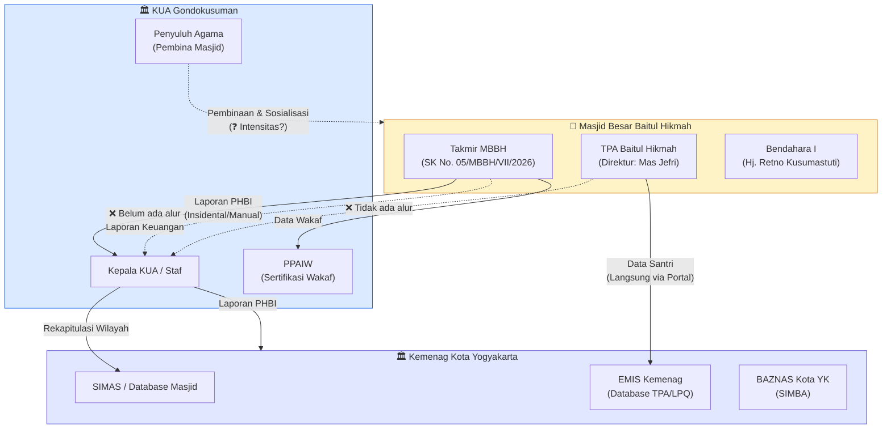

# INSTRUMEN WAWANCARA — NARASUMBER: KUA KECAMATAN GONDOKUSUMAN
## Validasi Alur Data Masjid ↔ KUA, Peta Masjid Kecamatan, & Evaluasi Tata Kelola Eksternal
*Disusun untuk: Tim Lapangan Kelompok 1 — Kelas F1*  
*Mata Kuliah: Praktik Manajemen Sistem Informasi (PTF60234) — Dosen: Dr. Ratna Wardani, S.Si., M.T.*  
*Narasumber Target: Kepala KUA / Staf Pelayanan KUA Kecamatan Gondokusuman*  
*Alamat KUA: Jalan Balapan No. 29, Kelurahan Klitren, Kecamatan Gondokusuman, Kota Yogyakarta, DIY 55222*

---

## 📋 IDENTITAS NARASUMBER (DIISI DI LAPANGAN)

| Kolom | Isian |
|:---|:---|
| **Nama Instansi** | KUA Kecamatan Gondokusuman |
| **Alamat** | Jl. Balapan No. 29, Klitren, Gondokusuman, Yogyakarta 55222 |
| **Nama Narasumber** | .............................................................. |
| **Jabatan** | .............................................................. |
| **NIP (opsional)** | .............................................................. |
| **Nomor WhatsApp** | .............................................................. |
| **Tanggal & Waktu** | .............................................................. |
| **Pewawancara** | Kelompok 1 F1 (Muhammad Riski, Fajar Ahnaf Mahardika, Muhadzdzib Terry Al-Fauzan) |
| **Media Perekaman** | .............................................................. |

---

## 💡 CATATAN STRATEGIS PEWAWANCARA

> **Posisi KUA dalam Ekosistem MSI:**  
> KUA Kecamatan Gondokusuman adalah **simpul vertikal terpenting** antara masjid-masjid se-kecamatan dengan Kementerian Agama Kota Yogyakarta. Dari perspektif MSI, KUA berfungsi sebagai:
> 1. **Data Aggregator** — Menerima dan merekapitulasi data pelaporan kegiatan keagamaan (PHBI, Qurban, Pernikahan) dari seluruh masjid di wilayah kecamatan.
> 2. **Regulator Administratif** — Memastikan kepatuhan masjid terhadap regulasi (PMA No. 34/2016, perizinan rumah ibadah, sertifikasi wakaf/BWI).
> 3. **Data Relay** — Meneruskan rekapitulasi data masjid ke Kemenag Kota → Kemenag Provinsi → Kemenag RI.
> 4. **Validator Eksistensi Masjid** — Mengetahui status resmi, tipologi, dan kondisi tata kelola masjid-masjid di wilayah binaannya.

> **Konteks Kritis dari Temuan Lapangan MBBH & TPA (sebagai dasar validasi silang):**
> - Bpk. Mardiyanto (Sekretaris I MBBH) menyatakan pelaporan PHBI ke KUA dilakukan secara **insidental manual** pasca-acara, belum terstandar format dan frekuensinya.
> - Mas Jefri (Direktur TPA/Ketua II) menyatakan hubungan masjid-KUA dan alur pelaporannya *"aku belum terlalu paham"* — mengindikasikan **kurangnya sosialisasi regulasi KUA** ke pengurus masjid.
> - Insiden TPA: dana bantuan Kemenag Rp 10 juta **hangus 2 tahun** karena IZOP kadaluwarsa tanpa ada peringatan dari pihak manapun, termasuk KUA/Kemenag.
> - Terdapat **kerancuan status lembaga**: MBBH dikenal sebagai "Masjid Besar" namun di beberapa persuratan KUA tercatat sebagai "Masjid Jami'". Validasi status ini penting.

> **Gaya Komunikasi:**  
> Gunakan bahasa formal-sopan karena narasumber adalah PNS/ASN. Sampaikan bahwa ini penelitian akademis bukan audit/inspeksi. Minta izin merekam audio dan mencatat. Bawa surat pengantar resmi dari kampus jika memungkinkan.

---

## ⏱️ RENCANA ALOKASI WAKTU (~35–45 MENIT)

| Menit Ke- | Topik | Fokus Inti |
|:---:|:---|:---|
| **00 – 05** | Pembuka & Izin Formal | Perkenalan, tujuan akademis, izin rekam audio |
| **05 – 12** | **Topik 1:** Profil KUA & Masjid Se-Kecamatan | Jumlah masjid binaan, tipologi, klasifikasi |
| **12 – 20** | **Topik 2:** Alur Data & Pelaporan Masjid ↔ KUA | Format, frekuensi, masalah pelaporan |
| **20 – 28** | **Topik 3:** Validasi Silang Data MBBH & TPA | Konfirmasi status, temuan lapangan, IZOP |
| **28 – 35** | **Topik 4:** Masjid Benchmark di Gondokusuman | Masjid setingkat yang lebih baik tata kelolanya |
| **35 – 42** | **Topik 5:** Masalah Tata Kelola & Harapan KUA | Pain points, hambatan, rekomendasi |
| **42 – 45** | Penutup | Permohonan data/dokumen, kontak lanjutan |

---

## 🎤 DAFTAR PERTANYAAN WAWANCARA

---

### TOPIK 1: Profil KUA & Peta Masjid Kecamatan Gondokusuman

> **Pertanyaan Payung:**  
> *"Bapak/Ibu, sebagai gambaran awal, bisa diceritakan secara umum berapa jumlah masjid yang berada di bawah binaan KUA Gondokusuman? Apakah masjid-masjid tersebut diklasifikasikan berdasarkan tipologi tertentu (Masjid Besar, Masjid Jami', Mushala), dan bagaimana KUA memantau aktifitas mereka?"*

**Poin Pancingan & Checklist:**
- [ ] **Jumlah Masjid Binaan:** Total masjid dan mushala yang terdaftar di wilayah Gondokusuman.
- [ ] **Klasifikasi Tipologi:** Apakah KUA menggunakan pembagian tipologi resmi (Masjid Negara, Masjid Raya, Masjid Besar, Masjid Jami', Mushala)? Berdasarkan regulasi apa?
- [ ] **Sistem Pendataan Masjid:** Apakah KUA memiliki database/daftar masjid digital (misalnya SIMAS — Sistem Informasi Masjid), atau masih berbasis arsip fisik?
- [ ] **Struktur Organisasi KUA:** Berapa jumlah staf/penyuluh agama yang menangani pembinaan masjid? Apakah ada penugasan per wilayah kelurahan?
- [ ] **Peran Penyuluh Agama:** Apakah ada penyuluh agama yang ditugaskan secara khusus untuk membina masjid-masjid tertentu? Bagaimana mekanisme koordinasinya?

---

### TOPIK 2: Alur Data & Pelaporan Masjid ↔ KUA (Perspektif MSI)

> **Pertanyaan Payung:**  
> *"Dari sisi alur informasi, data dan laporan apa saja yang secara reguler diminta oleh KUA dari masjid-masjid di wilayah Gondokusuman? Bagaimana formatnya, melalui jalur apa pengirimannya, dan apakah ada kendala yang sering ditemui?"*

**Poin Pancingan & Checklist:**
- [ ] **Jenis Data yang Diminta KUA dari Masjid:**
  - Laporan kegiatan PHBI (Idul Fitri, Idul Adha/Qurban) — format & frekuensi?
  - Data jamaah / kapasitas masjid?
  - Laporan keuangan / infaq / zakat masjid?
  - Data wakaf (tanah, bangunan)?
  - Data kegiatan sosial/dakwah?
  - Data TPA/TPQ (jika ada koordinasi)?
- [ ] **Jalur Pengiriman Data:**
  - Apakah via surat resmi fisik, WhatsApp, email, atau portal digital?
  - Apakah KUA memiliki sistem informasi digital untuk menerima laporan masjid (misalnya SIMAS, e-KUA, atau Google Form)?
- [ ] **Format & Standarisasi Laporan:**
  - Apakah KUA menyediakan template/format baku untuk laporan masjid?
  - Atau masjid membuat laporan dengan format bebas masing-masing?
- [ ] **Frekuensi Pelaporan:**
  - Tahunan? Semesteran? Per event?
  - Apakah ada deadline yang tegas?
- [ ] **Kendala Umum Pelaporan:**
  - Apa kendala paling sering yang ditemui KUA terkait pelaporan dari masjid? (misal: telat, tidak lengkap, format tidak sesuai, tidak ada pelaporan sama sekali)
  - Berapa persen masjid di Gondokusuman yang aktif melapor vs yang tidak?

---

### TOPIK 3: Validasi Silang — Status MBBH & TPA Baitul Hikmah

> **Pertanyaan Payung:**  
> *"Kami sedang melakukan studi kasus di Masjid Besar Baitul Hikmah di Klitren. Boleh kami konfirmasi beberapa hal terkait status masjid ini di mata KUA?"*

**Poin Pancingan & Checklist:**
- [ ] **Status Tipologi Resmi MBBH:**
  - Dalam catatan KUA, apakah Baitul Hikmah tercatat sebagai **"Masjid Besar"** atau **"Masjid Jami'"**?
  - *(Konteks: Mas Jefri menyebut ada discrepancy — secara fisik dan historis dikenal sebagai Masjid Besar, namun di beberapa surat KUA tercatat Masjid Jami'.)*
- [ ] **Riwayat Pelaporan MBBH ke KUA:**
  - Apakah KUA pernah menerima laporan PHBI (Idul Fitri / Qurban) dari takmir MBBH?
  - Jika ya, kapan terakhir diterima? Jika tidak, apakah KUA pernah mengingatkan?
- [ ] **Data Wakaf MBBH:**
  - Apakah tanah/bangunan MBBH sudah bersertifikat wakaf melalui PPAIW KUA?
  - Apakah ada catatan NIW (Nomor Induk Wakaf)?
- [ ] **TPA Baitul Hikmah:**
  - Apakah KUA mempunyai data tentang TPA yang beroperasi di bawah masjid-masjid?
  - *(Konteks: Data TPA di MBBH langsung ke BADKO/Kemenag via EMIS, bukan ke KUA. Validasi apakah KUA punya visibilitas soal ini.)*
- [ ] **Insiden IZOP TPA Kadaluwarsa:**
  - *(Jika relevan/tepat disampaikan)* Apakah KUA menerima informasi atau salinan IZOP lembaga pendidikan keagamaan di bawah masjid?
  - Apakah ada mekanisme peringatan dini dari KUA/Kemenag saat IZOP masjid atau unit di bawahnya mendekati masa kadaluwarsa?
- [ ] **SK Takmir & Pergantian Kepengurusan:**
  - Apakah masjid wajib mengirimkan salinan SK Takmir baru ke KUA setiap ada pergantian pengurus?
  - Apakah KUA memiliki arsip SK Takmir MBBH saat ini (SK No. 05/MBBH/VII/2026)?

---

### TOPIK 4: Masjid Benchmark di Gondokusuman — Masjid Setingkat yang Lebih Baik

> **Pertanyaan Payung:**  
> *"Dari pengalaman KUA membina masjid-masjid di Gondokusuman, adakah masjid yang setingkat atau sekelas dengan Baitul Hikmah (kategori Masjid Besar / Masjid Jami') namun tata kelola administrasi dan pelaporannya jauh lebih rapi dan aktif? Kami ingin belajar dari sana sebagai bahan perbandingan studi."*

**Poin Pancingan & Checklist:**
- [ ] **Nama Masjid Rekomendasi:** Masjid apa yang menurut KUA paling disiplin dalam pelaporan dan tata kelola?
- [ ] **Alasan Keunggulan:** Apa yang membuat masjid tersebut unggul? (SDM pengurus aktif, sudah digital, rutin melapor, dst.)
- [ ] **Perbedaan Tata Kelola:** Apa perbedaan mendasar tata kelola informasi antara masjid tersebut dengan masjid-masjid lain yang kurang aktif?
- [ ] **Rekomendasi KUA untuk MBBH:** Saran konkret apa yang bisa KUA berikan agar MBBH meningkatkan kepatuhan pelaporan dan tata kelolanya?
- [ ] **Praktik Terbaik Kecamatan (*Best Practice*):** Apakah ada program/inisiatif KUA yang mendorong masjid-masjid meningkatkan tata kelola informasi mereka? (Pelatihan takmir, workshop pelaporan, sosialisasi regulasi, dll.)

---

### TOPIK 5: Masalah Tata Kelola, Hambatan Komunikasi, & Harapan KUA

> **Pertanyaan Payung:**  
> *"Dari perspektif KUA sebagai pembina masjid, apa saja masalah atau tantangan terbesar dalam alur komunikasi dan koordinasi data dengan masjid-masjid se-kecamatan? Dan apa harapan KUA ke depannya?"*

**Poin Pancingan & Checklist:**
- [ ] **Pain Points Alur Data:**
  - Apakah ada masjid yang sama sekali tidak pernah melapor ke KUA selama bertahun-tahun?
  - Apakah ada kesenjangan data yang signifikan (misal: KUA tidak tahu berapa jamaah aktif masjid tertentu)?
- [ ] **Hambatan Struktural:**
  - Apakah ketiadaan SOP pelaporan tertulis dari KUA ke masjid menjadi masalah?
  - Apakah regulasi pelaporan sudah cukup jelas bagi pengurus takmir, atau perlu sosialisasi lebih lanjut?
- [ ] **Keterputusan Generasi (*Knowledge Gap*):**
  - Apakah KUA menemui masalah saat terjadi pergantian takmir, di mana pengurus baru tidak mengetahui kewajiban pelaporan ke KUA?
  - *(Validasi: Temuan di MBBH menunjukkan tidak ada mekanisme serah terima informasi antar-generasi takmir.)*
- [ ] **Masalah Sinkronisasi Data Lintas Instansi:**
  - Apakah ada isu data yang tumpang tindih atau berbeda antara data masjid di KUA vs data di Kemenag Kota vs data di SIMAS?
  - Bagaimana KUA memastikan konsistensi data?
- [ ] **Harapan & Rekomendasi KUA:**
  - Apa yang diinginkan KUA dari pengurus takmir masjid agar koordinasi berjalan lancar?
  - Apakah KUA pernah/berencana mengadakan program pelatihan administrasi takmir secara berkala?
  - Visi digitalisasi: apakah KUA mendukung pelaporan masjid secara digital?

---

## 📝 LEMBAR CATATAN CEPAT WAWANCARA KUA (DIISI DI LAPANGAN)

| Parameter | Temuan di KUA Gondokusuman | Catatan Evaluasi MSI |
|:---|:---|:---|
| **Jumlah Masjid Binaan** | ..................... masjid / ..................... mushala | Skala pembinaan KUA |
| **Sistem Pendataan Masjid** | [ ] SIMAS Digital &nbsp; [ ] Arsip Fisik &nbsp; [ ] Campuran | Level digitalisasi pembina |
| **Format Laporan Baku** | [ ] Ada Template &nbsp; [ ] Bebas Format | Standarisasi alur data |
| **Tingkat Kepatuhan Pelaporan** | ..................... % masjid aktif melapor | Gap compliance |
| **Status MBBH di KUA** | [ ] Masjid Besar &nbsp; [ ] Masjid Jami' &nbsp; [ ] Lainnya | Validasi discrepancy |
| **Laporan PHBI MBBH** | [ ] Pernah diterima &nbsp; [ ] Tidak pernah | Kepatuhan pelaporan |
| **Data Wakaf MBBH** | [ ] Sudah sertifikat &nbsp; [ ] Belum | Status legalitas |
| **Masjid Benchmark** | Nama: ..................... (Alasan: .....................) | Perbandingan tata kelola |
| **Masalah Utama KUA** | ..................... | Pain point alur data |
| **Digitalisasi KUA** | [ ] Sudah digital &nbsp; [ ] Proses &nbsp; [ ] Manual | Kesiapan integrasi |

---

## 🏛️ KONTEKS REGULASI RELEVAN (REFERENSI PEWAWANCARA)

| Regulasi | Isi Pokok | Relevansi ke Wawancara |
|---|---|---|
| **PMA No. 34 Tahun 2016** | Organisasi & Tata Kerja KUA Kecamatan | Mewajibkan KUA membina dan menerima laporan dari masjid |
| **PP No. 42 Tahun 2006** | Pelaksanaan UU No. 41/2004 tentang Wakaf | KUA sebagai PPAIW (Pejabat Pembuat Akta Ikrar Wakaf) |
| **PMA No. 73 Tahun 2013** | Tata Cara Pelaksanaan Pendaftaran Wakaf | Prosedur sertifikasi tanah wakaf masjid |
| **SKB 2 Menteri No. 9 & 8 Tahun 2006** | Izin pendirian rumah ibadah | 90 calon pengguna + 60 dukungan warga |
| **Keputusan Dirjen Bimas Islam** | Klasifikasi dan tipologi masjid | Pembagian Masjid Negara, Raya, Besar, Jami' |

---

## 🔗 DIAGRAM ALUR DATA VALIDASI SILANG MBBH ↔ KUA ↔ KEMENAG

---

## 🔖 PERMOHONAN ARSIP & DOKUMEN (DILAKUKAN DI AKHIR)

1. Izin memfoto/memperoleh **Daftar Masjid se-Kecamatan Gondokusuman** (nama, alamat, tipologi, status).
2. Izin memperoleh **Template/Format Baku Laporan PHBI** (jika ada).
3. Izin memperoleh **Data status MBBH** di basis data KUA (tipologi, NIW wakaf, riwayat pelaporan).
4. Izin memperoleh nama **masjid benchmark rekomendasi** beserta kontak takmir-nya untuk wawancara lanjutan.
5. Jika tersedia, izin mengakses **portal SIMAS** untuk melihat data masjid binaan.

---

*Instrumen disusun: 15 September 2026 | Kelompok 1 F1 — Praktik MSI*  
*Basis data: Temuan wawancara Bpk. Mardiyanto (Sekretaris I MBBH) & Jefri Nur Ihsan, SE.I. (Direktur TPA MBBH)*
