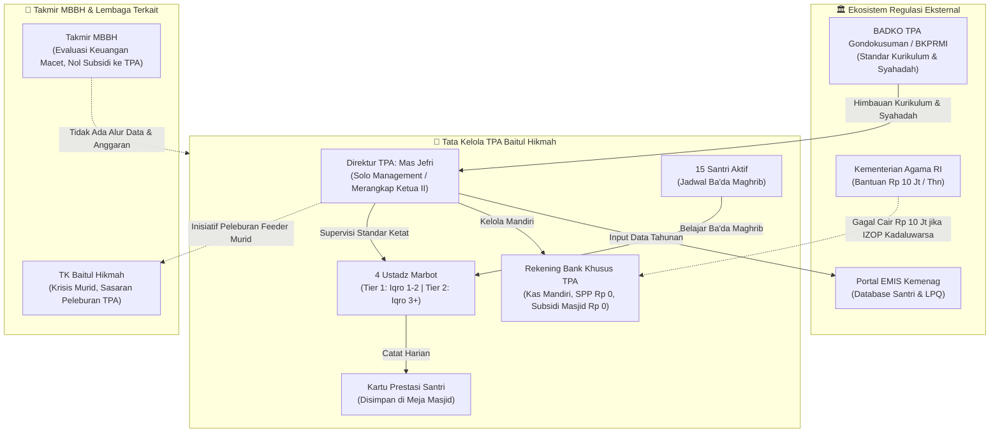

# INSTRUMEN & HASIL WAWANCARA KHUSUS: DIREKTUR TPA
## Investigasi Tata Kelola Akademik, Arsitektur Data Santri, & Dinamika Penurunan Siswa
*Objek: TPA Masjid Besar Baitul Hikmah (Klitren, Gondokusuman, Yogyakarta)*  
*Narasumber: Jefri Nur Ihsan, SE.I. (Direktur TPA Baitul Hikmah & Ketua II Takmir MBBH)*  
*Pewawancara: Tim Praktik MSI Kelompok 1 F1 (Muhammad Riski, Fajar Ahnaf Mahardika, Muhadzdzib Terry Al-Fauzan)*  
*Sumber Rekaman: Audio Verbatim PAA.mp3 (Wawancara Langsung)*

---

## 📋 IDENTITAS WAWANCARA

| Parameter | Catatan Lapangan |
|:---|:---|
| **Narasumber** | Jefri Nur Ihsan, SE.I. |
| **Amanah / Jabatan** | Direktur TPA Masjid Besar Baitul Hikmah *(merangkap Ketua II Takmir MBBH & ex-officio Komite TK)* |
| **Beban Tugas (Double Job)** | Solo management TPA (administrasi, kurikulum, humas, operasional ditangani sendiri tanpa staf manajerial) |
| **Jadwal Mengajar TPA** | 3× seminggu (ba'da Maghrib, dipindah dari sebelumnya jam 16.00 sore) |
| **Pewawancara** | Kelompok 1 F1 (Riski, Fajar, Terry) |
| **Waktu / Media** | September 2026 / Tatap Muka & Verbatim Audio PAA.mp3 |
| **Status Validasi Data** | ✅ TERVALIDASI EMPIRIS PENUH (Transkrip Verbatim Lengkap) |

---

## 💡 CATATAN STRATEGIS PEWAWANCARA
> Mas Jefri adalah praktisi lapangan yang berhadapan langsung dengan santri, orang tua, ustadz, dan kementerian.
> Wawancara ini mengonfirmasi realitas tata kelola informasi TPA pada 4 pilar utama:
> 1. **Arsitektur Data:** Dualitas data antara kartu prestasi operasional harian fisik di masjid vs pelaporan tahunan ke portal EMIS Kemenag RI.
> 2. **Dinamika Penurunan Santri:** Jumlah santri aktif riil hanya **15 anak** (anjlok tajam); pemicu utama adalah faktor sosio-kultural ketiadaan dorongan/dukungan orang tua warga sekitar.
> 3. **Internal Control & Keuangan:** Kas TPA mandiri (rekening bank khusus TPA), SPP Rp 0 (gratis), subsidi kas masjid Rp 0 (nol), serta **insiden kritis gagal cair dana bantuan Kemenag Rp 10.000.000** akibat izin operasional (IZOP) mati 5 tahunan tanpa serah terima pengurus lama.
> 4. **Tata Kelola Eksternal:** Regulasi kurikulum menginduk ke BKPRMI / BADKO TPA, kewajiban syahadah pengajar untuk IZOP, dan rencana strategis peleburan TPA ke TK Baitul Hikmah.

---

## ⏱️ REKAPITULASI PELAKSANAAN WAWANCARA

| Durasi | Fokus Topik | Status Hasil |
|:---:|:---|:---:|
| **00 – 05 mnt** | Profil Jabatan, Rangkap Peran (*Double Job*), & Beban Solo Management | Terkonfirmasi ✅ |
| **05 – 12 mnt** | **Topik 1:** Master Data Santri, Kartu Prestasi, Presensi, & Sistem EMIS Kemenag | Terkonfirmasi ✅ |
| **12 – 18 mnt** | **Topik 2:** Penurunan Santri (15 anak), Perilaku Orang Tua, & Strategi Retensi | Terkonfirmasi ✅ |
| **18 – 24 mnt** | **Topik 3:** Rekening Kas TPA Mandiri, Nol Subsidi Takmir, & Insiden Rp 10 Juta Kemenag | Terkonfirmasi ✅ |
| **24 – 28 mnt** | **Topik 4:** Relasi BADKO TPA, Standar BKPRMI, Syahadah, & Rencana Integrasi TK | Terkonfirmasi ✅ |
| **28 – 32 mnt** | Masalah Delegasi Organisasi Takmir, Refleksi Evaluasi Kas Bendahara 1,5 Jam | Terkonfirmasi ✅ |

---

## 🎤 HASIL PENGGALIAN DATA & TEMUAN PER TOPIK

---

### 1. Master Data Santri, Presensi, & Penanganan Kartu Hilang (Data Architecture)

> **Pertanyaan Payung:**  
> *"Mas Jefri, untuk operasional TPA 3 hari seminggu ini, bagaimana sistem pencatatan perkembangan mengaji santri—mulai dari absensi harian hingga kenaikan jilid Iqro'/Al-Qur'an? Apakah catatannya hanya dipegang santri lewat kartu prestasi atau ada buku master rekapitulasi di meja pengajar? Dan kalau ada kartu santri yang hilang atau robek, bagaimana ustadz memastikan halaman terakhir bacaannya?"*

**Checklist & Hasil Verifikasi Lapangan:**
- [x] **Basis Data Master:** Master data santri dihimpun dari KK / formulir pendaftaran awal santri baru, lalu diinput ke sistem digital terpusat nasional: **Website EMIS (Education Management Information System) Kemenag RI** (kategori EMIS LPQ/TPA, bukan EMIS 4.0 madrasah). Memuat data profil masjid, profil TPA, data individu santri, dan rombel (rombongan belajar/kelas jilid). Update dilakukan setahun sekali setiap tahun ajaran baru.
- [x] **Alur Kenaikan Jilid & Kualifikasi Pengajar:** Kenaikan jilid Iqro' menerapkan standar ketat oleh Mas Jefri. Konsep Iqro: boleh putus-putus asalkan makhraj huruf dan panjang-pendek (*mad*) benar. Mas Jefri pernah meriset ulang santri Iqro 4–6 yang keliru bacaannya untuk kembali ke Iqro 1. Pengajar (4 marbot) dibagi berbasis kompetensi (*tiered qualification*): 2 marbot pemula hanya diizinkan mengajar Iqro 1–2 (makharijul huruf murni), sedangkan 2 marbot yang tartil mengajar Iqro 3 ke atas hingga Al-Qur'an.
- [x] **Mitigasi Single Point of Data (Kartu Prestasi):** Kartu prestasi mencatat tanggal, capaian halaman, status lanjut/ulang. Fakta penting: **Kartu prestasi TIDAK dibawa pulang oleh santri**, melainkan wajib ditinggal dan dikumpulkan di masjid setelah selesai mengaji. Ini memitigasi risiko kartu hilang di rumah. Jika ada kartu tercecer/hilang, penanganannya masih mengandalkan ingatan mandiri ustadz pengajar (*hafalan informal*).
- [x] **Digitalisasi Data Santri:** Berada pada level hibrid: Pencatatan operasional harian = kartu fisik di masjid; Rekapitulasi master tahunan = digital cloud di website EMIS Kemenag.

---

### 2. Investigasi Mendalam Penurunan Santri (*Student Decline Dynamics*)

> **Pertanyaan Payung:**  
> *"Jika dibandingkan dengan beberapa tahun lalu, bagaimana tren jumlah santri aktif di TPA Baitul Hikmah saat ini—apakah mengalami penurunan yang cukup terasa? Menurut amatan Mas Jefri di lapangan, apa faktor terbesar penyebabnya, dan apakah TPA pernah mencoba strategi khusus seperti penyesuaian jam belajar atau kegiatan luar kelas untuk mempertahankan santri?"*

**Checklist & Hasil Verifikasi Lapangan:**
- [x] **Angka Riil Santri:** Jumlah santri aktif terdaftar saat ini **hanya 15 anak** (sangat sedikit untuk masjid kategori Masjid Besar). Bandingkan dengan Masjid Al-Wahid Gambiran (tempat lain Mas Jefri mengajar) yang memiliki **140 santri aktif**.
- [x] **Faktor Pemicu Utama (Sosio-Kultural & Peran Orang Tua):** Faktor terbesar kemerosotan santri **BUKAN semata beban Full-Day School atau gadget**, melainkan **ketiadaan dorongan/komitmen (*lack of support/parental involvement*) dari orang tua warga sekitar Klitren**. Orang tua bersikap pasif-permisif ("terserah anak mau mengaji atau tidak"). Sebaliknya di masjid pembanding, orang tua mengantar dan menunggu anak mengaji meski anak sudah sekolah di SD Islam terpadu.
- [x] **Penyesuaian Jadwal Operasional:** Jadwal TPA digeser dari jam 16.00 sore ke **ba'da Maghrib** untuk mengakomodasi kepulangan anak sekolah jam penuh (*Full-Day School*).
- [x] **Rasio Ustadz vs Santri:** Didampingi oleh 4 orang marbot masjid yang difungsikan ganda sebagai pengajar TPA, dikoordinasikan langsung oleh Mas Jefri.
- [x] **Metode & Inovasi Retensi Santri:** Menggunakan sisa saldo kas bantuan lama, Mas Jefri menerapkan program insentif: pemberian **uang pembinaan setiap santri naik 2 jilid Iqro** dan agenda **makan bersama sebulan sekali**. Inovasi ini berhasil mengaktifkan kembali 15 santri setelah sempat vakum total. Namun saat ini santri sudah kelas 5–6 SD dan berisiko putus kembali saat masuk SMP.
- [x] **Rencana Transformasi Strategis (Peleburan ke TK):** Mas Jefri merancang strategi peleburan TPA ke dalam ekosistem **TK Baitul Hikmah**. Mengingat pengurus takmir otomatis menjadi Komite TK, TPA akan menyaring murid langsung dari lulusan TK agar kesinambungan santri terjamin sejak usia dini.

---

### 3. Pengendalian Kas SPP, Bisyarah Pengajar, & Otonomi Finansial (Internal Control)

> **Pertanyaan Payung:**  
> *"Terkait operasional biaya TPA, bagaimana pengelolaan uang iuran/SPP santri diatur—apakah nominalnya sukarela atau ditentukan per bulan? Siapa yang memegang uang fisik tersebut, apakah kas TPA berdiri sendiri secara otonom atau disetor/tercampur ke kas umum takmir masjid? Serta bagaimana pemberian bisyarah/uang transport untuk ustadz pengajar?"*

**Checklist & Hasil Verifikasi Lapangan:**
- [x] **Sistem Penarikan SPP:** TPA Baitul Hikmah menerapkan **kebijakan GRATIS / Bebas SPP (Rp 0)**. Mas Jefri secara sadar tidak menarik pungutan iuran demi mencegah mundurnya motivasi belajar 15 santri yang tersisa.
- [x] **Pemisahan Rekening Kas (*Internal Control* Terpenuhi):** Keuangan TPA disimpan dalam **rekening bank tersendiri atas nama lembaga TPA**, terpisah mutlak dari kas takmir masjid dan bukan rekening pribadi pengurus. Tidak ada pencampuran dana (*no commingling of funds*).
- [x] **Subsidi Kas Takmir Masjid:** Saat ini **TIDAK ADA bantuan/subsidi kas sama sekali (Rp 0)** dari Takmir Masjid Besar Baitul Hikmah ke TPA. Operasional TPA murni mandiri.
- [x] **Insiden Tata Kelola Kritis (Dana Bantuan Kemenag Rp 10 Juta Hangus):**
  - TPA Baitul Hikmah memiliki hak alokasi bantuan operasional Kemenag sebesar **Rp 10.000.000 (10 juta rupiah)** per tahun.
  - Namun selama 2 tahun terakhir, dana Rp 10 juta tersebut **GAGAL CAIR / HANGUS** karena Izin Operasional (IZOP) TPA telah kadaluwarsa (siklus 5 tahunan) dan belum diperpanjang.
  - **Akar Masalah Tata Kelola:** Ketiadaan mekanisme *handover* (serah terima jabatan) dan sistem pengingat masa berlaku dokumen dari pengurus takmir lama ke pengurus baru. Mas Jefri baru mengetahui IZOP kadaluwarsa saat proposal bantuan ditolak sistem Kemenag.
- [x] **Bisyarah / Honor Ustadz:** **TIDAK ADA bisyarah uang saku rutin** dari TPA untuk ustadz (marbot) maupun Direktur TPA. Pengajar hanya mendapatkan manfaat natura non-tunai berupa makan bersama bulanan bersama santri ketika dana program pembinaan masih tersedia.

---

### 4. Keterhubungan Eksternal: BADKO TPA Kecamatan, BKPRMI, & Sinergi TK

> **Pertanyaan Payung:**  
> *"Secara kelembagaan di luar masjid, apakah TPA Baitul Hikmah terdaftar resmi di BADKO TPA Kemantren Gondokusuman? Bentuk koordinasi dan pelaporan apa saja yang rutin dilakukan (seperti data wisuda munaqasyah atau pelatihan guru)? Serta bagaimana hubungan TPA dengan TK Baitul Hikmah yang berada di satu kompleks masjid?"*

**Checklist & Hasil Verifikasi Lapangan:**
- [x] **Legalitas & Struktur Kelembagaan Eksternal:** TPA Baitul Hikmah terdaftar di bawah binaan **BADKO TPA Kemantren Gondokusuman**, yang menginduk pada standar **BKPRMI (Badan Komunikasi Pemuda Remaja Masjid Indonesia)** dan Kementerian Agama RI. BADKO TPA bertindak sebagai simpul koordinasi perizinan dan penyaluran informasi bantuan, bukan penerima laporan keuangan rutin.
- [x] **Syarat Syahadah Pengajar (Standarisasi Guru):** Regulasi Kemenag mensyaratkan guru TPA memiliki sertifikat kompetensi mengajar Al-Qur'an (**Syahadah Tingkat 1/2/3 BKPRMI**). Mas Jefri sempat terkendala jadwal ujian syahadah, sehingga untuk meloloskan perpanjangan IZOP TPA digunakan sertifikat syahadah milik kolega pengajar yang diunggah ke sistem.
- [x] **Jalur Pelaporan Data:** Pelaporan data kelembagaan dan santri dilakukan secara *direct* melalui **portal online EMIS Kemenag**, bukan diserahkan fisik ke BADKO atau KUA.
- [x] **Sinergi Antar-Unit Yayasan (TK & TPA):** TK Baitul Hikmah dan TPA berada di kompleks yang sama di bawah payung masjid. Namun saat ini TK mengalami penurunan murid dan kendala finansial. Mas Jefri yang kini merangkap Ketua II takmir (dan komite TK) sedang menyiapkan peleburan manajemen TPA ke TK untuk menciptakan kesinambungan rantai pendidikan Al-Qur'an (*feeder system*).
- [x] **Kelemahan Tata Kelola Takmir (Validasi Silang Rapat Kerja):** Mas Jefri mengonfirmasi bahwa saat rapat proker takmir, pembahasan evaluasi kas Bendahara macet selama 1,5 jam (08.00–10.00) tanpa laporan tertulis. Mas Jefri mengusulkan perbaikan SOP tertulis dan perlunya regenerasi pemuda inovatif karena takmir saat ini didominasi generasi sepuh yang kesulitan mengelola administrasi modern.

---

## 📝 LEMBAR CATATAN CEPAT WAWANCARA DIREKTUR TPA (TERVERIFIKASI)

| Parameter | Fakta Temuan di TPA Baitul Hikmah | Catatan Evaluasi Tata Kelola MSI |
|:---|:---|:---|
| **Jumlah Santri Aktif** | **15 anak terdaftar** (Tren: Sangat menurun / pernah vakum) | Kapasitas layanan pendidikan TPA sangat rendah (<15% kapasitas potensial) |
| **Jumlah Pengajar** | **4 orang marbot + 1 Direktur TPA** (Mas Jefri) | Rasio 1:3; diterapkan *tiered teaching* (marbot baru pegang Iqro 1-2, tartil pegang Iqro 3+) |
| **Pencatatan Jilid** | **Kartu Prestasi Fisik (disimpan di masjid)** + **EMIS Kemenag Digital** | Harian pakai kartu di masjid (aman dari hilang di rumah); tahunan pakai portal EMIS Kemenag |
| **Pemicu Turunnya Santri** | **[x] Ketiadaan dorongan orang tua** &nbsp; **[x] Full-Day School** (diatasi ba'da Maghrib) | Masalah terbesar: erosi kesadaran sosio-religius orang tua lokal (*lack of parental involvement*) |
| **Pengelolaan SPP** | **SPP: Rp 0 / Gratis** Penyimpanan: **Rekening Bank Mandiri atas nama TPA** | Bebas SPP untuk menjaga retensi santri; *internal control* baik (tidak campur kas masjid) |
| **Subsidi Kas Masjid** | **Nol Subsidi (Rp 0)** — murni mengandalkan bantuan Kemenag | TPA berjalan mandiri tanpa dukungan anggaran rutin dari Takmir MBBH |
| **Kemitraan BADKO & Kemenag** | **Terdaftar di BADKO Gondokusuman / BKPRMI; EMIS Kemenag Aktif** | Masalah kritis: IZOP mati 5 tahunan sempat membakar hangus dana bantuan Kemenag Rp 10 juta |
| **Irisan dengan TK** | **Rencana integrasi / peleburan manajemen ke TK Baitul Hikmah** | Memanfaatkan posisi Mas Jefri sebagai Ketua II / Komite TK untuk *feeder* santri berkesinambungan |

---

## 🏛️ ANALISIS IMPLIKASI TATA KELOLA INFORMASI (MSI PERSPECTIVE)

---

## 🔖 KESIMPULAN HASIL WAWANCARA DIREKTUR TPA
1. **Verifikasi Beban Kerja (*Single Person Dependency*):** Tata kelola TPA Baitul Hikmah bertumpu mutlak pada satu individu (Mas Jefri) yang merangkap peran manajerial, kurikulum, kelembagaan, hingga Ketua II Takmir dan Komite TK.
2. **Mitigasi Insiden Kartu Prestasi:** Hipotesis awal bahwa santri membawa pulang kartu prestasi dan rentan hilang terbantahkan oleh fakta bahwa kartu disimpan di masjid. Namun, pencatatan cadangan (*backup duplikat*) tetap belum tersedia jika kartu di masjid rusak.
3. **Penyebab Utama Kehilangan Pendanaan Rp 10 Juta:** Kegagalan pencairan dana bantuan Kemenag Rp 10 juta adalah bukti empiris fatalnya kelemahan manajemen dokumen (*document lifecycle management*), ketiadaan sistem peringatan kadaluwarsa perizinan (IZOP 5 tahunan), dan ketiadaan berita acara serah terima jabatan antar-periode takmir.
4. **Strategi Penyelamatan Ekosistem:** Peleburan TPA ke dalam TK Baitul Hikmah merupakan langkah taktis integrasi horizontal antarlayanan masjid untuk mengatasi kebocoran santri dan ketiadaan dukungan orang tua warga lokal.

