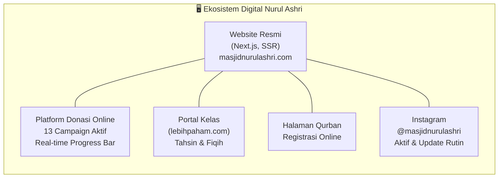
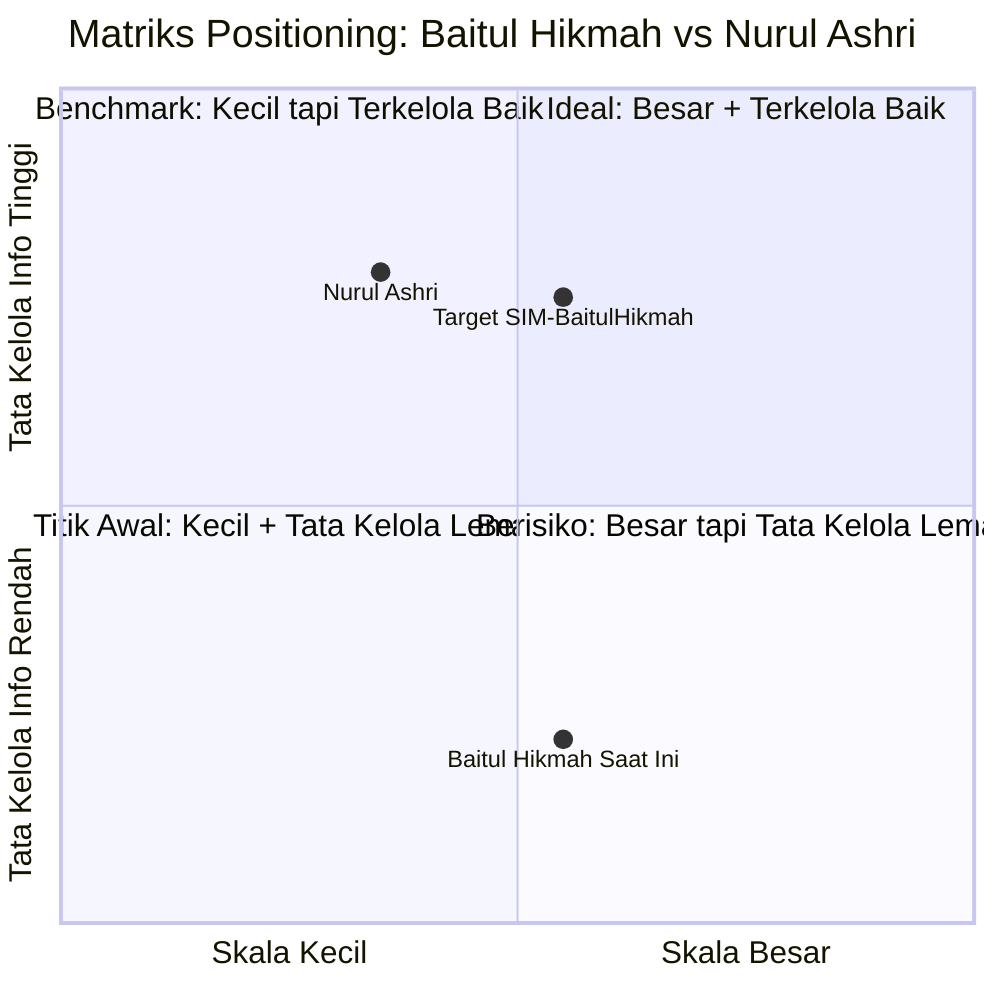

# KOMPARASI BENCHMARK MASJID NURUL ASHRI DERESAN & TATA KELOLA EKSTERNAL
## Studi Perbandingan: Masjid Besar Baitul Hikmah (Klitren) vs. Benchmark Nurul Ashri (Deresan)
*Disusun untuk: Kelompok 1 — Kelas F1*  
*Anggota: Muhammad Riski (24050530029), Fajar Ahnaf Mahardika (24050530030), Muhadzdzib Terry Al-Fauzan (24050530052)*  
*Mata Kuliah: Praktik Manajemen Sistem Informasi (PTF60234) — Dosen: Dr. Ratna Wardani, S.Si., M.T.*

> **⚠️ STATUS DATA:** Data Nurul Ashri dalam dokumen ini bersumber dari **website publik + Instagram** (`masjidnurulashri.com` & `@masjidnurulashri`, diakses 13 September 2026). Data mendalam dari wawancara lapangan **belum dilakukan** (dijadwalkan Selasa). Gunakan sebagai *preliminary benchmark only* — **jangan dikutip sebagai evidence primer Modul 3**.

---

## 1. Profil Singkat Masjid Nurul Ashri Deresan

### Identitas Umum
| Aspek | Data |
|---|---|
| **Nama Resmi** | Masjid Nurul Ashri Deresan |
| **Lokasi** | Deresan, Yogyakarta (koordinat peta: -7.762555°, 110.387163°) |
| **Tipologi** | Masjid Jami' tingkat lingkungan/kelurahan (bukan Masjid Besar kecamatan) |
| **Website Resmi** | [masjidnurulashri.com](https://masjidnurulashri.com/) — dibangun dengan Next.js, aktif dan terkelola |
| **Instagram** | [@masjidnurulashri](https://www.instagram.com/masjidnurulashri/) — aktif |
| **WhatsApp** | +6282243210412 |
| **Email** | admin@masjidnurulashri.com |
| **Slogan/Tagline** | *"Mengalirkan Energi Kebaikan"* |

### Statistik yang Dipublikasikan (dari website, per September 2026)
| Metrik | Angka |
|---|---|
| Jamaah aktif | **2.450+** |
| Program berjalan | **48+** |
| Penerima manfaat | **1.250+** |
| Relawan aktif | **25+** |
| Campaign donasi aktif | **13 campaign** |
| Total dana terkumpul (semua campaign) | **~Rp 10.178.000** |

---

## 2. Peta Kapabilitas Digital & Tata Kelola Informasi

### A. Infrastruktur Digital (Kekuatan Utama)

**Temuan Kunci dari Website (data publik):**
- ✅ Sistem donasi online dengan **progress bar real-time** per campaign
- ✅ Kategorisasi donasi: Infaq / Zakat / Wakaf / Sosial
- ✅ Laporan terstruktur di setiap campaign (narasi + target + realisasi)
- ✅ Kelas keislaman terintegrasi via platform `lebihpaham.com`
- ✅ Halaman Qurban dengan sistem pemesanan online
- ✅ Berita kegiatan dengan tanggal dan dokumentasi foto

### B. Program Unggulan yang Terpublikasi
| Nama Program | Kategori | Deskripsi Singkat |
|---|---|---|
| **Nurul Ashri Qurban** | Ibadah | Layanan qurban amanah untuk jamaah |
| **Nurul Ashri Education** | Pendidikan | Program pendidikan Islam & pengembangan keluarga |
| **Nurul Ashri Peduli** | Sosial-Kemanusiaan | Program sosial dan kemanusiaan berbasis masjid |
| **Peta Aduan Gempa Flores** | Kebencanaan | Peta kebutuhan warga terdampak gempa yang terverifikasi |
| **Bazar Sayur Jumat Subuh** | Pemberdayaan Ekonomi | Mempertemukan petani + jamaah, distribusi produk adil |
| **Kampanye Karhutla Kalimantan** | Kebencanaan | Bantuan logistik tim pemadam kebakaran hutan |
| **Bantuan Gempa NTT (Mbay M7.7)** | Kebencanaan | Respon cepat sembako penyintas gempa |

### C. Transparansi Keuangan (dari halaman /donasi)
- Setiap campaign menampilkan: **target, jumlah terkumpul, dan persentase real-time**
- Terdapat sistem filter per jenis: Infaq, Zakat, Wakaf, Sosial
- Terdapat narasi panjang untuk setiap campaign (konteks + kebutuhan spesifik + hashtag)
- **Belum terlihat:** laporan keuangan umum masjid (hanya laporan per campaign, bukan buku kas bulanan)

---

## 3. Komparasi Langsung: Baitul Hikmah vs. Nurul Ashri

> **Catatan Metodologis:** Kolom Nurul Ashri diisi dari data **website publik** saja. Kolom Baitul Hikmah dari **transkrip wawancara Bpk. Mardianto** (evidence primer). Perbandingan ini bersifat *desk research*, bukan *apples-to-apples* head-to-head karena tipologi berbeda.

| Dimensi Perbandingan | 🕌 Baitul Hikmah (Target) | 🌟 Nurul Ashri (Benchmark) | Kesenjangan & Catatan |
|:---|:---|:---|:---|
| **Tipologi Resmi** | Masjid Besar (Kecamatan) | Masjid Jami' Lingkungan | Baitul Hikmah *seharusnya* punya kapasitas lebih tinggi secara regulasi |
| **Kehadiran Digital** | Tidak ada website. Hanya WhatsApp grup pengurus | Website resmi Next.js + Instagram aktif | Gap besar — Nurul Ashri justru lebih kecil tapi lebih digital |
| **Transparansi Donasi** | Manual (lisan dari bendahara); 3 tahun tanpa laporan tertulis | Per-campaign real-time progress bar online | Gap kritis — Nurul Ashri jauh melampaui Baitul Hikmah |
| **Pengelolaan Program** | Ad-hoc (Qurban, Takjil, ZIS manual) | Program berstruktur dengan nama, narasi, dan target terukur | Gap terstruktur |
| **Tata Kelola ZIS** | Belum UPZ resmi, mustahik tanpa DTKS | Zakat dikategorikan per campaign (terlihat di /donasi) | Nurul Ashri lebih transparan meski kita belum tahu apakah sudah UPZ |
| **Backup Data** | PC rusak Feb 2026 → 70% data hilang permanen | Data tersimpan di cloud (website dikelola secara digital) | Gap bencana — Baitul Hikmah rentan, Nurul Ashri relatif aman |
| **Pendidikan** | TPA dipegang marbot (belum ada data mendalam) | Kelas Tahsin & Fiqih via platform `lebihpaham.com` | Data TPA Baitul Hikmah belum tersedia (pending wawancara Mas Jefri) |
| **Respons Kebencanaan** | Tidak ada program eksternal terdata | Aktif: Flores, NTT, Kalimantan | Nurul Ashri punya jangkauan nasional meski lebih kecil |
| **Pemberdayaan Ekonomi** | Tidak ada | Bazar Sayur Bakda Subuh (petani-jamaah) | Nurul Ashri menginisiasi program ekonomi komunitas |

---

## 4. Analisis MSI: Mengapa Nurul Ashri Relevan sebagai Benchmark?

Nurul Ashri dipilih sebagai benchmark bukan karena skala atau ekspansinya, melainkan karena **kualitas tata kelola informasi** yang bisa dipelajari:

**3 Pelajaran Kunci dari Nurul Ashri (versi tipis-tipis):**

1. **Transparansi Dulu, Ekspansi Kemudian** — Nurul Ashri membangun kepercayaan publik dulu lewat real-time reporting donasi, baru membangun jamaah aktif 2.450+. Baitul Hikmah perlu mengikuti logika ini.

2. **Digital bukan Tentang Ukuran** — Nurul Ashri adalah masjid lingkungan yang lebih kecil dari Baitul Hikmah secara tipologi, namun digitalisasi tata kelola informasinya lebih matang. Ini membuktikan bahwa *digitalisasi tata kelola* ≠ *ekspansi atau komersialisasi*.

3. **Kanal Tunggal = Satu Sumber Kebenaran** — Platform `/donasi` Nurul Ashri menjadi *single source of truth* untuk data keuangan program. Bandingkan dengan Baitul Hikmah yang menggunakan triple entry (WA → buku → PC) yang rawan selisih.

---

## 5. Keterbatasan Data & Agenda Wawancara Selasa

> **🔴 PENTING untuk Agent/Researcher:** Seluruh data di atas adalah *desk research* dari sumber publik. Berikut hal yang BELUM diketahui dan harus dikonfirmasi saat wawancara lapangan Selasa:

| Pertanyaan Terbuka | Mengapa Penting |
|---|---|
| Apakah Nurul Ashri sudah berstatus UPZ resmi BAZNAS? | Kepatuhan regulasi ZIS UU 23/2011 |
| Siapa pengelola TPA/pendidikan di Nurul Ashri? Berapa santri aktif? | Pembanding untuk klaster TPA Baitul Hikmah |
| Bagaimana tata kelola kas operasional harian (bukan campaign online)? | Audit internal vs Baitul Hikmah |
| Apakah laporan keuangan masjid (bukan campaign) dipublikasikan? | Akuntabilitas |
| Bagaimana struktur takmir dan masa baktinya? | Perbandingan tata kelola organisasi |

---

## 6. Referensi Sumber Data

| Sumber | Tipe | Tanggal Akses |
|---|---|---|
| `masjidnurulashri.com` — Beranda, Tentang, Program, Donasi, Kontak | Website publik (desk research) | 13 September 2026 |
| `@masjidnurulashri` — Instagram | Media sosial publik | 13 September 2026 |
| `@mbbh.yogyakarta` — Instagram Baitul Hikmah | Media sosial publik | 13 September 2026 |
| Transkrip wawancara Bpk. Mardianto | Data primer lapangan | Agustus 2026 |

> **File ini akan diperbarui** setelah wawancara lapangan Masjid Nurul Ashri Deresan (Selasa). Data dari wawancara akan menggantikan/melengkapi data desk research di atas.
