```mermaid
flowchart LR
    subgraph S1["BAGIAN 1: REVISI MODUL 2 (Riski)"]
        direction TB
        R1["Refleksi Kasus Empiris\nMasjid Besar Baitul Hikmah"]
        R2["Revisi Lingkungan Bisnis:\nSudah Lancar vs Temuan Masalah"]
        R3["Peran Ganda Regulasi KUA\n(PMA No. 34 Tahun 2016)"]
        R4["Power-Interest Grid & Dual-Tier"]
    end

    subgraph S2["BAGIAN 2: ANALISIS MASALAH (Fajar)"]
        direction TB
        F1["Metode Triangulasi 4 Sumber"]
        F2["Klasifikasi: 4 Terverifikasi\n+ 1 Hipotesis Kerja Parsial"]
        F3["Insiden Kritis PC Rusak Feb 2026\n(70% Data Hilang Permanen)"]
        F4["Bedah Fishbone 6 Dimensi\n(Ishikawa, 1976)"]
    end

    subgraph S3["BAGIAN 3: AKAR MASALAH & TEORI (Terry)"]
        direction TB
        T1["Analisis Kausalitas 5-Why\n(Ohno, 1988)"]
        T2["Matriks Prioritas Kelayakan\n(Quick Wins vs Proyek Strategis)"]
        T3["Landasan Teoretis MSI:\nTTF, TAM, Internal Control, Herzberg"]
        T4["Pernyataan Masalah Prioritas\n& Transisi ke Modul 4"]
    end

    S1 --> S2 --> S3
```

# NASKAH PRESENTASI AKADEMIS: REVISI MODUL 2 DAN MODUL 3
## Kasus: Sistem Informasi Manajemen Masjid Besar Baitul Hikmah (SIM-BaitulHikmah)
**Mata Kuliah:** Praktik Manajemen Sistem Informasi (PTF60234)  
**Dosen Pengampu:** Dr. Ratna Wardani, S.Si., M.T.  
**Penyusun (Kelompok 1 — Kelas F1):**
1. Muhammad Riski (24050530029) — *Pembicara 1 (Pembuka & Revisi Modul 2)*
2. Fajar Ahnaf Mahardika (24050530030) — *Pembicara 2 (Metodologi Triangulasi & Bedah Fishbone Modul 3)*
3. Muhadzdzib Terry Al-Fauzan (24050530052) — *Pembicara 3 (Analisis 5-Why, Matriks Prioritas, Teori MSI & Penutup)*

---

## 📌 PANDUAN PENGGUNAAN NASKAH & MENTAL MODEL KELOMPOK

### 🎯 Tujuan Utama Presentasi di Hadapan Bu Ratna:
1. **Membuktikan Pemahaman Filosofis MSI (Bukan Mindset RPL/Coding):** Menunjukkan bahwa kelompok tidak berfokus pada "membuat aplikasi/website", melainkan membedah **tata kelola informasi (*information governance*)**, pemisahan wewenang (*segregation of duties*), keselarasan regulasi makro, dan pengendalian internal.
2. **Menampilkan Kejujuran Akademis & Anti-Halusinasi:** Berani membedakan secara tegas mana **temuan empiris yang sudah terverifikasi** (misal: PC rusak Feb 2026 data hilang 70%, pendaftaran triple-entry qurban, SK resmi 2026) dengan mana **hipotesis kerja parsial** yang masih butuh konfirmasi lanjutan (misal: penentuan mustahik tanpa DTKS, data nominal kas Bendahara).
3. **Menghubungkan Alur Logis Revisi Modul 2 menuju Modul 3:** Memaparkan revisi Modul 2 terlebih dahulu (koreksi lingkungan bisnis, regulasi KUA, dan peta stakeholder) sebagai fondasi yang melahirkan identifikasi masalah sistemik di Modul 3.

### ⏱️ Alokasi Waktu:
* **Total Presentasi:** 10 – 12 Menit
  * Bagian 1 (Riski — Pembuka & Revisi Modul 2): ± 3,5 Menit
  * Bagian 2 (Fajar — Triangulasi & Fishbone Modul 3): ± 4,0 Menit
  * Bagian 3 (Terry — 5-Why, Matriks Prioritas, Teori MSI & Penutup): ± 3,5 Menit
* **Sesi Diskusi & Tanya Jawab (Q&A):** Fleksibel (disiapkan simulasi jawaban pada Bagian 4).

---

---

## 🎙️ NASKAH PRESENTASI LENGKAP (KATA PER KATA)

---

### 🗣️ BAGIAN 1: PEMBUKA & PEMAPARAN REVISI MODUL 2
**Pembicara 1: Muhammad Riski (24050530029)**  
*Alokasi Waktu: 00.00 – 03.30 (± 3,5 Menit)*  
*Fokus: Re-orientasi Kasus, Filosofi MSI, dan 3 Poin Kunci Revisi Modul 2 (Format Lingkungan Bisnis, Regulasi KUA, Peta Stakeholder).*

---

#### [00.00 – 00.45] Salam Pembuka & Re-orientasi Filosofis
> *"Assalamu’alaikum Warahmatullahi Wabarakatuh. Selamat pagi Bu Ratna dan rekan-rekan sekalian.*
>
> *Kami dari Kelompok 1 Kelas F1, yang beranggotakan saya sendiri Muhammad Riski, rekan saya Fajar Ahnaf Mahardika, dan Muhadzdzib Terry Al-Fauzan. Hari ini kami akan mempresentasikan progres analisis praktikum Manajemen Sistem Informasi pada kasus studi **Masjid Besar Baitul Hikmah**, Kemantren Gondokusuman, Kota Yogyakarta.*
>
> *Sebelum kami membedah hasil analisis masalah pada Modul 3, izinkan kami mengawali presentasi ini dengan memaparkan **revisi menyeluruh pada Laporan Modul 2** yang telah kami sempurnakan berdasarkan evaluasi dan arahan akademis dari Bu Ratna pada pertemuan sebelumnya.*
>
> *Sebagaimana filosofi yang selalu Ibu tekankan di kelas: **seorang analis MSI tidak berpikir seperti anak RPL yang sekadar ingin membikin aplikasi atau coding**. Sistem informasi adalah kesatuan sosio-teknis yang terdiri atas 5 unsur: Input, Proses, Output, Manpower, dan Teknologi. Mengembangkan sistem tanpa memahami regulasi eksternal, tata kelola, dan kapasitas manusianya sama saja seperti merakit motor balap kencang namun ditaruh di tengah pematang sawah tanpa jalan, tanpa rambu lalu lintas, dan tanpa pengemudi berlisensi."*

#### [00.45 – 02.00] Pemaparan Revisi Modul 2: Poin 1 (Format Analisis Lingkungan Bisnis)
*[Visual Slide: Menampilkan Tabel 4.6 Lembar Kerja Analisis Lingkungan Bisnis Modul 2]*

> *"Berdasarkan koreksi Bu Ratna, pada Modul 2 kami melakukan restrukturisasi format pada **Tabel Analisis Lingkungan Bisnis (Tabel 4.6)**. Kami tidak lagi menyajikan tabel yang sekadar berisi daftar keluhan atau langsung menjelek-jelekkan kondisi organisasi.*
>
> *Sesuai standar yang Ibu arahkan, kami membedah lingkungan bisnis secara berimbang ke dalam dua kolom dialektis: **'Hal-hal yang sudah berjalan lancar dan baik'** di satu sisi, dikonfrontasikan dengan **'Temuan masalah dan celah tata kelola yang perlu dikembangkan'** di sisi lain, yang mencakup 4 dimensi:*
> 1. *Pada dimensi **Regulasi dan Kepatuhan**: Yang sudah lancar adalah legalitas masjid yang resmi ber-ID SIMAS Kementerian Agama (`01.4.34.71.03.000032`), berdiri di atas tanah Barang Milik Negara (BMN), dan izin operasional TPA (IZOP) yang sudah terbit. Namun temuan masalahnya adalah pelaporan berkala keagamaan ke KUA dan BAZNAS yang belum terstandarisasi serta ketiadaan verifikasi mustahik ZIS berbasis DTKS.*
> 2. *Pada dimensi **Benchmark/Kompetisi**: Kami mengomparasikan praktik baik dari benchmark terdekat, yaitu Masjid Nurul Ashri Deresan yang memiliki portal digital aktif dan 13 program donasi daring, serta Masjid Mujur Al-Amin Karangnongko yang sukses menerapkan transparansi terbuka melalui sistem dual custody kotak infak dan Papan Takjil Terbuka. Di Baitul Hikmah, kapasitas publikasi terbuka ini masih menjadi kesenjangan besar.*
> 3. *Pada dimensi **Kapasitas Internal**: Masjid sudah memiliki SK kepengurusan formal (SK No. 05/MBBH/VII/2026), rekening bank, serta QRIS aktif. Namun masalahnya adalah fenomena sleeping committee, tumpukan beban kerja pada Sekretaris I, pembukuan kas fisik tanpa laporan tertulis selama ±3 tahun, dan kerentanan penyimpanan data lokal.*
> 4. *Pada dimensi **Tren dan Tekanan Eksternal**: Penerimaan infaq QRIS sudah aktif, namun mutasi bank digital tersebut belum pernah direkonsiliasi secara berkala ke dalam pembukuan kas masjid."*

#### [02.00 – 03.00] Pemaparan Revisi Modul 2: Poin 2 & 3 (Regulasi KUA & Power-Interest Grid)
*[Visual Slide: Menampilkan Diagram Konsentris & Power-Interest Grid Modul 2]*

> *"Revisi penting kedua pada Modul 2 adalah **redefinisi posisi KUA Kemantren Gondokusuman** dalam ekosistem masjid.*
>
> *Sebelumnya, KUA hanya kami pandang secara sempit sebagai penyewa aula untuk akad nikah. Melalui penelusuran regulasi, kami menemukan bahwa berdasarkan **PMA (Peraturan Menteri Agama) No. 34 Tahun 2016**, KUA memiliki mandat pengawasan dan pengumpulan data kegiatan keagamaan di wilayah kecamatan. KUA berwenang meminta Laporan Shalat Idul Fitri dan Laporan Penyelenggaraan Qurban Idul Adha dari takmir untuk dihimpun dan diteruskan ke Kemenag Kota Yogyakarta. Di Baitul Hikmah, pelaporan ini selama bertahun-tahun masih dilakukan secara manual, insidental, dan sering terlambat pasca-acara.*
>
> *Revisi ketiga, kami menyinkronkan **Power-Interest Grid** dengan struktur kepengurusan SK 2026 dan fakta wawancara riil:
> * Narasumber utama kami adalah **Bpk. Mardiyanto selaku Sekretaris I** (menjabat sejak 2004), bukan Ketua Takmir.
> * Kami membedakan peran antara pengurus sepuh dan kader muda melalui konsep **Dual-Tier Operating Model**: marbot sepuh menjalankan operasional harian berbasis prosedur fisik yang disederhanakan, sementara 17 pemuda Remaja Masjid (REMAS) diberdayakan sebagai operator pencatatan digital dan rekonsiliasi data pada periode musiman.*
>
> *Dari pemetaan lingkungan dan stakeholder Modul 2 inilah, kami menemukan anomali-anomali tata kelola yang membawa kami masuk ke Modul 3: Analisis Masalah dan Prioritas Solusi. Penjelasan Modul 3 akan dilanjutkan oleh rekan saya, Fajar Ahnaf."*

---

### 🗣️ BAGIAN 2: MODUL 3 — TRIANGULASI DATA & BEDAH FISHBONE DIAGRAM
**Pembicara 2: Fajar Ahnaf Mahardika (24050530030)**  
*Alokasi Waktu: 03.30 – 07.30 (± 4,0 Menit)*  
*Fokus: Triangulasi 4 Sumber Bukti, Validitas Akademis (4 Masalah Terverifikasi + 1 Hipotesis Kerja), dan Pemaparan Fishbone Diagram 6 Dimensi Insiden PC Rusak.*

---

#### [03.30 – 04.30] Metodologi Triangulasi 4 Sumber & Klasifikasi Kejujuran Ilmiah
*[Visual Slide: Menampilkan Lembar Kerja 4.1 Dokumen Analisis Masalah]*

> *"Terima kasih Riski. Selamat pagi Bu Ratna. Saya Fajar Ahnaf Mahardika akan melanjutkan pemaparan pada Modul 3.*
>
> *Memasuki Modul 3, kelompok kami berpegang teguh pada instruksi Ibu: **analisis masalah tidak boleh berangkat dari asumsi subyektif mahasiswa apalagi langsung berorientasi solusi**. Oleh karena itu, kami menerapkan metode **triangulasi data empiris** dengan menggabungkan 4 sumber bukti yang saling mengonfirmasi:*
> 1. *Pertama, **Wawancara Primer Mendalam** bersama Bpk. Mardiyanto (Sekretaris I Takmir).*
> 2. *Kedua, **Observasi Partisipatif Internal**, di mana saya sendiri adalah kader aktif REMAS dan panitia operasional kegiatan Ramadhan serta Qurban di Masjid Baitul Hikmah, sehingga gesekan alur kerja di lapangan dapat kami amati langsung dari dalam.*
> 3. *Ketiga, **Data Parsial Unit Pendidikan TPA**, melalui checklist dan konfirmasi daring bersama Bpk. Jefri Nur Ihsan, SE.I. selaku Ketua II Takmir merangkap Direktur TPA Baitul Hikmah.*
> 4. *Keempat, **Studi Komparasi Lapangan & Benchmark Digital** terhadap Masjid Mujur Al-Amin Karangnongko dan Masjid Nurul Ashri Deresan.*
>
> *Sebagai wujud integritas akademik, dari hasil penelusuran tersebut kami membagi temuannya secara jujur menjadi **4 Masalah Terverifikasi** dan **1 Hipotesis Kerja Parsial**:
> * Masalah terverifikasi mencakup: (1) Kerentanan penyimpanan tunggal yang memusnahkan data, (2) Stagnasi akuntabilitas kas karena nihil laporan tertulis selama ±3 tahun, dan (3) Kerapuhan operasional akibat alur pendaftaran triple-entry serta fenomena sleeping committee yang membebani Sekretaris I.
> * Sementara itu, permasalahan seleksi mustahik ZIS tanpa DTKS dan rincian data TPA kami tetapkan secara tegas sebagai **Hipotesis Kerja Parsial**, karena data tersebut baru bersumber dari keterangan lisan Sekretaris dan belum dikonfirmasi langsung ke Koordinator Sie ZISWAF maupun staf Kelurahan Klitren. Kami menolak mencantumkan angka nominal infaq atau volume qurban fiktif yang belum terverifikasi secara resmi."*

#### [04.30 – 05.45] Pemilihan Masalah Kritis & Prinsip Anti-Slop Fishbone
*[Visual Slide: Menampilkan Diagram Fishbone 6 Dimensi Ishikawa]*

> *"Dari daftar masalah tersebut, kami memilih satu insiden paling fatal yang mengancam kelangsungan organisasi (*business continuity threat*), yaitu: **Hilangnya 70% data arsip dan administrasi masjid akibat kerusakan PC kantor sekretariat pada Februari 2026**.*
>
> *Berdasarkan pengakuan Bpk. Mardiyanto, saat harddisk komputer rusak, teknisi servis hanya mampu merecovery sekitar 30% file, sementara 70% riwayat surat, data aset, dan arsip kepanitiaan musnah permanen.*
>
> *Kami membedah insiden ini menggunakan **Fishbone Diagram (Diagram Tulang Ikan)** dengan 6 kategori dimensi sosio-teknis. Dalam menyusun diagram ini, kami mematuhi prinsip anti-slop akademis: **kami mengharamkan kalimat 'karena belum ada aplikasi komputer' sebagai cabang penyebab**. Ketiadaan aplikasi adalah ketiadaan produk teknis, bukan akar kegagalan tata kelola sistem informasi."*

#### [05.45 – 07.30] Bedah 6 Dimensi Kausalisme Fishbone
*[Visual Slide: Menyorot Cabang-Cabang Fishbone Diagram]*

> *"Mari kita bedah 6 dimensi penyebabnya secara objektif:*
>
> *1. **Dimensi Manusia (*People*):** Adanya dominasi pengurus senior yang sudah terbiasa dengan pola kerja manual, ketergantungan ekstrem pada figur tunggal Sekretaris I yang merangkap lebih dari 6 tugas sekaligus tanpa pelapis, serta fenomena sleeping committee di mana puluhan nama tercantum di SK namun pasif di lapangan. Menariknya, saat kami menanyakan kepada Direktur TPA (Mas Jefri) apakah pasifnya pengurus disebabkan ketiadaan upah, beliau menegaskan bahwa takmir sebenarnya menerima bisyarah Rp 150.000 per bulan dari kas infaq, namun warga tetap saling melempar tanggung jawab. Berdasarkan literatur, kami berhipotesis bahwa bisyarah Rp 150.000 tersebut hanya berfungsi sebagai **Hygiene Factor (Herzberg, 1959)** yang mencegah ketidakpuasan, namun bukan *Motivator* yang mendorong kontribusi aktif. Mas Jefri juga menyebut fenomena ini berakar pada budaya komunal yang mengindikasikan melemahnya modal sosial warga (**Social Capital Theory, Putnam 2000**).*
>
> *2. **Dimensi Proses (*Process*):** Tidak adanya Standard Operating Procedure (SOP) pencadangan data berkala, alur koordinasi ad-hoc tanpa panduan tertulis sehingga pengurus baru mengalami disorientasi dan harus konfirmasi berbelit ke figur A, B, C, D, serta redundansi pendaftaran qurban melalui triple-entry (WhatsApp, buku tulis, baru diketik ke komputer).*
>
> *3. **Dimensi Teknologi (*Technology*):** Ketergantungan fatal pada satu unit penyimpanan fisik lokal (*single point of failure*), ketiadaan repositori cloud terpusat, serta penggunaan gawai pintar pengurus yang sebatas percakapan instan tanpa integrasi ke penyimpanan dokumen kerja.*
>
> *4. **Dimensi Kebijakan & Tata Kelola (*Policy & Governance*):** Ketiadaan regulasi internal yang menetapkan bahwa data digital adalah aset resmi organisasi, ketiadaan SOP audit kas berkala, serta SK takmir yang hanya membagi jabatan tanpa merinci otoritas dan hak akses data (*RACI matrix tidak terdefinisi*).*
>
> *5. **Dimensi Data & Informasi (*Data*):** Terjadinya data silo di mana dokumen tersebar di komputer rumah pribadi sekretaris, tradisi daur ulang berkas kepanitiaan lama di harddisk lokal (*hard drive legacy*), serta asimetri informasi kas kepada jamaah.*
>
> *6. **Dimensi Lingkungan Organisasi (*Environment*):** Adanya budaya kesungkanan (*ewuh pakewuh*) untuk mengaudit pengurus senior, serta anggapan komunal bahwa tertib administrasi bersifat sekunder selama ibadah ritual shalat lima waktu tetap berjalan lancar.*
>
> *Selanjutnya, bagaimana penelusuran 5-Why mengupas masalah ini hingga ke akar terdalam dan bagaimana matriks prioritas solusinya dirumuskan, akan dipaparkan oleh rekan saya, Muhadzdzib Terry."*

---

### 🗣️ BAGIAN 3: ANALISIS 5-WHY, MATRIKS PRIORITAS, TEORI MSI & PENUTUP
**Pembicara 3: Muhadzdzib Terry Al-Fauzan (24050530052)**  
*Alokasi Waktu: 07.30 – 11.00 (± 3,5 Menit)*  
*Fokus: Logika Kausalitas 5-Why, Matriks Prioritas Dampak vs Upaya, Justifikasi Teoretis MSI (TTF, TAM, Internal Control), Pernyataan Masalah Akhir.*

---

#### [07.30 – 08.45] Penelusuran Bertingkat 5-Why & Analogi Bu Ratna
*[Visual Slide: Menampilkan Alur Diagram 5-Why]*

> *"Terima kasih Fajar. Selamat pagi Bu Ratna. Saya Muhadzdzib Terry Al-Fauzan akan menguraikan analisis kausalitas 5-Why, matriks prioritas, dan sintesis teoretis MSI.*
>
> *Ketika insiden rusaknya PC kantor terjadi, orang awam atau programmer pemula mungkin akan menyimpulkan: 'Ya sudah, solusinya beli PC baru atau instal aplikasi web'. Namun melalui kerangka berpikir MSI, kelompok kami menguji kausalitas peristiwa tersebut menggunakan metode **5-Why (Ohno, 1988)**:*
>
> * *Why 1: Mengapa 70% data arsip dan administrasi masjid musnah? $\rightarrow$ Karena harddisk PC kantor rusak fisik pada Februari 2026 dan organisasi tidak memiliki salinan cadangan (*backup*).*
> * *Why 2: Mengapa tidak ada salinan cadangan? $\rightarrow$ Karena seluruh file kerja hanya disimpan secara lokal di harddisk komputer meja kantor dan laptop pribadi Sekretaris.*
> * *Why 3: Mengapa pengurus hanya menyimpan di perangkat lokal? $\rightarrow$ Karena tidak ada Standard Operating Procedure (SOP) pencadangan data rutin dan pengurus belum terbiasa memanfaatkan penyimpanan awan (*cloud storage*).*
> * *Why 4: Mengapa tidak ada SOP pencadangan rutin? $\rightarrow$ Karena pengurus takmir belum memandang data dan arsip digital sebagai **aset strategis organisasi** yang memiliki risiko kepunahan dan nilai akuntabilitas hukum.*
> * *Why 5 (Akar Masalah Terdalam): Mengapa data belum dipandang sebagai aset strategis? $\rightarrow$ Karena **ketiadaan kerangka tata kelola informasi (*information governance framework*) dan regulasi internal organisasi** yang mengatur standardisasi penyimpanan, protokol pencadangan, pemisahan wewenang (*segregation of duties*), serta transfer pengetahuan antar-generasi.*
>
> *Di sinilah letak korelasi sempurna dengan analogi Bu Ratna mengenai **'Motor Balap vs Aturan Jalan'**. PC rusak hanyalah mogoknya mesin fisik. Namun musnahnya data terjadi karena ketiadaan aturan lalu lintas organisasi (SOP backup) dan ketiadaan lisensi berkendara (tata kelola hak akses).*
>
> *Jika takmir memiliki SOP di mana setiap hari Jumat malam data disinkronisasi ke Google Drive bersama, maka meskipun komputernya tersambar petir atau rusak total, data organisasi tetap utuh 100%. Jadi masalahnya bukan pada komputernya, melainkan pada tata kelola informasinya!"*

#### [08.45 – 09.45] Matriks Prioritas: Quick Wins vs Proyek Strategis
*[Visual Slide: Menampilkan quadrantChart Matriks Dampak vs Upaya]*

> *"Berdasarkan identifikasi akar masalah tersebut, kami memetakan seluruh opsi intervensi ke dalam **Matriks Prioritas (Dampak vs Upaya)** pada Subbab 4.4 Laporan Modul 3:*
>
> *1. **Kuadran 1: Manfaat Cepat (*Quick Wins* — Dampak Tinggi, Upaya Rendah):**
> Solusi yang kami prioritaskan untuk dieksekusi segera tanpa menunggu sistem aplikasi rumit jadi, antara lain:
> * **Standardisasi SOP & Protokol Pencadangan Data Hibrid ke Cloud:** Memanfaatkan akun Google Drive terpadu milik masjid dengan menginstruksikan kader REMAS melakukan sinkronisasi berkala seminggu sekali.
> * **Penerapan Formulir Registrasi Tunggal (*Single-Entry Form*)**: Mengeliminasi alur triple-entry pendaftaran qurban dengan menggunakan Google Form atau lembar formulir fisik terstandar yang langsung direkapitulasi ke satu master sheet.
> * **Pemasangan Papan Informasi Transparansi Terbuka**: Mengadopsi kesuksesan Masjid Mujur Al-Amin dengan menampilkan saldo kas bulanan dan slot logistik Ramadhan secara fisik di serambi masjid.*
>
> *2. **Kuadran 2: Proyek Strategis (*Major Projects* — Dampak Tinggi, Upaya Tinggi):**
> Kami tempatkan untuk perencanaan jangka menengah, yaitu pengembangan SIM-BaitulHikmah terintegrasi multi-user, integrasi verifikasi mustahik ZIS dengan basis data DTKS Kelurahan Klitren, serta sistem pelaporan kepatuhan formal ke KUA dan BAZNAS."*

#### [09.45 – 11.00] Validasi Teori Akademik MSI, Rumusan Masalah Akhir & Penutup
*[Visual Slide: Menampilkan Tabel 7 Aspek MSI & Rumusan Masalah Prioritas]*

> *"Terakhir, seluruh rekomendasi kami dipayungi oleh teori-teori mapan dalam literatur MSI untuk menjawab kekhawatiran Bu Ratna:*
> 1. *Berdasarkan **Task-Technology Fit (Goodhue & Thompson, 1995)** dan **Technology Acceptance Model (Davis, 1989)**: Kami menolak memaksakan aplikasi digital canggih kepada marbot sepuh. Sebagai gantinya, marbot tetap mencatat di logbook fisik terstandar, dan rekonsiliasi ke sistem digital dilakukan oleh kader 17 pemuda REMAS (*Dual-Tier Operating Model*).*
> 2. *Berdasarkan konsep **Internal Control & Segregation of Duties (Romney & Steinbart, 2018)**: Masalah macetnya laporan kas Bendahara selama ±3 tahun bukan diselesaikan dengan membuat aplikasi kasir, melainkan dengan membentuk SOP verifikasi silang (*dual custody*) dan pemisahan fungsi antara pemegang kas fisik dengan pencatat buku.*
> 3. *Berdasarkan **Knowledge Conversion Model (Nonaka & Takeuchi, 1995)**: SOP tertulis berfungsi mengubah pengetahuan *tacit* yang selama puluhan tahun tersimpan di kepala Sekretaris I menjadi pengetahuan *explicit* agar regenerasi organisasi tidak lumpuh.*
>
> *Dengan demikian, **Pernyataan Masalah Prioritas Akhir** kami rumuskan sebagai berikut:
> > 'Ketiadaan kerangka tata kelola informasi (*information governance framework*) dan regulasi internal pada Masjid Besar Baitul Hikmah menyebabkan data administrasi, aset, dan layanan tersimpan secara terisolasi (*data silo*) pada perangkat lokal tanpa prosedur pencadangan berkala (*backup policy*), ketiadaan SOP kerja yang terdokumentasi memicu disorientasi regenerasi kepengurusan, serta ketiadaan transparansi berkala menghambat akuntabilitas pengelolaan organisasi kepada jamaah dan pemangku kepentingan.'
>
> *Rumusan masalah prioritas inilah yang akan menjadi kompas kami dalam menyusun Project Scope dan Work Breakdown Structure (WBS) pada Modul 4 mendatang.*
>
> *Demikian presentasi dari Kelompok 1 F1. Kami sangat terbuka terhadap masukan, kritik, dan arahan penyempurnaan dari Bu Ratna. Terima kasih. Wassalamu’alaikum Warahmatullahi Wabarakatuh."*

---

## 🛡️ BAGIAN 4: SIMULASI TANYA JAWAB (Q&A DEFENSE)
### Antisipasi Pertanyaan Kritis Dosen & Strategi Menjawab Berbobot Akademis

Bagian ini dirancang khusus sebagai panduan bagi anggota kelompok jika Bu Ratna menguji logika analisis, data lapangan, atau kerangka teoretis laporan:

---

#### ❓ Pertanyaan Maut 1:
> *"Kalian ini mahasiswa Pendidikan Teknik Informatika, kenapa solusi cepat (Quick Wins) kalian malah bikin SOP tertulis, pasang papan tulis di serambi masjid, dan suruh marbot pakai logbook kertas? Kenapa tidak langsung buatkan sistem aplikasi berbasis web atau mobile yang modern saja?"*

**Siapa yang Menjawab:** Terry atau Riski  
**Strategi Jawaban Akademis:**
> *"Terima kasih atas pertanyaannya Bu Ratna. Justru itulah pembeda fundamental antara pendekatan Rekayasa Perangkat Lunak (RPL) murni dengan Manajemen Sistem Informasi (MSI).*
>
> *Berdasarkan teori **Task-Technology Fit (Goodhue & Thompson, 1995)** dan **Technology Acceptance Model (Davis, 1989)**, efektivitas sistem informasi tidak ditentukan oleh seberapa canggih teknologi yang dibuat, melainkan seberapa cocok teknologi tersebut dengan karakteristik tugas dan kapasitas penggunanya. Di Masjid Baitul Hikmah, fakta empiris membuktikan operasional harian dipegang oleh marbot sepuh. Jika kami langsung memaksakan aplikasi web kompleks, marbot akan mengalami disonansi kognitif, merasa terbebani, dan akhirnya terjadi **system abandonment** (aplikasinya ditinggalkan dan mereka kembali ke cara lisan).*
>
> *Oleh karena itu, intervensi MSI yang kami lakukan adalah memperbaiki **arsitektur proses dan tata kelolanya terlebih dahulu**: logbook fisik marbot distandarisasi agar datanya valid (*Garbage In, Garbage Out dicegah*), SOP pencadangan ditetapkan, dan papan keterbukaan dipasang agar asimetri informasi ke jamaah langsung teratasi. Sementara itu, aplikasi web tetap kami kembangkan pada kuadran Proyek Strategis, di mana operator digitalnya didelegasikan kepada 17 pemuda REMAS melalui model **Dual-Tier System**."*

---

#### ❓ Pertanyaan Maut 2:
> *"Di data Fishbone kalian mencantumkan ada bisyarah takmir Rp 150.000 per bulan, tapi marbot tidak dapat bisyarah. Apakah kalian yakin masalah regenerasi dan pasifnya pengurus itu bukan semata-mata karena mereka tidak digaji layak secara profesional?"*

**Siapa yang Menjawab:** Fajar  
**Strategi Jawaban Akademis:**
> *"Terima kasih Bu Ratna. Pertanyaan ini sempat menjadi perdebatan mendalam di internal kelompok kami. Awalnya kami juga menduga bahwa ketiadaan upah formal adalah penyebab utama rendahnya antusiasme warga untuk menjadi pengurus.*
>
> *Namun, saat kami mengonfirmasi hal ini langsung via WhatsApp pada 14 September 2026 kepada Bpk. Jefri Nur Ihsan (Ketua II Takmir merangkap Direktur TPA), beliau secara eksplisit membantah premis tersebut. Mas Jefri menyatakan: 'Bukan karena sistem atau tidak ada upah. Memang budaya di warga kita seperti itu, jarang/sedikit yang mau ambil peran. Karena di pengurusan RT/RW sekitar pun kondisinya sama, saling lempar tanggung jawab.'*
>
> *Secara teoretis, temuan ini sangat selaras dengan **Teori Dua Faktor Herzberg (1959)**. Bisyarah Rp 150.000/bulan hanyalah **Hygiene Factor**—ia hanya mencegah rasa tidak puas, namun tidak memiliki daya dorong (*motivator*) untuk membangkitkan komitmen aktif. Selain itu, fenomena 'saling lempar peran' yang juga menular di tingkat RT/RW membuktikan terjadinya erosi modal sosial komunal (**Social Capital Theory, Putnam 2000**). Oleh karena itu, di dalam laporan kami menegaskan bahwa faktor upah dan budaya ini berstatus **Hipotesis Kerja**, dan solusi MSI yang kami tawarkan bukan menuntut kenaikan gaji, melainkan menyusun SOP kerja yang jelas dan membagi beban kerja secara adil agar pengurus baru tidak merasa takut atau terbebani saat menerima amanah."*

---

#### ❓ Pertanyaan Maut 3:
> *"Kalian bilang laporan kas bendahara macet 3 tahun dan mustahik ZIS belum pakai DTKS Kelurahan. Tapi kenapa di laporan kalian tidak ada angka pasti berapa saldo kas masjid sebenarnya dan berapa jumlah mustahiknya?"*

**Siapa yang Menjawab:** Riski atau Fajar  
**Strategi Jawaban Akademis:**
> *"Terima kasih Bu Ratna. Hal ini berkaitan langsung dengan **prinsip kejujuran dan etika penelitian empiris** yang Ibu ajarkan kepada kami.*
>
> *Pada draf awal kelompok lain atau asumsi umum, sering kali mahasiswa mencantumkan angka perkiraan seperti 'kas infaq Rp 2-3 juta' atau 'qurban 3 sapi 10 kambing'. Namun dalam audit data kami, angka nominal tersebut belum pernah diverifikasi langsung dari buku catatan fisik Bendahara I (Hj. Retno) maupun catatan resmi Koordinator ZIS.*
>
> *Keterangan bahwa laporan tertulis macet selama ±3 tahun merupakan kesaksian langsung dari Sekretaris I (Bpk. Mardiyanto) yang melihat tidak adanya laporan tertulis di rapat takmir triwulanan. Karena kami belum mendapatkan akses langsung ke buku fisik bendahara dan belum mewawancarai koordinator ZIS serta pihak kelurahan, maka dalam Lembar Kerja 4.1 Modul 3, kami secara tegas melabeli persoalan data mustahik ZIS ini sebagai **Hipotesis Kerja Parsial**, bukan temuan final.*
>
> *Kami memilih jujur menyatakan bahwa data nominal kas belum terverifikasi daripada menyajikan angka halusinasi di hadapan Ibu. Hal ini menjadi agenda wawancara mendalam lanjutan kami pada tahap pengerjaan modul berikutnya."*

---

#### ❓ Pertanyaan Maut 4:
> *"Di Modul 2 kalian menaruh KUA di kuadran Keep Satisfied. Memangnya apa dasar regulasinya sehingga KUA yang merupakan instansi vertikal pemerintah harus ikut dipikirkan dalam sistem informasi masjid tingkat kelurahan?"*

**Siapa yang Menjawab:** Riski  
**Strategi Jawaban Akademis:**
> *"Terima kasih Bu Ratna. Pada draf awal kami memang hanya melihat KUA dari aspek operasional penggunaan aula untuk akad nikah. Namun setelah menelaah hierarki regulasi makro, kami menemukan landasan yuridis formalnya, yaitu **Peraturan Menteri Agama (PMA) No. 34 Tahun 2016 tentang Organisasi dan Tata Kerja Kantor Urusan Agama Kecamatan**.*
>
> *Dalam PMA tersebut, KUA bertindak sebagai perpanjangan tangan Kementerian Agama RI di tingkat kecamatan yang menjalankan fungsi supervisi pembinaan kemasjidan dan hisab rukyat/kemakmuran tempat ibadah. Takmir masjid memiliki kewajiban regulatif untuk melaporkan perhelatan Peringatan Hari Besar Islam (PHBI), khususnya Laporan Pelaksanaan Shalat Idul Fitri dan Laporan Penghimpunan serta Pemotongan Hewan Qurban Idul Adha ke KUA, untuk kemudian direkapitulasi secara berjenjang ke Kemenag Kota Yogyakarta.*
>
> *Karena KUA memiliki otoritas legalitas kewilayahan (Power Tinggi) namun tidak mencampuri urusan kas internal masjid sehari-hari (Interest Sedang), maka penempatan KUA pada kuadran **Keep Satisfied** sangat tepat secara metodologis. Sistem informasi masjid harus memfasilitasi format ekspor laporan berkala keagamaan yang sesuai dengan standar KUA tersebut."*

---

## 🧠 BAGIAN 5: CHEAT SHEET & KATA KUNCI EMAS (MSI GLOSSARY)

Tabel berikut adalah rangkuman konsep teoretis yang dapat digunakan anggota kelompok sebagai "senjata argumen" cepat saat menjawab interupsi dosen:

| Istilah Kunci MSI | Definisi Singkat 1 Kalimat | Konteks Penerapan di Masjid Baitul Hikmah |
|---|---|---|
| **Single Source of Truth (SSOT)** | Satu sumber data acuan tunggal yang terverifikasi dan disepakati bersama untuk mencegah inkonsistensi. | Mengakhiri duplikasi data pendaftaran qurban dan arsip kepanitiaan yang tersebar di WhatsApp, buku tulis, dan harddisk lokal. |
| **Data Silo** | Kondisi di mana sekumpulan data terisolasi di satu pihak/perangkat dan tidak dapat diakses oleh pihak lain yang berhak. | Dokumen tersimpan di komputer pribadi Sekretaris I dan buku fisik pribadi Bendahara I tanpa repositori terpusat. |
| **Segregation of Duties** | Prinsip pengendalian internal di mana wewenang otorisasi, pencatatan, dan penyimpanan fisik dipegang oleh orang berbeda. | Pemisahan tegas antara pemegang kas fisik kotak infak (Bendahara/Marbot) dengan pencatat mutasi pembukuan kas. |
| **Task-Technology Fit (TTF)** | Kesesuaian antara tuntutan tugas operasional dengan kompleksitas teknologi yang diadopsi pengguna. | Marbot sepuh tetap difasilitasi logbook fisik yang rapi, sedangkan pemuda REMAS bertugas menginput ke database digital. |
| **Dual-Tier Operating Model** | Model operasi dua tingkat yang menggabungkan pencatatan fisik di level dasar dan rekonsiliasi digital di level kedua. | Solusi hibrid antara kesiapan literasi marbot sepuh harian dan kapasitas teknologi 17 pemuda REMAS pada momen musiman. |
| **Hygiene Factor vs Motivator** | Teori Herzberg: faktor yang hanya mencegah ketidakpuasan kerja (hygiene) vs faktor yang mendorong kinerja aktif (motivator). | Bisyarah Rp 150.000/bln hanya mencegah takmir mogok (*hygiene*), namun tidak otomatis mendorong keaktifan tanpa adanya pengakuan dan SOP kerja yang jelas. |
| **Knowledge Conversion (SECI)** | Proses pengubahan pengetahuan tersembunyi di kepala orang (*tacit*) menjadi dokumen formal tertulis (*explicit*). | Mengubah alur kerja di kepala Sekretaris I Bpk. Mardiyanto (sejak 2004) menjadi SOP tertulis resmi agar pengurus baru tidak disorientasi. |
| **Evidence-Based Decision Making** | Pengambilan keputusan strategis yang berlandaskan data empiris valid, bukan berdasarkan intuisi atau perkiraan lisan. | Ketua Takmir memutuskan kuota santunan dhuafa dan renovasi fasilitas berdasarkan grafik saldo kas riil dan verifikasi data DTKS. |

---

> **Catatan Akhir untuk Tim:**  
> Bacalah naskah ini dengan intonasi yang lugas, percaya diri, dan saling melempar transisi antarpembicara secara kompak. Tunjukkan bahwa Kelompok 1 F1 menguasai materi secara komprehensif mulai dari landasan regulasi makro, realitas lapangan di tingkat mikro, hingga justifikasi teoretis tingkat tinggi! Sukses untuk presentasinya! 🚀
