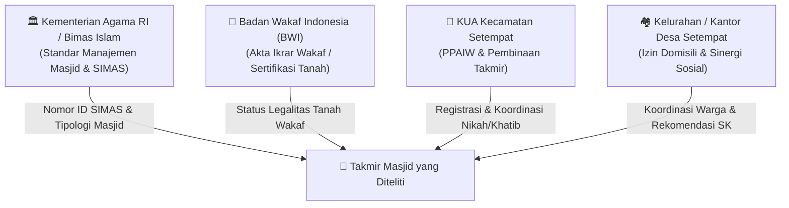
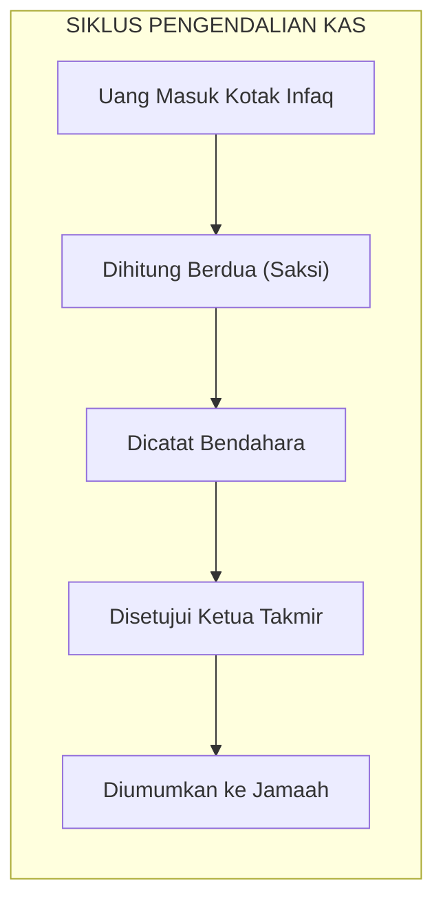

# INSTRUMEN WAWANCARA LAPANGAN MANAJEMEN SISTEM INFORMASI (MSI)
## Panduan Investigasi Tata Kelola, Arsitektur Informasi, dan Regulasi Masjid Komunitas / Kampung
*Disusun untuk: Tim Lapangan Kelompok 1 — Kelas F1*  
*Mata Kuliah: Praktik Manajemen Sistem Informasi (PTF60234) — Dosen: Dr. Ratna Wardani, S.Si., M.T.*

---

## 📋 IDENTITAS MASJID & NARASUMBER (DIISI DI LAPANGAN)
* **Nama Masjid:** ............................................................................................
* **Alamat / RT / RW / Dusun:** ............................................................................................
* **Desa / Kelurahan & Kecamatan:** ............................................................................................
* **Nama Narasumber:** ............................................................................................
* **Jabatan di Takmir:** ............................................................................................
* **Nomor Kontak / WhatsApp:** ............................................................................................
* **Tanggal & Waktu Wawancara:** ............................................................................................

---

## 💡 PANDUAN PENGANTAR UNTUK PEWAWANCARA (TIPS LAPANGAN)
1. **Gunakan Bahasa Santai & Menghormati:** Pengurus takmir di kampung umumnya sesepuh atau tokoh masyarakat senior. Hindari istilah teknis yang terdengar rumit seperti *"Arsitektur Sistem", "Database", "Single Source of Truth", atau "Enterprise System"*. Terjemahkan menjadi bahasa yang akrab: *"Buku catatan pusat", "Cara bapak mencocokkan data kas", "Siapa yang pegang catatan kalau orangnya berhalangan"*.
2. **Fokus pada "Siapa Berwenang Melakukan Apa" (Tata Kelola), Bukan Menuntut Aplikasi:** Jika takmir menjawab *"Kami semua masih pakai buku tulis biasa"*, jangan katakan *"Kenapa tidak pakai aplikasi komputer?"*. Sebaliknya tanyakan: *"Siapa yang berhak menulis di buku itu? Apakah pernah terjadi selisih hitung? Kalau bukunya hilang atau rusak, ada salinannya di mana?"*.
3. **Minta Izin Merekam:** Bawa buku catatan kecil dan minta izin sopan jika ingin merekam suara agar kutipan penting tidak terlewat.

---

## BAGIAN 1: Legalitas, Tipologi, & Keterhubungan Pemerintah (Tingkat Makro / Nasional)
> *Tujuan: Menjawab arahan Bu Ratna mengenai apakah pembangunan masjid mengikuti regulasi pemerintah, instansi mana yang menaungi, dan bagaimana posisi hukumnya.*

### Daftar Pertanyaan:
1. **Status Tanah & Riwayat Legalitas Bangunan:**
   * *"Pak/Kiai, status hukum tanah masjid ini bagaimana nggih? Apakah tanah wakaf bersertifikat resmi (punya Akta Ikrar Wakaf dari KUA/BWI), tanah hibah perseorangan warga, atau tanah kas desa/bengkok?"*
   * *"Dulu saat awal mula masjid ini didirikan atau direnovasi besar, apakah proses perizinannya mengikuti aturan pemerintah (seperti izin pembangunan rumah ibadat, persetujuan tanda tangan warga sekitar, dan rekomendasi Kemenag/FKUB)?"*
2. **Kementerian & Lembaga yang Menaungi:**
   * *"Secara administrasi pemerintahan, masjid ini terdaftar resmi di instansi mana nggih? Apakah sudah memiliki Nomor ID SIMAS (Sistem Informasi Masjid) dari Kementerian Agama?"*
   * *"Seberapa sering pihak KUA (Kantor Urusan Agama) kecamatan atau Kemenag kabupaten/kota mengundang takmir untuk rapat koordinasi, pembinaan, atau meminta data kegiatan masjid?"*
3. **Tipologi Pengelolaan (Pemerintah vs Swadaya Warga):**
   * *"Masjid ini tipologinya apa menurut Kemenag (apakah Masjid Jami' tingkat kelurahan/desa, Masjid Besar tingkat kecamatan, atau murni masjid kampung/lingkungan swadaya RT-RW)?"*
   * *"Apakah ada bantuan dana operasional rutin dari pemerintah (Kemenag/Pemda), atau 100% mandiri dari infak kotak dan donasi swadaya warga sekitar?"*

---

## BAGIAN 2: Struktur Organisasi, Pemilihan Takmir, & Standar Pembinaan (Tingkat Meso)
> *Tujuan: Mengetahui aturan bisnis pemilihan pimpinan, periodesasi kepengurusan, batas wewenang, dan dasar hukum internal.*

1. **Standar & Mekanisme Pemilihan Takmir:**
   * *"Bagaimana proses pemilihan Ketua Takmir dan jajarannya selama ini? Apakah ada musyawarah warga berkala (misal tiap 3 atau 5 tahun sekali), sistem penunjukan sesepuh kampung, atau bagaimana?"*
   * *"Apakah masjid ini memiliki SK resmi (misal SK Lurah/Kades atau SK dari KUA/DMI), dan apakah ada buku AD/ART (Anggaran Dasar/Anggaran Rumah Tangga) tertulis yang menjadi panduan?"*
2. **Pembagian Wewenang & Bidang Kerja:**
   * *"Apakah dalam struktur kepengurusan ada pembagian bidang kerja resmi (seperti bidang administrasi/idarah, ibadah/imarah, dan sarana prasarana/ri'ayah)?"*
   * *"Jika ada pengurus takmir yang pindah tempat tinggal, wafat, atau sudah tidak aktif lagi, bagaimana mekanisme pergantian antar-waktu dilakukan? Siapa yang berhak menunjuk penggantinya?"*

---

## BAGIAN 3: Pelayanan Ibadah, Master Data Jamaah, & Tren Kehadiran (Tingkat Mikro)
> *Tujuan: Menelusuri ketersediaan data jamaah, pengelolaan jadwal khatib, SOP mitigasi ustadz berhalangan, serta dinamika penurunan jamaah.*

1. **Pendataan Jamaah (Master Data Warga):**
   * *"Masjid ini melayani berapa RT atau RW nggih? Kira-kira ada berapa kepala keluarga (KK) dan berapa rata-rata jamaah shalat lima waktu serta shalat Jumat?"*
   * *"Apakah takmir memiliki buku catatan daftar warga/jamaah tetap (nama dan alamat per keluarga)? Kalau ada warga baru yang mengontrak atau pindah ke lingkungan sini, bagaimana masjid mendatanya?"*
2. **Dinamika & Tren Fluktuasi Jamaah (Isu Penurunan Jamaah):**
   * *"Dibandingkan 3–5 tahun yang lalu, apakah jumlah jamaah shalat rawatib (Subuh, Maghrib, Isya) dan jamaah shalat Jumat di masjid ini mengalami **penurunan, stabil, atau bertambah**?"*
   * *"Jika dirasakan menurun, menurut pengamatan Bapak/Kiai, kira-kira apa penyebab utamanya?*
     - *Apakah karena faktor demografi warga (banyak sesepuh sepuh yang telah wafat, sementara anak muda merantau/bekerja di luar)?*
     - *Apakah karena kesibukan jam kerja warga modern?*
     - *Atau karena adanya pilihan masjid/mushalla lain di sekitar lingkungan sini?"*
   * *"Bagaimana komposisi usia jamaah shalat saat ini? Apakah jamaah didominasi oleh bapak-bapak lansia/pensiunan, sementara kalangan usia produktif (20–40 tahun) dan remaja minim hadir? Apa kendala takmir dalam menarik kehadiran mereka?"*
3. **Penjadwalan Khatib & Ustadz:**
   * *"Bagaimana cara takmir menyusun jadwal imam rawatib, khatib shalat Jumat, dan penceramah pengajian? Disimpan di media apa jadwal tersebut (papan tulis aula, lembaran kertas kalender, atau di grup WhatsApp pengurus)?"*
   * *"Berapa ustadz/khatib yang rutin mengisi dalam satu siklus jadwal? Apakah takmir melakukan konfirmasi ulang menjelang hari-H (misal H-3 atau H-1)?"*
4. **Prosedur Kontinjensi (Ustadz Batal Mendadak):**
   * *"Pernahkah terjadi khatib Jumat atau ustadz pengajian membatalkan jadwal mendadak (misal 1 jam sebelum adzan atau saat jamaah sudah kumpul)?"*
   * *"Jika itu terjadi, apa aturan resmi takmir untuk mencari pengganti (ustadz badal)? Siapa pengurus yang wajib otomatis maju menggantikan?"*
5. **Tata Kelola Bisyarah / Honor Ustadz:**
   * *"Bagaimana penyerahan amplop bisyarah/transport ustadz dicatat? Siapa yang berwenang menentukan nominalnya dan menandatangani bukti kas pengeluarannya?"*

---

## BAGIAN 4: Tata Kelola Pendidikan Santri (TPA & Isu Penurunan Siswa)
> *Tujuan: Meneliti aliran data perkembangan santri, pemisahan uang kas SPP, dan investigasi mendalam penyebab menyusutnya santri TPA.*

1. **Pencatatan Progres Santri & Presensi:**
   * *"Berapa jumlah santri TPA saat ini dan berapa jumlah ustadz yang mengajar (apakah marbot, remaja masjid, atau guru khusus)?"*
   * *"Bagaimana cara mencatat capaian jilid Iqra atau Al-Qur'an santri? Apakah hanya di kartu yang dibawa santri atau ada buku induk rekapitulasi di meja ustadz?"*
   * *"Pernahkah kartu santri hilang atau rusak? Kalau hilang, bagaimana ustadz tahu santri tersebut kemarin terakhir baca halaman berapa?"*
2. **Dinamika Penurunan Jumlah Siswa TPA (Investigasi Kritis):**
   * *"Apakah TPA masjid ini pernah mengalami masa di mana santrinya sangat banyak, lalu belakangan ini **mengalami penurunan drastis** (santri menyusut/sedikit)?"*
   * *"Jika santri berkurang, kira-kira apa faktor penyebab di lapangan menurut pengamatan takmir/ustadz?*
     - *Apakah karena kebijakan sekolah formal (**Full-Day School** hingga jam 15.30–16.00 sehingga anak kelelahan saat sore)?*
     - *Apakah karena maraknya les privat/bimbel mata pelajaran umum di luar?*
     - *Apakah karena anak-anak lebih asyik bermain gadget/gawai di rumah?*
     - *Atau karena kejenuhan metode mengajar yang masih monoton dan terbatasnya jumlah ustadz pengajar?"*
   * *"Apakah takmir atau pengurus TPA pernah melakukan evaluasi jam belajar atau survei ke orang tua santri (misalnya menggeser jadwal TPA ke ba'da Maghrib)? Bagaimana tanggapan orang tua?"*
3. **Pengendalian Kas Iuran/SPP Santri (Internal Control):**
   * *"Apakah santri ditarik uang iuran/SPP bulanan? Siapa yang bertugas mencatat dan memegang uang fisik tersebut?"*
   * *"Apakah uang kas TPA disimpan di dompet/rekening terpisah dari uang kas masjid, atau dicampur? Pernahkah ada laporan pertanggungjawaban kas TPA ke takmir atau orang tua santri?"*
4. **Keterkaitan ke Lembaga Pembina (BADKO TPA & Kemenag):**
   * *"Apakah TPA masjid ini terdaftar resmi di **BADKO TPA (Badan Koordinasi TPA)** tingkat kecamatan setempat?"*
   * *"Laporan apa saja yang wajib disetor ke BADKO (misal: data santri untuk ujian munaqasyah/wisuda, data ustadz untuk sertifikasi)? Seberapa sering laporan itu dibuat?"*
5. **Keterkaitan dengan TK / PAUD di Area Masjid (Jika Ada):**
   * *"Jika di lingkungan masjid ini ada TK/PAUD, bagaimana hubungan pengelolaannya dengan takmir? Apakah TK tersebut merupakan unit resmi di bawah takmir masjid, ataukah yayasan terpisah yang menyewa/meminjam gedung aula masjid?"*

---

## BAGIAN 5: Tata Kelola Keuangan, Zakat, & Tren Infak/Donasi
> *Tujuan: Meneliti segregation of duties (pemisahan wewenang), dual custody saat hitung infaq, legalitas UPZ, dan fenomena pergeseran donatur.*

1. **Penghitungan & Penyimpanan Infaq Kotak:**
   * *"Saat membuka kotak infak Jumat atau tromol harian, berapa orang yang ikut menghitung bersama? Apakah ada catatan berita acara tanda tangan berdua, atau langsung diserahkan ke Bendahara?"*
   * *"Di mana uang kas fisik masjid disimpan? Di brankas masjid, rekening bank atas nama takmir/masjid, atau di rekening pribadi salah satu pengurus?"*
2. **Pencatatan, Pembukuan, & Potensi Selisih:**
   * *"Pembukuan kas masjid dicatat di mana (buku kas folio tulis tangan, Microsoft Excel, atau Word)? Apakah Sekretaris juga mencatat keuangan secara terpisah?"*
   * *"Pernahkah terjadi selisih hitung antara saldo buku catatan dan uang fisik yang ada di kas? Jika ada selisih, bagaimana cara takmir melacak dan menyelesaikannya?"*
   * *"Seberapa sering laporan keuangan diumumkan secara terbuka ke jamaah (apakah setiap menjelang shalat Jumat, ditempel di papan pengumuman, atau dibuatkan selebaran)?"*
3. **Tren Pendapatan Infak & Pergeseran Donatur (Isu Sektor Keuangan):**
   * *"Bagaimana tren perolehan kas infak kotak Jumat dan donasi warga dalam beberapa tahun terakhir? Apakah cenderung meningkat, stagnan, atau justru mengalami penurunan?"*
   * *"Apakah ada fenomena di mana warga mampu/donatur yang dulu rutin berzakat atau berinfak di masjid ini, sekarang mulai beralih menyalurkannya ke lembaga amil zakat luar (seperti BAZNAS, LAZ swasta, panti asuhan, atau masjid modern lain)? Jika ada, apakah ada kaitannya dengan tuntutan transparansi laporan keuangan atau kemudahan transfer digital?"*
4. **Tata Kelola Zakat (Fitrah & Maal) & Keterkaitan BAZNAS:**
   * *"Saat membentuk panitia zakat fitrah/maal menjelang Idul Fitri, apakah panitia mengantongi SK resmi sebagai UPZ (Unit Pengumpulan Zakat) dari BAZNAS setempat?"*
   * *"Bagaimana takmir menentukan siapa saja warga yang berhak menerima zakat (mustahik)? Apakah takmir punya data warga miskin sendiri, atau mencocokkan dengan data DTKS (Data Terpadu Kesejahteraan Sosial) dari Kelurahan/RT?"*
   * *"Setelah zakat dibagikan, apakah takmir wajib mengirimkan laporan rekapitulasi ke BAZNAS? Apa kendala yang paling sering dialami saat menyusun laporan tersebut?"*

---

## BAGIAN 6: Manajemen Beban Puncak (Peak-Load: Qurban & Ramadhan)
> *Tujuan: Membedah titik kemacetan informasi dan logistik saat beban aktivitas memuncak dalam waktu singkat.*

1. **Manajemen Idul Adha & Shahibul Qurban:**
   * *"Saat pendaftaran qurban dibuka, data apa saja yang dicatat panitia dari peserta shahibul qurban (apakah hanya nama saja, atau lengkap dengan alamat RT/RW dan nomor WhatsApp aktif)?"*
   * *"Apakah jumlah peserta qurban (shahibul qurban) dari tahun ke tahun mengalami kenaikan, tetap, atau penurunan? Jika menurun, apakah warga beralih qurban lewat lembaga penyalur online?"*
   * *"Saat hewan qurban (sapi/kambing) diantar pedagang ke masjid, pernahkah terjadi panitia di lokasi bingung karena tidak ada penanggung jawab penerima atau tidak tahu hewan itu milik siapa?"*
   * *"Bagaimana panitia mendata warga relawan yang ikut membantu memotong daging? Pernahkah ada warga yang sudah seharian ikut memotong daging tetapi terlewat tidak kebagian jatah daging panitia?"*
   * *"Bagaimana pembagian kupon daging qurban ke warga dilakukan? Apakah pernah terjadi kupon dobel, kupon hilang, atau daging habis sebelum antrean kupon selesai dilayani?"*
2. **Manajemen Ramadhan (Takjil, Tarawih, & Shalat Ied):**
   * *"Bagaimana cara seksi konsumsi mengatur jadwal warga yang mendapat giliran menyumbang takjil buka puasa selama 30 hari? Catatannya disimpan di mana?"*
   * *"Pernahkah ada hari di mana takjil menumpuk terlalu banyak, atau sebaliknya kosong/kurang karena warga tidak tahu tanggal mana yang belum terisi?"*
   * *"Untuk pelaksanaan Shalat Ied (jika menggunakan lapangan atau jalan kampung di luar masjid), bagaimana alur perizinannya? Siapa saja instansi yang harus dikoordinasikan (pihak Kelurahan, Kepolisian, RT/RW)?"*

---

## BAGIAN 7: Kolaborasi Ekonomi, UMKM, & Jejaring Antar-Lembaga
> *Tujuan: Menjawab arahan Bu Ratna mengenai keterhubungan eksternal, kontribusi sosial, dan diversifikasi ekonomi.*

1. **Aktivitas Ekonomi & UMKM Warga Sekitar:**
   * *"Apakah saat shalat Jumat atau ada acara pengajian besar ada pedagang UMKM warga sekitar yang berjualan di halaman atau sekitar masjid? Bagaimana perizinannya?"*
   * *"Apakah ada infak kebersihan atau retribusi sukarela dari pedagang? Dicatat di pos keuangan mana uang tersebut?"*
   * *"Apakah masjid ini memiliki unit usaha mandiri (misal: depot air minum isi ulang, koperasi masjid, sewa aula untuk hajatan/akad nikah, atau unit usaha lainnya)?"*
2. **Kontribusi & Hubungan dengan Masjid Tetangga:**
   * *"Apakah pengurus takmir tergabung dalam organisasi **DMI (Dewan Masjid Indonesia)** tingkat ranting/desa atau paguyuban antar-takmir masjid sekitar?"*
   * *"Apakah masjid ini pernah bekerja sama dengan masjid tetangga (misal: saling bertukar informasi ustadz/khatib cadangan, saling meminjam peralatan seperti sound system/tenda, atau mencocokkan jadwal shalat Ied/qurban)?"*
3. **Hubungan Sosial dengan Kelurahan & Warga Sekitar:**
   * *"Apa saja kontribusi nyata masjid ini bagi kantor Kelurahan/Desa dan warga setempat? Apakah masjid pernah dijadikan posko penanganan bencana, lokasi posyandu, atau tempat rapat warga?"*
   * *"Bagaimana hubungan masjid dengan warga non-Muslim di lingkungan sekitar? Apakah saat pembagian daging qurban atau bantuan sosial warga non-Muslim juga ikut dilibatkan/diberi jatah?"*

---

## BAGIAN 8: Krisis Regenerasi & Identifikasi Masalah Inti MSI
> *Tujuan: Mengunci bukti nyata permasalahan tata kelola informasi, stagnasi kepemimpinan, dan kesenjangan adopsi teknologi.*

1. **Krisis Regenerasi Pengurus & Keterasingan Pemuda (Isu Regenerasi):**
   * *"Apakah masjid ini mengalami krisis regenerasi kepengurusan (pengurus takmir dari periode ke periode hanya diisi oleh orang-orang yang sama tanpa ada pemuda yang bersedia menggantikan)?"*
   * *"Berapa jumlah pemuda remaja masjid (REMAS/RISMA) di sini? Seberapa sering mereka dilibatkan dalam tugas administrasi harian selain saat disuruh angkat daging qurban?"*
   * *"Menurut pengamatan takmir, mengapa anak-anak muda zaman sekarang terkesan enggan atau sungkan untuk aktif mengurus masjid? Apakah karena merasa tidak diberi ruang suara oleh pengurus senior, atau format kegiatan masjid dirasa kurang relevan bagi anak muda?"*
2. **Ketergantungan pada Figur Tertentu (Key-Person Dependency):**
   * *"Jika Pak Bendahara atau Pak Sekretaris sedang sakit atau bepergian ke luar kota dalam waktu lama, apakah pengurus takmir yang lain bisa membaca dan melanjutkan pembukuan kas atau jadwal kegiatan dengan mudah?"*
3. **Kerapian Penyimpanan Arsip & Dokumen:**
   * *"Di mana surat-surat resmi (dari Kemenag, kelurahan, proposal bantuan, atau bukti kuitansi) disimpan? Apakah ada lemari arsip tersusun rapi, atau masih bercampur di meja kantor masjid?"*
4. **Kesiapan Adopsi Teknologi (Change Management):**
   * *"Jika suatu saat takmir ingin merapikan pencatatan menggunakan komputer atau menampilkan jadwal di layar TV informasi masjid, apakah pengurus senior menyambut baik atau ada kekhawatiran merasa repot/bingung mengoperasikannya?"*

---

## 📝 LEMBAR CATATAN RINGKAS TEMUAN (DIISI SETELAH SELESAI WAWANCARA)

| No | Parameter Tata Kelola & Tren Lapangan | Fakta yang Ditemukan di Lapangan | Indikasi Masalah MSI / Penyebab Utama |
|:---:|:---|:---|:---|
| 1 | Status Legalitas & ID SIMAS Kemenag | .......................................................................... | .......................................................................... |
| 2 | SK Takmir, Masa Jabatan, & AD/ART | .......................................................................... | .......................................................................... |
| 3 | **Tren Jumlah Jamaah Shalat & Profil Usia** | .......................................................................... | .......................................................................... |
| 4 | **Tren Jumlah Santri TPA & Dugaan Penurunan** | .......................................................................... | .......................................................................... |
| 5 | Master Data Santri & Penanganan Kartu Hilang | .......................................................................... | .......................................................................... |
| 6 | Pemisahan Kas Unit TPA vs Kas Masjid | .......................................................................... | .......................................................................... |
| 7 | Cadangan Ustadz/Khatib Batal (*Badal*) | .......................................................................... | .......................................................................... |
| 8 | **Tren Infak Kas & Pergeseran Muzaki/Donatur** | .......................................................................... | .......................................................................... |
| 9 | Legalitas UPZ Zakat & Sinergi DTKS | .......................................................................... | .......................................................................... |
| 10 | Kualitas Data Shahibul Qurban & Kupon | .......................................................................... | .......................................................................... |
| 11 | Transparansi Kuota Takjil Ramadhan | .......................................................................... | .......................................................................... |
| 12 | Jejaring Antar-Masjid (DMI) & UMKM | .......................................................................... | .......................................................................... |
| 13 | **Krisis Regenerasi & Peran Pemuda (REMAS)** | .......................................................................... | .......................................................................... |
| 14 | Ketergantungan Figur (*Key-Person Risk*) | .......................................................................... | .......................................................................... |
