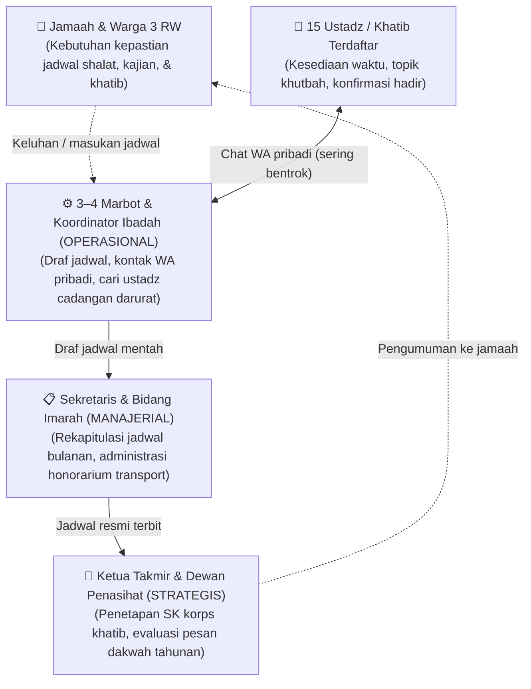
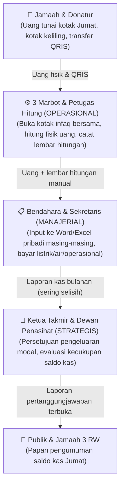
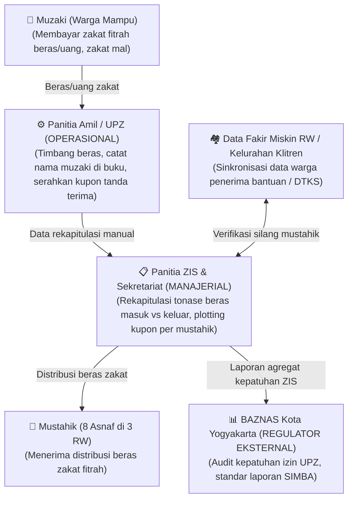
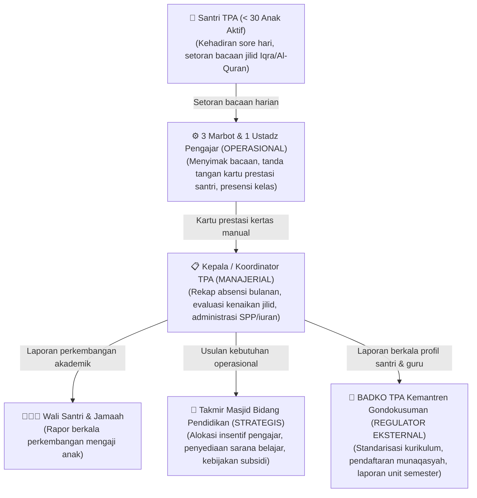
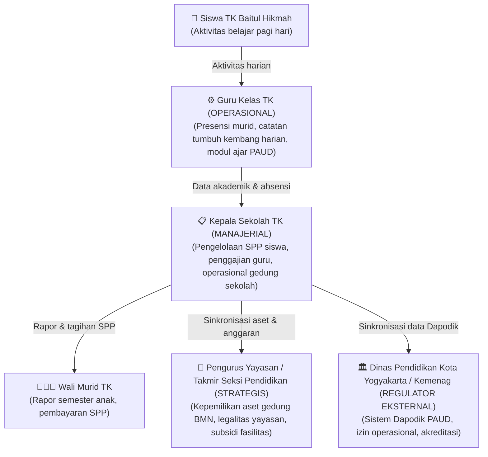

# ANALISIS TATA KELOLA INFORMASI BOTTOM-UP (DARI BAWAH KE ATAS)
## Sistem Informasi Manajemen Masjid Besar Baitul Hikmah (SIM-BaitulHikmah)
*Disusun oleh: Kelompok 1 — Kelas F1*  
*Anggota: Muhammad Riski (24050530029), Fajar Ahnaf Mahardika (24050530030), Muhadzdzib Terry Al-Fauzan (24050530052)*  
*Mata Kuliah: Praktik Manajemen Sistem Informasi (PTF60234) — Dosen: Dr. Ratna Wardani, S.Si., M.T.*

---

## 📌 Pengantar Paradigma MSI: Aliran Data Vertikal
Dalam Manajemen Sistem Informasi (MSI), sistem informasi **bukanlah sekadar piranti lunak** yang berdiri sendiri, melainkan instrumen tata kelola organisasi. Aliran data harus dipetakan secara **vertikal dari bawah ke atas (*Bottom-Up*)**:
1. **Level Operasional (Bawah):** Tempat transaksi dan data mentah dihasilkan (pencatatan infaq harian, presensi santri, kesediaan jadwal ustadz).
2. **Level Manajerial (Tengah):** Tempat data direkonsiliasi, diverifikasi, dan divalidasi menjadi laporan taktis (rekonsiliasi saldo kas bulanan, plotting jadwal khatib tanpa bentrok, evaluasi kurikulum TPA).
3. **Level Strategis (Puncak):** Tempat pimpinan mengambil kebijakan berbasis bukti (*evidence-based decision making*) untuk keberlanjutan umat (alokasi dana dhuafa, renovasi fasilitas, transparansi publik).
4. **Level Lingkungan Eksternal (Regulator):** Entitas luar yang mengikat tata kelola data (BAZNAS, BADKO TPA, Kelurahan/DTKS, Kemenag/SIMAS).

Berikut adalah bedah lengkap 5 pilar utama tata kelola masjid beserta analisis titik kritis kerusakan sistemnya.

---

## 🕌 PILAR 1: Tata Kelola Jamaah & Ustadz (Peribadatan & Dakwah)

### 1. Diagram Alur Data Bottom-Up

### 2. Aliran Data per Level:
* **Operasional:** Tanggal lowong ustadz, nomor kontak pribadi, riwayat konfirmasi hadir H-3, pencatatan ustadz pengganti saat darurat.
* **Manajerial:** Kalender bulanan 15 khatib Jumat, daftar penceramah tarawih/Ramadhan, jadwal kajian subuh/dzuhur, rekap honor transport.
* **Strategis:** Evaluasi tingkat kehadiran khatib, penambahan korps ustadz baru, keselarasan materi dakwah dengan visi masjid.

### 3. Di Bagian Mana Sistemnya Jebol / Rusak?
* **Jebol di Titik Konfirmasi H-3:** Tidak ada sistem pengingat otomatis. Komunikasi hanya mengandalkan chat WA marbot secara manual satu per satu. Ustadz yang lupa atau mendadak berhalangan sering baru terdeteksi 1–2 jam sebelum shalat Jumat dimulai.
* **Jebol di Saluran Pengumuman Jamaah:** Tidak ada papan digital atau kalender web publik. Jika terjadi perubahan penceramah, jamaah yang tidak berada di grup WA takmir tidak mendapat informasi.
* **Jebol di Penanganan Kontinjensi (Ustadz Cadangan):** Saat shalat tarawih Ramadhan khatib batal dan ustadz pengganti luar tidak ada, takmir tidak memiliki daftar kesiapsiagaan ustadz internal. Dampaknya, agenda terpaksa di-skip dan diganti pembacaan hadits seadanya oleh marbot.

### ❓ Pertanyaan Konfirmasi untuk Takmir:
1. *"Berapa hari sebelum hari-H takmir mengonfirmasi kehadiran khatib Jumat? Siapa petugas yang bertanggung jawab menghubungi?"*
2. *"Jika khatib berhalangan hadir mendadak jam 11 siang, apa SOP takmir? Siapa figur yang berhak ditunjuk sebagai khatib pengganti?"*
3. *"Apakah takmir memiliki buku rekap kehadiran khatib selama setahun terakhir untuk evaluasi honor dan perpanjangan jadwal?"*

---

## 💰 PILAR 2: Tata Kelola Infaq & Kas Masjid (Rp 2–3 Juta/Bulan)

### 1. Diagram Alur Data Bottom-Up

### 2. Aliran Data per Level:
* **Operasional:** Nominal pecahan uang kotak Jumat, tanggal pembukaan kotak, nota pembelian alat kebersihan/listrik, tanda terima honor marbot.
* **Manajerial:** Buku kas masuk dan buku kas keluar bulanan, rekonsiliasi selisih buku kas fisik vs file spreadsheet, pencocokan saldo rekening bank masjid.
* **Strategis:** Rasio kecukupan kas operasional, tren donasi jamaah pasca-pandemi, keputusan alokasi dana renovasi sarana ibadah.

### 3. Di Bagian Mana Sistemnya Jebol / Rusak?
* **Jebol di Rekonsiliasi Kas (Ketiadaan *Single Source of Truth*):** Bendahara mencatat pengeluaran di Excel laptopnya, Sekretaris mencatat uang masuk di file Word miliknya. Saat akhir bulan direkap, angka saldo **kerap kali selisih ratusan ribu**, sehingga pengurus harus memeriksa kembali tumpukan kuitansi fisik satu per satu.
* **Jebol di Rekam Jejak Audit (*Audit Trail*):** Banyak pengeluaran operasional kecil (sapu, air galon, pembersih lantai) hanya berupa nota toko kelontong tanpa nomor seri resmi, bahkan sebagian hanya berupa konfirmasi lisan tanpa bukti digital yang tersimpan aman.
* **Jebol di Kecepatan Informasi Publik:** Transparansi kas ke jamaah hanya dilakukan seminggu sekali lewat papan tulis kapur/spidol sebelum shalat Jumat. Jamaah tidak bisa memantau aliran dana secara real-time.

### ❓ Pertanyaan Konfirmasi untuk Takmir:
1. *"Proses penghitungan kotak infaq Jumat disaksikan oleh berapa orang? Apakah langsung dibuatkan berita acara tertulis di tempat?"*
2. *"Uang kas fisik masjid saat ini disimpan di mana (rekening bank atas nama takmir atau disimpan tunai di brankas/amplop)? Siapa yang memegang aksesnya?"*
3. *"Apa faktor utama yang paling sering membuat catatan keuangan Bendahara dan Sekretaris tidak cocok saat rekapitulasi akhir bulan?"*

---

## 🌾 PILAR 3: Tata Kelola Zakat (UPZ & Zakat Fitrah / Mal)

### 1. Diagram Alur Data Bottom-Up

### 2. Aliran Data per Level:
* **Operasional:** Nama muzaki, jumlah jiwa yang dizakati, kilogram beras / nominal rupiah, pencatatan kupon mustahik di lapangan.
* **Manajerial:** Rekapitulasi total tonase beras terkumpul, pencocokan kuota penerima dengan daftar kemiskinan RW, pengelolaan sisa beras zakat.
* **Strategis:** Kebijakan pemberdayaan ekonomi mustahik di lingkungan sekitar masjid, pertanggungjawaban publik kepanitiaan Ramadhan.
* **Regulator (BAZNAS):** Nomor registrasi UPZ resmi, laporan keuangan zakat berbasis format standar sistem SIMBA.

### 3. Di Bagian Mana Sistemnya Jebol / Rusak?
* **Jebol di Validasi Mustahik (Data Usang):** Data penerima zakat mengandalkan daftar lama pengurus RT. Warga yang kondisi ekonominya sudah mampu sering masih terdaftar sebagai penerima, sementara warga miskin pendatang/kos baru malah terlewat karena tidak terdata KTP lokal.
* **Jebol di Panik Rekapitulasi Malam Takbiran:** Arus muzaki yang membeludak pada H-1 Idul Fitri dicatat manual di lembaran kertas. Panitia rawan salah menjumlahkan total beras yang harus dibagikan malam itu juga.
* **Jebol di Kepatuhan BAZNAS:** BAZNAS mewajibkan laporan berkala digital (SIMBA), namun takmir hanya memiliki laporan kertas sederhana pasca-lebaran, sehingga laporan resmi ke BAZNAS tertunda lama.

### ❓ Pertanyaan Konfirmasi untuk Takmir:
1. *"Bagaimana cara amil memastikan warga penerima zakat fitrah benar-benar berhak? Apakah ada kriteria verifikasi silang dengan data RT/Kelurahan?"*
2. *"Apakah UPZ Baitul Hikmah sudah mengantongi SK izin operasional resmi dari BAZNAS Kota Yogyakarta?"*
3. *"Berapa rata-rata sisa beras zakat fitrah setelah malam takbiran dibagikan, dan dialokasikan ke mana sisa tersebut?"*

---

## 📖 PILAR 4: Tata Kelola TPA (Pendidikan Al-Qur'an Santri)

### 1. Diagram Alur Data Bottom-Up

### 2. Aliran Data per Level:
* **Operasional:** Presensi harian santri, halaman dan jilid Iqra/Al-Quran yang dibaca hari ini, catatan tajwid/kelancaran bacaan.
* **Manajerial:** Rekapitulasi absensi santri dan pengajar per bulan, daftar kelayakan santri naik ke jenjang Al-Quran, rekap penerimaan SPP/iuran santri.
* **Strategis:** Keputusan penambahan tenaga pengajar, subsidi buku dan seragam santri dhuafa, pemeliharaan ruang belajar TPA.
* **Regulator (BADKO TPA):** Formulir pendataan unit TPA berkala, data peserta ujian munaqasyah, profil kompetensi pengajar.

### 3. Di Bagian Mana Sistemnya Jebol / Rusak?
* **Jebol di Kehilangan Kartu Prestasi:** Kartu catatan jilid Iqra berupa lembaran kertas tipis yang disimpan mandiri oleh santri di tas atau ditaruh di rak meja TPA. Kartu ini **kerap hilang atau rusak**, sehingga pengajar lupa posisi terakhir bacaan anak dan santri terpaksa mengulang dari halaman awal.
* **Jebol di Asinkronitas Antarpengajar:** Karena pengajar bergantian antara 3 marbot dan 1 ustadz, Marbot A sering tidak mengetahui evaluasi bacaan yang diberikan oleh Marbot B pada hari sebelumnya.
* **Jebol di Pelaporan BADKO:** BADKO mewajibkan setoran laporan semester profil santri dan ustadz, tetapi pengelola TPA lambat menyetor karena harus mereka-reka ulang data manual dari lembaran presensi yang tercecer.

### ❓ Pertanyaan Konfirmasi untuk Takmir / Pengelola TPA:
1. *"Di mana kartu prestasi mengaji santri saat ini disimpan, dan seberapa sering terjadi kasus kartu hilang atau tertukar?"*
2. *"Apakah ada iuran bulanan santri TPA? Bagaimana pencatatannya dan apakah dananya disatukan dengan kas umum masjid?"*
3. *"Format laporan apa saja yang diwajibkan oleh BADKO TPA Kemantren Gondokusuman setiap semesternya?"*

---

## 🎒 PILAR 5: Tata Kelola TK (Pendidikan Anak Usia Dini Baitul Hikmah)

### 1. Diagram Alur Data Bottom-Up

### 2. Aliran Data per Level:
* **Operasional:** Absensi harian murid, catatan capaian fisik/motorik, agenda kegiatan outing/manasik haji anak.
* **Manajerial:** Buku kas SPP dan uang seragam, operasional belanja alat permainan edukatif (APE), laporan kinerja guru.
* **Strategis:** Penetapan tarif SPP tahun ajaran baru, koordinasi status tanah BMN dengan instansi pemilik, persetujuan renovasi gedung.
* **Regulator (Dinas Pendidikan):** Nomor Pokok Sekolah Nasional (NPSN), data Dapodik PAUD, laporan penggunaan Bantuan Operasional Satuan Pendidikan (BOSP).

### 3. Di Bagian Mana Sistemnya Jebol / Rusak?
* **Jebol di Batas Otoritas & Keuangan (Takmir vs Sekolah):** Ketidakjelasan apakah kas TK terpisah penuh atau berada di bawah pengawasan takmir masjid. Sering menimbulkan tanda tanya mengenai besaran subsidi masjid terhadap operasional TK.
* **Jebol di Penjadwalan Fasilitas Bersama:** TK memakai ruang kelas dan aula di pagi hari, sedangkan TPA dan takmir memakainya di sore dan malam hari. Tanpa kalender fasilitas terpadu, pemeliharaan kebersihan ruang dan inventaris bermain anak kerap menimbulkan gesekan antarpengurus.

### ❓ Pertanyaan Konfirmasi untuk Takmir / Pengelola TK:
1. *"Apakah TK Baitul Hikmah berbadan hukum yayasan terpisah atau berada langsung di bawah struktur seksi pendidikan takmir masjid?"*
2. *"Apakah pembukuan keuangan TK sudah mandiri dari SPP siswa atau masih menerima subsidi rutin dari kas infaq masjid?"*
3. *"Apakah TK sudah menggunakan aplikasi Dapodik secara mandiri, dan bagaimana mekanisme peminjaman aula masjid jika TK mengadakan acara besar?"*

---

## 🔍 TINJAUAN KRITIS: KUA Kemantren Gondokusuman (Core vs Support)

### Mengapa KUA Tidak Menjadi Proses Bisnis Inti (*Core Process*)?
Berdasarkan data wawancara lapangan:
* KUA hanya menggunakan aula masjid rata-rata **minimal 1 kali dalam sebulan**, mayoritas khusus untuk agenda akad nikah warga sekitar.
* Pihak KUA sudah memiliki sistem internal kementerian sendiri (SIMKAH - Sistem Informasi Manajemen Nikah).
* KUA **tidak mengelola dana infaq masjid, tidak mengajar TPA, dan tidak terlibat dalam operasional peribadatan harian**.

### Rekomendasi Desain MSI:
Dalam arsitektur SIM-BaitulHikmah, hubungan dengan KUA **cukup ditangani oleh Modul Peminjaman Fasilitas / Kalender Ruang (*Room Booking Schedule*)**, bukan sistem yang rumit. Modul ini bertugas memastikan aula tidak bentrok dengan acara internal takmir saat tanggal akad nikah tiba.

---

## 📊 MATRIKS PRIORITAS SISTEM INFORMASI (MSI PRIORITY MATRIX)

Berdasarkan analisis titik kerusakan tata kelola di atas, berikut adalah penentuan prioritas pengembangan modul:

| Peringkat Prioritas | Pilar / Domain | Frekuensi Aktivitas | Titik Kritis Kerusakan Data | Kebutuhan Solusi Sistem Informasi |
|---|---|---|---|---|
| **Prioritas 1 (CORE)** | **Tata Kelola Infaq & Kas** | Harian & Tiap Jumat | Pencatatan ganda Bendahara-Sekretaris, selisih rekap, kuitansi tercecer | *Single Source of Truth*, buku kas digital terpadu, dashboard saldo real-time |
| **Prioritas 1 (CORE)** | **Tata Kelola TPA** | Rutin (Sore hari) | Kartu Iqra hilang, asinkron antarmarbot, pelaporan BADKO terhambat | Buku presensi digital, pelacak jilid Iqra terpusat, ekspor laporan BADKO |
| **Prioritas 2 (CORE)** | **Tata Kelola 15 Khatib & Dakwah** | Tiap Jumat & Event | Koordinasi via chat WA, bentrok jadwal mendadak, tarawih diskip | Kalender terpadu, notifikasi konfirmasi otomatis H-3, bank data khatib cadangan |
| **Prioritas 2 (PEAK)** | **Tata Kelola Qurban & Zakat** | Musiman (Hari Raya) | Pencatatan manual di lapangan, data mustahik tidak valid, kupon ganda | Validasi silang NIK warga per KK, modul pendaftar qurban, laporan format BAZNAS |
| **Prioritas 3 (SUPPORT)** | **Tata Kelola TK Baitul Hikmah** | Harian (Pagi) | Gesekan jadwal ruang aula, batas otorisasi subsidi kas | Modul pemisahan kas yayasan, sinkronisasi ruang kelas |
| **Prioritas 4 (SUPPORT)** | **Kemitraan KUA Gondokusuman** | Bulanan (1x/bln) | Potensi tabrakan jadwal pemakaian aula akad nikah | Modul reservasi aula sederhana dengan notifikasi ketersediaan ruang |

---
*Dokumen ini menjadi acuan analisis masalah, diagram Fishbone, dan Work Breakdown Structure (WBS) untuk penyusunan Laporan Praktikum Modul 3.*
